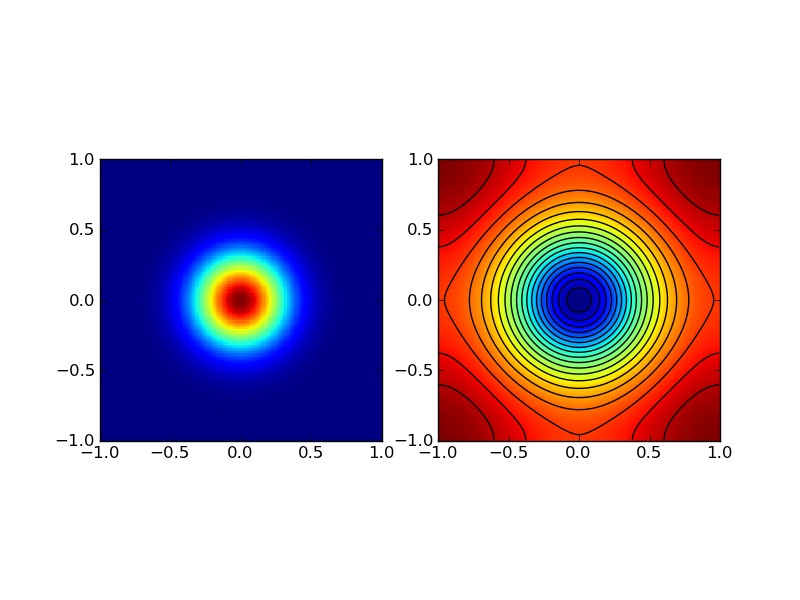

:Author: Ammar Hakim
:Date: September 3rd 2011

JE1: Solving Poisson Equation on 2D Periodic Domain
===================================================

The problem and solution technique
----------------------------------

With periodic boundary conditions, the Poisson equation in 2D

.. math::
  :label: eq:poisson-eqn

  \frac{\partial^2 \psi}{\partial x^2} + 
  \frac{\partial^2 \psi}{\partial y^2} = s(x,y)

can be solved using discrete Fourier transforms. Denote the
rectangular domain by :math:`\Omega` and discretize using :math:`N_x
\times N_y` cells. 

Integrating :eq:`eq:poisson-eqn` over :math:`\Omega` and using
periodicity shows that the source :math:`s(x,y)` must satisfy

.. math::

  \int_\Omega s(x,y) dx dy = 0

In the solver implemented in Lucee the source is modified by
subtracting the integrated source from the RHS of :eq:`eq:poisson-eqn`
to ensure that this condition is met. Hence, the solution computed by
the updater *does not* satisify :eq:`eq:poisson-eqn` but the modified
equation

.. math::
  :label: eq:poisson-eqn-mod

  \frac{\partial^2 \psi}{\partial x^2} + 
  \frac{\partial^2 \psi}{\partial y^2} = s(x,y) - s_T

where :math:`s_T = \int_\Omega s(x,y) dx dy / |\Omega|`, where
:math:`|\Omega|` is the domain volume. Note that for a properly posed
problem the zero integrated source condition *must* be met.

Once the source term is adjusted, its 2D Fourier transform is
computed. The Fourier transform of the solution is then

.. math::

  \overline{\psi}(k_x, k_y) = -\frac{\overline{s}(k_x,k_y)}{k_x^2+k_y^2}

where overbars indicate 2D Fourier transforms and :math:`k_x` and
:math:`k_y` are the wave-numbers. The zero wave-numbers are replaced
by :math:`10^{-8}` to prevent divide-by-zero. The `FFTW
<http://fftw.org/>`_ library is used to compute the transforms.

The algorithm is implemented in the class ``PeriodicPoisson2DUpdater``
class in the ``proto`` directory.

This updater is for use in testing finite-volume/finite-difference 2D
incompressible flow algorithms. In this entry the stand-alone updater
is verified.

Test Problem 1
--------------

The domain is assumed to be :math:`\Omega = [-L_x/2, L_x/2] \times
[-L_y/2, L_y/2]` with :math:`L_x=L_y=2` and is discretized using
:math:`128\times 128` cells. The source is an isotropic Gaussian
source of the form

.. math::

  s(x,y) = e^{-10(x^2+y^2)}

The source and the numerical solution is shown below.

  The source (left) for this problem [:doc:`s1
  <../../sims/s1/s1-periodic-poisson>`] is an isotropic Gaussian
  :math:`e^{-10(x^2+y^2)}`. Color and contour plot of the solution is
  shown in the right plot.

A central difference operator is applied to the computed solution and
is compared to the adjusted source. The results are shown below.

  Central difference of the solution (black line) compared to the
  source (red dots) along the X-axis (left) and Y-axis
  (right).

Test Problem 2
--------------

The domain and resolution are the same as problem 1. The source is an
anisotropic Gaussian source of the form

.. math::

  s(x,y) = e^{-10(2x^2+4xy+5y^2)}

The source and the numerical solution is shown below.

  The source (left) for this problem [:doc:`s2
  <../../sims/s2/s2-periodic-poisson>`] is an anisotropic Gaussian
  :math:`e^{-10(2x^2+4xy+5y^2)}`. Color and contour plot of the
  solution is shown in the right plot.

A central difference operator is applied to the computed solution and
is compared to the adjusted source. The results are shown below.

.. figure:: s2-periodic-poisson_1d_CD_cmp.png
  :width: 100%
  :align: center

  Central difference of the solution (black line) compared to the
  source (red dots) along the X-axis (left) and Y-axis
  (right). 

  
Test Problem 3
--------------

The domain is assumed to be :math:`\Omega = [0, L_x] \times [0, L_y]`
with :math:`L_x=L_y=10` and is discretized using :math:`128\times 128`
cells. The source is the sum of two Gaussians given by

.. math::

  s(x,y) = \omega_1(x,y) + \omega_2(x,y)

where 

.. math::

  \omega_i(x,y) = e^{-r_i^2/0.8}

where :math:`r_i^2 = (x-x_i)^2 + (y-y_i)^2` and :math:`(x_1,y_1) =
(3.5,5.0)` and :math:`(x_2,y_2) = (6.5,5.0)`. The source and the
numerical solution is shown below.

  The source (left) for this problem [:doc:`s3
  <../../sims/s3/s3-periodic-poisson>`] is the sum of two
  Gaussians. Color and contour plot of the solution is shown in the
  right plot.

A central difference operator is applied to the computed solution and
is compared to the adjusted source. The results are shown below.

  Central difference of the solution (black line) compared to the
  source (red dots) along the X-axis (left) and Y-axis (right).

Test Problem 4
--------------

This problem is the same as Test Problem 3 except it is discretized
using :math:`128\times 64` cells. The solutions are shown below.

  The source (left) for this problem [:doc:`s4
  <../../sims/s4/s4-periodic-poisson>`] is the sum of two
  Gaussians. Color and contour plot of the solution is shown in the
  right plot.

A central difference operator is applied to the computed solution and
is compared to the adjusted source. The results are shown below.

  Central difference of the solution (black line) compared to the
  source (red dots) along the X-axis (left) and Y-axis (right).
