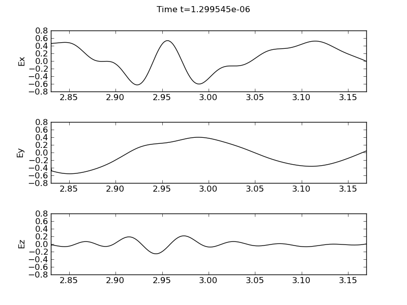
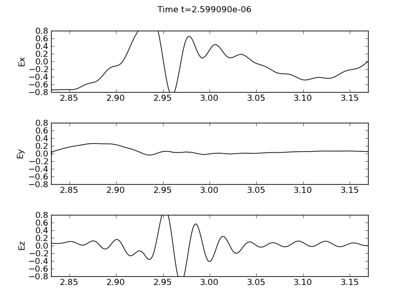
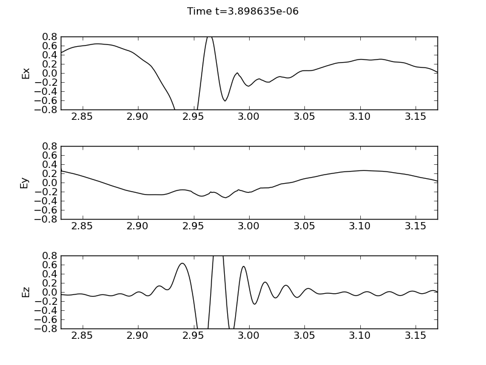
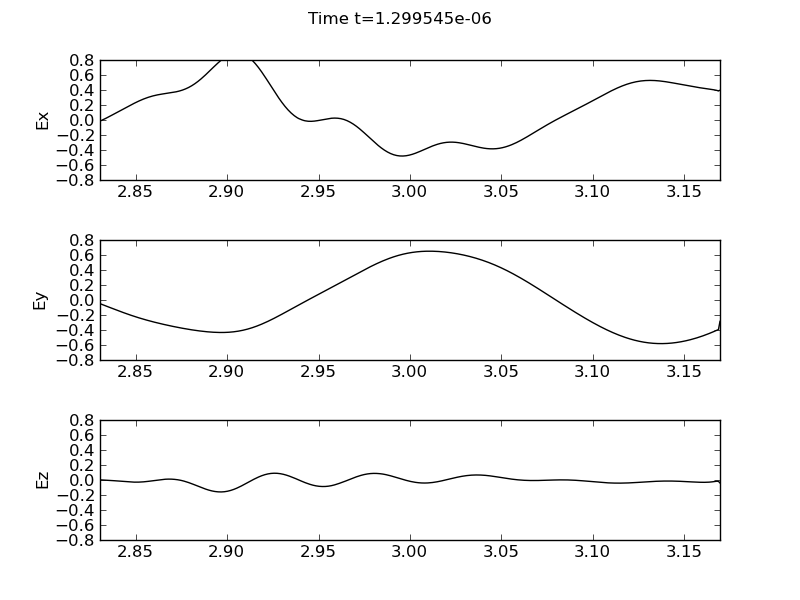
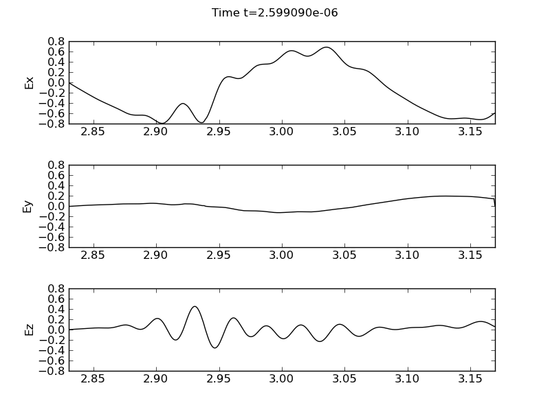
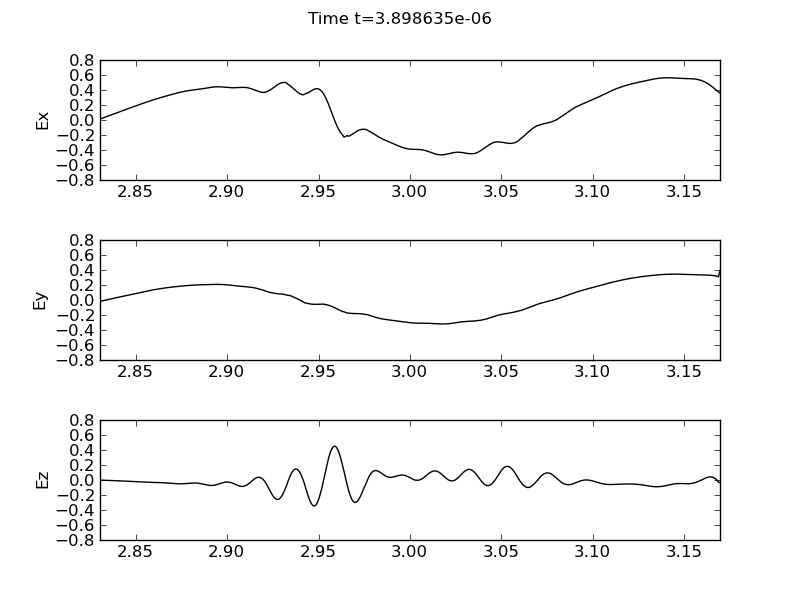

:Author: Ammar Hakim
:Date: October 30th 2011
:Completed: 

JE9: Ion-cyclotron wave (ICW) propagation and mode conversion
=============================================================

The ion-cyclotron wave (ICW) is a short-wavelength cold-plasma wave
that occurs when an electromagnetic wave is pumped into a plasma
threaded with a magnetic field that is oblique to the direction of
wave propagation. This situation is encountered in the laboratory in
ion-cyclotron resonance heating (ICRH) in tokamaks.

In this problem tokamak-like parameters are used to initialize the
plasma. The domain is assumed to be :math:`x\in[2.83, 3.17]`. The
tokamak major radius is assumed to be :math:`R_0=3.0` meters. The
density profile is computed using

.. math::

  n(x) = f(x)(n_{0s} - n_{ws}) + n_{ws}

where, :math:`s` is the species index, :math:`n_{0s}` are
:math:`n_{ws}` reference number densities, and the :math:`f(x)`
profile is computed from

.. math::

  f(x) = 1-\left(\frac{x-R_0}{a}\right)^\alpha

Here :math:`a` is the wall radius, and :math:`\alpha` is a constant
that controls the shape of the profile. We have set :math:`a=1`,
:math:`\alpha=2` and :math:`\beta = 1` to give a quadratic density
profile. An external magnetic field is initialized using :math:`B_x(x)
= B_z(x)/10` with :math:`B_z(x) = B_0 R_0/x`, where :math:`B_0 = 4`
Tesla. The external field is held fixed during the simulation.

The plasma contains three species: electrons, deuterium and
Helium-3. The reference densities are set to :math:`4\times 10^{19}`,
:math:`3.6\times 10^{19}` and :math:`2\times 10^{18}`
:math:`\mathrm{m}^{-3}` respectively. The wall reference densities are
all set to 0.

The plasma is illuminated with a antenna source operating at a
frequency of :math:`40.5` MHz.  The antenna current source is
specified using

.. math::

  J_y(t) = J_0\sin(2\pi f_d t)\thinspace
  \sin^2\big(0.5\pi \min(1, t/t_0)\big)

where :math:`f_d = 40.5\times 10^6` Hz is the drive frequency and
:math:`t_0=5/f_d` is the time at which the source turns on completely.

Two cases are considered: high-field incidence (antenna is on the
left) and low-field incidence (antenna is on the right). Results are
presented below.

Notes on the simulations
------------------------

These simulations are quite complex (over 500 lines of Lua) as there
are three fluid species and a static background magnetic field. This
means that we need to create 4 solvers (one for each species and the
EM field) and take into account the Lorentz force on each species and
the current contributions from each species. Further, the static field
also exerts a Lorentz force on each species.

One observation was that the simulation needs to be run close to the
allowed CFL limit (of 1.0 in 1D) in order for the solutions to look
reasonable. This means, unfortunately, that there need to be enough
cells in the domain so that the time-step from speed of light
constraint is smaller than that allowed by the plasma
frequency. Another option is to treat the electron physics implicitly.

High-field incidence
--------------------

In the high-field incidence simulation the antenna is placed in the
first cell (left) in the domain. In this case there is strong mode
conversion of the fast wave to the ICW. The simulation needs to be run
for around 100 periods before the mode conversion is clearly visible.

The oblique angle of propagation results in all three electric field
components. The :math:`E_y` component is domainated by the fast wave
and shows a standing wave pattern. The :math:`E_z` component is
dominated by the mode-converted ICW while the :math:`E_x` shows
both. At the mode conversion layer the :math:`E_x` field shows a sharp
gradient.

  Electric field components, :math:`E_x` (top panel), :math:`E_y`
  (middle panel) and :math:`E_z` (bottom panel) for high-field
  incidence (antenna is on the left). The plot is around the time when
  the ICW mode conversion is starting to occur. [:doc:`s74
  <../../sims/s74/s74-icw>`]

  Electric field components, :math:`E_x` (top panel), :math:`E_y`
  (middle panel) and :math:`E_z` (bottom panel) for high-field
  incidence.

  Electric field components, :math:`E_x` (top panel), :math:`E_y`
  (middle panel) and :math:`E_z` (bottom panel) for high-field
  incidence.

Low-field incidence
-------------------

In the low-field incidence simulation the antenna is placed in the
last cell (right) in the domain. In this case the mode conversion is
weaker than in the high-field incidence case. The differences are
clearly visible from the high-field incidence case in the :math:`E_x`
and :math:`E_z`. The gradients are much weaker while the amplitudes
are smaller.

  Electric field components, :math:`E_x` (top panel), :math:`E_y`
  (middle panel) and :math:`E_z` (bottom panel) for low-field
  incidence (antenna is on the right). The plot is around the time
  when the ICW mode conversion is starting to occur. [:doc:`s76
  <../../sims/s76/s76-icw>`]

  Electric field components, :math:`E_x` (top panel), :math:`E_y`
  (middle panel) and :math:`E_z` (bottom panel) for low-field
  incidence.

  Electric field components, :math:`E_x` (top panel), :math:`E_y`
  (middle panel) and :math:`E_z` (bottom panel) for low-field
  incidence.

Conclusions
-----------

A multi-fluid model is used to peform ICW mode conversion
simulations. Strong mode conversion is seen in the high-field
incidence case. The algorithm needs to be run close to the allowed CFL
limit to avoid unphysical oscillations in the electric field. This can
be avoided by using an implicit scheme for the electron motion.
