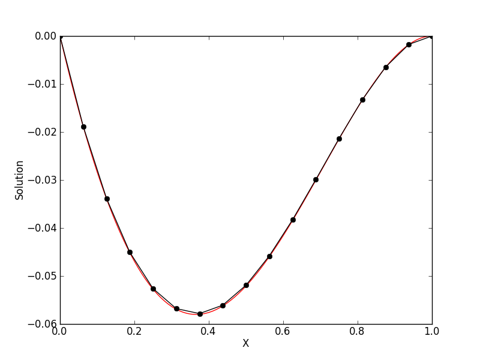
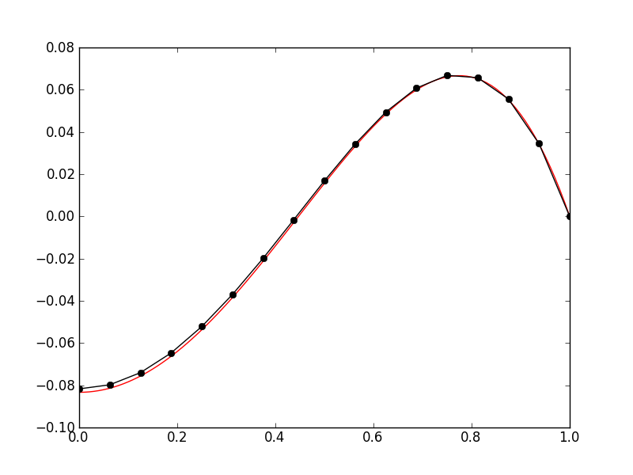

:Author: Ammar Hakim
:Date: March 13th 2012
:Completed: 

JE11: Benchmarking a finite-element Poisson solver
==================================================

.. contents::

In this entry I benchmark and test a finite-element method (FEM)
Poisson solver. The solver is implemented in Lucee/Gkeyll as the class
``FemPoissonStructUpdater`` and solves the equation

.. math::

  \nabla^2 \psi = s

where :math:`s` is the spatially dependent source term. This updater
works in 1D, 2D and 3D and is agnostic of the underlying nodal basis
functions, which need to be provided separately.

Convergence of 1D solver
------------------------

In this test the convergence of the 1D solver is tested with an exact
solution. The source is choosen to be

.. math::

 s(x) = 1-ax^2

where :math:`a=2`. With this the exact solution is

.. math::

 \psi(x) = \frac{x^2}{2} - \frac{ax^4}{12} + c_0 x + c_1

where :math:`c_0` and :math:`c_1` are constants of integration. 

Dirichlet boundary conditions
+++++++++++++++++++++++++++++

For the first test we pick the domain :math:`x\in [0,1]` and Dirichlet
boundary conditions :math:`\psi(0)=\psi(1)=0`. With these we get
:math:`c_1=0` and :math:`c_0=a/12-1/2`.

The following table shows the errors for the second-order Lobatto
scheme with different cell sizes corresponding to 8, 16, 32, and 64
elements and with :math:`a=2`.

.. list-table:: Poisson solver convergence for second-order FEM with
		Dirichlet boundary conditions
  :header-rows: 1
  :widths: 20,40,20,20

  * - Grid size :math:`\Delta x`
    - Average error
    - Order
    - Simulation
  * - :math:`0.125`
    - :math:`3.797 \times 10^{-4}`
    - 
    - :doc:`s77 <../../sims/s77/s77-poisson-1d>`
  * - :math:`0.0625`
    - :math:`1.01725 \times 10^{-4}`
    - 1.90
    - :doc:`s78 <../../sims/s78/s78-poisson-1d>`
  * - :math:`0.03125`
    - :math:`2.627\times 10^{-5}`
    - 1.95
    - :doc:`s79 <../../sims/s79/s79-poisson-1d>`
  * - :math:`0.015625`
    - :math:`6.675726\times 10^{-6}`
    - 1.98
    - :doc:`s80 <../../sims/s80/s80-poisson-1d>`

An example solution with 16 elements is shown below.

  Solution computed with the 1D Poisson finite-element updater (black)
  compared to the exact solution (red) for 16 elements [:doc:`s78
  <../../sims/s78/s78-poisson-1d>`] and Dirichlet boundary conditions.

Dirichlet/Neumann boundary conditions
+++++++++++++++++++++++++++++++++++++

For the second test we use Dirichlet and Neumann boundary conditions
:math:`{\partial \psi}/{\partial x}=0` at :math:`x=0` and
:math:`\psi(1)=0`. With these we get :math:`c_0=0` and
:math:`c_1=a/12-1/2`.

The following table shows the errors for the second-order Lobatto
scheme with different cell sizes corresponding to 8, 16, 32, and 64
elements and with :math:`a=5`.

.. list-table:: Poisson solver convergence for second-order FEM with
		Dirichlet/Neumann boundary conditions
  :header-rows: 1
  :widths: 20,40,20,20

  * - Grid size :math:`\Delta x`
    - Average error
    - Order
    - Simulation
  * - :math:`0.125`
    - :math:`4.20464 \times 10^{-3}`
    - 
    - :doc:`s81 <../../sims/s81/s81-poisson-1d>`
  * - :math:`0.0625`
    - :math:`106812 \times 10^{-3}`
    - 1.98
    - :doc:`s82 <../../sims/s82/s82-poisson-1d>`
  * - :math:`0.03125`
    - :math:`2.69148\times 10^{-4}`
    - 1.99
    - :doc:`s83 <../../sims/s83/s83-poisson-1d>`
  * - :math:`0.015625`
    - :math:`6.75519\times 10^{-5}`
    - 1.99
    - :doc:`s84 <../../sims/s84/s84-poisson-1d>`

An example solution with 16 elements is shown below.

  Solution computed with the 1D Poisson finite-element updater (black)
  compared to the exact solution (red) for 16 elements [:doc:`s82
  <../../sims/s82/s82-poisson-1d>`] and Neumann boundary conditions on
  left and Dirichlet boundary conditions on right.

Convergence of 2D solver
------------------------

In this test the convergence of the 2D solver is tested with an exact
solution. The exact solution is choosen to be

.. math::

 \psi(x,y) = f(x;a,c_0,c_1)f(y;b,d_0,d_1)

where

.. math::

 f(x;a,c_0,c_1) = \frac{x^2}{2} - \frac{ax^4}{12} + c_0 x + c_1

Here, I have choosen :math:`a=2`, :math:`b=5`, :math:`c_1=d_0=0` and
:math:`c_0=a/12-1/2` and :math:`d_1=b/12-1/2`. This corresponds to
Dirichlet boundary conditions on the left, right and top edge and a
Neumann boundary condition on the bottom edge.

