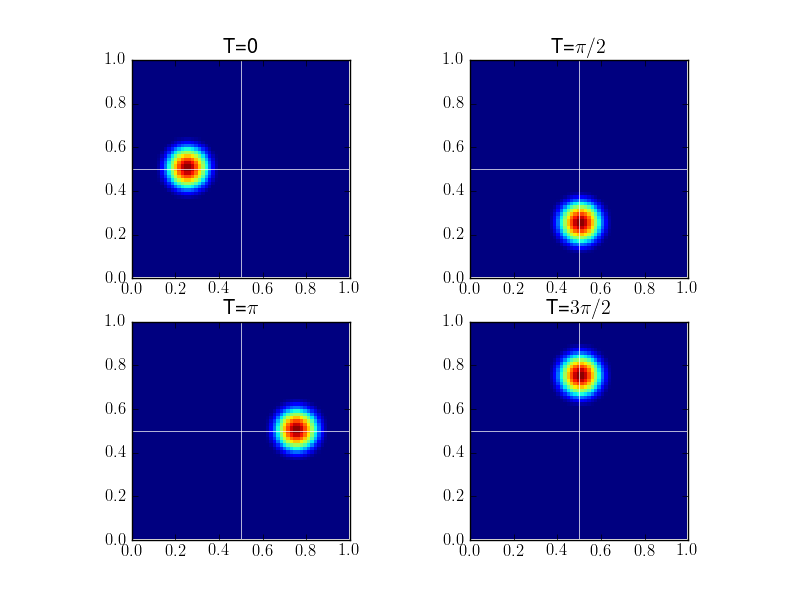

:Author: Ammar Hakim
:Date: April 13th 2012
:Completed: April 30th 2012
:Last Updated:  May 5th 2012

JE12: Studies with a discontinuous Galerkin Poisson bracket solver
==================================================================

.. contents::

In this entry I study a discontinuous Galerkin (DG) algorithm to
discretize the Poisson bracket operator. In particular, I look at the
spatial and temporal convergence properties of this algorithm and
study the ability of the algorithm to solve complicated problems.

The algorithm updates the equation

.. math::
  :label: eqn:pb

  \frac{\partial \chi}{\partial t} + \{\chi,\psi\} = 0

the Poisson bracket :math:`\{\chi,\psi\}` is defined as

.. math::

  \{\chi,\psi\} = 
  \frac{\partial \chi}{\partial x}\frac{\partial \psi}{\partial y} 
  -
  \frac{\partial \chi}{\partial y}\frac{\partial \psi}{\partial x}.

This equation describes the advection of the vorticity field
:math:`\chi` with the advection velocity determined from the potential
field as :math:`\mathbf{u} = \nabla\psi\times \mathbf{e}_z` or
:math:`u_x = \partial \psi/ \partial y` and :math:`u_y = -\partial
\psi/ \partial x`. Hence, although :math:`\chi` can be discontinuous,
:math:`\psi` must be be continuous.

Convergence of Poisson bracket algorithm
----------------------------------------

Temporal Convergence
++++++++++++++++++++

In the first set of tests the temporal convergence is tested. For this
a Gaussian pulse :math:`\chi(x,y,0) = \exp(-75(x-x_c)^2)` is
initialized, where :math:`x_c = 0.5` and :math:`x \in [0,1]` with
periodic boundary conditions. The potential is set to
:math:`\psi(x,y)=y` which advects the pulse with constant speed in the
X-direction. Simulations were run on a :math:`32\times 4` grid to
:math:`t=1.0`. The time-steps were adjusted to CFL numbers of 0.2,
0.1, 0.05 and 0.025. To isolate the errors from the temporal
discretization alone the differences in the solution were computed
between successive results and their convergence computed. 

The results with Runge-Kutta second-order schemes is presented in the
following table.

.. list-table:: Poisson bracket convergence for RK-2 time-stepping.
  :header-rows: 1
  :widths: 20,40,20,20

  * - CFL
    - Change in error
    - Order
    - Simulation
  * - :math:`0.1`
    - :math:`4.9346\times 10^{-3}`
    - 
    - :doc:`s105 <../../sims/s105/s105-pb-advection-1d>`
  * - :math:`0.05`
    - :math:`1.2315\times 10^{-3}`
    - 2.0
    - :doc:`s106 <../../sims/s106/s106-pb-advection-1d>`
  * - :math:`0.025`
    - :math:`3.0780\times 10^{-4}`
    - 2.0
    - :doc:`s107 <../../sims/s107/s107-pb-advection-1d>`

The results with Runge-Kutta third-order schemes is presented in the
following table.

.. list-table:: Poisson bracket convergence for RK-3 time-stepping.
  :header-rows: 1
  :widths: 20,40,20,20

  * - CFL
    - Change in error
    - Order
    - Simulation
  * - :math:`0.1`
    - :math:`1.9146\times 10^{-4}`
    - 
    - :doc:`s109 <../../sims/s109/s109-pb-advection-1d>`
  * - :math:`0.05`
    - :math:`2.4022\times 10^{-5}`
    - 2.99
    - :doc:`s110 <../../sims/s110/s110-pb-advection-1d>`
  * - :math:`0.025`
    - :math:`3.0023\times 10^{-6}`
    - 3.00
    - :doc:`s111 <../../sims/s111/s111-pb-advection-1d>`

Spatial Convergence
+++++++++++++++++++

To test the spatial convergence of the algorithms, a Gaussian pulse is
initialized and propagated diagonally across a unit square with
periodic boundary conditions. The pulse returns to its starting
position after unit time has elapsed. Note that diagonal propagation
is a harder problem than propagation parallel to grid lines: it not
only tests the isotropy of the scheme but also the ability of the
scheme to capture features propagating across grid lines.

The Gaussian pulse is

.. math::

  \chi(x,y,0) = \exp(-75 r^2)

where :math:`r = \sqrt{(x-x_c)^2+(y-y_c)^2}` and :math:`(x_c,y_c)` are
the coordinates of the center of the pulse. The potential is selected
as

.. math::

  \psi(x,y) =y - x

giving an advection speed of :math:`\sqrt{2}` top right corner of the
domain. For all problems, the time-step was held fixed for all spatial
resolutions.

In the first set of tests, the convergence of the second-order scheme
is tested. This scheme uses the second-order 4-node Lobatto elements
with RK-2 time-stepping. Grids of :math:`32\times 32`, :math:`64\times
64` and :math:`128\times 128` were used and convergence computed by
comparing to the initial conditions. Results are shown in the
following table.

.. list-table:: Poisson bracket convergence for second-order spatial scheme
  :header-rows: 1
  :widths: 20,40,20,20

  * - Cell size
    - Average Error
    - Order
    - Simulation
  * - :math:`1/32`
    - :math:`1.4036 \times 10^{-3}`
    - 
    - :doc:`s112 <../../sims/s112/s112-pb-advection-2d>`
  * - :math:`1/64`
    - :math:`2.0966\times 10^{-4}`
    - 2.74
    - :doc:`s113 <../../sims/s113/s113-pb-advection-2d>`
  * - :math:`1/128`
    - :math:`4.6609\times 10^{-5}`
    - 2.17
    - :doc:`s114 <../../sims/s114/s114-pb-advection-2d>`

The solution computed on the :math:`32\times 32` grid is shown below.

.. figure:: s112-projected-solution.png
  :width: 100%
  :align: center

  Solution computed on a :math:`32\times 32` with the 2D Poisson
  bracket updater (left) with a slice in the X-direction (red, right)
  compared to exact solution (black) at :math:`t=0`. See :doc:`s112
  <../../sims/s112/s112-pb-advection-2d>` for input file.

In the second set of tests, the convergence of the third-order scheme
is tested. This scheme uses the third-order 8-node Serendipity
elements with RK-3 time-stepping. Grids of :math:`8\times 8`,
:math:`16\times 16`, and :math:`32\times 32` were used and convergence
computed by comparing to the initial conditions. Results are shown in
the following table.

.. list-table:: Poisson bracket convergence for third-order spatial scheme
  :header-rows: 1
  :widths: 20,40,20,20

  * - Cell size
    - Average Error
    - Order
    - Simulation
  * - :math:`1/8`
    - :math:`4.4776 \times 10^{-3}`
    - 
    - :doc:`s115 <../../sims/s115/s115-pb-advection-2d>`
  * - :math:`1/16`
    - :math:`3.4893\times 10^{-4}`
    - 3.68
    - :doc:`s116 <../../sims/s116/s116-pb-advection-2d>`
  * - :math:`1/32`
    - :math:`2.8015\times 10^{-5}`
    - 3.63
    - :doc:`s117 <../../sims/s117/s117-pb-advection-2d>`

.. note::

  To get the correct convergence with the third-order spatial scheme
  we need to use RK3 time-stepping. Even though the results look okay
  with the RK2 scheme, the mild instability in RK2 reduces the overall
  convergence of the spatial operator.

Rigid-body rotating flow
------------------------

In this test a rigid body rotating flow is initialized by selecting
the potential as

.. math::

  \psi(x,y) = -\frac{1}{2}(y^2-y+x^2-x)

With this potential the flow velocity is :math:`(u_x,v_x) = (-y+1/2,
x-1/2)` which represents a counter-clockwise rigid body rotation about
:math:`(x_c,y_c)=(1/2,1/2)` with period :math:`2\pi`. Hence,
structures in :math:`\chi` will perform a circular motion about
:math:`(x_c,y_c)`, returning to their original position at
:math:`t=2\pi`.

The simulation was performed with :math:`32\times 32` and
:math:`64\times 64` grid with an initial cosine hump of the form

.. math::

  \chi(x,y,0) = \frac{1}{4}
  \left[
    1 + \cos(\pi r)
  \right]

where

.. math::

  r(x,y) = \min(\sqrt{(x-x_0)^2 + (y-y_0)^2}, r_0)/r_0

For this problem, :math:`r_0=0.2` and :math:`(x_0,y_0) = (1/4,
1/2)`. To test convergence, the simulation was run to :math:`t=2\pi`
and compared to the initial condition. Average errors of
:math:`1.583\times 10^{-3}` and :math:`3.459\times 10^{-4}` were
computed, giving a spatial convergence order of about
:math:`2.29`. Next, a third order spatial scheme was used to compute
the solution to :math:`t=4\pi` at which point the cosine hump has
advected twice about the origin. The figure below shows the solution at
four different times, indicating that the algorithm essentially
advects the initial hump without any significant distortion.

  Rigid-body rotation solution on a :math:`32\times 32` grid using a
  3rd order discontinuous Galerkin scheme at different times
  [:doc:`s120 <../../sims/s120/s120-pb-advection-rb>`]. The white
  lines are the axes drawn through the point around which the flow
  rotates. These figures show that the scheme advects the initial
  cosine hump without significant distortion even on a relatively
  coarse grid. For a movie of the simulation click `here
  <../../_static/s120-rigid-body.mov>`_.

Swirling flow
-------------

In this problem we use a time-dependent potential given by

.. math::

  \psi(x,y,t) = \frac{1}{\pi}\sin^2(\pi x) \sin^2(\pi y) g(t)

where

.. math::

  g(t) = \cos(\pi t/T)

With this potential we get the velocity field

.. math::

  u_x(x,y,t) &= \sin^2(\pi x) \sin(2 \pi y) g(t) \\
  u_y(x,y,t) &= -\sin^2(\pi y) \sin(2 \pi x) g(t)

This represents a swirling flow that distorts the vorticity field,
reaching a maximum distortion at :math:`t=T/2`. At that point the flow
reverses and the vorticity profile returns to its initial value.

We use a 3rd order scheme on a :math:`32\times 32` grid and run the
simulation to :math:`t=2T`. The results are show in the following
figure. For a movie of the simulation click `here
<../../_static/s121-swirl-flow.mov>`_.

  Swirling flow solution on a :math:`32\times 32` using a 3rd order
  discontinuous Galerkin scheme at different times [:doc:`s121
  <../../sims/s121/s121-pb-advection-sf>`]. The figure shows the
  initial condition, the maximum distortion in the first half period
  after which the solution returns to its initial value, swinging back
  for a second oscillation.

In thw following figure compares the final solution to the initial
conditions.

  Swirling flow solution on a :math:`32\times 32` grid using a 3rd
  order discontinuous Galerkin scheme at :math:`t=2T` (red dots)
  compared to the initial conditions (black line). The algorithm is
  able to handle this complicated flow pattern and show very little
  distortion of the final solution. See [:doc:`s121
  <../../sims/s121/s121-pb-advection-sf>`].

Enstrophy conservation properties
---------------------------------

For equation :eq:`eqn:pb` there are an infinite set of invariants. Let
:math:`C_a(\chi)` be an arbitrary function. Then the scalar quantity

.. math::

  C \equiv \int_\Omega C_a(\chi) dx dy

is conserved. In particular, :math:`C_a = \chi^2/2` is called the
fluid enstrophy. To prove conservation, multiply :eq:`eqn:pb` by
:math:`C_a'(\chi)` after writing :math:`\{\chi,\psi \} =
\mathbf{u}\cdot \nabla \chi` and integrate over the domain, using the
boundary conditions to get

.. math::

  dC/dt = 0.

We can show that the Poisson bracket algorithm does not conserve
enstrophy unless a central flux is used. Even with the central flux
the overall scheme is not conservative as the Runge-Kutta
time-stepping adds a small amount of diffusion. 

The following figure shows the error in enstropy as the time-step is
reduced. The error should reduce with the same order as the
time-stepping order, in this case third. These simulations were run
with central flux with the DG2 spatial scheme.

  Enstrophy history with different CFL numbers. The relative errors in
  enstrophy in are :math:`1.396\times 10^{-3}`, :math:`1.794\times
  10^{-4}` and :math:`2.254\times 10^{-5}`, giving a convergence order
  2.96 and 2.99 respectively. See :doc:`s122
  <../../sims/s122/s122-pb-advection-2d>`, :doc:`s123
  <../../sims/s123/s123-pb-advection-2d>` and :doc:`s124
  <../../sims/s124/s124-pb-advection-2d>`, for input files.
