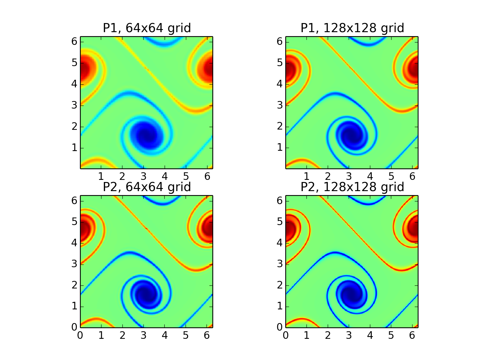
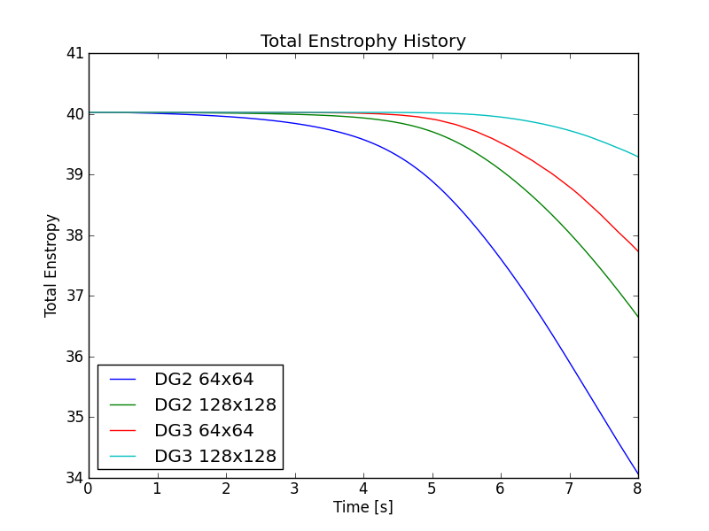
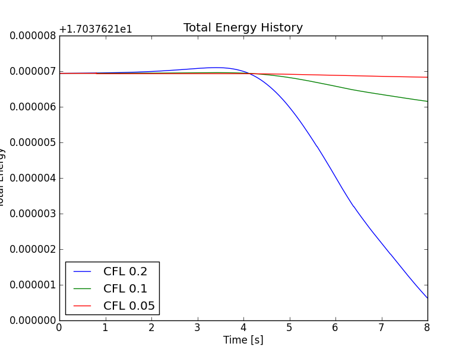
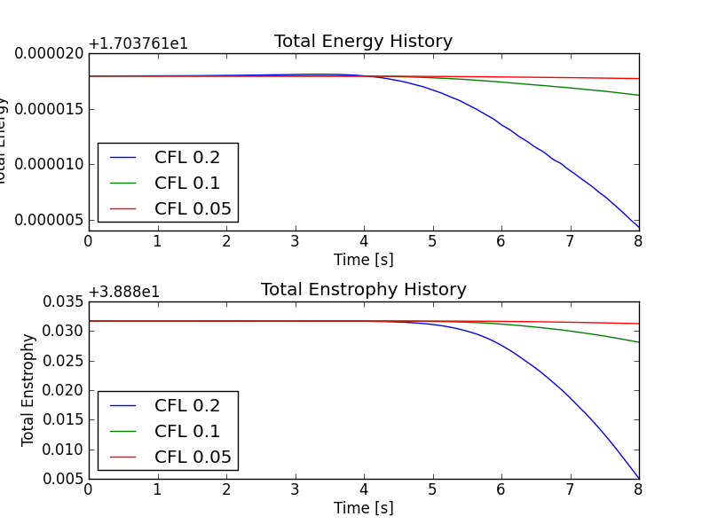
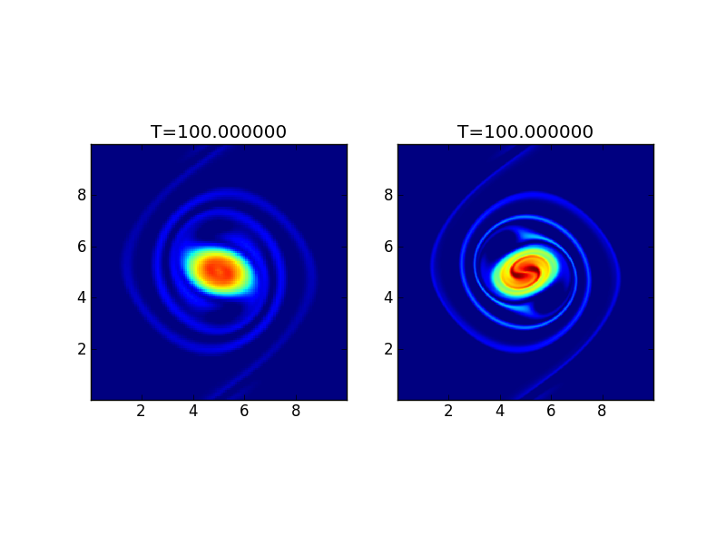
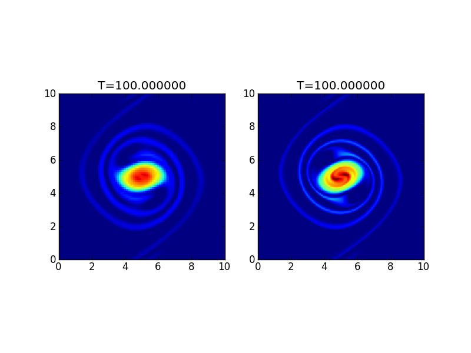
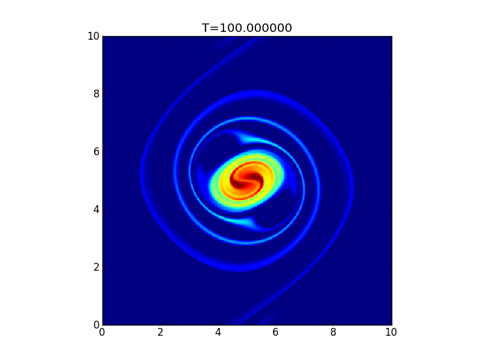

:Author: Ammar Hakim
:Date: May 15th 2012
:Completed:  May 15th 2012
:Last Updated:  

JE13: 2D Incompressible Euler Solver
====================================

.. contents::

The 2D incompressible Euler equations can be written in
vorticity-streamfunction form

.. math::

  \frac{\partial \chi}{\partial t} + \nabla\cdot(\mathbf{u}\chi) = 0

where :math:`\chi` is the fluid vorticity and :math:`\mathbf{u} =
\nabla\psi\times\mathbf{e}_z` is the fluid velocity. Here :math:`\psi`
is the streamfunction determined from a Poisson equation

.. math::

  \nabla^2 \psi = -\chi. 

As the flow is incompressible (:math:`\nabla\cdot\mathbf{u}=0`) we can
rewrite the fluid equation in the form

.. math::

  \frac{\partial \chi}{\partial t} + \{\chi,\psi\} = 0

where :math:`\{\chi,\psi\}` is the Poisson bracket operator defined by

.. math::

  \{\chi,\psi\} = 
  \frac{\partial \chi}{\partial x}\frac{\partial \psi}{\partial y} -
  \frac{\partial \chi}{\partial y}\frac{\partial \psi}{\partial  x}.

In this entry I use the FE Poisson solver tested in :doc:`JE11
<../je11/je11-fem-poisson.rst>` and combine it with the Poisson
bracket algorithm tested in :doc:`JE12 <../je12/je12-poisson-bracket>`
to solve this set of equations.

.. note::

  As of May 15th 2012 there is a bug in my Poisson solver which feeds
  in a non-symmetric matrix to PetSc. This causes very small errors in
  the potential, which, however, greatly magnify the errors in the
  total energy. In fact, the total energy plots look bizarre although
  the solution is just fine.

  Till this problem is fixed Gkeyll needs to be run with the
  ``-pc_type lu`` command line option to force PetSc to use a direct
  Poisson solve instead of the iterative solver.

Problem 1: A double shear flow
------------------------------

In this problem the simulation is initialized with two shear
layers. The initially planar shear layers are perturbed slightly due
to which they roll around each other, forming finer and finer
vortex-like features. The initial conditions for this problem are

.. math::
  \chi(x,y,0) = 
  \left\{
    \begin{array}{1 1}
      \delta\cos(x) - \frac{1}{\rho}\mathrm{sech}^2((y-\pi/2)/\rho) \quad y\le\pi \\
      \delta\cos(x) + \frac{1}{\rho}\mathrm{sech}^2((3\pi/2-y)/\rho) \quad y\gt\pi
    \end{array}
  \right.

For the results show below :math:`\rho = \pi/15` and :math:`\delta =
0.05` run up to a time of 8 seconds.

In the first set of simulations, an upwind flux was used with
different grid sizes and spatial order schemes to compute the
solution. The figure below shows the results at the final time from
these simulations.

  Double shear problem vorticity at :math:`t=8` with different grid
  resolutions and schemes. Upper left, DG2 on :math:`64\times 64` grid
  [:doc:`s125 <../../sims/s125/s125-double-shear>`], upper right DG2
  on :math:`128\times 128` grid [:doc:`s126
  <../../sims/s126/s126-double-shear>`], lower left, DG3 on
  :math:`64\times 64` grid [:doc:`s127
  <../../sims/s127/s127-double-shear>`] and lower right, DG3 on
  :math:`128\times 128` grid [:doc:`s128
  <../../sims/s128/s128-double-shear>`]. Note the increasing
  resolution of features as the spatial order and grid resolution is
  increased.

In the following two figures the energy and enstrophy history as a
function of time is shown. Note that these are conserved quantities of
the incompressible Euler equations but need not be conserved by the
numerical scheme.

  Double shear energy history with different grid resolutions and
  schemes. Increasing grid resolution reduces the drop in energy,
  however the spatial order seems to have an opposite effect than
  expected. I have not figured out why this should be the case and
  this plot has mystified me.

  Double shear enstrophy history with different grid resolutions and
  schemes. Increasing spatial order and grid resolution reduces the
  drop in enstrophy as expected.

Even with upwind fluxes (used in all the simulations shown above), one
can show that the energy is conserved by the spatial discretization
exactly. However, in the actual simulations there is a small loss in
energy due to the dissipation added from the Runge-Kutta time-stepping
and energy conservation proof holds only as :math:`\Delta t
\rightarrow 0` with the same order as the time integration
scheme. This is clearly seen in the plot shown below.

  Double shear energy history with DG2 on a :math:`64\times 64` grid
  with different CFL numbers. Blue, CFL 0.2 [:doc:`s125
  <../../sims/s125/s125-double-shear>`], green, CFL 0.1 [:doc:`s129
  <../../sims/s129/s129-double-shear>`] and red, CFL 0.05 [:doc:`s130
  <../../sims/s130/s130-double-shear>`]. The drop in energy is
  :math:`6.3\times 10^{-6}`, :math:`7.8\times 10^{-7}` and
  :math:`1.1\times 10^{-7}` respectively. This gives energy
  convergence order of 3.0 and 2.8 respectively.
  
With central fluxes both energy and enstrophy are conserved to the
same order of the time integration scheme. To test this the simulation
was run with the second order scheme on a :math:`64\times 64` grid
with central fluxes and different CFL numbers. The vorticity at
:math:`t=8` is shown below.

  Vorticity at :math:`t=8` for double shear problem with central
  fluxes. Notice the significant phase errors in the solution as
  compared to the solution with the upwind flux. See [:doc:`s131
  <../../sims/s131/s131-double-shear>`] for the input
  file.

The following figure shows the time history of the energy and
enstrophy with central fluxes with different CFL numbers. With
reducing time steps the errors in *both* energy and enstrophy go to
zero.

  Total energy (top) and total enstrophy (bottom) history with
  different CFL numbers with central flux. Both energy and enstrophy
  errors go to zero with the order of time-stepping scheme. See
  [:doc:`s131 <../../sims/s131/s131-double-shear>`], [:doc:`s132
  <../../sims/s132/s132-double-shear>`] and [:doc:`s133
  <../../sims/s133/s133-double-shear>`] for the input files.

Problem 2: The Vortex Waltz
---------------------------

This problem is initialized with two Guassian vortices which merge as
they orbit around each other. The vorticity is initialized using the
sum of two Gaussians given by

.. math::

  \chi(x,y,0) = \omega_1(x,y) + \omega_2(x,y)

where 

.. math::

  \omega_i(x,y) = e^{-r_i^2/0.8}

where :math:`r_i^2 = (x-x_i)^2 + (y-y_i)^2` and :math:`(x_1,y_1) =
(3.5,5.0)` and :math:`(x_2,y_2) = (6.5,5.0)`.

The figure below shows the solutions on :math:`64\times 64` and
:math:`256\times 256` grids using the second order scheme with upwind
fluxes.

  Vorticity for the vortex waltz problem. The left panel shows the
  solution with :math:`64 \times 64` [:doc:`s134
  <../../sims/s134/s134-vortex-waltz>`] grid, while the right panel
  shows the solution with :math:`256 \times 256` [:doc:`s136
  <../../sims/s136/s136-vortex-waltz>`] grid.

The figure below shows the solutions on :math:`32\times 32` and
:math:`64\times 64` grids using the third order scheme with upwind
fluxes.

  Vorticity for the vortex waltz problem with the third-order
  scheme. The left panel shows the solution with :math:`32 \times 32`
  [:doc:`s137 <../../sims/s137/s137-vortex-waltz>`] grid, while the
  right panel shows the solution with :math:`64 \times 64` [:doc:`s138
  <../../sims/s138/s138-vortex-waltz>`] grid.

The following figure shows the solution with the third order scheme on
:math:`128\times 128` grid.

  Vorticity for the vortex waltz problem with the third-order scheme
  on a :math:`128 \times 128` [:doc:`s139
  <../../sims/s139/s139-vortex-waltz>`] grid. The solution looks
  better resolved than the :math:`256 \times 256` second-order scheme
  and runs significantly faster.

Conclusions
-----------

The Poisson bracket updater combined with the Poisson solver is used
to solve the incompressible Euler equations. The results show that
energy and enstrophy is conserved (to the order of the time
integration scheme) when using a central flux, while the energy is
conserved even when using upwind fluxes. It is also shown that the
third order spatial scheme is significantly more accurate and runs
faster than the second order spatial scheme.

