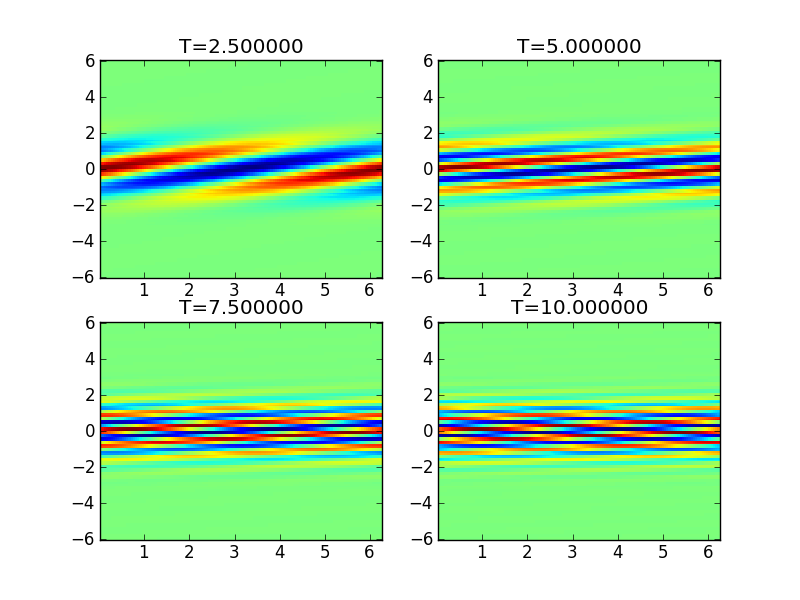
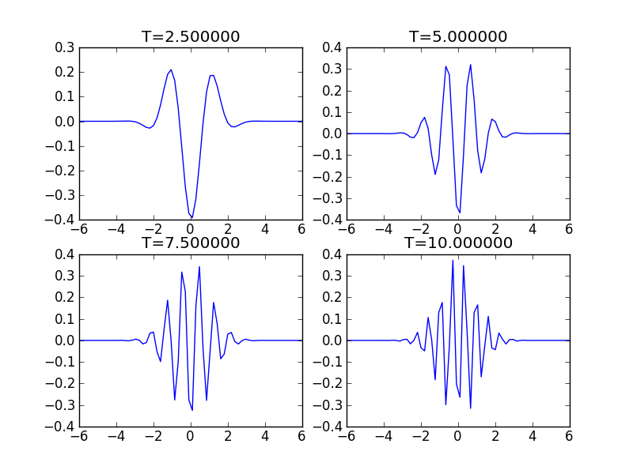

:Author: Ammar Hakim
:Date: July 3rd
:Completed:  
:Last Updated:  

JE14: A DG scheme for Vlasov equation with fixed potential
==========================================================

.. contents::

In this document I test a discontinuous Galerkin (DG) scheme for the
solution of the 1D Vlasov equation written as

.. math::

  \frac{\partial f}{\partial t} = \{H,f\}

where :math:`f(x,v,t)` is the distribution function, :math:`H(x,v)` is
a Hamiltonian function and where :math:`\{H,f\}` is the Poisson
bracket operator defined by

.. math::

  \{H,f\} = 
  \frac{\partial H}{\partial x}\frac{\partial f}{\partial v} -
  \frac{\partial H}{\partial v}\frac{\partial f}{\partial x}.

The Hamiltonian takes the form [#hamil-note]_

.. math::

  H = \frac{1}{2}v^2 + \frac{q}{m}\phi

where :math:`\phi(x,t)` is a scalar potential and :math:`q` and
:math:`m` are the particle charge and mass respectively. In this note
the potential is specified and time-independent. For the
Vlasov-Poisson system, however, the potential is determined from
either a Poisson solve or from the requirements of
quasi-neutrality. With this Hamiltonian the Vlasov equation can be
written in the familar form

.. math::

  \frac{\partial f}{\partial t} + v\frac{\partial f}{\partial x}
  - \frac{q}{m}\frac{\partial \phi}{\partial x} \frac{\partial f}{\partial v}
  = 0.

.. note::

  The Lua programs implementing these simulations are quite
  complicated due to the fact that the moments and potential live on a
  1D spatial grid while the distribution function itself lives on a 2D
  phase-space grid. This means that basis functions, fields and
  updaters need to be defined on both grids, with additional operators
  to go between them.

Problem 1: Free streaming
-------------------------

In the first test we set :math:`\phi = 0`, which leads to the
free-streaming (constant advection) equation

.. math::

  \frac{\partial f}{\partial t} + v\frac{\partial f}{\partial x} = 0.

Note that the exact solution to this equation is simply

.. math::

  f(x,v,t) = f(x-vt,v,0)

i.e. for at each point in velocity space the initial distribution
advects with a constant speed. However, even though the distribution
function is manifestly undamped, its *moments* are damped. To see this
pick an initial condition a Maxwellian [#positivity]_

.. math::

  f(x,v,0) = \frac{1}{\sqrt{2\pi v_t}}
    \exp(-v^2/2v_t^2) \cos(kx)

where :math:`v_t` is the thermal velocity and :math:`k` is the
wave-number. Then, the exact solution is

.. math::

  f(x,v,t) = \frac{1}{\sqrt{2\pi v_t}}
    \exp(-v^2/2vt^2) \cos\left( k(x-vt) \right)

The increasingly oscillatory nature of the :math:`\cos\left( k(x-vt)
\right)` term results in *phase mixing* due to which all moments of
the distribution functions are severly damped. For example, the number
density is

.. math::

  n(x,t) = \int_{-\infty}^\infty f dv = e^{-k^2v_t^2t^2/2} \cos(kx)

which is exponentially damped.

To test the ability of the algorithm to model this damping, a
simulation is initialized with a Maxwellian with :math:`v_t=1` and
:math:`k=1` on a domain :math:`(x,v) \in [0,2\pi] \times [-6,6]`. The
number density is computed and diagnositcs inserted to record the
time-dependent density in a specified cell. 

The results on a :math:`64\times 64` grid with DG second order scheme
with upwind fluxes are show below.

  Distribution function :math:`f(x,v,t)` at different times for
  free-streaming problem. This simulaton [:doc:`s143
  <../../sims/s143/s143-vlasov-free-stream>`] was performed on a
  :math:`64\times 64` grid with DG second order scheme with upwind
  fluxes. Seen is the increasing striations in the distribution
  function due to the differential advection at different velocities
  and the initial spatial perturbation.

  Distribution function :math:`f(x=\pi,v,t)` at different times for
  free-streaming problem. The increasingly oscillatory nature of the
  distribution function is evident in this plot. See previous figure
  caption for other details.

--------

.. [#hamil-note] The Hamilitonian should be written in
   canonical coordinates as

   .. math::

       H = \frac{p^2}{2m} + q\phi

   where :math:`p=mv` is the particle momentum. However, for the
   simple case considered here the two definitions lead to the same
   dynamical equation for the distribution function.

.. [#positivity] The form of the initial condition means that the
   distribution function is allowed to go negative. This is okay in
   this test problem, but for plasmas positivity of the distribution
   function is a required condition of physical realizability.

