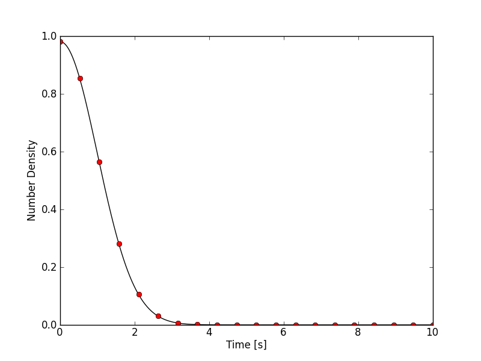
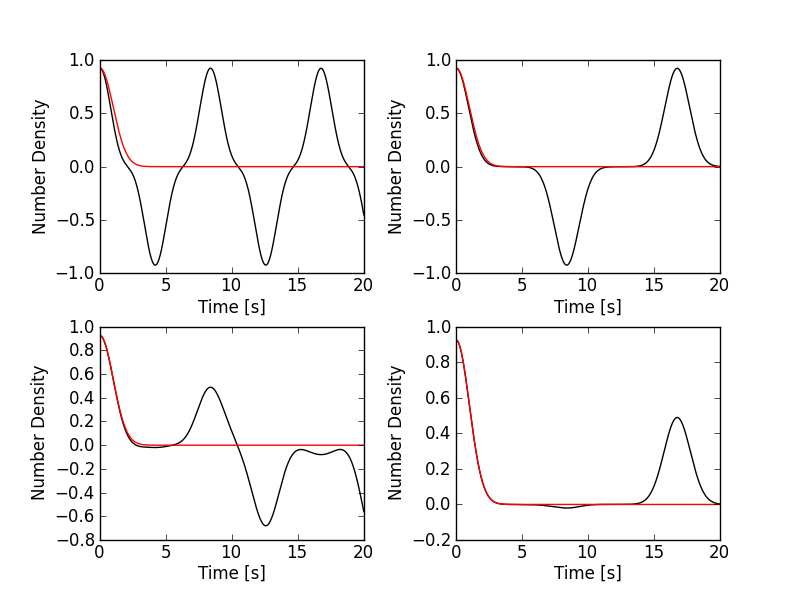
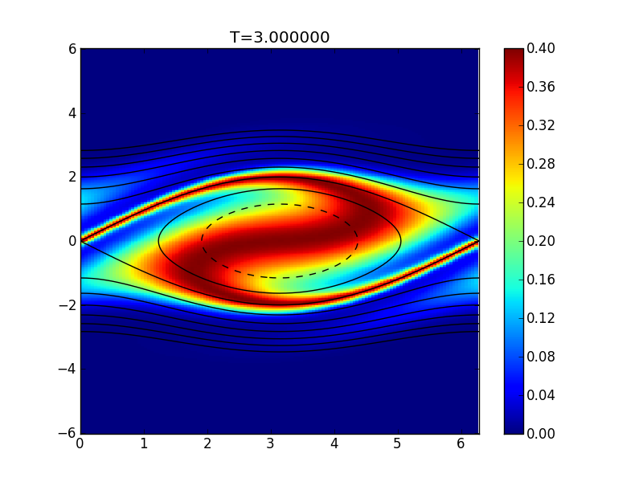
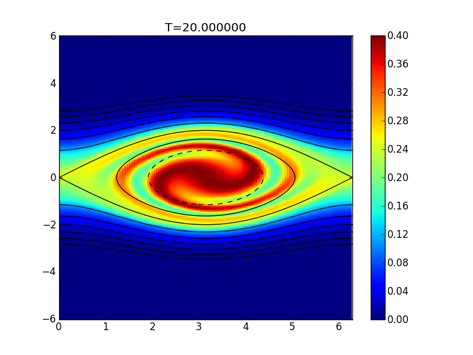

:Author: Ammar Hakim
:Date: July 3rd
:Completed:  
:Last Updated:  

JE14: A DG scheme for Vlasov equation with fixed potential
==========================================================

.. contents::

In this document I test a discontinuous Galerkin (DG) scheme for the
solution of the 1D Vlasov equation written as

.. math::

  \frac{\partial f}{\partial t} = \{H,f\}

where :math:`f(x,v,t)` is the distribution function, :math:`H(x,v)` is
a Hamiltonian function and where :math:`\{H,f\}` is the Poisson
bracket operator defined by

.. math::

  \{H,f\} = 
  \frac{\partial H}{\partial x}\frac{\partial f}{\partial v} -
  \frac{\partial H}{\partial v}\frac{\partial f}{\partial x}.

The Hamiltonian takes the form [#hamil-note]_

.. math::

  H = \frac{1}{2}v^2 + \frac{q}{m}\phi

where :math:`\phi(x,t)` is a scalar potential and :math:`q` and
:math:`m` are the particle charge and mass respectively. In this note
the potential is specified and time-independent. For the
Vlasov-Poisson system, however, the potential is determined from
either a Poisson solve or from the requirements of
quasi-neutrality. With this Hamiltonian the Vlasov equation can be
written in the familar form

.. math::

  \frac{\partial f}{\partial t} + v\frac{\partial f}{\partial x}
  - \frac{q}{m}\frac{\partial \phi}{\partial x} \frac{\partial f}{\partial v}
  = 0.

.. note::

  The Lua programs implementing these simulations are quite
  complicated due to the fact that the moments and potential live on a
  1D spatial grid while the distribution function itself lives on a 2D
  phase-space grid. This means that basis functions, fields and
  updaters need to be defined on both grids, with additional operators
  to go between them.

Problem 1: Free streaming
-------------------------

In the first test we set :math:`\phi = 0`, which leads to the
free-streaming (constant advection) equation

.. math::

  \frac{\partial f}{\partial t} + v\frac{\partial f}{\partial x} = 0.

Note that the exact solution to this equation is simply

.. math::

  f(x,v,t) = f(x-vt,v,0)

i.e. for at each point in velocity space the initial distribution
advects with a constant speed. However, even though the distribution
function is manifestly undamped, its *moments* are damped. To see this
pick an initial condition a Maxwellian [#positivity]_

.. math::

  f(x,v,0) = \frac{1}{\sqrt{2\pi v_t}}
    \exp(-v^2/2v_t^2) \cos(kx)

where :math:`v_t` is the thermal velocity and :math:`k` is the
wave-number. Then, the exact solution is

.. math::

  f(x,v,t) = \frac{1}{\sqrt{2\pi v_t}}
    \exp(-v^2/2vt^2) \cos\left( k(x-vt) \right)

The increasingly oscillatory nature of the :math:`\cos\left( k(x-vt)
\right)` term results in *phase mixing* due to which all moments of
the distribution functions are severly damped. For example, the number
density is

.. math::

  n(x,t) = \int_{-\infty}^\infty f dv = e^{-k^2v_t^2t^2/2} \cos(kx)

which is exponentially damped.

Accuracy test
+++++++++++++

To test the ability of the algorithm to model this damping, a
simulation is initialized with a Maxwellian with :math:`v_t=1` and
:math:`k=1` on a domain :math:`(x,v) \in [0,2\pi] \times [-6,6]`. The
number density is computed and diagnositcs inserted to record the
time-dependent density in a specified cell. 

The results on a :math:`64\times 64` grid with DG second order scheme
with upwind fluxes are show below.

.. figure:: s143-vlasov-free-stream_distf.png
  :width: 100%
  :align: center

  Distribution function :math:`f(x,v,t)` at different times for
  free-streaming problem. This simulaton [:doc:`s143
  <../../sims/s143/s143-vlasov-free-stream>`] was performed on a
  :math:`64\times 64` grid with DG second order scheme with upwind
  fluxes. Seen is the increasing striations in the distribution
  function due to the differential advection at different velocities
  and the initial spatial perturbation.

.. figure:: s143-vlasov-free-stream_distf_v.png
  :width: 100%
  :align: center

  Distribution function :math:`f(x=\pi,v,t)` at different times for
  free-streaming problem. The increasingly oscillatory nature of the
  distribution function is evident in this plot. See previous figure
  caption for other details.

  Number density (black) in cell 2 as a function of time. The red dots
  show the exact solution. For this resolution the numerical solution
  is indistinguishable from the exact solution. See previous figure
  caption for other details.

Recurrence phenomena
++++++++++++++++++++

The discrete velocity space grid combined with a lack of true physical
(or numerical) damping will lead to recurrence, i.e, the initial
conditions will recur almost exactly after a finite amount of
time. To see this the above simulation was run on a coarser mesh with
:math:`32 \times 8` and :math:`32\times 16` cells with a second and
third spatial order scheme. The results are show below.

  Number density (black) as a function of time with DG2 on 8 velocity
  cells [:doc:`s144 <../../sims/s144/s144-vlasov-free-stream>`] (top
  left), DG2 on 16 velocity cells [:doc:`s145
  <../../sims/s145/s145-vlasov-free-stream>`] (top right), DG3 on 8
  velocity cells [:doc:`s146
  <../../sims/s146/s146-vlasov-free-stream>`] (bottom left) and DG3 on
  16 velocity cells [:doc:`s147
  <../../sims/s147/s147-vlasov-free-stream>`] (bottom right). The red
  line shows the exact solution. The recurrence is clearly visible in
  the second order scheme, and occurs later as the velocity grid is
  refined. Exact recurrence in the third-order scheme is not seen on
  this time-scale.

Problem 2: Particles in a potential well
----------------------------------------

In this problem the potential is held fixed after being initialized as

.. math::

  \phi(x) = \cos(x)

The initial distribution is assumed to be a uniform Maxwellian

.. math::

  f(x,v,0) = \frac{1}{\sqrt{2\pi v_t}} \exp(-v^2/2v_t^2)

with :math:`v_t=1.0`. A fraction of the particles will be trapped in
this potential well and appear as rotating vortices in the
distribution function plots. Simulations were run with a DG2 scheme on
a :math:`64\times 128` grid for :math:`(x,v) \in [0,2\pi] \times
[-6,6]`.

See `movie <../../_static/s149-fxv.mov>`_ of the results. Snapshots
are shown at a :math:`t=3` and :math:`t=20` below.

  Distribution function at :math:`t=3` for flow in a potential
  well. The black lines show contours of constant particle energy. A
  separatrix forms along the trapped-passing boundary. Simulation run
  with a DG2 scheme on a :math:`64\times 128` grid [:doc:`s149
  <../../sims/s149/s149-vlasov-fp>`].

  Distribution function at :math:`t=20` for flow in a potential
  well. See previous figure captions for other details.

--------

.. [#hamil-note] The Hamilitonian should be written in
   canonical coordinates as

   .. math::

       H = \frac{p^2}{2m} + q\phi

   where :math:`p=mv` is the particle momentum. However, for the
   simple case considered here the two definitions lead to the same
   dynamical equation for the distribution function.

.. [#positivity] The form of the initial condition means that the
   distribution function is allowed to go negative. This is okay in
   this test problem, but for plasmas positivity of the distribution
   function is a required condition of physical realizability.

