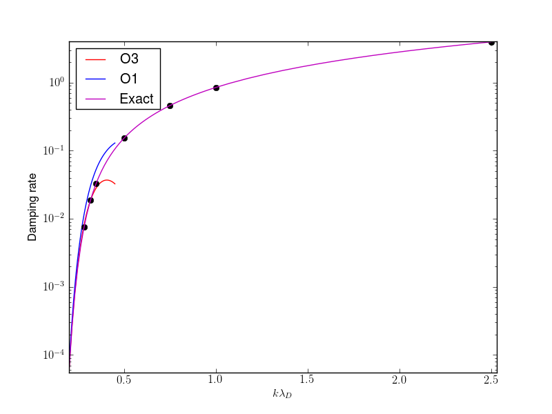

:Author: Ammar Hakim
:Date: July 16th
:Completed:  
:Last Updated:  

JE14: Studies with a DG electrostatic Vlasov solver
===================================================

.. contents::

In this document I study various standard "text-book" problems with a
discontinuous Galerkin algorithm for the solution of the electrostatic
Vlasov system. This system is written in Hamiltonian form as 

.. math::

  \frac{\partial f}{\partial t} = \{H,f\}

where :math:`f(x,v,t)` is the distribution function, :math:`H(x,v)` is
a Hamiltonian function and where :math:`\{H,f\}` is the Poisson
bracket operator defined by

.. math::

  \{H,f\} = 
  \frac{\partial H}{\partial x}\frac{\partial f}{\partial v} -
  \frac{\partial H}{\partial v}\frac{\partial f}{\partial x}.

The Hamiltonian takes the form

.. math::

  H = \frac{1}{2}v^2 + \frac{q}{m}\phi

where :math:`\phi(x,t)` is a scalar potential and :math:`q` and
:math:`m` are the particle charge and mass respectively. 

Two classes of problems will be considered: the first, in which the
potential is determined by solving a Poisson equation

.. math::

  \frac{\partial^2 \phi}{\partial x^2} = -\frac{\rho_c}{\epsilon_0}

where, :math:`\rho_c` is the total charge density. In this class of
problems the ion distribution function is not evolved: the ions simply
provide a neutralizing background to the electron motion. Hence, the
charge density is determined from

.. math::

 \rho_c = |e| \left(Zn_{io}(x) - \int_{-\infty}^{\infty} f(x,v,t) dv\right)

where :math:`n_{io}(x)` is the fixed ion number-density profile,
:math:`e` is the charge on an electron and :math:`Z` the ion charge
number.

In the second class of problems the electrons are assumed to be a
massless, isothermal fluid. In this case, the electron motion is
determined from the condition of quasi-neutrality that, for small
deviations, can be written as

.. math::

  n_{i}(x) = n_{eo}\left(1 + \frac{|e|\phi}{T_e}\right)

where :math:`n_{eo}` is the constant electron initial density and
:math:`T_e` is the fixed electron temperature. This allows the
determination of the potential once the ion number density is known.

Notice that in the first class of problems the distribution function
for the *electrons* is evolved, while in the second class of problems
the distribution function for the *ions* is evolved. Hence, they
represent the high-frequency (plasma frequency) and low-frequency (ion
sound speed) branch of the electrostatic plasma dispersion relation
respectively.

Tests for the Vlasov-Poisson system
-----------------------------------

Linear Landau damping
+++++++++++++++++++++

In this test the ability of the algorithm to capture the phenomena of
Landau damping is shown. For this the electrons are initialized with a
perturbed Maxwellian given by

.. math::

    f(x,v,0) = \frac{1}{\sqrt{2\pi v_t}} \exp(-v^2/2v_t^2)
    (1+\alpha\cos(kx))

where :math:`v_t` is the thermal velocity, :math:`k` is the
wave-number and :math:`\alpha` controls the perturbation. The
computational domain is :math:`(x,v) \in [-\pi/k,\pi/k] \times
[-6,6]`. This means the domain contains a single wave. Periodic
boundary conditions imposed in the spatial direction and open
boundary conditions in the velocity direction. The ion density is
simply set to :math:`n_i(x) = 1`. For all these tests we set
:math:`m=1`, :math:`\epsilon_0=1`, :math:`Z=1`, :math:`k=1/2` and
:math:`\alpha=0.01`. With these settings, the plasma frequency is
:math:`\omega_{pe}=1` and Debye length is :math:`\lambda_D =
\sqrt{T_e}`.

To test the dependence of the damping rate on normalized wavenumber
(:math:`k\lambda_D`) simulations were performed with different
:math:`T_e`. The field energy was computed and recorded as a function
of time. An example plot of field energy is shown in the following
figure for the case :math:`T_e=1.0`.

.. figure:: s151-field-energy.png
  :width: 100%
  :align: center

  Field energy (blue) as a function of time for linear Landau damping
  problem with :math:`k = 0.5` and :math:`T_e = 1.0`. The red dots
  represent the maxima in the field energy which are used to compute a
  linear least-square fit. The slope of the black line gives the
  damping rate. See [:doc:`s151
  <../../sims/s151/s151-landau-damping-vp>`] for the input file.

To understand the dependence of the damping rate on Debye length, the
electron temperature was varied. The results are shown in the
following figure.

.. figure:: damping-rates-elc-osc.png
  :width: 100%
  :align: center

  Damping rate from Landau damping for electron plasma oscillations as
  a function of normalized Debye length. The damping rate increases
  rapidly with electron temperature (Debye length), eventually
  saturating.

Linear Landau damping on larger periodic domain
+++++++++++++++++++++++++++++++++++++++++++++++

In the results shown above the simulation domain was comparable to the
Debye length. In this case the damping rate is strongly enhanced from
the expected values from standard linear-analysis. In C. Villani's
`course notes
<http://math.univ-lyon1.fr/~villani/Cedrif/pre.Landau.pdf>`_, see
section 3 in Chapter 3, it is stated that "... the Landau damping rate
in a periodic box of length :math:`l` decays extremely fast with
:math:`l`, like :math:`\exp(-c/l^2)`." Hence, to verify results with
linear theory one needs to increase the size of the domain. With this,
the damping rates can be compared to results obtained from linear
analysis in the :math:`k\lambda_D \ll 1` regime

.. math::

  \Omega_i \approx \left(\frac{\pi}{8}\right)^{1/2}
    \left(\frac{1}{K^3} - 6K\right)
    \exp\left(-\frac{1}{2K^2} -\frac{3}{2} - 3K^2 - 12K^4 \right)

In this `third-order accurate formula
<http://www.lle.rochester.edu/media/publications/lle_review/documents/v74/4_74accurate.pdf>`_
:math:`\Omega_i` is the normalized (to plasma frequency) growth
(damping) rate and :math:`K = k\lambda_D`. Note that the standard
text-book formula

.. math::

  \Omega_i \approx \left(\frac{\pi}{8}\right)^{1/2}
    \frac{1}{K^3}
    \exp\left(-\frac{1}{2K^2} -\frac{3}{2}\right)

is only first-order accurate. For the case in which :math:`k\lambda_D`
is large a numerical root-finder is needed to get the correct damping
rates.

In the following figure the numerical results are compared to the
exact values obtained from a numerical root finder that solves the
dispersion relation for Langmuir waves. Also shown are the values from
third order and the first-order formulas. Note that it is difficult to
obtain damping rates from simulations with even smaller
:math:`k\lambda_D` as the numerical damping seems to affect the the
delicate damping from the phase-mixing process.

  Damping rate from Landau damping for electron plasma oscillations as
  a function of normalized Debye length. These simulations were
  performed on a larger domain (compared to Debye length) to allow
  comparison with analytical results. The black dots show the
  numerical damping rates compared to the exact results (magenta),
  third-order formula (red) and the first-order formula (blue). The
  damping rates are within 3% of the exact values, and for large
  values of :math:`k\lambda_D` within 1%. The first- and third-oder
  formulas are only valid for :math:`k\lambda_D \ll 1` and do not
  agree with the exact results.

Nonlinear Landau damping
------------------------

For this problem the we set :math:`\alpha = 0.5`, rapidly driving the
system nonlinear. Other parameters are the same as for the linear
Landau damping problem with :math:`k=0.5` and :math:`T_e=1.0`. The
field energy history and distribution function at various times are
shown in the following figures. Full details of the evolution of the
distribution function can be seen in `this movie
<../../_static/s162-distf.mov>`_.

.. figure:: s162-field-energy.png
  :width: 100%
  :align: center

  Field energy as a function of time for nonlinear Landau damping
  problem with :math:`k = 0.5`, :math:`T_e = 1.0` and
  :math:`\alpha=0.5`. The initial perturbation decays at a rate of
  :math:`\gamma = -0.2916`, after which the damping is halted from
  particle trapping. The growth rate of this phase is :math:`\gamma =
  0.0879`. See [:doc:`s162 <../../sims/s162/s162-landau-damping-vp>`]
  for the input file.

.. figure:: s162-landau-damping-vp_distf.png
  :width: 100%
  :align: center

  Distribution function at different times for the nonlinear Landau
  damping problem. The initial perturbation undergoes shearing in
  phase space, leading to Landau damping from the phase mixing (see
  previous plot for damping rate). Starting at around :math:`t=20` the
  damping is halted due to particle trapping, finally leading to
  saturation. Phase-space holes are clearly visible.

Tests for the Vlasov-Quasineutral system
----------------------------------------

Etc. etc.

A note on dispersion relations for electrostatic oscillations
-------------------------------------------------------------

The plasma dielectric function can be written as

.. math::

  \epsilon(\omega, k) = 1 + \sum_s \chi_s(\omega,k)

where :math:`\omega` is the (complex) frequency, :math:`k` the wave
number and the sum is over all species in the plasma. The species
suseptibilites are defined as

.. math::

 \chi_s(\omega, k) = -\frac{\omega_s^2}{2v_s^2 k^2} 
    Z'\left( \frac{\omega}{\sqrt{2} v_s k} \right)

where :math:`\omega_s = \sqrt{n_sq_s^2/\epsilon_0 m_s}` is the plasma
frequency, :math:`v_s = \sqrt{T_s/m_s}` the thermal speed and
:math:`Z(\zeta)` is the plasma dispersion function. Further,
:math:`q_s` and :math:`m_s` are the species mass and charge
respectively and :math:`T_s` the temperature.

The plasma dispersion function is defined as

.. math::

  Z(\zeta) = \frac{1}{\sqrt{\pi}}
      \int_{-\infty}^\infty
         \frac{e^{-x^2}}{x-\zeta}
      dx

for :math:`\mathrm{Im}(\zeta) > 0`. The derivative of the plasma
dispersion function is given by

.. math::

  Z'(\zeta) = -2\left(1+\zeta Z(\zeta)\right).

Also, :math:`Z(0) = i\sqrt{\pi}`. In terms of the dielectric function
the plasma dispersion relation is obtained from the roots of the
equation :math:`\epsilon(\omega,k) = 0`, i.e, the frequency and
wave-number are related by

.. math::

  1 + \sum_s \chi_s(\omega,k) = 0.

Plasma oscillations
+++++++++++++++++++

For plasma oscillations we assume that the ions are immobile and hence
ignore the ion contribution to the dielectric function, leading to the
dispersion relation

.. math::

  1 - \frac{1}{2 k^2 \lambda_D^2} Z'(\zeta) = 0

where :math:`\lambda_D = v_e/\omega_e` is the Debye length. Once
:math:`\zeta` is determined from this equation for a specified
:math:`K \equiv k \lambda_D`, the frequency is determined from
:math:`\omega/\omega_e = \sqrt{2} K \zeta`.

Ion acoustic waves
++++++++++++++++++

For ion acoustic waves we can no longer ignore the ion contribution to
the dielectric function. In this case we can express the dispersion
function as

.. math::

 k^2\lambda_D^2 + 1 - \frac{T_e}{2 T_i} Z'(\zeta) = 0

where we have now defined :math:`\zeta \equiv \omega/\sqrt{2} v_i k`
and have assumed massless electrons. We let :math:`T \equiv T_i/T_e`
and determine :math:`\zeta` for a specified value of :math:`T` (in
this case :math:`K` is just held fixed). Now, the electron
contribution to the ion sound speed is :math:`c_e =
\sqrt{T_e/m_i}`. Hence, once :math:`\zeta` is determined we can
compute the normalized frequency from :math:`\omega/kc_i = \sqrt{2
T}\zeta`.

