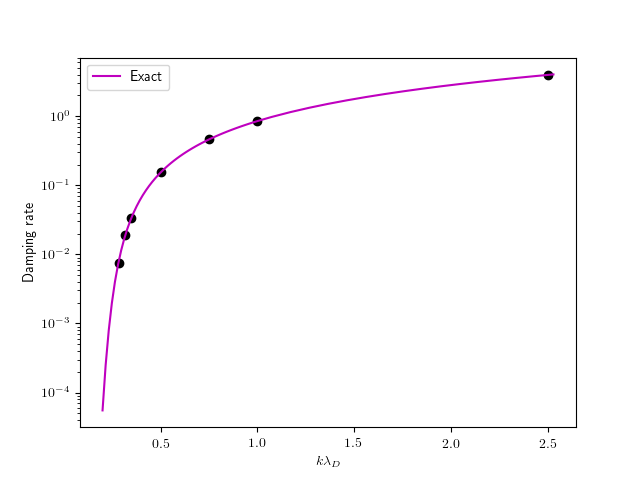
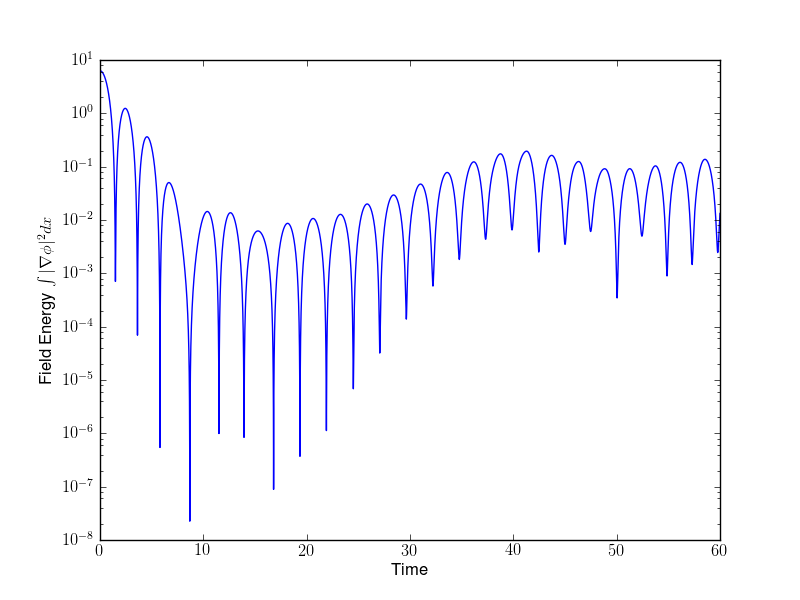
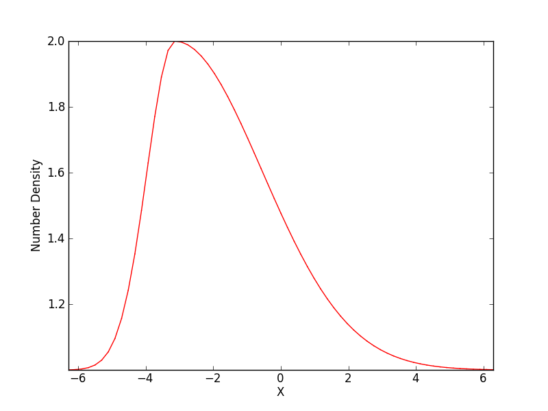
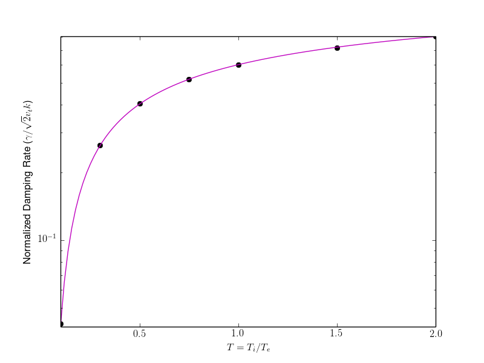

:Author: Ammar Hakim
:Date: July 16th
:Completed: July 27th
:Last Updated:  

JE15: Studies with a DG electrostatic Vlasov solver
===================================================

.. contents::

In this document I study various standard "text-book" problems with a
discontinuous Galerkin algorithm for the solution of the electrostatic
Vlasov system. This system is written in Hamiltonian form as 

.. math::

  \frac{\partial f}{\partial t} = \{H,f\}

where :math:`f(x,v,t)` is the distribution function, :math:`H(x,v)` is
a Hamiltonian function and where :math:`\{H,f\}` is the Poisson
bracket operator defined by

.. math::

  \{H,f\} = 
  \frac{\partial H}{\partial x}\frac{\partial f}{\partial v} -
  \frac{\partial H}{\partial v}\frac{\partial f}{\partial x}.

The Hamiltonian takes the form

.. math::

  H = \frac{1}{2}v^2 + \frac{q}{m}\phi

where :math:`\phi(x,t)` is a scalar potential and :math:`q` and
:math:`m` are the particle charge and mass respectively. 

Two classes of problems will be considered: the first, in which the
potential is determined by solving a Poisson equation

.. math::

  \frac{\partial^2 \phi}{\partial x^2} = -\frac{\rho_c}{\epsilon_0}

where, :math:`\rho_c` is the total charge density. In this class of
problems the ion distribution function is not evolved: the ions simply
provide a neutralizing background to the electron motion. Hence, the
charge density is determined from

.. math::

 \rho_c = |e| \left(Zn_{io}(x) - \int_{-\infty}^{\infty} f(x,v,t) dv\right)

where :math:`n_{io}(x)` is the fixed ion number-density profile,
:math:`e` is the charge on an electron and :math:`Z` the ion charge
number.

In the second class of problems the electrons are assumed to be a
massless, isothermal fluid. In this case, the electron motion is
determined from the condition of quasi-neutrality that, for small
deviations, can be written as

.. math::
  :label: eq:quasi_neutral

  n_{i}(x) = n_{eo}\left(1 + \frac{|e|\phi}{T_e}\right)

where :math:`n_{eo}` is the constant electron initial density and
:math:`T_e` is the fixed electron temperature. This allows the
determination of the potential once the ion number density is known.

Notice that in the first class of problems the distribution function
for the *electrons* is evolved, while in the second class of problems
the distribution function for the *ions* is evolved. Hence, they
represent the high-frequency (plasma frequency) and low-frequency (ion
sound speed) branch of the electrostatic plasma dispersion relation
respectively.

Tests for the Vlasov-Poisson system
-----------------------------------

Linear Landau damping
+++++++++++++++++++++

In this test the ability of the algorithm to capture the phenomena of
Landau damping is shown. For this the electrons are initialized with a
perturbed Maxwellian given by

.. math::

    f(x,v,0) = \frac{1}{\sqrt{2\pi v_t^2}} \exp(-v^2/2v_t^2)
    (1+\alpha\cos(kx))

where :math:`v_t` is the thermal velocity, :math:`k` is the
wave-number and :math:`\alpha` controls the perturbation. Periodic
boundary conditions imposed in the spatial direction and open boundary
conditions in the velocity direction. The ion density is set to
:math:`n_i(x) = 1`. For all these tests :math:`m=1`,
:math:`\epsilon_0=1`, :math:`Z=1` and :math:`\alpha=0.01`. With these
settings, the plasma frequency is :math:`\omega_{pe}=1` and Debye
length is :math:`\lambda_D = \sqrt{T_e}`. The wave-number is varied
and the damping rates computed as the slope of the least-squared line
passing through successive maxima of the field energy. See figure for
details. An example plot of field energy is shown in the following
figure for the case :math:`T_e=1.0`.

.. figure:: s151-field-energy.png
  :width: 100%
  :align: center

  Field energy (blue) as a function of time for linear Landau damping
  problem with :math:`k = 0.5` and :math:`T_e = 1.0`. The red dots
  represent the maxima in the field energy which are used to compute a
  linear least-square fit. The slope of the black line gives the
  damping rate. See [:doc:`s151
  <../../sims/s151/s151-landau-damping-vp>`] for the input file.

The damping rates can be compared to results obtained from linear
analysis in the :math:`k\lambda_D \ll 1` regime

.. math::

  \Omega_i \approx \left(\frac{\pi}{8}\right)^{1/2}
    \left(\frac{1}{K^3} - 6K\right)
    \exp\left(-\frac{1}{2K^2} -\frac{3}{2} - 3K^2 - 12K^4 \right)

In this `third-order accurate formula
<http://www.lle.rochester.edu/media/publications/lle_review/documents/v74/4_74accurate.pdf>`_
:math:`\Omega_i` is the normalized (to plasma frequency) growth
(damping) rate and :math:`K = k\lambda_D`. Note that the standard
text-book formula

.. math::

  \Omega_i \approx \left(\frac{\pi}{8}\right)^{1/2}
    \frac{1}{K^3}
    \exp\left(-\frac{1}{2K^2} -\frac{3}{2}\right)

is only first-order accurate. For the case in which :math:`k\lambda_D`
is large a numerical root-finder is needed to get the correct damping
rates.

In the following figure the numerical results are compared to the
exact values obtained from a numerical root finder that solves the
dispersion relation for Langmuir waves. Also shown are the values from
third order and the first-order formulas. Note that it is difficult to
obtain damping rates from simulations with even smaller
:math:`k\lambda_D` as the numerical damping seems to affect the the
delicate damping from the phase-mixing process.

  Damping rate from Landau damping for electron plasma oscillations as
  a function of normalized Debye length. These simulations were
  performed on a larger domain (compared to Debye length) to allow
  comparison with analytical results. The black dots show the
  numerical damping rates compared to the exact results (magenta),
  third-order formula (red) and the first-order formula (blue). The
  damping rates are within 3% of the exact values, and for large
  values of :math:`k\lambda_D` within 1%. The first- and third-oder
  formulas are only valid for :math:`k\lambda_D \ll 1` and do not
  agree with the exact results.

Nonlinear Landau damping
++++++++++++++++++++++++

For this problem :math:`\alpha = 0.5`, rapidly driving the system
nonlinear. Other parameters are the same as for the linear Landau
damping problem with :math:`k=0.5` and :math:`T_e=1.0`. The field
energy history and distribution function at various times are shown in
the following figures. Full details of the evolution of the
distribution function can be seen in `this movie
<../../_static/s162-distf.mov>`_.

  Field energy as a function of time for nonlinear Landau damping
  problem with :math:`k = 0.5`, :math:`T_e = 1.0` and
  :math:`\alpha=0.5`. The initial perturbation decays at a rate of
  :math:`\gamma = -0.2916`, after which the damping is halted from
  particle trapping. The growth rate of this phase is :math:`\gamma =
  0.0879`. See [:doc:`s162 <../../sims/s162/s162-landau-damping-vp>`]
  for the input file.

.. figure:: s162-landau-damping-vp_distf.png
  :width: 100%
  :align: center

  Distribution function at different times for the nonlinear Landau
  damping problem. The initial perturbation undergoes shearing in
  phase space, leading to Landau damping from the phase mixing (see
  previous plot for damping rate). Starting at around :math:`t=20` the
  damping is halted due to particle trapping, finally leading to
  saturation. Phase-space holes are clearly visible.

Conservation of Momentum and Energy
-----------------------------------

The Vlasov-Poisson system admits three conservation laws, the
conservation of particles, momentum and energy. Taking moments of the
Vlasov-Poisson equation leads to the moment equations

.. math::

 &\frac{\partial n}{\partial t} + \frac{\partial }{\partial x}(nu) = 0 \\
 &\frac{\partial }{\partial t}(mnu) + \frac{\partial}{\partial x} (mnu^2+p) = 
    -qn \frac{\partial \phi}{\partial x} \\
 &\frac{\partial \mathcal{E}}{\partial t} + \frac{\partial Q}{\partial x} = 
    -qnu\frac{\partial \phi}{\partial x}

where the moments are defined as

.. math::

  n &\equiv \int_{-\infty}^\infty f(x,v,t) dv \\
  u &\equiv \frac{1}{n}\int_{-\infty}^\infty v f(x,v,t) dv \\
  p &\equiv \int_{-\infty}^\infty m (v-u)^2 f(x,v,t) dv \\
  \mathcal{E} &\equiv \int_{-\infty}^\infty \frac{1}{2}mv^2 f(x,v,t) dv  \\
  Q &\equiv \int_{-\infty}^\infty \frac{1}{2}mv^3 f(x,v,t) dv

Note that the particle energy can also be written as
:math:`\mathcal{E} = mnu^2/2 + p/2`. Integrating the moment equations
over space and assuming periodic boundary conditions leads to the
conservation laws

.. math::

 &\frac{\partial}{\partial t}\left<n\right> = 0 \\
 &\frac{\partial}{\partial t}\left<nu\right> = 0 \\
 &\frac{\partial}{\partial t}\left<\mathcal{E} +
 \frac{\epsilon_0}{2}\left(\frac{\partial \phi}{\partial x}\right)^2 \right> =
 0

where angle brackets indicate spatial averaging. It can be shown that
the DG spatial discretization conserves energy.

From the derivation of momentum conservation one can see that a key
identity to preserve numerically is

.. math::

  \left<n\frac{\partial \phi}{\partial x}\right> = 0.

In the continuous case this can be easily derived from the Poisson
equation. However, for the discrete case it can be shown that the DG
scheme *does not* preserve this identity. The reason is that although
the discrete potential is continuous, its derivative is not. In fact,
the error in momentum is proportional to the jump in the derivative of
the potential across each interface summed over the domain.

Momentum conservation tests
+++++++++++++++++++++++++++

In this series of tests the distribution function is initialized as

.. math::

  f(x,v,0) &= (1+\exp\left(-\beta_l(x-x_m)^2\right)\thinspace f_m(T_e, v_d)
  \quad x<x_m \\
  &= (1+\exp\left(-\beta_r(x-x_m)^2\right)\thinspace f_m(T_e, v_d) \quad x \ge x_m

where :math:`\beta_l = 0.75`, :math:`\beta_r = 0.075`,
:math:`v_d=1.0`, :math:`T_e=1.0` and :math:`x_m=-\pi`. Further,
:math:`f_m(T,v_d)` is a drifting Maxwellian with a specified
temperature and drift velocity. For all problems the domain is
:math:`[-2\pi\times 2\pi]\times [-10,10]` and the velocity grid
resolution is held fixed to 128 cells. Spatial resolutions of
:math:`8,16,32` and 64 are used and relative error in momentum
measured.

The initial conditions drive strong asymmetric flows around
:math:`x=x_m` from the asymmetric number density profile. Note that if
a symmetric initial profile is used the net initial momentum in the
system will be zero and will remain so (to machine precision) as the
solution evolves. The initial number density is shown below.

  Initial number density profile for momentum conservation test
  problems. The profile is chosen to drive strong flows resulting in
  a large initial momentum.  See [:doc:`s183
  <../../sims/s183/s183-landau-damping-vp>`] for the input file.

The errors in momentum conservation are very insensitive to the
velocity space resolution, as is confirmed numerically. This is not
surprising as the momentum is an integrated (over velocity space)
quantity and hence the dependence of the *error* on velocity space
resolution is weak.

The following table shows the error in momentum conservation with
number of cells. The effective convergence error is also shown. The
errors seem to be reducing as :math:`\Delta x^2`, although at present
I am not sure what to make of the fractional convergence rates.

.. list-table:: Momentum conservation errors 
  :header-rows: 1
  :widths: 20,40,20,20

  * - :math:`N_x`
    - Error
    - Order
    - Simulation
  * - 8
    - :math:`1.3332\times 10^{-3}`
    - 
    - :doc:`s179 <../../sims/s179/s179-landau-damping-vp>`
  * - 16
    - :math:`3.9308\times 10^{-4}`
    - 1.76
    - :doc:`s181 <../../sims/s181/s181-landau-damping-vp>`
  * - 32
    - :math:`8.5969\times 10^{-5}`
    - 2.19
    - :doc:`s182 <../../sims/s182/s182-landau-damping-vp>`
  * - 64
    - :math:`1.5254\times 10^{-5}`
    - 2.49
    - :doc:`s183 <../../sims/s183/s183-landau-damping-vp>`

Energy conservation tests
+++++++++++++++++++++++++

In this series of test the conservation of total energy is tested. For
this the same initial conditions and domain size are used as for the
momentum tests. A fixed grid of :math:`16\times 32` is used and the
CFL number is varied. The errors in energy conservation are shown in
the following table. 

Note that even though the spatial discretization conserves energy
exactly, the non-reversible Runge-Kutta time-stepping adds a small
amount of diffusion. Thus, the errors in energy should converge to
zero with the same order as the time-stepping scheme, in this case
third-order. This is clearly seen from the results shown below.

.. list-table:: Energy conservation errors 
  :header-rows: 1
  :widths: 20,40,20,20

  * - :math:`CFL`
    - Error
    - Order
    - Simulation
  * - 0.3
    - :math:`1.4185\times 10^{-6}`
    - 
    - :doc:`s184 <../../sims/s184/s184-landau-damping-vp>`
  * - 0.15
    - :math:`1.7687\times 10^{-7}`
    - 3.00
    - :doc:`s185 <../../sims/s185/s185-landau-damping-vp>`
  * - 0.075
    - :math:`2.2078\times 10^{-8}`
    - 3.00
    - :doc:`s186 <../../sims/s186/s186-landau-damping-vp>`
  * - 0.0375
    - :math:`2.7587\times 10^{-9}`
    - 3.00
    - :doc:`s187 <../../sims/s187/s187-landau-damping-vp>`

Tests for the Vlasov-Quasineutral system
----------------------------------------

In this series of tests the electrons are assumed to be a massless
isothermal fluid. For small deviations the condition of
quasineutrality leads to an algebraic expression to determine the
electrostatic potential, see :eq:`eq:quasi_neutral`. In this regime
ion sound waves can propagate. However, these waves are
strongly Landau damped when the ion and electron temperatures are
comparable.

For these series of simulations the ion temperature is held fixed to
:math:`T_i=1` and vary the ratio :math:`T \equiv T_i/T_e`. The
wave-number is also held fixed to :math:`k=0.5`. Results are shown in
the following figure.

  Normalized damping rates :math:`\gamma/c_e k` where :math:`c_e =
  \sqrt{T_e/m_i}` as a function of temperature ratio
  :math:`T_i/T_e`. Ion sound waves are strongly damped as ion
  temperature becomes comparable to the electron
  temperature. Conversely, the damping is very small as the ions get
  colder.

A note on dispersion relations for electrostatic oscillations
-------------------------------------------------------------

The plasma dielectric function can be written as

.. math::

  \epsilon(\omega, k) = 1 + \sum_s \chi_s(\omega,k)

where :math:`\omega` is the (complex) frequency, :math:`k` the wave
number and the sum is over all species in the plasma. The species
suseptibilites are defined as

.. math::

 \chi_s(\omega, k) = -\frac{\omega_s^2}{2v_s^2 k^2} 
    Z'\left( \frac{\omega}{\sqrt{2} v_s k} \right)

where :math:`\omega_s = \sqrt{n_sq_s^2/\epsilon_0 m_s}` is the plasma
frequency, :math:`v_s = \sqrt{T_s/m_s}` the thermal speed and
:math:`Z(\zeta)` is the plasma dispersion function. Further,
:math:`q_s` and :math:`m_s` are the species mass and charge
respectively and :math:`T_s` the temperature.

The plasma dispersion function is defined as

.. math::

  Z(\zeta) = \frac{1}{\sqrt{\pi}}
      \int_{-\infty}^\infty
         \frac{e^{-x^2}}{x-\zeta}
      dx

for :math:`\mathrm{Im}(\zeta) > 0`. The derivative of the plasma
dispersion function is given by

.. math::

  Z'(\zeta) = -2\left(1+\zeta Z(\zeta)\right).

Also, :math:`Z(0) = i\sqrt{\pi}`. In terms of the dielectric function
the plasma dispersion relation is obtained from the roots of the
equation :math:`\epsilon(\omega,k) = 0`, i.e, the frequency and
wave-number are related by

.. math::

  1 + \sum_s \chi_s(\omega,k) = 0.

Plasma oscillations
+++++++++++++++++++

For plasma oscillations it is assumed that the ions are immobile and
hence ignore the ion contribution to the dielectric function, leading
to the dispersion relation

.. math::

  1 - \frac{1}{2 k^2 \lambda_D^2} Z'(\zeta) = 0

where :math:`\lambda_D = v_e/\omega_e` is the Debye length. Once
:math:`\zeta` is determined from this equation for a specified
:math:`K \equiv k \lambda_D`, the frequency is determined from
:math:`\omega/\omega_e = \sqrt{2} K \zeta`.

.. Ion acoustic waves
.. ++++++++++++++++++

.. For ion acoustic waves we can no longer ignore the ion contribution to
.. the dielectric function. In this case we can express the dispersion
.. function as

.. .. math::

..  k^2\lambda_D^2 + 1 - \frac{T_e}{2 T_i} Z'(\zeta) = 0

.. where we have now defined :math:`\zeta \equiv \omega/\sqrt{2} v_i k`
.. and have assumed massless electrons. We let :math:`T \equiv T_i/T_e`
.. and determine :math:`\zeta` for a specified value of :math:`T` (in
.. this case :math:`K` is just held fixed). Now, the electron
.. contribution to the ion sound speed is :math:`c_e =
.. \sqrt{T_e/m_i}`. Hence, once :math:`\zeta` is determined we can
.. compute the normalized frequency from :math:`\omega/kc_i = \sqrt{2
.. T}\zeta`.
