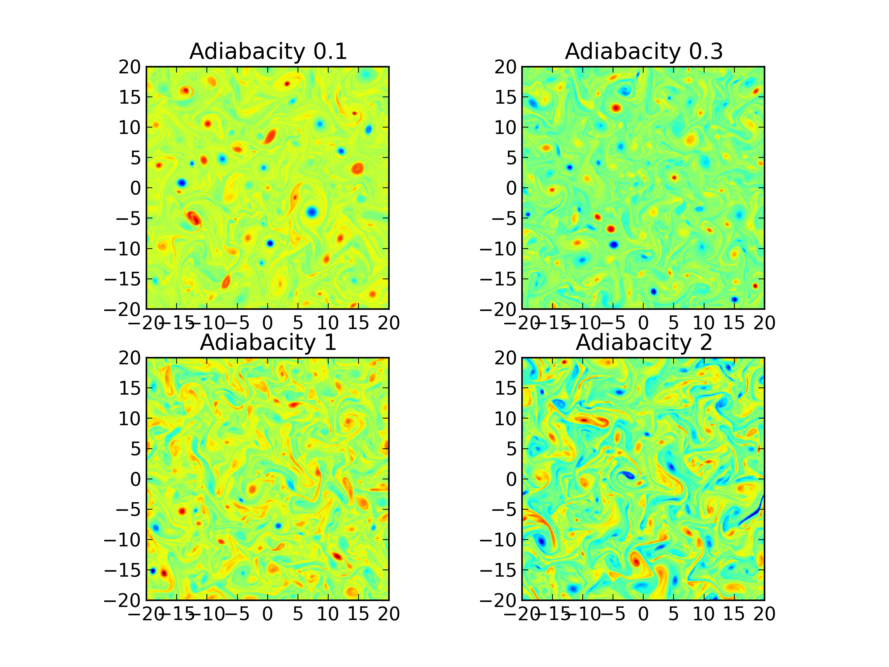
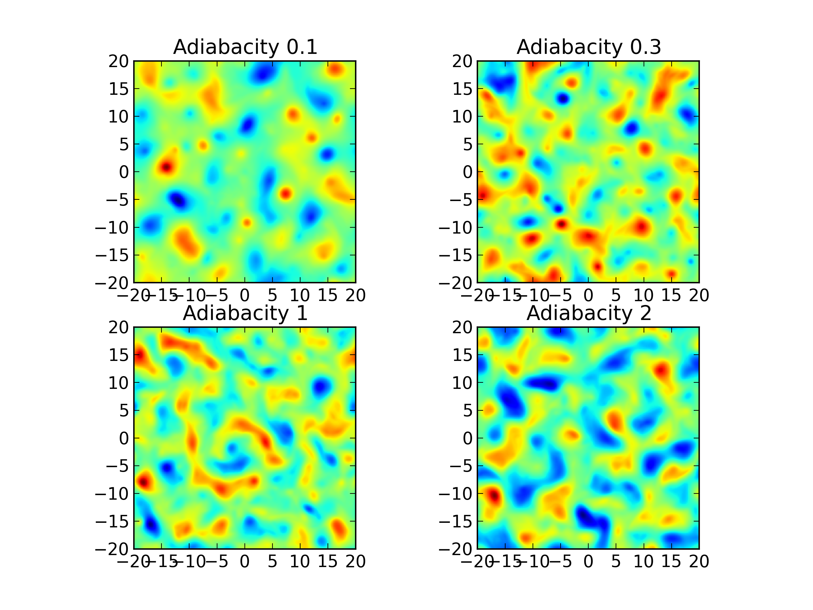
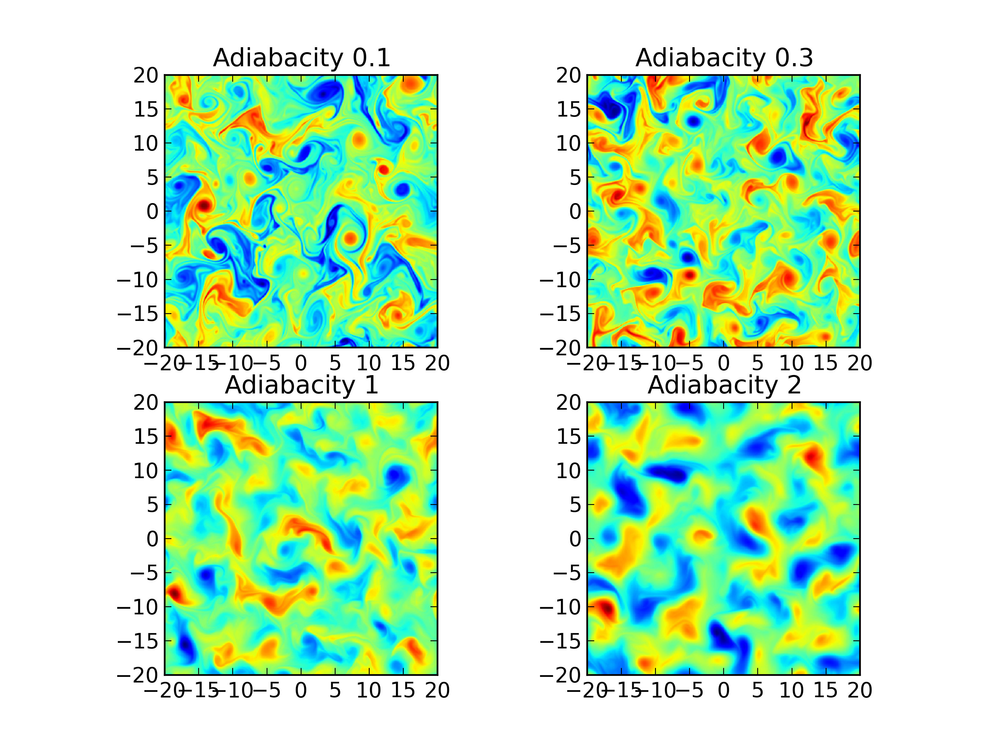

:Author: Ammar Hakim
:Date: May 6th 2013
:Completed: 
:Last Updated:

JE17: Solving (Modified) Hasegawa-Wakatani equations
====================================================

In this note I describe how to solve the Hasegawa-Wakatani system
using Gkeyll, both in its original incarnation as well as modified to
describe zonal flows.

.. contents::

The Hasegawa-Wakatani system
----------------------------

The Hasegawa-Wakatani (HW) system is a coupled set of equations for
the plasma density and electrostatic potential that describe resistive
drift wave turbulence. See, for example, the early papers by Hasegawa
and Wakatani [Wakatani1986]_, [Hasegawa1987]_. These can be written as

.. math::

  \frac{\partial \zeta}{\partial t} + \{\phi,\zeta \} &= \alpha(\phi-n)
  - \mu \nabla^4\zeta
  \\
  \frac{\partial n}{\partial t} + \{\phi,n \} &= \alpha(\phi-n)
  - \kappa \frac{\partial \phi}{\partial y}
  - \mu \nabla^4 n

where :math:`\zeta` is the vorticity, :math:`\phi` the electrostatic
potential, and :math:`n` the number density. Also, :math:`\kappa =
-\partial/\partial x \ln{n_0}` is a constant density gradient
scale-length, :math:`\alpha` is the adiabaticity operator and
:math:`\mu` is a hyper-diffusion coefficient. Also, :math:`\{a,b\}` is
the standard canonical Poisson bracket operator. The electrostatic
potential itself is determined by solving a Poisson equation

.. math::

  \nabla_{\perp}^2\phi = \zeta.

Note that in general :math:`\alpha` is an *operator*, coupling the
out-of-plane direction, making the system 3D. However, in several
important regimes this operator can be replaced by a constant, making
the problem 2D. This is the approach taken in this note. 

The hyper-diffusive terms are usually added for numerical
stability. However, the DG scheme implemented in Gkeyll works fine
without these, and hence I have set :math:`\mu=0` for all simulations
shown here.

The HW system contains two limits that can be obtained by setting
:math:`\alpha=0` and :math:`\alpha=\infty`. In the first limit the
incompressible hydrodynamic limit is obtained (see :doc:`JE13
<../je13/je13-incomp-euler-2d>` on solving this with Gkeyll). In the
second case the Hasegawa-Mima equations are obtained. These can be
written as, after identifying :math:`\phi=n` and defining
:math:`\zeta'=\zeta-\phi`, as

.. math::
 
  \frac{\partial \zeta'}{\partial t} + \{\phi,\zeta' \} &= 
  \kappa \frac{\partial \phi}{\partial y}
  - \mu \nabla^4 \zeta'

with the potential now determined from

.. math::

  (\nabla_{\perp}^2-1)\phi = \zeta'

As of writing this note, I have not attempted to solve the
Hasegawa-Mima equations with Gkeyll, although it should be an easy
task.

The modified Hasegawa-Wakatani system
-------------------------------------

When restricted to 2D the HW system described above does not contain
zonal flows. Numata et. al [Numata2007]_ describe a simple
modification that allows capturing zonal flows. This is obtained by
observing that in a tokamak edge any potential fluctuations on a flux
surface is neutralized by the parallel electron motion. Define the
zonal and non-zonal component of any variable :math:`f` as

.. math::

  \mathrm{zonal:}\ \left<f\right> &\equiv \frac{1}{L_y}\int f dy,
  \quad
  \mathrm{nonzonal:}\ \tilde{f} &\equiv f - \left<f\right>

respectively. Note that in the reduced 2D geometry, the
:math:`y`-direction is assumed to lie on flux surfaces, while
:math:`x`-direction is radial. With these definitions, the *modified*
Hasegawa-Wakatani (MHW) equations can be written as

.. math::

  \frac{\partial \zeta}{\partial t} + \{\phi,\zeta \} &= 
  \alpha(\tilde{\phi}-\tilde{n})
  - \mu \nabla^4\zeta
  \\
  \frac{\partial n}{\partial t} + \{\phi,n \} &= 
  \alpha(\tilde{\phi}-\tilde{n})
  - \kappa \frac{\partial \phi}{\partial y}
  - \mu \nabla^4 n

These are identical to the standard HW system, except that the
adiabatic coupling terms are computed differently.

A note on solving (M)HW systems with Gkeyll
-------------------------------------------

Given the Poisson bracket solver in Gkeyll (see :doc:`JE12
<../je12/je12-poisson-bracket>`) all that remains to be done is to
write a Lua program that combines two of these to update the LHS of
the (M)HW system. The drift wave term on the RHS (with :math:`\kappa`)
is taken into account by including it into the Poisson bracket
operator directly. The source term (:math:`\alpha(\phi-n)`) is simply
accounted for in the Lua script using the ``accumulate``
function. 

When solving the MHW system the zonal component is computed using a
"moment" updater (also used in the Valsov-Poisson solvers) and
subtracting it off to compute the nonzonal components needed in the
source terms. 

The Lua programs are long, but relatively straightforward. See
[:doc:`s215 <../../sims/s215/s215-hw>`] for an example input file
where these are coded up.

In the HW system, with large value of the adiabaticity parameter
:math:`\alpha` the relaxation time scale from the source term can make
the system stiff. In this case I need to use a much smaller time-step
than allowed by stability from the Poisson bracket operator alone.

Simulations of the Hasegawa-Wakatani system
-------------------------------------------

DESCRIPTION HERE.

  Comparison of Hasegawa-Wakatani solutions of vorticity
  (:math:`\zeta`) with adiabaticity parameter 0.1 (top-left)
  [:doc:`s215 <../../sims/s215/s215-hw>`], 0.3 (top-right) :doc:`s217
  <../../sims/s217/s217-hw>`, 1.0 (bottom-left) :doc:`s215
  <../../sims/s218/s218-hw>` and 2.0 (bottom-right) :doc:`s215
  <../../sims/s219/s219-hw>` at :math:`t=200`. The simulations were
  run on a :math:`128\times 128` grid using piecewise quadratic basis
  functions.

  Comparison of Hasegawa-Wakatani solutions of potential
  (:math:`\phi`) with adiabaticity parameter 0.1 (top-left)
  [:doc:`s215 <../../sims/s215/s215-hw>`], 0.3 (top-right) :doc:`s217
  <../../sims/s217/s217-hw>`, 1.0 (bottom-left) :doc:`s215
  <../../sims/s218/s218-hw>` and 2.0 (bottom-right) :doc:`s215
  <../../sims/s219/s219-hw>` at :math:`t=200`. The simulations were
  run on a :math:`128\times 128` grid using piecewise quadratic basis
  functions.

  Comparison of Hasegawa-Wakatani solutions of number density
  (:math:`n`) with adiabaticity parameter 0.1 (top-left) [:doc:`s215
  <../../sims/s215/s215-hw>`], 0.3 (top-right) :doc:`s217
  <../../sims/s217/s217-hw>`, 1.0 (bottom-left) :doc:`s215
  <../../sims/s218/s218-hw>` and 2.0 (bottom-right) :doc:`s215
  <../../sims/s219/s219-hw>` at :math:`t=200`. The simulations were
  run on a :math:`128\times 128` grid using piecewise quadratic basis
  functions.

References
----------

.. [Wakatani1986] Masahiro Wakatani and Akira Hasegawa, "A collisional
   drift wave description of plasma edge turbulence", *Physics of
   Fluids*, **27** (3), 1984.

.. [Hasegawa1987] Akira Hasegawa and Masahiro Wakatani,
   "Self-Organization of Electrostatic Turbulence in a Cylindrical
   Plasma", *Physical Review Letters*, **59** (14), 1987.

.. [Numata2007] Numata, R., Ball, R., & Dewar, R. L, "Bifurcation in
   electrostatic resistive drift wave turbulence". *Physics of
   Plasmas*, **14** (10), 102312, 2007.
