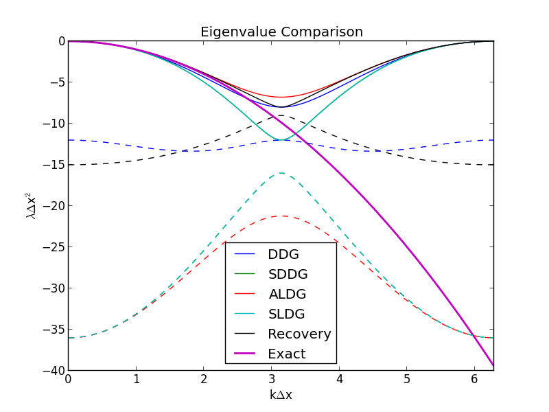

:Author: Ammar Hakim
:Date: February 18th 2013
:Completed: 
:Last Updated:

JE17: Tests for the recovery based DG scheme for diffusion
==========================================================

**With Eric Shi and Greg Hammett**

In this note we describe and test a DG scheme for solving the
diffusion equation using the recovery procedure proposed by van Leer
[vanLeer2005]_. This algorithm, the recovery discontinuous Galerkin
(RDG) scheme, is implemented for arbitrary order modal basis functions
in the `ModalDg1DDiffusionUpdater` class. In preparation for this, we
have performed an analysis of several existing DG schemes for
diffusion, and summarized our results in `this presentation
<../../_static/diffusionSchemeSummary.pdf>`_.

A single figure summary of the initial study is given in the following
figure. This figure shows that with piecewise linear basis functions,
the RDG scheme and standard LDG schemes (marked ALDG below) are both
fourth order, but, as shown in the above linked presentation, the RDG
scheme leads to symmetric stencil, while the LDG scheme does not.

  Comparison of the eigenvalues of various DG based schemes for
  diffusion equations as a function of wavenumber. The solid purple
  line shows the exact wavenumber dependence,
  :math:`\lambda_{\mathrm{exact}} = -k^2`. The various schemes are
  DDG: Direct DG, SDDG: Symmetric Direct DG, ALDG: Asymmetric local
  DG, SLDG: Symmetrized local DG, Recovery: the RDG scheme. The plot
  is for piecewise linear basis function and the aliased wave
  eigenvalues are shown as dashed lines.

The Recovery Discontinuous Galerkin Scheme
-----------------------------------------

XXX

References
----------

.. [vanLeer2005] van Leer, Bram and Nomura, Shohei, "Discontinuous
   Galerkin for Diffusion", 17th AIAA Computational Fluid Dynamics
   Conference, AIAA 2005-5108.
