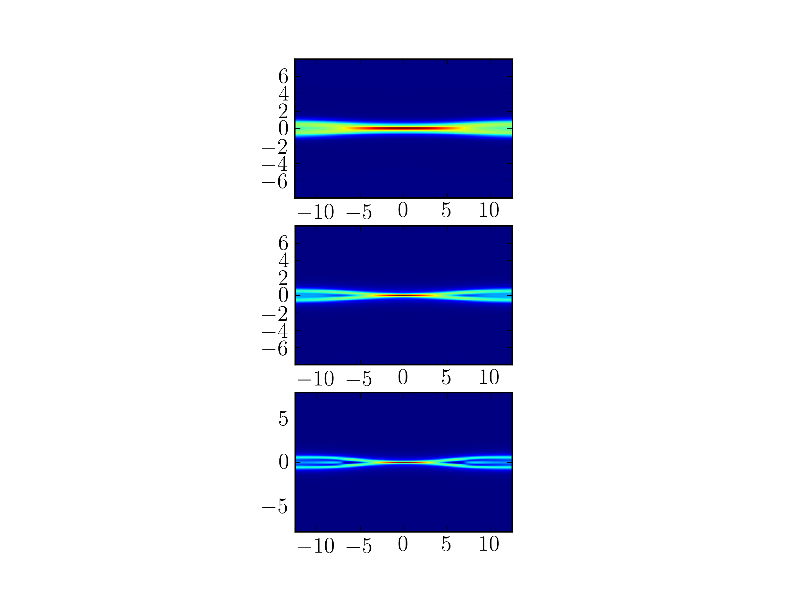
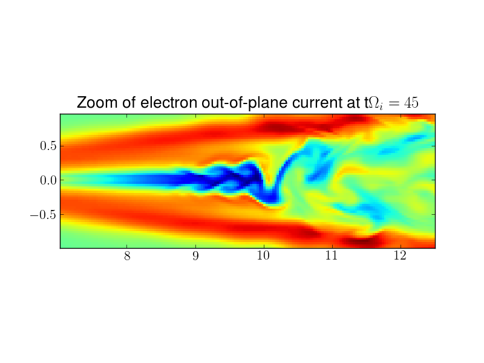

:Author: Ammar Hakim
:Date: May 15th 2013
:Completed: 
:Last Updated:

JE18: Five-moment two-fluid reconnection on open domain
=======================================================

.. contents::

In this note I study the process of magnetic reconnection with the
five-moment model. This model consists of a set of fluid equations for
each of the species in the plasma (electron and ions in this case),
coupled to the Maxwell equations via Lorentz force and currents. With
a scalar pressure, the fluid equations can be written in
non-conservative form as

.. math::

  \partial_t{n} + n \partial_j{u_j} + u_j \partial_j{n} &= 0 \\
  \partial_t{u_i}
  + u_k \partial_k{u_i}
  + \frac{1}{mn}\partial_i{p}
   &=
  \frac{q}{m}\left(E_i + \epsilon_{kmi}u_kB_m\right) \\
  \partial_t{p} + u_k\partial_k{p}
  &= -\gamma p \partial_k u_k

where :math:`n` is the number density, :math:`u_i` is the fluid
velocity, :math:`p` is the scalar pressure and :math:`E_i` and
:math:`B_i` are the electric and magnetic fields. The electromagnetic
fields are computed by solving the full Maxwell equations.

The simulations are performed on an open domain, with the plasma
initialized with a Harris current sheet with initial magnetic field
given by

.. math::

  B_x(y) = B_0 \tanh{(y/L)}

where :math:`L` is the current sheet half-thickness. With this initial
magnetic field the conservation of total pressure (fluid plus
magnetic)

.. math::

  p_e(y) + p_i(y) + \frac{B(y)^2}{2\mu_0} = \mathrm{const.}

can be used to determine the number density and pressure profiles
(initial fluid temperatures are assumed constant). Using a background
number density :math:`n_b`, this gives

.. math::

  n(y) = n_0\mathrm{sech}^2{(y/L)} + n_b

The other parameters are taken from [Daughton2006]_ as

.. math::

  \frac{\rho_i}{L} = 1,\quad
  \frac{m_i}{m_e} = 25,\quad
  \frac{T_i}{T_e} = 5,\quad
  \frac{\omega_{pe}}{\Omega_{ce}} = 3,\quad
  \frac{n_b}{n_0} = 0.3,

where :math:`\rho_i=v_{thi}/\Omega_{ci}` is the ion gyroradius,
:math:`v_{thi}=\sqrt{2T_i/m_i}` is the ion thermal speed,
:math:`\Omega_{cs}=e B_0/m_s` is the species gyrofrequency and
:math:`\omega_{pe} = \sqrt{e^2n_0/\epsilon_0 m_e}` is the electron
plasma frequency.

Picking a normalization as :math:`n_0=\epsilon_0=\mu_0=m_i=1`, gives
:math:`B_0=1/15`, :math:`v_{the}=1/3\sqrt{6}\approx 0.361`, :math:`T_e
= B_0^2/12` and :math:`\rho_i=\sqrt{10/12}`. 

Reconnection on a :math:`25d_i\times 25 d_i` open domain
--------------------------------------------------------

In the first set of simulations, the BCs are open (zero normal
derivative of all quantities). The domain is :math:`25d_i \times
25d_i`, where :math:`d_i=c/\omega_{pi}` is the ion inertial length.

Different grid sizes were used: :math:`256\times 256`,
:math:`512\times 512` and :math:`768\times 768`. This gives about 10
(20, 30) cells per :math:`d_i` and 2 (4, 6) per :math:`d_e`,
respectively. For a complete description of the simulation see the Lua program
[:doc:`s238 <../../sims/s238/s238-gemguide-5m>`].

Increasing the grid size reduces the numerical diffusion of the
scheme, and shows qualitative differences in the current sheet
structure. In the highest resolution runs (6 cells per :math:`d_e`, 30
per :math:`d_i`) the electron diffusion layer is sufficiently well
resolved and the simulation is assumed to be converged [1]_.

  Electron out-of-plane current at :math:`t\Omega_{ci}=30` with
  different grid resolutions. With 2 cells per :math:`d_e` (upper), 4
  cells per :math:`d_e` (middle) and 6 cells per :math:`d_e` (lower)
  respectively. The current sheet seems be getting thinner with
  increasing resolution, although the results do not significantly
  change in the lower two plots. See footnote [1]_ for caveats.

The set of plots below show the electron number density and
:math:`B_x` profile taken along a section :math:`x=0.0` that passes
through the X-point. The magnetic field upstream of the diffusion
region (:math:`x\approx 3 d_i`) is :math:`0.834`.

.. _fig:

  .. image:: s238-ne-diff.png
     :width: 100%
     :align: center

  .. image:: s238-bx-diff.png
     :width: 100%
     :align: center

  Number density (top) and magnetic field (bottom) along vertical
  slice at :math:`x=12.5d_i`. At the upstream edge of the diffusion
  region the magnetic field is :math:`B_x/B_0=0.834`. See [:doc:`s238
  <../../sims/s238/s238-gemguide-5m>`].

The set of plots below show the contours of various fluid quantities
at :math:`t\Omega_{ci} = 30`. There is strong outflow in both the ion
and electron fluids (on the order of :math:`0.5 v_{ti}` and
:math:`v_{the}` respectively). The electron outflow velocity shows a
strong flows along the current sheet, which then bifurcates along the
magnetic flux separatrix. A careful look at the separatrix flow shows
a reversal of the flow from outflow to inflow.

.. _fig:

  .. image:: s238-ne.png
     :width: 100%
     :align: center

  .. image:: s238-uiz.png
     :width: 100%
     :align: center

  .. image:: s238-uix.png
     :width: 100%
     :align: center

  .. image:: s238-uey.png
     :width: 100%
     :align: center

  .. image:: s238-uex.png
     :width: 100%
     :align: center

  Number density, inflow ion velocity, outflow ion velocity,
  out-of-plane electron velocity and outflow electron velocity at
  :math:`t\Omega_{ci}=30`.

In the following plots the electron out-of-plane current is shown at
:math:`t\Omega_{pi}=30` and :math:`t\Omega_{ci}=45`. The current sheet
is seen to elongate. Also seen are fluid jet instabilities (seen more
clearly in the zoomed-in plot) which are formed due to the strong
outflow of the fluids. 

A movie of the electron out-of-plane currents can be seen `here
<../../_static/s238-elc-zcurr.mov>`_. This shows the formation of the
current sheet due to reconnection, its elongation and the formation of
jet instabilities due to the strong flow in the exhaust region.

.. _fig:

  .. image:: s238-elcCurr_30.png
     :width: 100%
     :align: center

  .. image:: s238-elcCurr_45.png
     :width: 100%
     :align: center

  Electron out-of-plane current at :math:`t\Omega_{ci}=30` and
  :math:`t\Omega_{ci}=45`. The reconnection current sheet is much
  thinner than the initial Harris sheet, which has half-width
  :math:`L\approx \rho_i`. The current sheet has elongated and jet
  instabilities are seen in the exhaust region due to the strong fluid
  outflow.

  Electron out-of-plane current at :math:`t\Omega_{ci}=45`, zoomed in
  the right exhaust region. The fluid flow is unstable and shows
  vortices from the streaming of the fluid outwards into the exhaust
  region.

Conclusions
-----------

These initial studies of reconnection in open domains shows that the
reconnection current sheet is much thinner than the initial Harris
current sheet. In addition, rather unexpectedly (but also seen in the
PIC simulation) the current sheet elongates late in time, extending
nearly to the domain boundaries. Simulations with even bigger domains
need to be performed to minimize the effect of the outflow boundaries
on the current sheet dynamics. However, at this point it seems that
the two-fluid five-moment model and the PIC model gives qualitatively
similar results.
  
References
-----------

.. [Daughton2006] William Daughton, Jack Scudder and Homa Karimabadi,
   "Fully kinetic simulations of undriven magnetic reconnection with
   open boundary conditions", *Physics of Plasmas*, **13**, 072101,
   2006.

Footnotes
---------

.. [1] This (convergence) is strictly true only if some sort of
   physical resistivity is included in the equations. The reason for
   this is that the ideal (without heat-flux and resistivity)
   two-fluid system has a large number of dispersive waves that will
   be captured as smaller and smaller scales are resolved. Some
   kinetic mechanism always damps such waves on a small scale. An
   extreme case of this "feature" is seen in shock simulations (see
   :doc:`JE4 <../je4/je4-twofluid-shock>`) in which finer and finer
   scale structures are seen as the grid is resolved.

   In numerical simulations damping is provided by numerical diffusion
   from the scheme. For physical correctness, some form of physical
   resistivity should be added, such that it damps out sub electron
   skin-depth structures.

