:Author: Ammar Hakim
:Date: September 6th 2011

JE2: Benchmarking two finite-volume schemes for 1D Euler equations
==================================================================

.. note::

  **4/22/2013** A positivity fix has been implemented for the
  wave-propagation scheme. The basic idea is to switch to a Lax-flux
  based updater when negative density and/or pressure are
  detected. Then, the simulation is switched back to using Roe-flux
  based updater. All of this is achieved in the Lua script. Results
  have been updated accordingly.

.. contents::

Overview of problems and schemes
--------------------------------

In this entry two algorithms, the wave-propagation algorithm and the
`MUSCL-Hancock scheme <http://ammar-hakim.org/hancock-muscl.html>`_,
are benchmarked against a series of 1D shock-tube problems. For most
of these problems exact solutions can be computed using an exact
Riemann solver, described, for example, in [Kulikovskii2001]_.

The wave-propagation scheme is implemented in the
``WavePropagationUpdater`` in the ``slvrs`` directory, while the
MUSCL-Hancock scheme is implemented in the ``MusclHancock1DUpdater``
in the `proto` directory. Note that as this point the MUSCL-Hancock
scheme is *not* production quality but is hard-coded to solve just the
1D Euler equations. The code to compute the exact solution is located
in the ``sims/code/exactrp`` directory.

The problems solved in this entry are quite difficult and really tax
the ability of schemes to capture discontinuities accurately. In
particular, schemes have a lot of trouble in problems in which vacuum
states can form or exist in parts of the domain. Also, ensuring
positivity of density and pressure is a difficult problem.

Shock-tube problems
-------------------

Eight shock-tube problems are solved. Each problem is described below
and results of comparing both schemes with the exact solution are
shown. Internal energy in the following is computed as
:math:`p/(\gamma-1)\rho`.

Problem 1
+++++++++

Sod-shock with sonic point in rarefaction. Domain is :math:`x \in
[0,1]`, discretized with 100 cells. Gas adiabatic constant of 1.4 was
used. Simulation is initialized with a shock at :math:`x=0.3`, with
left and right states

.. math::

  \left[
    \begin{matrix}
      \rho_l \\
      u_l \\
      p_l
    \end{matrix}
  \right]
  = 
  \left[
    \begin{matrix}
      1 \\
      0.75 \\
      1.0
    \end{matrix}
  \right],
  \qquad
  \left[
    \begin{matrix}
      \rho_r \\
      u_r \\
      p_r
    \end{matrix}
  \right]
  = 
  \left[
    \begin{matrix}
      0.125 \\
      0.0 \\
      0.1
    \end{matrix}
  \right].

and is run to :math:`t=0.2`.

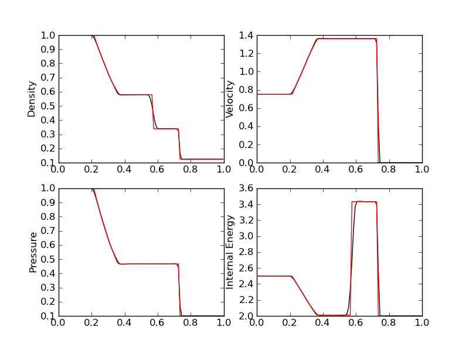

  Comparison of wave-propagation solution (black) [:doc:`s5
  <../../sims/s5/s5-euler-shock-wave>`] with exact solution (red) [s6]
  for density (top left), velocity (top right), pressure (bottom left)
  and internal energy (bottom right).

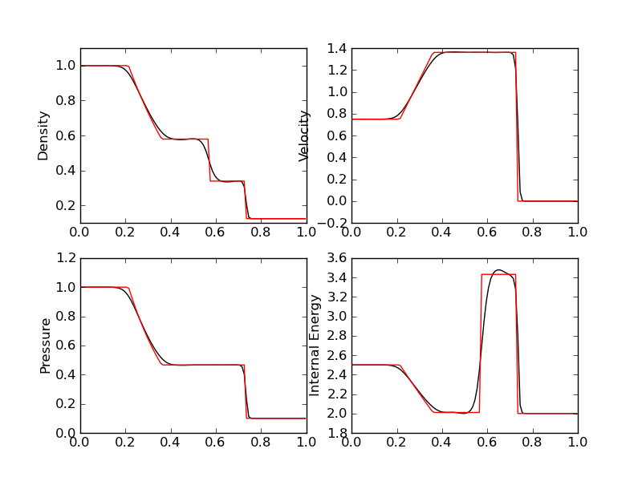

  Comparison of MUSCL-Hancock solution (black) [:doc:`s7
  <../../sims/s7/s7-euler-shock-muscl>`] with exact solution (red)
  [s6] for density (top left), velocity (top right), pressure (bottom
  left) and internal energy (bottom right).

Problem 2
+++++++++

This problem has a near-vaccum near the location of the
discontinuity. Domain is :math:`x \in [0,1]`, discretized with 100
cells. Gas adiabatic constant of 1.4 is used. Simulation is
initialized with a shock at :math:`x=0.5`, with left and right states

.. math::

  \left[
    \begin{matrix}
      \rho_l \\
      u_l \\
      p_l
    \end{matrix}
  \right]
  = 
  \left[
    \begin{matrix}
      1.0 \\
      -2.0 \\
      0.4
    \end{matrix}
  \right],
  \qquad
  \left[
    \begin{matrix}
      \rho_r \\
      u_r \\
      p_r
    \end{matrix}
  \right]
  = 
  \left[
    \begin{matrix}
      1.0 \\
      2.0 \\
      0.4
    \end{matrix}
  \right].

and is run to :math:`t=0.15`.

The second order MUSCL-Hancock **fails** on this problem. The solution
quickly develops negative pressure and density. A positivity fix is
required.

The wave-propagation scheme works with this problem. However, a
positivity fix is required. This is implemented by redoing a time-step
with Lax fluxes when negative density/pressure is detected and then
continuing on with regular Roe fluxes. For this particular problem the
negative density/pressure only occurs in the very first time-step and
so Roe fluxes can be used for rest of the simulation. The
wave-propagation scheme also works with the use of Lax fluxes for the
complete simulation. With Lax fluxes used for the complete simulation,
the solution is more diffuse, however does not show the strange
features around :math:`x=0.5`.

Results are shown below.

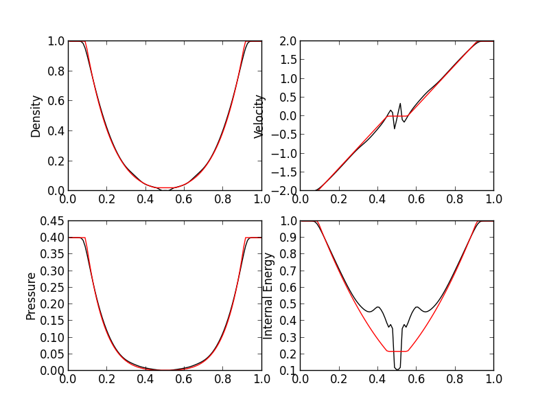

  Comparison of wave-propagation with positivity fix solution (black)
  [:doc:`s220 <../../sims/s220/s220-euler-shock-wave>`] with exact
  solution (red) [s9] for density (top left), velocity (top right),
  pressure (bottom left) and internal energy (bottom right).

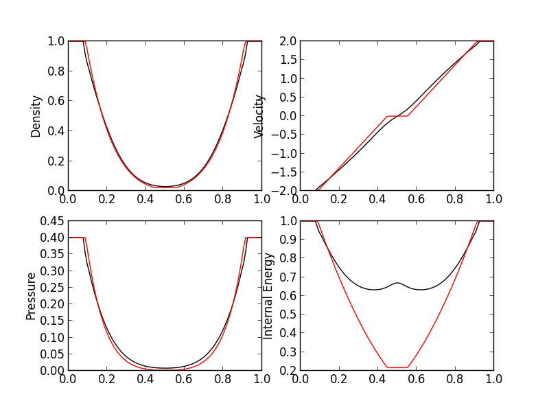

  Comparison of wave-propagation with Lax-fluxes solution (black)
  [:doc:`s8 <../../sims/s8/s8-euler-shock-wave>`] with exact
  solution (red) [s9] for density (top left), velocity (top right),
  pressure (bottom left) and internal energy (bottom right).

The first-order MUSCL-Hancock also works for this problem. Results are
shown below. The wave-propagation scheme seems marginally better than
the first-order MUSCL scheme for this problem.

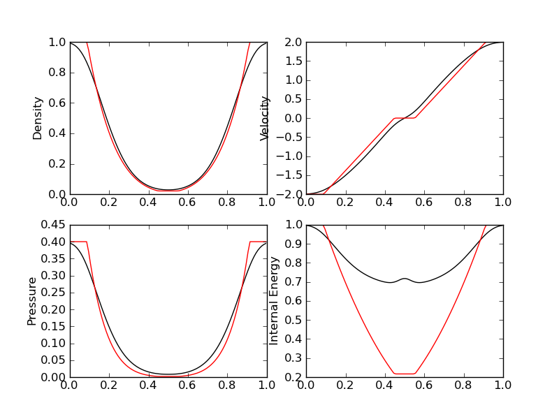

  Comparison of 1st-order MUSCL-Hancock solution (black) [:doc:`s10
  <../../sims/s10/s10-euler-shock-muscl>`] with exact solution (red)
  [s9] for density (top left), velocity (top right), pressure (bottom
  left) and internal energy (bottom right).

Problem 3
+++++++++

The 1D Noh problem. Domain is :math:`x \in [0,1]`, discretized with
100 cells. Gas adiabatic constant of :math:`5/3` is used. Simulation
is initialized with a shock at :math:`x=0.5`, with left and right
states

.. math::

  \left[
    \begin{matrix}
      \rho_l \\
      u_l \\
      p_l
    \end{matrix}
  \right]
  = 
  \left[
    \begin{matrix}
      1.0 \\
      1.0 \\
      10^{-6}
    \end{matrix}
  \right],
  \qquad
  \left[
    \begin{matrix}
      \rho_r \\
      u_r \\
      p_r
    \end{matrix}
  \right]
  = 
  \left[
    \begin{matrix}
      1.0 \\
      -1.0 \\
      10^{-6}
    \end{matrix}
  \right].

and is run to :math:`t=1.0`.

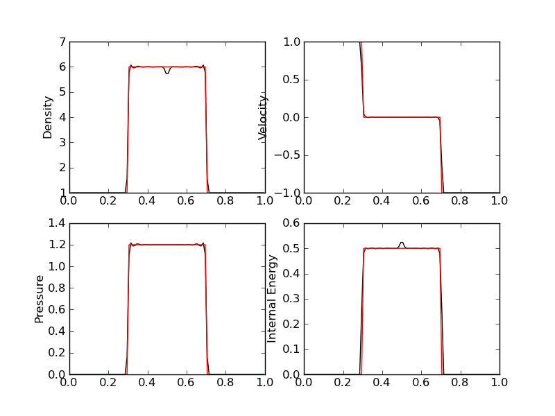

  Comparison of wave-propagation solution (black) [:doc:`s11
  <../../sims/s11/s11-euler-shock-wave>`] with exact solution (red)
  [s12] for density (top left), velocity (top right), pressure (bottom
  left) and internal energy (bottom right).

The MUSCL-Hancock scheme **fails** on this problem. A positivity fix
needs to be implemented. However, the 1st-order MUSCL-Hancock scheme
works and results are shown below.

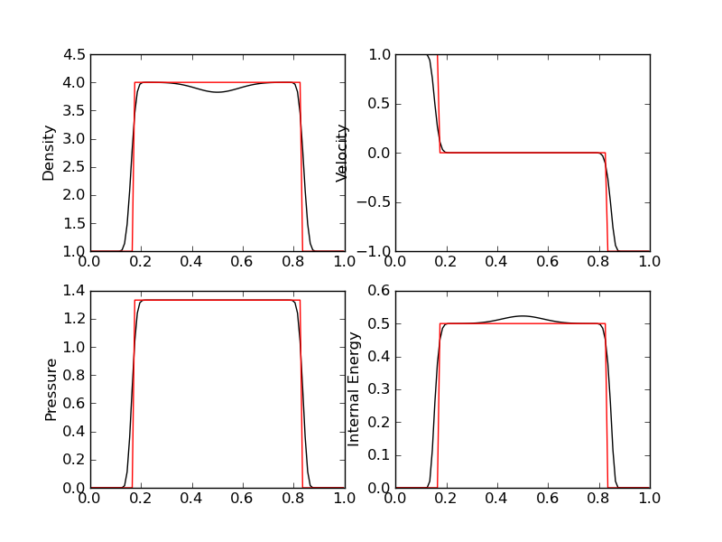

  Comparison of 1st-order MUSCL-Hancock solution (black) [:doc:`s13
  <../../sims/s13/s13-euler-shock-muscl>`] with exact solution (red)
  [s12] for density (top left), velocity (top right), pressure (bottom
  left) and internal energy (bottom right).

Problem 4
+++++++++

1D Euler shock with a stationary contact discontinuity at
:math:`x=0.8`. Domain is :math:`x \in [0,1]`, discretized with 100
cells. Gas adiabatic constant of :math:`1.4` is used. Simulation is
initialized with a shock at :math:`x=0.8`, with left and right states

.. math::

  \left[
    \begin{matrix}
      \rho_l \\
      u_l \\
      p_l
    \end{matrix}
  \right]
  = 
  \left[
    \begin{matrix}
      1.0 \\
      -19.59745 \\
      1000
    \end{matrix}
  \right],
  \qquad
  \left[
    \begin{matrix}
      \rho_r \\
      u_r \\
      p_r
    \end{matrix}
  \right]
  = 
  \left[
    \begin{matrix}
      1.0 \\
      -19.59745 \\
      0.01
    \end{matrix}
  \right].

and is run to :math:`t=0.012`.

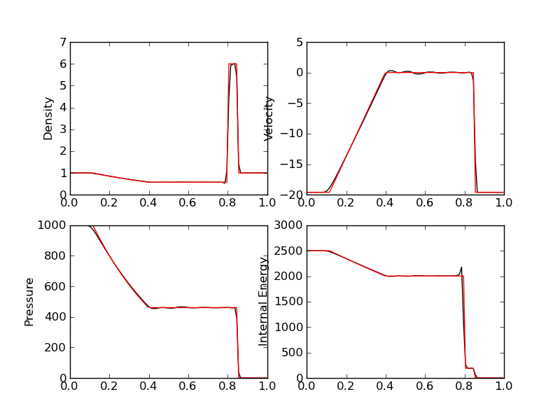

  Comparison of wave-propagation solution (black) [:doc:`s14
  <../../sims/s14/s14-euler-shock-wave>`] with exact solution (red)
  [s15] for density (top left), velocity (top right), pressure (bottom
  left) and internal energy (bottom right).

The MUSCL-Hancock scheme **fails** on this problem. Results with the
1st-order MUSCL-Hancock method is shown below.

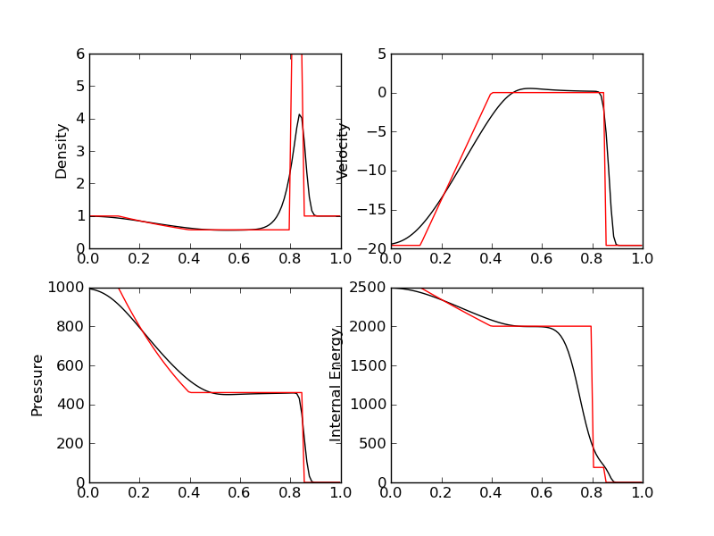

  Comparison of 1st-order MUSCL-Hancock solution (black) [:doc:`s16
  <../../sims/s16/s16-euler-shock-muscl>`] with exact solution (red)
  [s15] for density (top left), velocity (top right), pressure (bottom
  left) and internal energy (bottom right).

Problem 5
+++++++++

1D Euler shock with two strong shocks. Domain is :math:`x \in [0,1]`,
discretized with 100 cells. Gas adiabatic constant of :math:`1.4` is
used. Simulation is initialized with a shock at :math:`x=0.4`, with
left and right states

.. math::

  \left[
    \begin{matrix}
      \rho_l \\
      u_l \\
      p_l
    \end{matrix}
  \right]
  = 
  \left[
    \begin{matrix}
      5.99924 \\
      19.5975 \\
      460.894
    \end{matrix}
  \right],
  \qquad
  \left[
    \begin{matrix}
      \rho_r \\
      u_r \\
      p_r
    \end{matrix}
  \right]
  = 
  \left[
    \begin{matrix}
      5.99242 \\
      -6.19633 \\
      46.0895
    \end{matrix}
  \right].

and is run to :math:`t=0.035`.

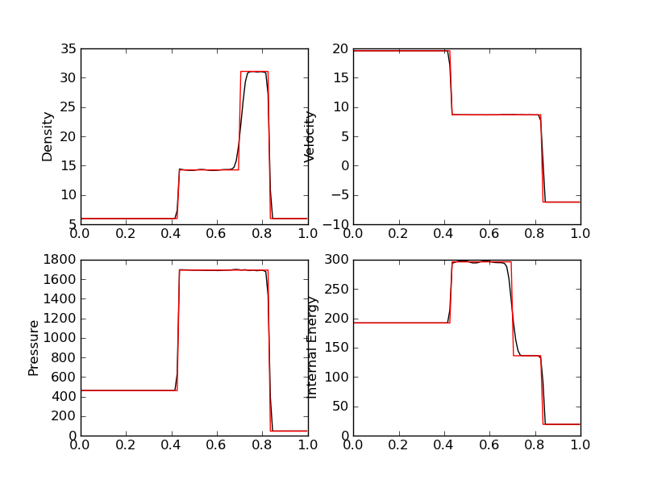

  Comparison of wave-propagation solution (black) [:doc:`s17
  <../../sims/s17/s17-euler-shock-wave>`] with exact solution (red)
  [s18] for density (top left), velocity (top right), pressure (bottom
  left) and internal energy (bottom right).

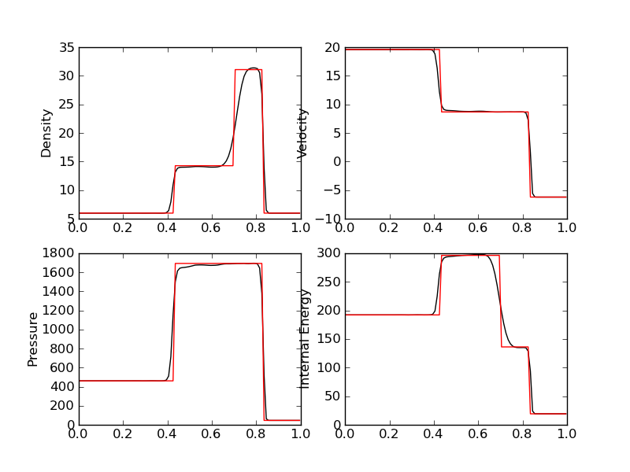

  Comparison of MUSCL-Hancock solution (black) [:doc:`s19
  <../../sims/s19/s19-euler-shock-muscl>`] with exact solution (red)
  [s18] for density (top left), velocity (top right), pressure (bottom
  left) and internal energy (bottom right).

Problem 6
+++++++++

1D Euler with a stationary contact discontinuity. Domain is :math:`x
\in [0,1]`, discretized with 100 cells. Gas adiabatic constant of
:math:`1.4` is used. Simulation is initialized with a shock at
:math:`x=0.5`, with left and right states

.. math::

  \left[
    \begin{matrix}
      \rho_l \\
      u_l \\
      p_l
    \end{matrix}
  \right]
  = 
  \left[
    \begin{matrix}
      1.4 \\
      0.0 \\
      1.0
    \end{matrix}
  \right],
  \qquad
  \left[
    \begin{matrix}
      \rho_r \\
      u_r \\
      p_r
    \end{matrix}
  \right]
  = 
  \left[
    \begin{matrix}
      1.0 \\
      0.0 \\
      1.0
    \end{matrix}
  \right].

and is run to :math:`t=2.0`.

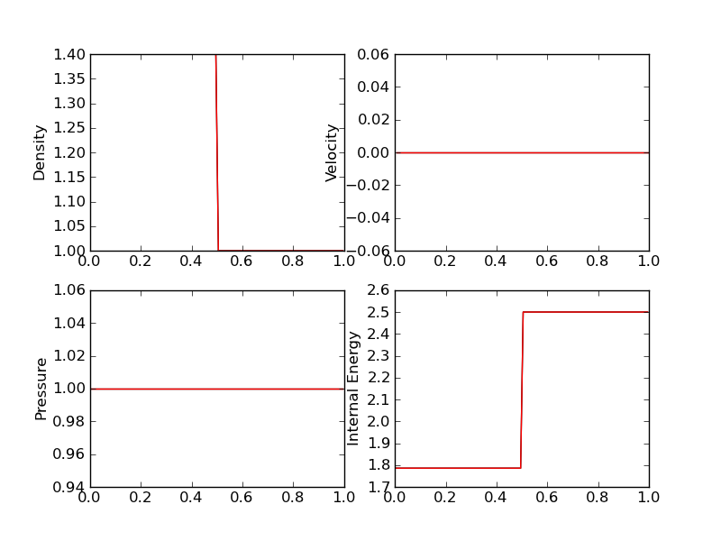

  Comparison of wave-propagation solution (black) [:doc:`s20
  <../../sims/s20/s20-euler-shock-wave>`] with exact solution (red)
  [s21] for density (top left), velocity (top right), pressure (bottom
  left) and internal energy (bottom right).

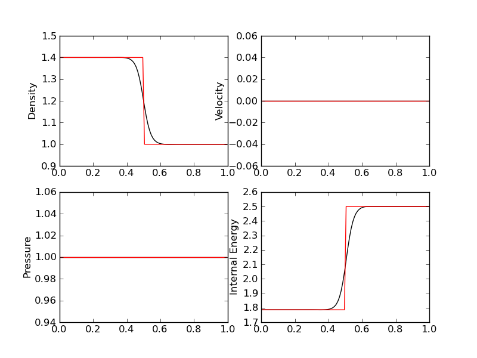

  Comparison of MUSCL-Hancock solution (black) [:doc:`s22
  <../../sims/s22/s22-euler-shock-muscl>`] with exact solution (red)
  [s21] for density (top left), velocity (top right), pressure (bottom
  left) and internal energy (bottom right).

Problem 7
+++++++++

1D Euler with a slowly moving contact discontinuity. Domain is
:math:`x \in [0,1]`, discretized with 100 cells. Gas adiabatic
constant of :math:`1.4` is used. Simulation is initialized with a
shock at :math:`x=0.5`, with left and right states

.. math::

  \left[
    \begin{matrix}
      \rho_l \\
      u_l \\
      p_l
    \end{matrix}
  \right]
  = 
  \left[
    \begin{matrix}
      1.4 \\
      0.1 \\
      1.0
    \end{matrix}
  \right],
  \qquad
  \left[
    \begin{matrix}
      \rho_r \\
      u_r \\
      p_r
    \end{matrix}
  \right]
  = 
  \left[
    \begin{matrix}
      1.0 \\
      0.1 \\
      1.0
    \end{matrix}
  \right].

and is run to :math:`t=2.0`.

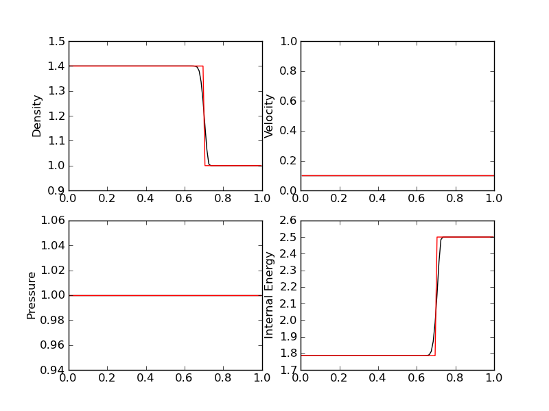

  Comparison of wave-propagation solution (black) [:doc:`s23
  <../../sims/s23/s23-euler-shock-wave>`] with exact solution (red)
  [s24] for density (top left), velocity (top right), pressure (bottom
  left) and internal energy (bottom right).

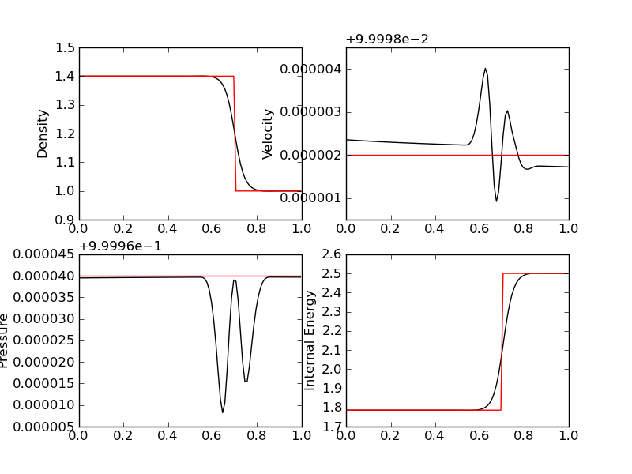

  Comparison of MUSCL-Hancock solution (black) [:doc:`s25
  <../../sims/s25/s25-euler-shock-muscl>`] with exact solution (red)
  [s24] for density (top left), velocity (top right), pressure (bottom
  left) and internal energy (bottom right). The oscillations in the
  velocity and pressure appear exaggerated by the plot scale but are
  actually very small.

Problem 8
+++++++++

1D Euler with a sharp peak in density. Domain is :math:`x \in
[0.0,0.5]`, discretized with 800 cells. Gas adiabatic constant of
:math:`1.4` is used. Simulation is initialized with a shock at
:math:`x=0.4`, with left and right states

.. math::

  \left[
    \begin{matrix}
      \rho_l \\
      u_l \\
      p_l
    \end{matrix}
  \right]
  = 
  \left[
    \begin{matrix}
      0.1261192 \\
      8.9047029 \\
      782.92899
    \end{matrix}
  \right],
  \qquad
  \left[
    \begin{matrix}
      \rho_r \\
      u_r \\
      p_r
    \end{matrix}
  \right]
  = 
  \left[
    \begin{matrix}
      6.591493 \\
      2.2654207 \\
      3.1544874
    \end{matrix}
  \right].

and is run to :math:`t=0.0039`.

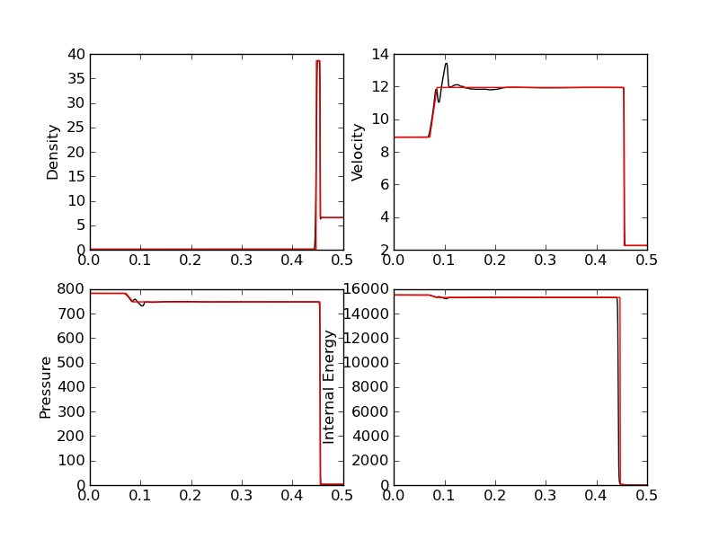

  Comparison of wave-propagation solution (black) [:doc:`s26
  <../../sims/s26/s26-euler-shock-wave>`] with exact solution (red)
  [s27] for density (top left), velocity (top right), pressure (bottom
  left) and internal energy (bottom right).

The MUSCL-Hancock scheme **fails** on this problem. Results with the
1st-order MUSCL-Hancock method is shown below.

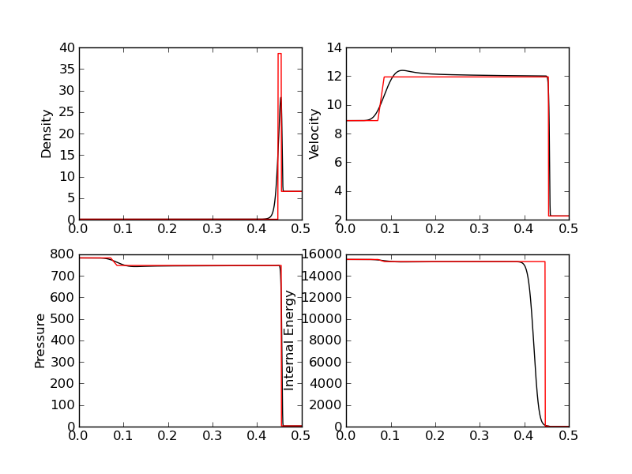

  Comparison of 1st-order MUSCL-Hancock solution (black) [:doc:`s28
  <../../sims/s28/s28-euler-shock-muscl>`] with exact solution (red)
  [s27] for density (top left), velocity (top right), pressure (bottom
  left) and internal energy (bottom right).

Woodward-Collela blast wave problem
-----------------------------------

The Woodward-Collela blast wave problem consists of two shocks
interacting due to reflections off solid walls. The domain is :math:`x
\in [0,1]`, discretized with 400 cells with wall boundary conditions
at both ends. Simulation is initialized with two discontinuities,
first at :math:`x_1 = 0.1` and the other at :math:`x_2=0.9`. The
density and velocity is set everywhere to :math:`1.0` and :math:`0.0`
respectively. The pressure in the three regions, left :math:`p_l`,
middle :math:`p_m`, and right :math:`p_r` are :math:`(p_l,p_m,p_r) =
(1000,0.01,100)`. The simulation is run to :math:`t=0.038`.

In the following, the "exact" solution is computed using
wave-propagation method using 2000 cells.

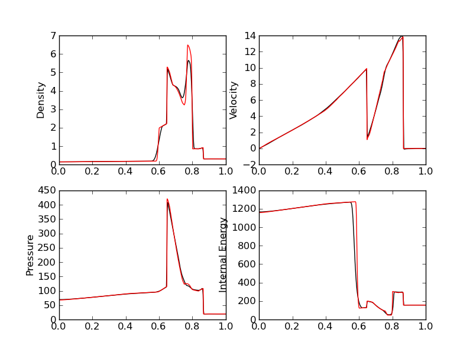

  Comparison of wave-propagation solution (black) [:doc:`s29
  <../../sims/s29/s29-euler-blastwave-wave>`] with "exact" solution
  (red) [:doc:`s30 <../../sims/s30/s30-euler-blastwave-wave>`] for
  density (top left), velocity (top right), pressure (bottom left) and
  internal energy (bottom right).

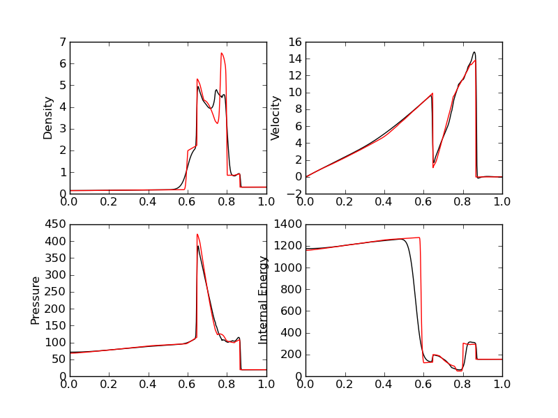

  Comparison of MUSCL-Hancock solution (black) [:doc:`s31
  <../../sims/s31/s31-euler-blastwave-muscl>`] with "exact" solution
  (red) [s30] for density (top left), velocity (top right), pressure
  (bottom left) and internal energy (bottom right).

Conclusions
-----------

One of the aims of this note was to determine what modifications are
needed to the wave-propagation scheme and the MUSCL-Hancock scheme to
make them more robust and accurate. Note that the MUSCL-Hancock scheme
tested here is only a prototype version and fails on a number of
problems. The tests in conducted in this entry will allow a better
production quality solver to be developed.

The lessons learned are:

- The wave-propagation scheme needs a positivity fix. For this, a
  density and pressure floor should be added. More importantly, if the
  Roe averages lead to a NaN or negative pressure, the Roe fluxes
  should be replaced (automatically) with a diffusive, but positivity
  preserving, Rusanov (Lax) flux.

- The MUSCL-Hancock scheme needs a positivity fix also: essentially,
  if the predicted edge values are negative the slope in the cell
  should be simply set to zero. This is the main reason why the 2nd
  order MUSCL-Hancock scheme fails as the predicted edge values do not
  preserve positivity.

- More accurate (than Rusanov flux) numerical flux needs to be
  implemented. An HLLC flux will help reduce the diffusion as compared
  to the wave-propagation scheme.

References
----------

.. [Kulikovskii2001] Andrei G. Kulikoviskii and Nikolai V. Pogorelov
   and Andrei Yu. Semenov, *Mathematical Aspects of Numerical
   Solutions of Hyperbolic Systems*, Chapman and Hall/CRC, 2001.
