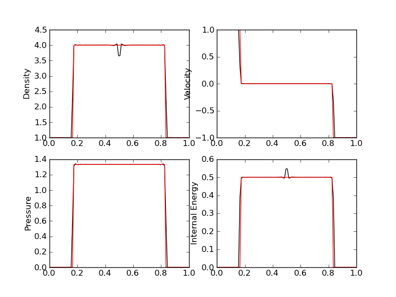

JE2: Benchmarking two finite-volume schemes for 1D Euler equations
==================================================================

:Author: Ammar Hakim
:Date: September 6th 2011

Overview of problems and schemes
--------------------------------

In this entry two algorithms, the wave-propagation algorithm and the
`MUSCL-Hancock scheme <http://ammar-hakim.org/hancock-muscl.html>`_,
are benchmarked against a series of 1D shock-tube problems. For most
of these problems exact solutions can be computed using an exact
Riemann solver, described, for example, in [Kulikovskii2001]_.

The wave-propagation scheme is implemented in the
``WavePropagationUpdater`` in the ``slvrs`` directory, while the
MUSCL-Hancock scheme is implemented in the ``MusclHancock1DUpdater``
in the `proto` directory. Note that as this point the MUSCL-Hancock
scheme is *not* production quality but is hard-coded to solve just the
1D Euler equations. The code to compute the exact solution is located
in the ``sims/code/exactrp`` directory.

Shock-tube problems
-------------------

Eight shock-tube problems are solved. Each problem is described below
and results of comparing both schemes with the exact solution are
shown. Internal energy in the following is computed as
:math:`p/(\gamma-1)\rho`.

Problem 1
+++++++++

Sod-shock with sonic point in rarefaction. Domain is :math:`x \in
[0,1]`, discretized with 100 cells. Gas adiabatic constant of 1.4 was
used. Simulation is initialized with a shock at :math:`x=0.3`, with
left and right states

.. math::

  \left[
    \begin{matrix}
      \rho_l \\
      u_l \\
      p_l
    \end{matrix}
  \right]
  = 
  \left[
    \begin{matrix}
      1 \\
      0.75 \\
      1.0
    \end{matrix}
  \right],
  \qquad
  \left[
    \begin{matrix}
      \rho_r \\
      u_r \\
      p_r
    \end{matrix}
  \right]
  = 
  \left[
    \begin{matrix}
      0.125 \\
      0.0 \\
      0.1
    \end{matrix}
  \right].

and is run to :math:`t=0.2`.

.. figure:: s5-euler-shock-wave_exact_cmp.png
  :width: 100%
  :align: center

  Comparison of wave-propagation solution (black) with exact solution
  (red) for density (top left), velocity (top right), pressure (bottom
  left) and internal energy (bottom right).

  Comparison of MUSCL-Hancock solution (black) with exact solution
  (red) for density (top left), velocity (top right), pressure (bottom
  left) and internal energy (bottom right).

.. note::

  This problem uses input files and plotting scripts in sims/s5,
  sims/s6 and sims/s7 directories.

Problem 2
+++++++++

This problem has a near-vaccum near the location of the
discontinuity. Domain is :math:`x \in [0,1]`, discretized with 100
cells. Gas adiabatic constant of 1.4 was used. Simulation is
initialized with a shock at :math:`x=0.5`, with left and right states

.. math::

  \left[
    \begin{matrix}
      \rho_l \\
      u_l \\
      p_l
    \end{matrix}
  \right]
  = 
  \left[
    \begin{matrix}
      1.0 \\
      -2.0 \\
      0.4
    \end{matrix}
  \right],
  \qquad
  \left[
    \begin{matrix}
      \rho_r \\
      u_r \\
      p_r
    \end{matrix}
  \right]
  = 
  \left[
    \begin{matrix}
      1.0 \\
      2.0 \\
      0.4
    \end{matrix}
  \right].

and is run to :math:`t=0.15`.

Both wave-propagation and MUSCL-Hancock **fail** on this problem. The
solution quickly develops negative pressure and density. A positivity
fix is required for both schemes (not implemented as of September 6
2011).

Problem 3
+++++++++

The 1D Noh problem. Domain is :math:`x \in [0,1]`, discretized with
100 cells. Gas adiabatic constant of :math:`5/3` was used. Simulation
is initialized with a shock at :math:`x=0.5`, with left and right
states

.. math::

  \left[
    \begin{matrix}
      \rho_l \\
      u_l \\
      p_l
    \end{matrix}
  \right]
  = 
  \left[
    \begin{matrix}
      1.0 \\
      1.0 \\
      10^{-6}
    \end{matrix}
  \right],
  \qquad
  \left[
    \begin{matrix}
      \rho_r \\
      u_r \\
      p_r
    \end{matrix}
  \right]
  = 
  \left[
    \begin{matrix}
      1.0 \\
      -1.0 \\
      10^{-6}
    \end{matrix}
  \right].

and is run to :math:`t=1.0`.

  Comparison of wave-propagation solution (black) with exact solution
  (red) for density (top left), velocity (top right), pressure (bottom
  left) and internal energy (bottom right).

The MUSCL-Hancock scheme **fails** on this problem. A positivity fix
needs to be implemented.

Woodward-Collela blast wave problem
-----------------------------------

XXX

References
----------

.. [Kulikovskii2001] Andrei G. Kulikoviskii and Nikolai V. Pogorelov
   and Andrei Yu. Semenov, *Mathematical Aspects of Numerical
   Solutions of Hyperbolic Systems*, Chapman and Hall/CRC, 2001.