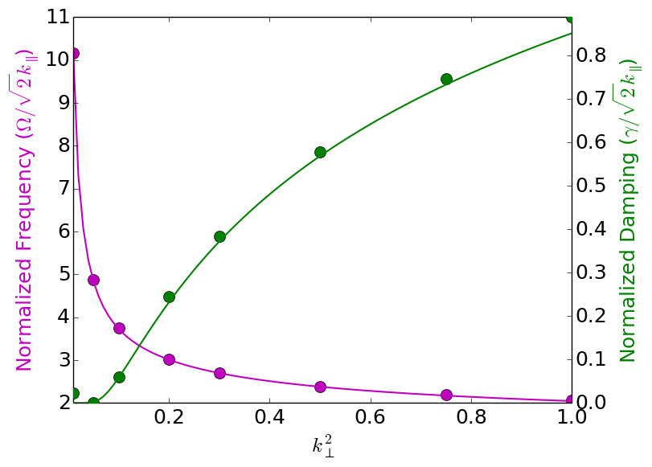
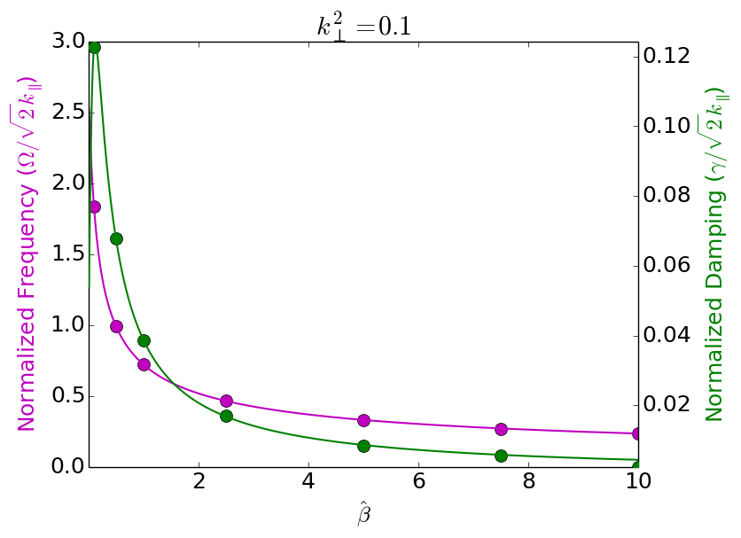

:Author: Ammar Hakim
:Date: 29th December 2013
:Completed: 
:Last Updated:

JE21: Testing a solver for linearized electromagnetic GK equations
==================================================================

.. contents::

In this note I test a solver for the linearized electromagentic
gyrokinetic equations. This system is described by the Vlasov equation
for the electrons

.. math::

  \frac{\partial f}{\partial t} + \{f,H\} = 0

where :math:`f(z,p_\parallel,t)` is the electron distribution function
[#dist-function]_ and the Hamiltonian is given by

.. math::

  H = \frac{1}{2m_e}(p_\parallel-q_e A_\parallel)^2 + q_e \phi

where :math:`A_\parallel` is the parallel magnetic potential and
:math:`\phi` is the electrostatic potential, :math:`m_e` is the
electron mass and :math:`q_e = -|e|` is the electron charge. The ions
are assumed to be stationary.

.. warning::

  Put full EM equations here. Will require some re-wording of the
  following section.

Normalized linear system
------------------------

To linearize the system we first linearize the Hamiltonian around a
field-free equilibirum to write

.. math::

  H &= H_0 + H_1.

Here :math:`H` is the linearized Hamiltonian. The zeroth-order
Hamiltonian describes free-streaming

.. math::

  H_0 = \frac{1}{2m_e} p_\parallel^2

and the first-order Hamiltonian describes motion of the perturbations

.. math::

  H_1 = -\frac{q_e}{m_e}p_\parallel A_\parallel + q_e\phi.

Writing :math:`f(z,p_\parallel,t) = f_0(z,p_\parallel) +
f_1(z,p_\parallel,t)` the linearized Vlasov equation is given by

.. math::

  \frac{\partial f_1}{\partial t} + \{f_1,H_0\} + \{f_0,H_0+H_1\} = 0.

Note that only the zeroth-order Hamiltonian acts on the perturbed
distribution, while the full linearized Hamiltonian acts on the
equilibirum distribution. The linearized electromagnetic field
equations become: Ampere's law

.. math::

  k_\perp^2 A_\parallel = \mu_0 q_e \int v_\parallel f_1\thinspace dv_\parallel

and the GK Poisson equation

.. math::

  \frac{q_i n_{0i}}{T_{0i}}
  k_\perp^2\rho_i^2 \phi
  =
  q_e \int f_1\thinspace dv_\parallel

where :math:`q_i = Z_i |e|` is ion charge, and :math:`v_\parallel =
(p_\parallel-q_e A_\parallel)/m_e` is the parallel velocity.

We normalize the equations as follows. We pick :math:`q_e=-1`,
:math:`m_e=1` and :math:`v_{te}=1`. To simpify the notation we now use
:math:`w` as the momentum space coordinate. The form of normalized
Vlasov equation remains unchanged, with the Hamiltonians given by
:math:`H_0 = w^2/2` and

.. math::

  H_1 = w A_\parallel - \phi.

Note that in this normalization, effectively :math:`k_\perp^2` is
normalized to :math:`Z_i\rho_i^2` and :math:`\beta \equiv (\beta_e/2)
m_i/m_e`, where :math:`\beta_e` is the electron plasma-beta. In these
units, the Alfven speed is :math:`v_A=1/\sqrt{\beta}`. The normalized
equilibrium distribution is :math:`f_0 = e^{-w^2/2}/\sqrt{2\pi}`.

The EM equations become

.. math::

 k_\perp^2 \phi &= -\int f_1\thinspace dw\\
 (k_\perp^2+\beta) A_\parallel &= -\beta \int w f_1\thinspace dw.

Note that the normalized system is identical to the one described in
the appendix of Belli and Hammett 2005 [#belli-hammett-2005]_.

To solve this system with Gkeyll we use two Poisson Bracket updaters,
one acting on the perturbed distribution and the other acting on the
equilibrium distribution. The perturbed Hamiltonian is computed from
the EM fields, after they are projected onto continious basis
functions.

Electron acoustic waves
-----------------------

We first look at the electrostatic limit, i.e. set :math:`\beta=0`. In
this limit the system supports electron acoustic waves, which are
increasingly Landau damped as :math:`k_\perp^2` increases. 

The first set of simulations were performed with a piece-wise
first-order polynomial basis functions on a :math:`16\times 32`
grid. The second set of simulations were performed on the same grid,
except using piece-wise second-order polynomials. 

  Frequency (magenta, left axis) and damping (green, right axis) for
  electron acoustic waves. Solid dots are simulation results on a
  :math:`16\times 32` grid with piece-wise first-order polynomial
  basis functions. Note that the resolution is rather coarse, and the
  discretization errors are particularly noticeable in the damping
  rates. In these simulations :math:`\beta=0.0`, and
  :math:`k_\perp^2=0.01,\ldots,1.0`. See simulations [:doc:`347
  <../../sims/s347/s347-lin-em-gke>`] to [:doc:`s354
  <../../sims/s354/s354-lin-em-gke>`] for details.

  Same as the previous figure, except using piece-wise second order
  polynomial basis functions. The damping rates are much better
  predicted than in the first-order polynomial case, however, the
  simulations take twice as long. See simulations [:doc:`s355
  <../../sims/s355/s355-lin-em-gke>`] to [:doc:`s362
  <../../sims/s362/s362-lin-em-gke>`] for details.

Shear Kinetic Alfven waves
--------------------------

In the next set of calculations, we look at the case in which EM terms
are included, i.e. :math:`\beta>0.0`. In this case the system supports
shear kinetic Alfven waves (KAWs), which asymptote to undamped waves
as :math:`k_\perp\rightarrow 0`. 

Case when :math:`k_\perp^2=0.1`
+++++++++++++++++++++++++++++++

For first set of tests I hold :math:`k_\perp^2=0.1` and vary
:math:`beta=0.1,\ldots,10.0`. For all simulations piece-wise
second-order basis functions on a grid of :math:`16\times 32` were
used. One of the reasons to use a second-order polynomial basis
functions is that it delays recurrence issues, rather severe in the
lower-order basis function case. Eventually, we will implement a
hyper-collision term to damp out the recurrence, but this has not been
tested yet.

The results are shown in the following figure.

  Frequency (magenta, left axis) and damping (green, right axis) for
  shear kinetic Alfven waves (KAWs). Solid dots are simulation results
  on a :math:`16\times 32` grid with piece-wise second-order
  polynomial basis functions. Note that the damping rates do not agree
  very well for the :math:`\beta=10.0` case. See simulations [:doc:`s363
  <../../sims/s363/s363-lin-em-gke>`] to [:doc:`s369
  <../../sims/s369/s369-lin-em-gke>`] for details.

Case when :math:`k_\perp^2=0.05`
+++++++++++++++++++++++++++++++

In this set of tests I hold :math:`k_\perp^2=0.05` and vary
:math:`beta=0.1,\ldots,10.0`. All other parameters are the same as for
the :math:`k_\perp^2=0.1` case.

The results are shown in the following figure.

  Frequency (magenta, left axis) and damping (green, right axis) for
  shear kinetic Alfven waves (KAWs). Solid dots are simulation results
  on a :math:`16\times 32` grid with piece-wise second-order
  polynomial basis functions. Note that the damping rates do not agree
  very well for the :math:`\beta=10.0` case. See simulations [:doc:`s363
  <../../sims/s363/s363-lin-em-gke>`] to [:doc:`s369
  <../../sims/s369/s369-lin-em-gke>`] for details.

-----

.. [#dist-function] The distribution function is for the guiding
   centers. However, in this note the zero gyro-radius approximation
   is used for the electrons, and the particle and guiding center
   distributions coincide.

.. [#belli-hammett-2005] Belli, E. A., & Hammett, G. W. "A numerical
   instability in an ADI algorithm for gyrokinetics", *Computer
   Physics Communications*, **172** (2),
   119–132, 2005. doi:10.1016/j.cpc.2005.06.007
