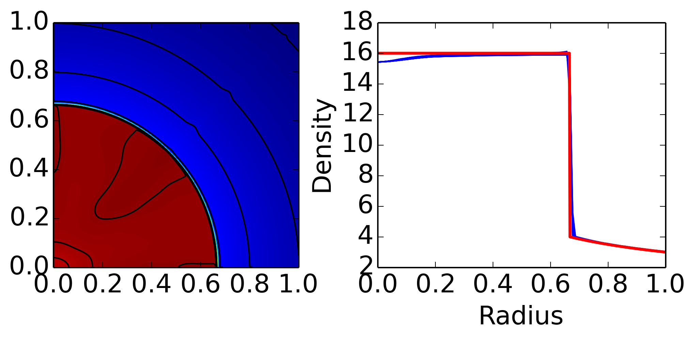

:Author: Ammar Hakim
:Date: 19th March 2014
:Completed: 
:Last Updated:

JE22: Benchmarking dimensionally split finite-volume scheme for 2D Euler equations
==================================================================================

.. contents::

In this note, I simulate a number of benchmark problems for the 2D
Euler equations. The scheme is a finite-volume wave-propagation
algorithm. Dimensional splitting is used. I.e. denoting the
X-direction update schematically by the operator
:math:`\exp(\mathcal{L}_x\Delta t)` and the Y-direction update by
:math:`\exp(\mathcal{L}_y\Delta t)`, the scheme can be written as

.. math::

  \exp(\mathcal{L}_y\Delta t) \exp(\mathcal{L}_x\Delta t)

I.e. the X-direction update is performed first, and then the
Y-direction update. Another option is to use an unsplit scheme
(i.e. in which transverse solvers are included, see
[LeVeque2002]_). Both split and unsplit (with transverse solvers)
schemes allow a maximum CFL number of 1.0, and are second order
accurate. However, an unsplit scheme without transverse solvers has a
stability CFL of 0.5, making it inefficient compared to the split
scheme.

As the scheme uses a Roe Riemann solver, the density and/or pressure
can sometimes become negative. To prevent this from crashing the code,
on detection of a positivity violation, the step is rejected and taken
again using a Lax flux. This ensures that the solution remains
positive, as Lax fluxes maintain positivity. However, use of Lax flux
can add more diffusion to the scheme. As positivity violations occur
infrequently, or not at all, this does not have a major impact on the
overall solution quality. Note that the use of a Lax flux still
conserves total mass, momentum and density, and hence is preferable to
the ad-hoc procedure of setting a density/pressure floor that can
cause uncontrolled mass and energy conservation errors.

Some of the problems are taken from a paper by Liska and Wendroff
[Liska2003]_ that compares a whole set of numerical methods for Euler
equations on various 1D and 2D problems. The 1D Euler solver has
already been tested in :doc:`JE2 <../je2/je2-euler-shock>`, and so
only the 2D scheme is tested here.

Smooth periodic problem
-----------------------

To check convergence, an exact smooth travelling wave solution

.. math::

  \rho(x,y,t) = 1 + 0.2\sin\left(\pi(x+y)-t(u+v)\right)

where :math:`u=1, v=-1/2, p=1`, are the constant velocity and pressure
of the fluid, is used to initialize the problem. The domain is
:math:`2\times 2` and a sequence of grids, :math:`25\times 25`,
:math:`50\times 50`, :math:`100\times 100` and :math:`200\times 200`
are used. The gas adiabatic index is set to :math:`\gamma=1.4`. The
simulation is run to :math:`t=4`, at which point the wave has
traversed the domain once.

The time-step is the same for each resolution to ensure that only the
convergence rate of the spatial scheme is tested. Errors are measured
using the :math:`L_2` norm of the error in density. The results are
presented in the table below.

.. list-table:: Smooth periodic :math:`L_2` errors
  :header-rows: 1
  :widths: 20,40,20,20

  * - Grid size :math:`\Delta x`
    - Average error
    - Order
    - Simulation
  * - :math:`0.08`
    - :math:`8.61153\times 10^{-5}`
    - 
    - :doc:`s389 <../../sims/s389/s389-euler-ds-2d>`
  * - :math:`0.04`
    - :math:`5.28259\times 10^{-6}`
    - :math:`4.02`
    - :doc:`s390 <../../sims/s390/s390-euler-ds-2d>`
  * - :math:`0.02`
    - :math:`2.98383\times 10^{-7}`
    - :math:`4.15`
    - :doc:`s391 <../../sims/s391/s391-euler-ds-2d>`
  * - :math:`0.01`
    - :math:`1.16211\times 10^{-8}`
    - :math:`4.68`
    - :doc:`s392 <../../sims/s392/s392-euler-ds-2d>`

.. note::

  I am not sure why the scheme converges with 4th order accuracy,
  rather than second order accuracy, as it should. Perhaps this is not
  a sufficiently good test, and the errors are very small to start off
  with, even on coarse grid. Also, the scheme is run without limiters,
  perhaps making the scheme look more accurate than it really is.

Gaussian pulse in a box
-----------------------

In this test, the gas is initially at rest with :math:`\rho=1.0` and
with a Gaussian pulse added to the background pressure

.. math::

  p(x,y) = 1 + 1\times 10^{-1} \exp(-\beta r^2)

where :math:`r^2=(x-x_c)^2 + (y-y_c)^2`, :math:`(x_c,y_c)` being the
domain center, and :math:`\beta=50.0`. The domain is bounded by
walls. This sets up sound waves that slosh around the box, forming
complex interference patterns. The aim of this test is to check the
energy conservation properties of the scheme with wall boundary
conditions.

The time-history of the fluid energy is shown in the following figure.

  Time history of fluid energy for pulse in box problem [:doc:`s393
  <../../sims/s393/s393-euler-wall-ds-2d>`]. The total energy should
  remain constant, however, fluctuates slightly, by about 0.01
  percent, due to small inconsistency (see main text) in the wall flux
  caused by the upwinding. The fluctuations correspond to sound waves
  hitting the wall.

The plot shows that the total energy is not exactly conserved,
however, fluctuates slightly, by about 0.01%. These errors can be
traced to the numerical flux used on the domain boundary, i.e. the
wall. Consider, for example, Lax fluxes

.. math::

  \mathbf{F}_{i+1/2} = \frac{1}{2}(\mathbf{f}_{i+1}+\mathbf{f}_{i})
  -
  \frac{\lambda}{2}(\mathbf{q}_{i+1}-\mathbf{q}_{i})

where :math:`\mathbf{F}_{i+1/2}` is the numerical flux,
:math:`\lambda` is the maximum eigenvalue in cells :math:`i,i+1`,
:math:`\mathbf{f}_{i}` is the physical flux, and
:math:`\mathbf{q}_{i}` is the conserved variable. For 1D Euler
equation we have

.. math::

  \mathbf{q} &= [\rho, \rho u, E]^T \\
  \mathbf{f} &= [\rho u, \rho u^2 + p, (E+p)u]^T

At the wall, the boundary conditions are obtained by copying into the
ghost cell the density and energy, and copying with a sign flip, the
normal velocity. Hence, the flux of mass and energy into the domain
vanishes in the first term in the numerical flux, but the flux of
normal momentum is incorrect due to the second, "diffusive" term,
leading to an error in the total momentum and hence energy
conservation. Setting :math:`\lambda=0` in the cell edges on a wall
will make the energy conservation exact, however, complicating the
algorithm somewhat.

2D Riemann problems
-------------------

In this section, a set of 2D problems are simulated. The parameters
are taken from Table 4.3 in [Liska2003]_, using the same labels to
identify the simulations. The problems are solved on a square with
unit side, initially divided into four quadrants, filled with fluid
with uniform state in a quadrant. The jumps across the fluid
quantities across quadrants cause a complex set of waves consisting of
shocks, rarefactions and contact slips.

There is no exact solution to these problems, and so an "eye-ball
metric" is used to study the quality of the solution by comparing with
figures in [Liska2003]_. In each case, it is found that the results
produced by Gkeyll are almost identical to the results published in
[Liska2003]_. Note that they only show solutions for Case 3, 12
and 15. I have included plots from all tests here for
reference. Details for each simulation (initial conditions, etc.)  are
available by clicking on the link to the Lua script in the figure
caption.

.. figure:: s394-pr-dens-flow.png
  :width: 100%
  :align: center

  Results of 2D Riemann problem from Case 3. Pressure is displayed in
  color and density contours are superimposed. For detail see
  [:doc:`s394 <../../sims/s394/s394-euler-reim-ds-2d>`].

  Results of 2D Riemann problem from Case 4. Pressure is displayed in
  color and density contours are superimposed. For detail see
  [:doc:`s395 <../../sims/s395/s395-euler-reim-ds-2d>`].

  Results of 2D Riemann problem from Case 6. Pressure is displayed in
  color and density contours are superimposed. For detail see
  [:doc:`s396 <../../sims/s396/s396-euler-reim-ds-2d>`].

.. figure:: s397-pr-dens-flow.png
  :width: 100%
  :align: center

  Results of 2D Riemann problem from Case 12. Pressure is displayed in
  color and density contours are superimposed. For detail see
  [:doc:`s397 <../../sims/s397/s397-euler-reim-ds-2d>`].

  Results of 2D Riemann problem from Case 15. Pressure is displayed in
  color and density contours are superimposed. For detail see
  [:doc:`s398 <../../sims/s398/s398-euler-reim-ds-2d>`].

  Results of 2D Riemann problem from Case 17. Pressure is displayed in
  color and density contours are superimposed. For detail see
  [:doc:`s399 <../../sims/s399/s399-euler-reim-ds-2d>`].

Noh Problem
-----------

This problem is simulated on a domain :math:`(x,y)\in
[0,1]\times[0,1]`, with the initial density set to 1, and pressure set
to zero (:math:`1\times 10^{-6}` to avoid numerical problems). The
initial velocity is directed at the origin and is constant with
magnitude 1. The solution is an infinite strength circularly symmetric
shock reflecting from the origin. Behind the shock (inside the circle)
the density is 16, the velocity is 0 and the pressure is 16/3. The
shock speed is :math:`1/3`, and ahead of the shock, the density is
:math:`1+t/\sqrt{x^2+y^2}`, while velocity and pressure remain as set
initially. The problem is simulated by using wall boundary conditions
on the left and bottom boundaries, while on the top and right
boundaries the exact solution is enforced. The simulation is run to
:math:`t=2`, on two grids, :math:`200\times 200` and :math:`400\times
400`.

This is a very difficult problem, and one of those rare cases in
Gkeyll in which almost every step is rejected (due to negative
pressure) and retaken with Lax fluxes. Note that according to
[Liska2003]_ many schemes fail on this problem, and even those that
work show numerical artifact. As shown below, Gkeyll does a fairly
good job of capturing the physics, on par with the best schemes shown
in [Liska2003]_.

  Left panel shows color plot of density, with superimposed density
  contours (from 2.5 to 4.0 in step of 0..25, and 14.0 to 17.0 in step
  of 0.2) for Noh problem on a :math:`400\times 400` grid. See
  [:doc:`s401 <../../sims/s401/s401-euler-noh-ds-2d>`]. The right
  panel shows lineouts of the density (blue lines) along several
  radial lines drawn from the origin. Solid red line is the exact
  solution. Gkeyll is robustly able to handle this difficult problem,
  with only a small (incorrect) dip in the density close to the
  origin.

REFERENCES
----------

.. [LeVeque2002] Randall J. LeVeque, *Finite Volume Methods For
   Hyperbolic Problems*, Cambridge University Press, 2002.

.. [Liska2003] Liska, R., & Wendroff, B. "Comparison of Several
   Difference Schemes on 1D and 2D Test Problems for the Euler
   Equations", *SIAM Journal on Scientific Computing*, **25** (3),
   995–1017. doi:10.1137/S1064827502402120
