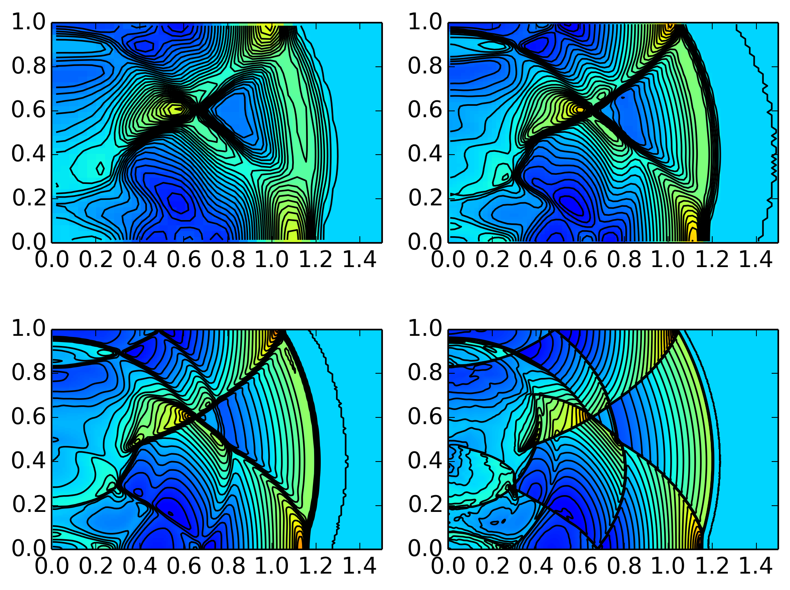

:Author: Ammar Hakim
:Date: 25th March 2014
:Completed: 
:Last Updated:

JE23: Benchmarking a finite-volume scheme for 3D Euler equations
================================================================

.. contents::

In this note, I simulate a number of benchmark problems for the 3D
Euler equations. The scheme is a finite-volume wave-propagation
algorithm. Dimensional splitting is used. I.e. the scheme can be written as

.. math::

  \exp(\mathcal{L}_z\Delta t)\exp(\mathcal{L}_y\Delta t) \exp(\mathcal{L}_x\Delta t)

I.e. the X-direction update is performed first, then the Y-direction
update, and finally the Z-direction update. See :doc:`JE22
<../je22/je22-euler-2d>` for other details about the scheme, and for
2D benchmarks.

These problems are taken from a paper by Langseth and LeVeque
[Langseth2000]_, which describes the unsplit wave-propagation
algorithm for the solution of 3D Euler equations. None of the problems
tested has an exact solution, so mostly eye-ball metric is used to
quantify the results.

Spherical Riemann Problem
--------------------------

In this problem a gas, initially at rest, fills the space between two
walls at :math:`z=0` and :math:`z=1`. The density and pressure are
:math:`\rho_0=1.0` and :math:`p_0=1.0`, except inside a sphere
centered at :math:`(0,0,0.4)` with radius :math:`0.2`. Inside the
sphere the pressure is higher, :math:`p_i=5.0`. This results in a
strong outward moving shock wave, a contact discontinuity and an
inward moving rarefaction. This rarefaction causes an "implosion",
creating a second outward moving shock wave. Note that this problem
has cylindrical symmetry about the Z-axis. Hence, a special version of
Gkeyll, setup to solve axisymmetric Euler equations (see last section
of this note) is used to verify the 3D results obtained.

The simulations are performed on a quarter of the domain
:math:`(x,y,z)\in [0,1.5]\times [0,1.5]\times [0,1.0]`. Symmetry is
assumed on the :math:`x=0` and :math:`y=0` planes. Other boundaries
are open (note that there are walls at :math:`z=0` and
:math:`z=1`). The simulation is performed on a :math:`37\times
37\times 25`,
:math:`75\times 75\times 50` and :math:`150\times 150\times 300`
grid. For comparison, the solution from the axisymmetric solver on a
:math:`600\times 400` grid is used as a reference. The figure below
shows the results, which compare well with those published in
[Langseth2000]_, Figure 6.

  Color plot of pressure with superimposed contours (30 equally space
  contours are drawn) on a :math:`37\times 37\times 25` [:doc:`s408
  <../../sims/s408/s408-riemann-euler-3d>`] (top left),
  :math:`75\times 75\times 50` [:doc:`s409
  <../../sims/s409/s409-riemann-euler-3d>`] (top right) and
  :math:`150\times 150\times 300` [:doc:`s410
  <../../sims/s410/s410-riemann-euler-3d>`] (bottom left) grid. The
  plot on the lower right shows the solution from the axisymmetric
  solver on a :math:`600\times 400` [:doc:`s411
  <../../sims/s411/s411-riemann-euler-rz>`] grid. Even on the coarse
  mesh, the qualitative features of this complex flow are captured.

In the figure below lineouts of pressure in the XY plane at
:math:`z=0.4` are shown for each of the grid resolutions. For
comparison, the solution from the high resolution 2D axisymmetric
simulation are also shown. The figure shows that even with coarse
resolution the solver gives qualitatively correct results, and that
the axisymmetry in the 3D simulation is well maintained.

  Lineouts of pressure in various directions in the XY plane at
  :math:`z=0.4` are shown for :math:`37\times 37\times 25` (top left),
  :math:`75\times 75\times 50` (top right) and :math:`150\times
  150\times 300` (bottom left) grid. For comparison, the solution from
  the high resolution 2D axisymmetric simulation are also shown (black
  line). The figure shows that even with coarse resolution the solver
  gives qualitatively correct results, and that the axisymmetry in the
  3D simulation is well maintained.

On solving axisymmetric Euler equations
---------------------------------------

Something.

References
----------

.. [Langseth2000] Langseth, J. O., & LeVeque, R. J. (2000). "A Wave
   Propagation Method for Three-Dimensional Hyperbolic Conservation
   Laws", *Journal of Computational Physics*, **165** (1),
   126–166. doi:10.1006/jcph.2000.6606
