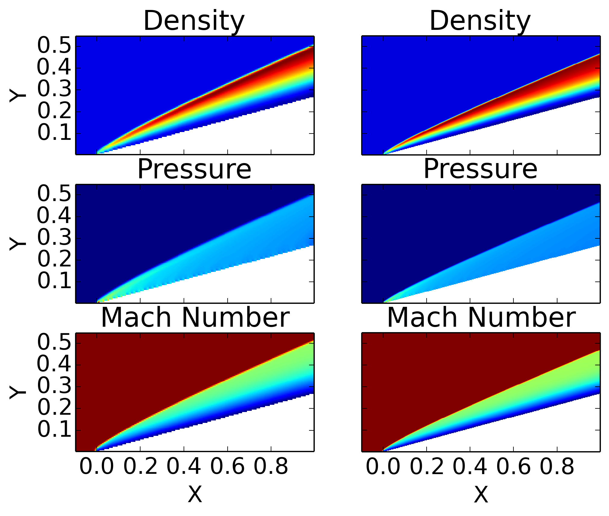
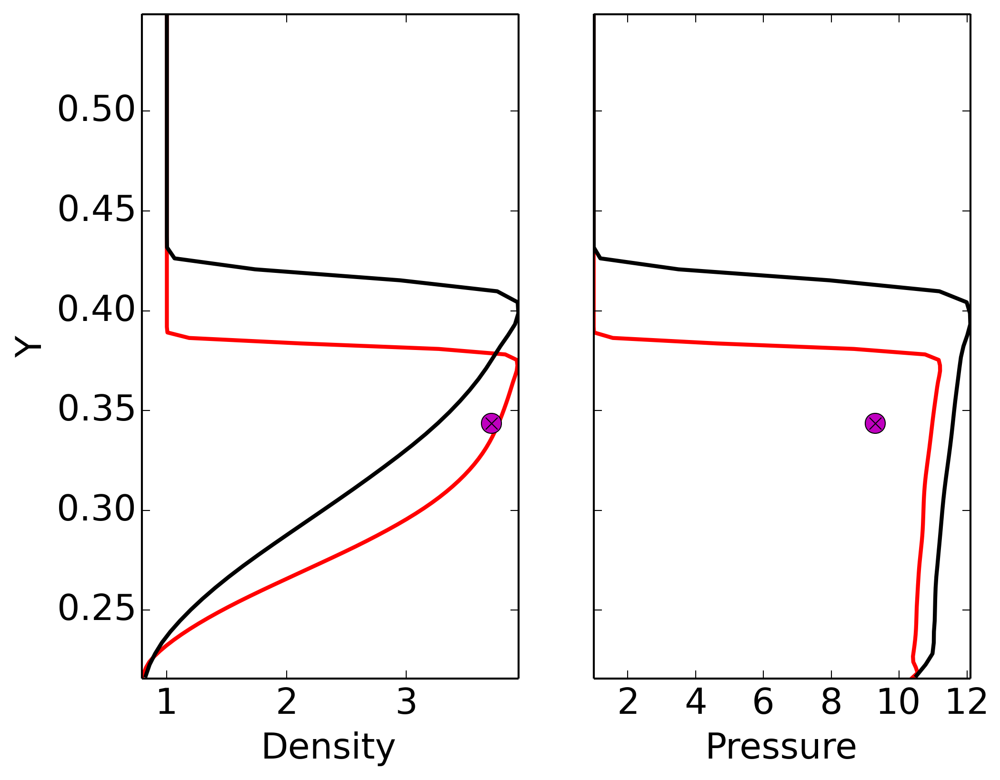

:Author: Ammar Hakim
:Date: July 15th 2014
:Completed: 
:Last Updated:

JE24: Tests for embedded boundary Euler solver
==============================================

.. contents::

.. warning::

  There is a subtle bug in the present implementation, which I have
  not been able to track down. Basically, when running in parallel, if
  the MPI domain boundary and the embedded boundaries are coincident
  or separated by one cell, the results differ very slightly from
  serial results. Note that for all other cases in parallel the bug
  does not manifest itself.

In this note I test the finite-volume embedded boundary updater on the
Euler equations. At present, Gkeyll uses a stair-stepped mesh to
represent the surface of an object. Although crude, this is sufficient
to tackle many problems, including magnetosphere modeling. We are
interested in the latter problem, and most global magnetosphere codes
use a stair-stepped mesh to represent the planet/moon surface. The
representation of the boundary may be improved in the future by using
either a conformal cut-cell mesh, or using a multi-block body-fitted
mesh. Note that for viscous flows, using stair-stepped or even
cut-cell BCs is not a good idea as near a wall, to capture the
boundary layer accurately, one needs meshes aligned with the surface.

For now, stair-stepped meshes are sufficient.

Note on geometry representation and embedded boundary conditions
----------------------------------------------------------------

The key step in doing embedded boundary simulations is to setup the
geometry. For this, one needs to create an Gkeyll field with a single
component. This field should store a positive number when the
corresponding point is inside the domain and a negative number when it
is outside the domain. Rather complex objects can be created by
combining a set of elementary shapes (circles, boxes, ellipses, ...)
using shift/rotate and logical operators. For example, to represent a
circle one can use the Lua function

.. code-block:: lua

  function inCircle(x,y, xc,yc,rad)
    return (x-xc)^2 + (y-yc)^2 < rad^2 and 1.0 or -1.0
  end

This function evaluates to 1.0 when inside the sphere, and to -1.0
otherwise. Note that for flow *around* a sphere one needs to flip the
signs in the above equation.

Given two in/out functions :math:`d_A(x,y)` and :math:`d_B(x,y)` can
can create a new functions representing the union, intersection and
subtraction as follows

.. math::

  d_U(x,y) &= \max(d_A(x,y), d_B(x,y)) \qquad &\mathrm{union} \\
  d_I(x,y) &= \min(d_A(x,y), d_B(x,y)) \qquad &\mathrm{intersection} \\
  d_S(x,y) &= \min(d_A(x,y), -d_B(x,y)) \qquad &\mathrm{substraction}.

In three dimensions several other operations are possible: rotation of
a 2D shape about some axis, extrusion of a 2D shape along a curve,
etc. Arbitrary shapes can be represented in this way, however, the
final function representing a complex shape may not be very readable.

Once the object geometry has been created, the boundary condition
update needs to be created (in 2D) using the `StairSteppedBc2D`
updater. This updater takes in the in/out field and a list of BCs to
apply. 

Note that due to the way in which BCs are applied this updater also
needs the direction in which to apply the BC (using a setDir
method). In essence, I am assuming that this updater is used as part
of a dimensionally-split algorithm in which the BC is applied in a
particular direction and then the update in that direction is
performed. For unsplit algorithms, embedded BCs require more
complicated data-structures.

Note of numerical fluxes
------------------------

In most of these simulations, I need to use HLLE fluxes (enabled using
numericalFlux = "lax" and useIntermediateWave = true in
HyperEquation.Euler block). The Roe fluxes causes severe problems,
including carbuncle problem and launch of spurious shocks from
stair-stepped cells. It appears that the numerical diffusion added by
the HLLE flux effectively acts to "smooth out" the jagged
representation of the boundary, allowing one to obtain reasonable
results. However, as is obvious (and shown below) if the flow is very
sensitive to the stuff happening at the boundary, then stair-stepped
meshes are not a good idea, and one will need to use a body-fitted
(structured or unstructured) mesh.

Supersonic flow over wedge
--------------------------

In this test, I study the supersonic flow over a 2D wedge. This is a
standard problem in compressible, invicid shock theory, and, for
example, is described in detail in Chapter 4 of [#anderson-mcf]_. For
this problem one can use the Rankine-Hugoniot relations to compute the
exact fluid state just behind the oblique shock.

The wedge has a half-angle of :math:`15` degrees, and a free-stream
Mach 8 flow (with :math:`\rho_1=1` and :math:`p_1=1`) is
imposed. Standard shock theory shows (see `this online calculator
<http://www.dept.aoe.vt.edu/~devenpor/aoe3114/calc.html>`_, for
example) that an attached oblique shock should form, with shock angle
of about :math:`20.9^o`, with the density and pressure behind the
shock given by :math:`\rho_2/\rho_1 = 3.71` and
:math:`p_2/p_1=9.30`. The Mach number just behind the shock should be
:math:`4.75`. (Subscript 1 is used for free-stream values, and 2 for
just behind the shock). Two grid resolutions, :math:`100\times 200`
and :math:`200\times 400` are used. Results are shown the following
figure.

  Density (top), pressure (middle) and Mach number (bottom) on
  :math:`100\times 200` (left) [:doc:`s416
  <../../sims/s416/s416-euler-wedge-2d>`] and :math:`200\times 400`
  (right) [:doc:`s417 <../../sims/s417/s417-euler-wedge-2d>`] grid for
  flow over :math:`15^o` half-angle wedge. Inflow speed is Mach 8. The
  exact solution predicts a shock-angle of about :math:`20.86^o`. The
  numerically computed angles are :math:`27^o` and :math:`25^o` for
  the coarse and fine resolutions, respectively. These errors are due
  to the boundary representation, which causes a the shock to detach
  slightly at the tip of the wedge, leading to a much larger shock
  angle.

As seen in the above figure, the shock angle is poorly predicted. The
reason for this are (a) the stair-stepped boundary causes the shock to
detach from the tip of the wedge, opening up the shock angle somewhat,
and (b) the use of a diffusive flux means that the effective wedge
angle is larger, as the numerical diffusion "smears out" the
boundary.

A vertical lineout of the density and pressure at :math:`x=0.9` are
shown in the following figure.

  Density (left), pressure (right) for Mach 8 flow over :math:`15^o`
  half-angle wedge, on :math:`100\times 200` (black) [:doc:`s416
  <../../sims/s416/s416-euler-wedge-2d>`] and :math:`200\times 400`
  (red) [:doc:`s417 <../../sims/s417/s417-euler-wedge-2d>`] grids. The
  solid magenta dots indicates the exact value just behind the
  shock. Further, the pressure inside shock should be uniform. As seen
  here Gkeyll over-predicts the jump across the shock, and also
  over-predicts the shock angle. It should be noted that the jump
  across the shock is very sensitive to the wedge angle, and hence a
  small (even two degree) error can cause this level of discrepancy.

References
----------

.. [#anderson-mcf] John D. Anderson, Jr. "Modern Compressible Flow".
