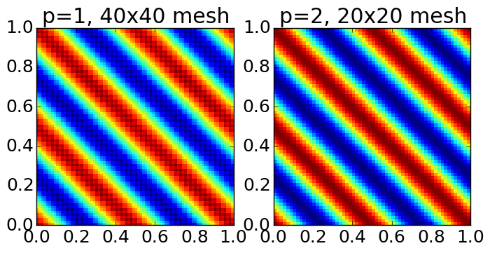

:Author: Ammar Hakim
:Date: May 19th 2015
:Completed: 
:Last Updated:

JE26: Benchmarking a discontinuous Galerkin algorithm for Maxwell equations
===========================================================================

.. contents::

In this note I benchmark a nodal discontinuous Galerkin solver for
Maxwell equations. This solver will be used as part of the
Vlasov-Maxwell and multi-fluid equations. For notes on Maxwell
equations and divergence cleaning, please see :doc:`JE6
<../je6/je6-maxwell-solvers>`.

For Maxwell equations, it can be shown that the *spatial operator* of
the DG scheme conserves the electromagnetic (EM) energy exactly when
using *central fluxes*. However, with *upwinding* the EM energy
*decays monotonically*. Note that the time-stepping scheme (in this
case a SSP-RK3 scheme) will add some dissipation, and hence the fully
discrete scheme will decay the energy (not necessarily monotonically),
independent of numerical fluxes used.

Gkeyll at present (as of May 19th 2015) has polynomial order 1 and 2
serendipity elements, and arbitrary order Lagrange tensor elements. In
the near future we hope to have higher order serendipity element as
well as other basis sets in which the number of degrees-of-freedom
(DOFs) are minimized.

The nodal DG solver works in 1D, 2D and 3D, but only 1D and 2D studies
are shown below.

Convergence of 1D and 2D scheme
-------------------------------

To test the convergence of the scheme, we can use a general wave
solution on a periodic domain. Let :math:`\mathbf{k} = 2\pi(k,l,m)/L`
be a wave-vector such that :math:`|\mathbf{k}|\ne 0`. Let
:math:`\mathbf{n}` be a non-zero vector such that
:math:`\mathbf{k}\cdot\mathbf{n} = 0`. Then, a general periodic
solution of Maxwell equations on a domain :math:`L\times L\times L` is

.. math::

  \mathbf{E} &= E_0 \cos(\mathbf{k}\cdot\mathbf{x} - |\mathbf{k}|c t +
  \delta)\hat{\mathbf{n}} \\
  \mathbf{B} &= E_0\sqrt{\mu_0\epsilon_0} 
    \cos(\mathbf{k}\cdot\mathbf{x} - |\mathbf{k}|c t + \delta)\hat{\mathbf{k}}\times\hat{\mathbf{n}}

where :math:`\hat{\mathbf{n}}` and :math:`\hat{\mathbf{k}}` are unit
vectors. We can use this solution to generate 1D and 2D initial
conditions that can be used to test the convergence of the scheme.

Errors in the L1 norm of the solution of :math:`E_z` are
computed. These correspond to computing the errors in the cell
averages. Let :math:`E_{z0}` be the initial conditions, projected on
the selected basis functions. Then, the errors are computed as

.. math::
  \epsilon = \sum_j \left|\int_{I_j} E_z - E_{z0} \thinspace dx dy \right|

where the sum is performed over all cells. Other norms can also be
used, and I intedend to do this at some point. For example, the L2
norm may be a better measure, as it would also account for the
convergence of higher order moments of the solution.

Convergence of 1D schemes
+++++++++++++++++++++++++

For this problem I pick :math:`\mathbf{k} = 2\pi(2,0,0)/L`, with
:math:`L=1`. The simulation is run for one perdiod, i.e. to
:math:`t=2\pi|\mathbf{k}|c`. Physical values of speed of light and
other physical constants are used. To study spatial convergence, the
time-step is kept constant, and the number of cells are
doubled. 

Results are shown below for various polynomial orders and basis
functions.

.. list-table:: **Serendipity polynomial order 1**
  :header-rows: 1
  :widths: 20,40,20,20

  * - Grid size :math:`\Delta x`
    - Average error
    - Order
    - Simulation
  * - :math:`0.025`
    - :math:`5.373\times 10^{-3}`
    - 
    - :doc:`s1 <../../sims-2/dg-maxwell/s1/s1-dg-maxwell>`
  * - :math:`0.0125`
    - :math:`5.794\times 10^{-4}`
    - :math:`3.2`
    - :doc:`s2 <../../sims-2/dg-maxwell/s2/s2-dg-maxwell>`
  * - :math:`0.00625`
    - :math:`6.6596\times 10^{-5}`
    - :math:`3.1`
    - :doc:`s3 <../../sims-2/dg-maxwell/s3/s3-dg-maxwell>`

.. list-table:: **Serendipity polynomial order 2**
  :header-rows: 1
  :widths: 20,40,20,20

  * - Grid size :math:`\Delta x`
    - Average error
    - Order
    - Simulation
  * - :math:`0.1`
    - :math:`9.639\times 10^{-3}`
    - 
    - :doc:`s4 <../../sims-2/dg-maxwell/s4/s4-dg-maxwell>`
  * - :math:`0.05`
    - :math:`2.8299\times 10^{-4}`
    - :math:`5.1`
    - :doc:`s5 <../../sims-2/dg-maxwell/s5/s5-dg-maxwell>`
  * - :math:`0.025`
    - :math:`1.17\times 10^{-5}`
    - :math:`4.6`
    - :doc:`s6 <../../sims-2/dg-maxwell/s6/s6-dg-maxwell>`

.. list-table:: **Lagrange tensor, polynomial order 3**
  :header-rows: 1
  :widths: 20,40,20,20

  * - Grid size :math:`\Delta x`
    - Average error
    - Order
    - Simulation
  * - :math:`0.25`
    - :math:`5.186\times 10^{-2}`
    - 
    - :doc:`s8 <../../sims-2/dg-maxwell/s8/s8-dg-maxwell>`
  * - :math:`0.125`
    - :math:`8.9166\times 10^{-5}`
    - :math:`9.1`
    - :doc:`s9 <../../sims-2/dg-maxwell/s9/s9-dg-maxwell>`
  * - :math:`0.0625`
    - :math:`3.3212\times 10^{-5}`
    - :math:`1.45`
    - :doc:`s10 <../../sims-2/dg-maxwell/s10/s10-dg-maxwell>`

**Discussion** Note that the DG scheme with serendipity basis
converges faster than :math:`p+1`, and seem to converge as
:math:`2p+1`. The Lagrange tensor solution converges even faster,
however, then levels off, probably because the errors are too small to
measure accurately. Also, note that in general going to higher order
reduces the error dramatically, even on much coarser meshes.

Convergence of 2D schemes
+++++++++++++++++++++++++

For this problem I pick :math:`\mathbf{k} = 2\pi(2,2,0)/L`, with
:math:`L=1`. The simulation is run for one period, i.e. to
:math:`t=2\pi|\mathbf{k}|c`. The wave propagates diagonally, testing
propagation of waves transverse to the grid. Equal number of cells are
used in each direction.

Results are shown below for various polynomial orders and basis
functions.

.. list-table:: **Serendipity polynomial order 1**
  :header-rows: 1
  :widths: 20,40,20,20

  * - Grid size :math:`\Delta x`
    - Average error
    - Order
    - Simulation
  * - :math:`0.05`
    - :math:`8.699\times 10^{-2}`
    - 
    - :doc:`s15 <../../sims-2/dg-maxwell/s15/s15-dg-maxwell>`
  * - :math:`0.025`
    - :math:`9.619\times 10^{-3}`
    - :math:`3.1`
    - :doc:`s16 <../../sims-2/dg-maxwell/s16/s16-dg-maxwell>`
  * - :math:`0.0125`
    - :math:`1.065\times 10^{-3}`
    - :math:`3.2`
    - :doc:`s17 <../../sims-2/dg-maxwell/s17/s17-dg-maxwell>`

.. list-table:: **Serendipity polynomial order 2**
  :header-rows: 1
  :widths: 20,40,20,20

  * - Grid size :math:`\Delta x`
    - Average error
    - Order
    - Simulation
  * - :math:`0.1`
    - :math:`2.332\times 10^{-2}`
    - 
    - :doc:`s18 <../../sims-2/dg-maxwell/s18/s18-dg-maxwell>`
  * - :math:`0.05`
    - :math:`7.359\times 10^{-4}`
    - :math:`4.95`
    - :doc:`s19 <../../sims-2/dg-maxwell/s19/s19-dg-maxwell>`
  * - :math:`0.025`
    - :math:`3.5146\times 10^{-5}`
    - :math:`4.4`
    - :doc:`s20 <../../sims-2/dg-maxwell/s20/s20-dg-maxwell>`

Example solutions with polynomial order 1 on grid :math:`40\times 40`
and polyorder 2 on grid :math:`20\times 20` are shown below.

  Solution computed with polynomial order 1 on grid :math:`40\times
  40` grid (left) [:doc:`s16
  <../../sims-2/dg-maxwell/s16/s16-dg-maxwell>`] and polyorder 2 on
  grid :math:`20\times 20` (right) [:doc:`s19
  <../../sims-2/dg-maxwell/s19/s19-dg-maxwell>`]. The piecewise
  quadratic scheme is more accurate and runs faster than the piecewise
  linear scheme. This is also evident from the errors shown in the
  tables above.
