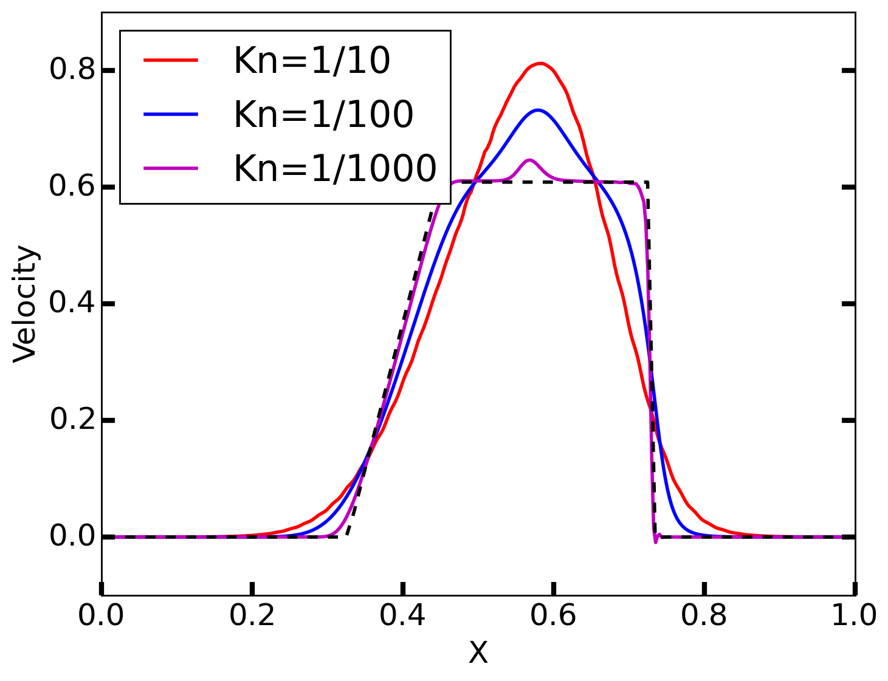
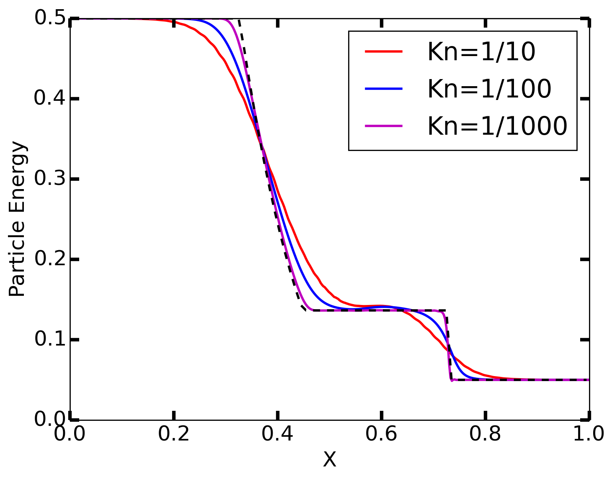

:Author: Ammar Hakim
:Date: 30nd Jan 2016
:Completed: 
:Last Updated:

JE28: Some tests for Boltzmann-BGK equations
============================================

.. note::

   This note is written with Petr Cagas, a graduate student at
   Virginia Tech. Petr wrote the code to compute a Maxwellian from
   moments. This updater at present does not conserve the
   moments. I.e. moments computed *from* the Maxwellian won't exactly
   match the moments used to *compute* the Maxwellian. We hope to fix
   this soon.

.. contents::

Introduction
------------

Gkeyll includes the ability to incorporate (as of this writing) both a
BGK and a Lenard-Bernstein (LB) collision operator. The LB operator is
modified to ensure momentum and energy conservation. In this note, I
test the BGK operator in the context of kinetic simulations of neutral
gas dynamics.

The neutral gas dynamics system, with the BGK operator, is given by

.. math::

  \frac{\partial f}{\partial t} + v \frac{\partial f}{\partial x} =
  \nu (f_M - f)

where :math:`f_M` is the Maxwellian distribution computed from the
moments of :math:`f(x,v,t)`:

.. math::

   f_M(x,v,t) = \frac{n}{\sqrt{2\pi v_{th}^2}} \exp(-(v-u)^2/2 v_{th}^2)

where

.. math::

   n \equiv \int f(x,v,t) \thinspace dv \\
   nu \equiv \int v f(x,v,t) \thinspace dv \\
   nu^2 + n v_{th}^2 \equiv \int v^2 f(x,v,t) \thinspace dv

The above equations are written in 1X/1V, however, the code works in
higher dimensions.

Notes on algorithm: positivity and asymptotic preservation
----------------------------------------------------------

The are two major issues with algorithms for Boltzmann type equations
(i.e. with collisions) which one needs to deal with. The first, is to
ensure that the distribution function remains positive, and second, to
ensure that the time-step in the very high collisionality regime is
not dominated by the collision frequency.

Gkeyll's current algorithm for evolving the distribution function does
not maintain positivity. However, a positivity "fix" (which maintains
particle conservation) has been implemented, and can applied as a
filter step. This positivity fix, although conservative and easy to
use, is not very good as it often reduces the order of the
scheme. Better schemes will be implemented in the future.

Its clear from the form of the BGK operator, that for :math:`\nu
\rightarrow \infty`, the collisional sources become very stiff. In
this fluid regime the time-step restriction from the collisions become
more severe than the explicit time-step from the thermal
velocity. Hence, to avoid taking a small time-step, an asymptotic
preserving (AP) method needs to be implemented [#pareschi]_. (Note
that to achieve AP property we need to ensure also that the spatial
scheme is AP. This is naturally the case for the Gkeyll kinetic
solver, which asymptotes to a kinetic-Riemann solver based fluid
solver in the fluid limit).  As far as can be determined, this can be
done from the Lua script without any new C++ code. We hope to do this
soon.

Test Problems
-------------

Problem 1: Relaxation of step function to Maxwellian
++++++++++++++++++++++++++++++++++++++++++++++++++++

In this test the relaxation of an initial non-Maxwellian distribution
function to Maxwellian (due to collisions) is studied. The initial
distribution function is a step-function in velocity space:

.. math::

   f(x,v,t) &= \frac{1}{2v_0} \quad &|v| < v_0 \\
            &= 0 \quad &|v| > v_0

where :math:`v_0 = 3 v_{th}/2`. 32 cells are used in velocity space,
with piece-wise quadratic Serendipity basis elements. The simulation
is run to steady-state, and the resulting Maxwellian compared with the
exact solution. Note that as the BGK operator (as all collision
operators) conserves density, momentum and energy, we can easily
calculate the expected solution (for comparison) from the parameters
of the selected initial distribution function. The results are shown
in the figure below. As can be seen, the steady-state solution matches
the exact solution very well.

  Relaxation of an initial step-function distribution function
  (red-line) to a Maxwellian. Black line is the numerical solution,
  while blue dots are the exact solution computed from the moments of
  the initial condition. See [:doc:`s1
  <../../sims-2/boltz-bgk/s1/s1-bgk-boltz>`] for input file.

Problem 2: Sod-shock problem
++++++++++++++++++++++++++++

This problem is the generalization of the classical Sod-shock to
the Boltzmann-BGK system. The initial conditions are

.. math::

.. math::

  \left[
    \begin{matrix}
      \rho_l \\
      u_l \\
      p_l
    \end{matrix}
  \right]
  = 
  \left[
    \begin{matrix}
      1 \\
      0.0 \\
      1.0
    \end{matrix}
  \right],
  \qquad
  \left[
    \begin{matrix}
      \rho_r \\
      u_r \\
      p_r
    \end{matrix}
  \right]
  = 
  \left[
    \begin{matrix}
      0.125 \\
      0.0 \\
      0.1
    \end{matrix}
  \right].
   
For a 1D/1V system, the thermal velocity needs to be computed as
:math:`p=n v_{th}^2`, indicating a gas adiabatic constant of
:math:`\gamma=3`. (The internal energy is :math:`p/(\gamma-1) = n
v_{th}^2/2`, which means :math:`\gamma=3`). The Knudsen number
(:math:`\mathrm{Kn} = \lambda_\textrm{mfp}/L`) is varied from
:math:`1/10`, :math:`1/100` and :math:`1/1000`. In the first case, the
gas is collisionless (on the time-scale of the simulation), and in the
last case, the gas is highly collisional. Hence, the solution should
match (approximately) the solution from (Navier-Stokes) Euler
equations.

In the following figures, the results with various Knudsen numbers are
shown, as well the exact solution of the Euler equations for the same
parameters. Note that the Euler equations represent the inviscid limit
of the Boltzmann equation, and hence even in high collisionality
regime won't match the kinetic results exactly. In fact, the high
collisionality results would be better compared to a Navier-Stokes
solution, with transport parameters derived from the BGK operator
(rather than the Boltzmann collision operator).

.. figure:: sod-shock-density-cmp.png
  :width: 100%
  :align: center

  Density from Sod-shock problem for :math:`\mathrm{Kn}=1/10` (red)
  [:doc:`s2 <../../sims-2/boltz-bgk/s2/s2-bgk-boltz>`],
  :math:`\mathrm{Kn}=1/100` (blue) [:doc:`s3
  <../../sims-2/boltz-bgk/s3/s3-bgk-boltz>`], and
  :math:`\mathrm{Kn}=1/1000` (magenta) [:doc:`s4
  <../../sims-2/boltz-bgk/s4/s4-bgk-boltz>`]. The black dashed line
  shows the exact solution from the Euler equation.

  Velocity from Sod-shock problem for :math:`\mathrm{Kn}=1/10` (red)
  [:doc:`s2 <../../sims-2/boltz-bgk/s2/s2-bgk-boltz>`],
  :math:`\mathrm{Kn}=1/100` (blue) [:doc:`s3
  <../../sims-2/boltz-bgk/s3/s3-bgk-boltz>`], and
  :math:`\mathrm{Kn}=1/1000` (magenta) [:doc:`s4
  <../../sims-2/boltz-bgk/s4/s4-bgk-boltz>`]. The black dashed line
  shows the exact solution from the Euler equation.

  Internal energy (:math:`n v_{th}^2/2 = p/(\gamma-1)`) from Sod-shock
  problem for :math:`\mathrm{Kn}=1/10` (red) [:doc:`s2
  <../../sims-2/boltz-bgk/s2/s2-bgk-boltz>`],
  :math:`\mathrm{Kn}=1/100` (blue) [:doc:`s3
  <../../sims-2/boltz-bgk/s3/s3-bgk-boltz>`], and
  :math:`\mathrm{Kn}=1/1000` (magenta) [:doc:`s4
  <../../sims-2/boltz-bgk/s4/s4-bgk-boltz>`]. The black dashed line
  shows the exact solution from the Euler equation.

References
----------

.. [#pareschi] Pareschi, L., & Russo, G.. "Implicit-explicit
   Runge-Kutta schemes and applications to hyperbolic systems with
   relaxation". arXiv:1009.2757.
