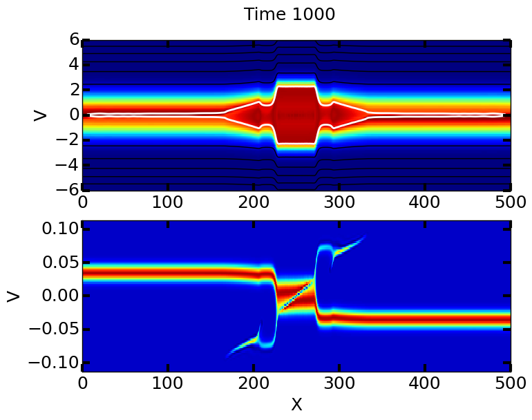
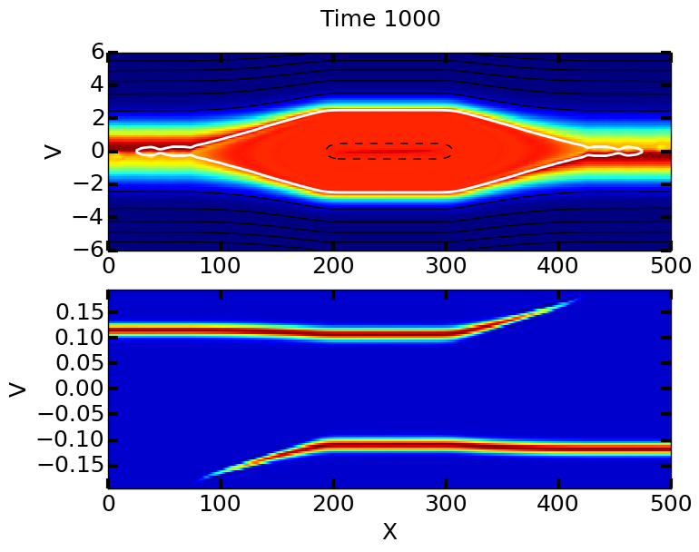
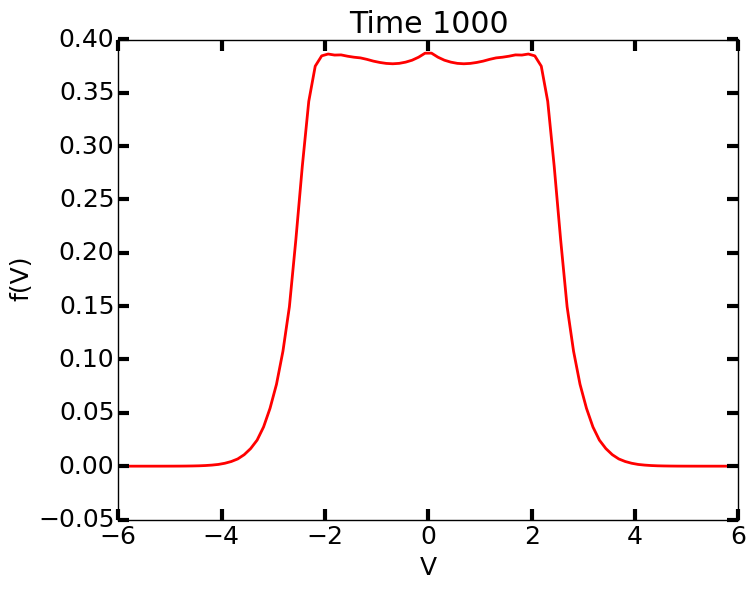
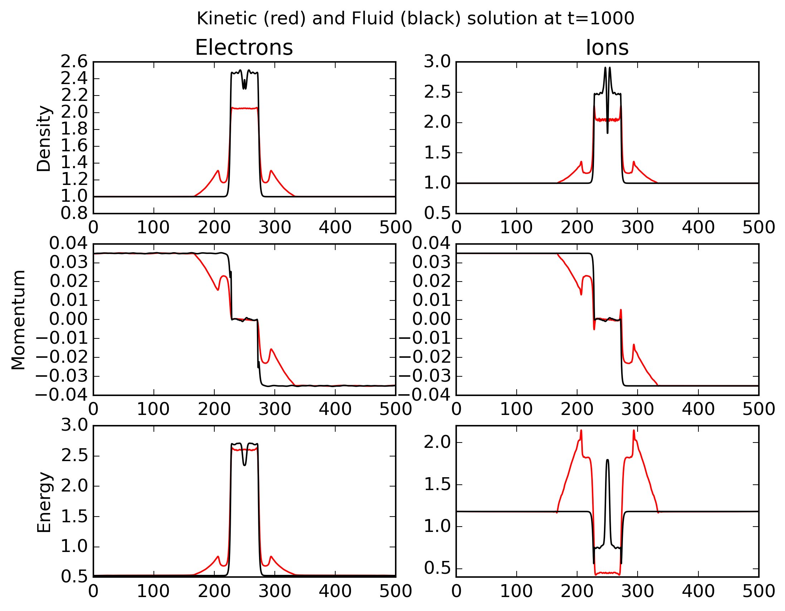
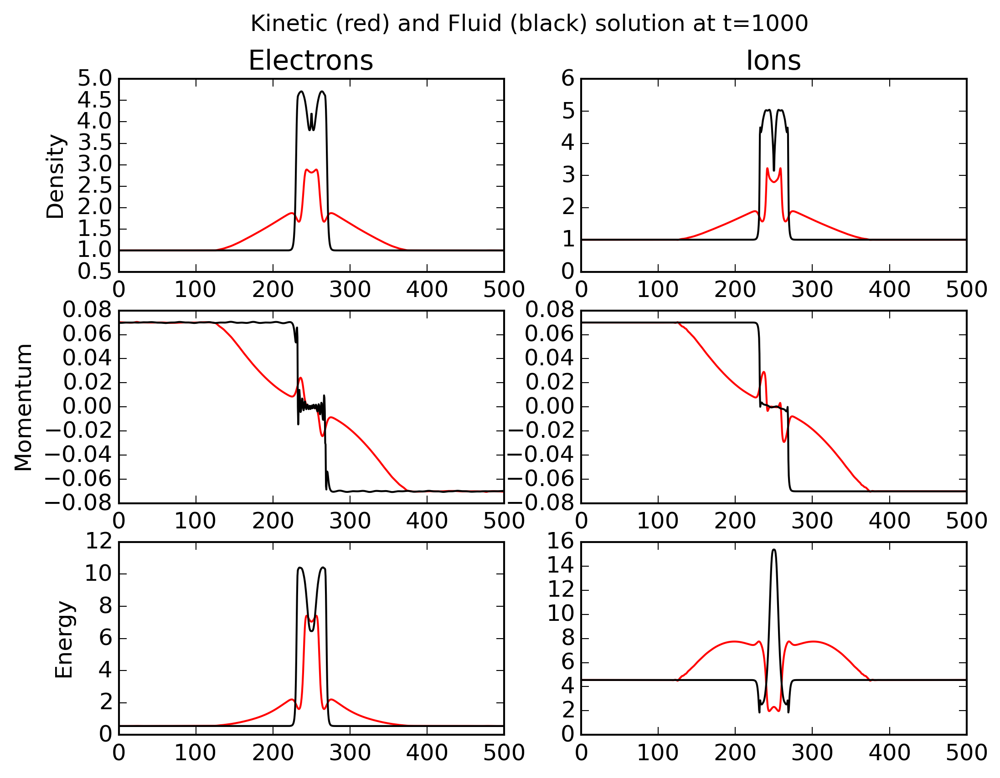
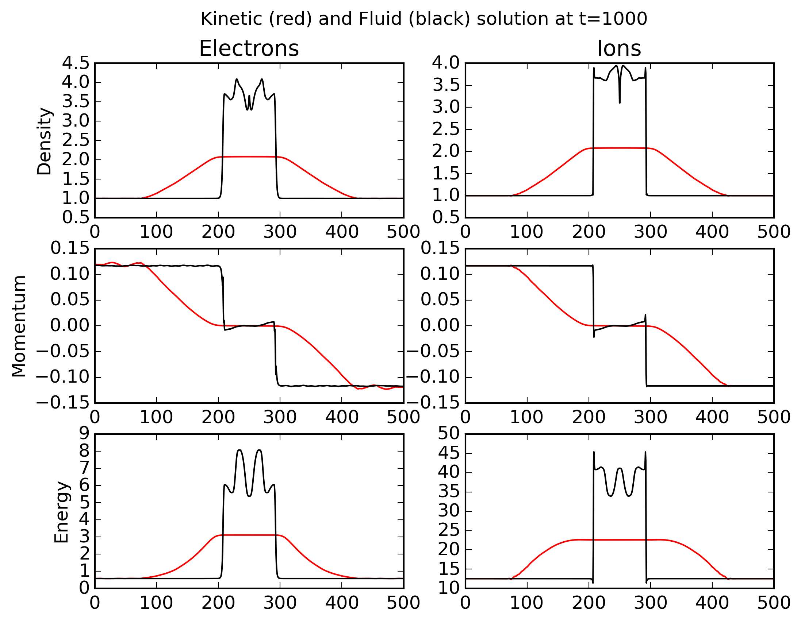

:Author: Ammar Hakim
:Date: 7th Feb 2016
:Completed: 
:Last Updated:

JE29: Electrostatic shocks: kinetic and fluid
=============================================

.. contents::

Introduction
------------

In this notes I compare results from 1D/1V simulations of
electrostatic shocks with those obtained from the multi-fluid,
5-moment model. The Poisson-bracket formulation of Vlasov-Poisson
equations is used. See :doc:`JE15 <../je15/je15-vlasov-poisson>` for
formulation of the equations, and basic benchmarks.

The basic setup for all problems is the same: two counter propagating
beams of plasmas start interacting at :math:`t=0`. The beams have
initial drift speed determined from their Mach number, :math:`M \equiv
u/c_s`, where :math:`u` is the drift velocity, and :math:`c_s \equiv
\sqrt{T_e/m_i}` is the sound speed. The domain size is :math:`500`
Debye lengths, with time measured in inverse plasma frequency
:math:`1/\omega_{pe}`. For all problems, a DG/CG scheme with
polynomial order 2 is used.

The multi-fluid simulations are setup in an identical way. However,
the full Maxwell equations are evolved instead of the Poisson
equation. A finite-volume scheme is used to solve the multi-fluid
equations. For benchmarks of the FV scheme, see :doc:`JE4
<../je4/je4-twofluid-shock>` and other notes following that.

Note that for these problem the domain size, and hence the run-time,
can be reduced by a 2X by using reflecting boundaries
instead of two counter propagating beams. However, as of this writing,
Gkeyll does not have reflecting BCs for the distribution function, and
hence I am just using a bigger domain.

Some notes on collionless electrostatic shock formation
-------------------------------------------------------

When two counter propagating, but otherwise identical, slabs of plasma
collide, a potential well is created, leading to trapping of electrons
and the formation of shocks from nonlinear steepening of wave
fronts. However, this shock formation only happens to a critical Mach
number of about :math:`M_c = 3` [#Forslund]_. The situation is
different. however, when the plasma slabs have different temperatures
and/or densities. In this case [#Sorasio]_ any Mach number shock can
be obtained, as long as the correct temperature and densities ratios
are selected. The critical Mach number (above which an collisionless
ES shock is not formed) is given by

.. math::

   M_c \approx \frac{3(Y+1)}{Y}\sqrt{\frac{\pi\Theta}{8}}

where :math:`Y = n_R/n_L` and :math:`\Theta = T_{eR}/T_{eL}` are the
density and electron temperature ratios (ions assumed to be cold) of
the slabs, respectively.

The potential well, besides trapping electrons, reflects ions back
into the oncoming plasma and decelerates the ions in the interaction
region. For higher Mach numbers (above the critical Mach number) there
isn't enough slowing down of the ions to create a shock, and the
trapped particle region keeps growing with time (instead of nonlinear
steepening leading to shock formation). For colder ions there are
significant amplitude ion waves, which damp out in the warmer ion
case.

In the following simulations, I use various mass ratios and
electron/ion temperature ratios to simulate the formation of
collisionless ES shocks. In addition, I compare the results with fluid
simulations with identical parameters. Fluid models will always show
shock formation, independent of the Mach number. However, the
mechanism of shock formation is different (than in the kinetic case)
and is a combination of charge separation and collisions (which keep
the plasma Maxwellian). At some point it will be useful to perform
simulations with some collision operator.

Hydrogen plasma, :math:`T_e/T_i = 9.0`. Kinetic simulations
-----------------------------------------------------------

In this sequence of simulations, I use a hydrogen plasma,
:math:`m_e/m_i = 1/1836.2`, with :math:`T_e/T_i = 9.0`. I run
simulations with initial Mach numbers of :math:`1.5` [:doc:`m1
<../../sims-2/es-shock-1d/m1/m1-es-shock>`], :math:`3.0` [:doc:`m3
<../../sims-2/es-shock-1d/m3/m3-es-shock>`] and :math:`5.0` [:doc:`m4
<../../sims-2/es-shock-1d/m4/m4-es-shock>`].

The distribution functions for the Mach :math:`1.5` and Mach
:math:`5.0` at :math: `T\Omega_{pe} = 1000` are shown below.

In the first case, the potential well traps the electrons and
decelerates the ions in the interaction region, significantly slowing
them down. The trapped electron component flattens the electron
distribution function (leading to a "flat-top" distribution). The
reflected ions seem to undergo some oscillations, which are, however,
damped. The evolution is markedly different in the Mach :math:`5.0`
case. The ion momentum is so high that the potential well is unable to
slow down the ions in the interaction region, and the reflected ions
also have a very small increase in velocity. However, in each case, in
the interaction region the electron distribution function takes a
characteristic flat-top shape, as shown below.

  Electron (upper) and ion (lower) distribution function at
  :math:`T\Omega_{pe}=1000` for Mach :math:`1.5` case. Note the
  steepening of wave fronts leading to shock formation. The ions in
  the interaction region have slowed down significantly, and the
  reflected ions show oscillations. On the electron distribution
  function is also superimposed in white the contour of zero
  Hamiltonian (i.e the contour :math:`m_e v^2/2 - e \phi =
  0`). Inside this region, the electrons are trapped, leading to
  formation of a flat-top distribution function.

  Electron (upper) and ion (lower) distribution function at
  :math:`T\Omega_{pe}=1000` for Mach :math:`5.0` case. In contrast to
  the Mach :math:`1.5` case, there is no nonlinear steepening and
  shock formation. Also, the potential well does not slow down the
  ions in the interaction region significantly. On the electron
  distribution function is also superimposed in white the contour of
  zero Hamiltonian (i.e the contour :math:`m_e v^2/2 - e \phi =
  0`). Inside this region, the electrons are trapped, leading to
  formation of a flat-top distribution function.

  Cross-section of the electron distribution function in the center of
  the domain at :math:`T\Omega_{pe}=1000` for Mach :math:`1.5`
  case. Particle trapping has led to formation of a typical flat-top
  distribution function. The shape of the distribution function inside
  the interaction region remains nearly constant in time.

Hydrogen plasma, :math:`T_e/T_i = 9.0`. Comparison with fluids
--------------------------------------------------------------

I ran a set of two-fluid simulations (electrons and ions treated as
separate fluids coupled via electromagnetic source terms, the field
evolved with Maxwell equations) with the same parameters and initial
conditions as used for the kinetic simulations. In general, the fluid
results compare well (except for ion energy) with kinetic results for
low Mach numbers. The ion energy outside the interaction region in the
kinetic simulations is dominated by the high-energy reflected ions,
leading to significant differences with the fluid results.

However, for higher Mach numbers the results are dramatically
different. The fluid simulations always show a shock, independent of
Mach number. The trapped particle effects are not captured in the
fluid model, and collisions (missing in the kinetic model) force the
distribution functions to be Maxwellian. Hence, the kinetic effects,
which lead to the nonlinear physics (particle trapping and ion
deceleration) in the interaction regions, are not correctly captured
in the interaction region.

In the following plots, the kinetic and fluid results for density,
momentum density (:math:`n u`) and energy density (:math:`n u^2 +
nv_{th}^2`) are compared.

  Comparison of fluid (black) and kinetic (red) results for electrons
  (left column) and ions (right column) for density (top), momentum
  density (middle) and energy density (bottom) for Mach :math:`1.5`
  case. The fluid model correctly predicts the shock location.  The
  values of the density are lower in the kinetic simulations due to
  flat-top distribution. The ion energy is significantly different as
  the fluid model is unable to capture the effect of the reflected
  ions, making up the high-energy tails outside the interaction
  region.

  Same as previous figure, except for for Mach :math:`3.0` case. The
  fluid model now shows significant differences from the kinetic
  results. The nearly linear drop of moments (compared to the
  step-function like shock profiles for lower Mach numbers) leads to
  more diffuse profiles in the kinetic case.

  Same as previous figures, except for for Mach :math:`5.0` case. The
  lack of shock in the kinetic solutions leads to significant
  differences with the fluid results.

References
----------

.. [#Forslund] D. W. Forslund and C. R. Shonk "Formation and Structure
   of Electrostatic Collisionless Shocks". *Phy. Review Letters*,
   **25**, No 25, 1970.

.. [#Sorasio] Sorasio, G., Marti, M., Fonseca, R., &
   Silva, L. O. (2006). "Very High Mach-Number Electrostatic Shocks in
   Collisionless Plasmas". *Phys. Rev. Letters*,
   96(4), 045005. http://doi.org/10.1103/PhysRevLett.96.045005
