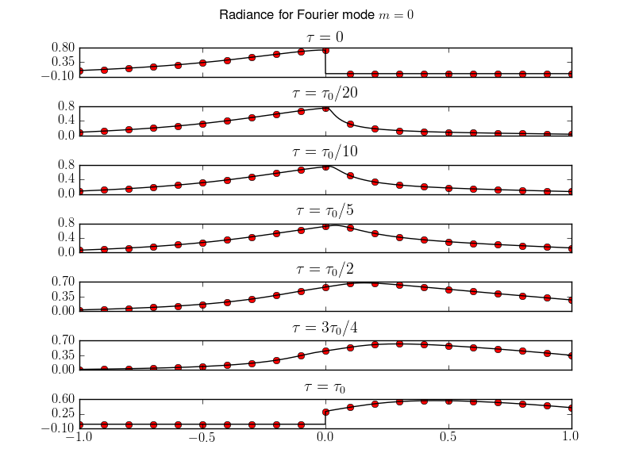
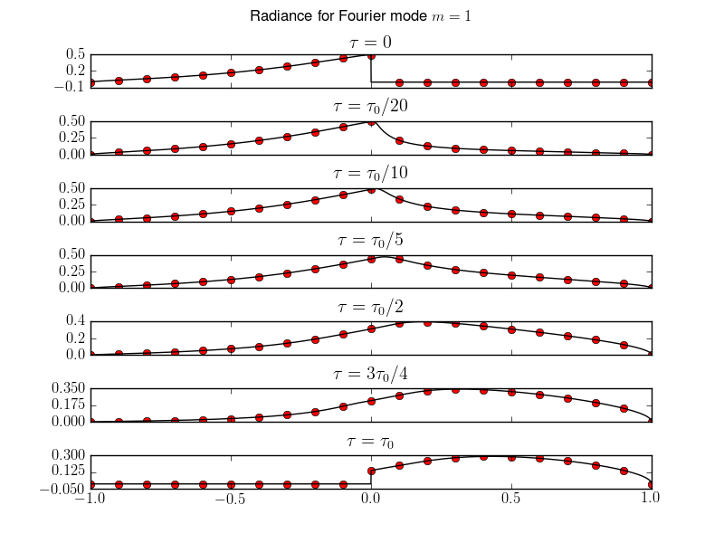
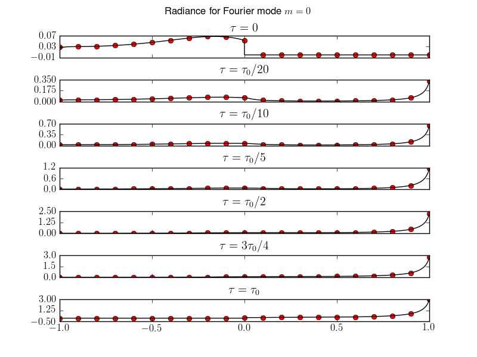
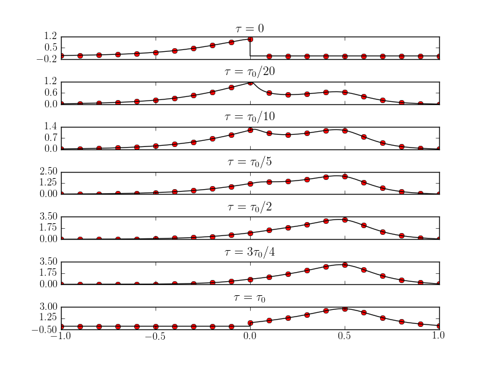

:Author: Ammar Hakim
:Date: September 15th 2011

JE3: Testing the radiation transport equation solver in a homogeneous slab
==========================================================================

.. contents::

Problem formulation and Fourier decomposition
---------------------------------------------

In this entry I test the solver for the radiation transport equation
(RTE) in a homogeneous slab. In addition to stand-alone use this
solver can be used as a building block for solving the RTE in an
inhomogeneous slab.

Although it might seem that the problem of the RTE in a slab is only
of academic interest, it finds applications in understanding the
radiation in the Earth's (and other planetary) atmosphere and
oceans. To an excellent approximation the atmosphere and the ocean can
be treated as horizontally uniform with optical properties varying
only with depth. See, for example, [Mobley1994]_ and
[Thomas1999]_. The key difficulty in solving the RTE for such
applications is higly anisotropic scattering with a strong forward
component. This requires the use of special algorithms to accurately
handle the angular dependence of the radiation field.

The systematic study of the RTE was initiated by Subrahmanyan
Chandrasekhar. He wrote a now-classic monograph [ChandraRT]_ (based on
a series of his papers) in which he developed very elegant analytical
methods to solve the RTE (including the effects of polarization) in
homogeneous slabs. Chandra's book is a tour de force in mathematical
physics and has inspired several algorithms now in common use.

The RTE is a linear integro-differential equation and is written as

.. math::

  \mu\frac{\partial L(\tau,\mu,\phi)}{\partial \tau} + L(\tau,\mu,\phi)
  =
  \frac{\varpi}{4\pi}
  \int_{-1}^1 \int_0^{2\pi}
  p(\cos\Theta) L(\tau,\mu,\phi) d\mu d\phi

where

- :math:`L(\tau,\mu,\phi)` is the radiance in units of Watt
  :math:`\mathrm{m}^{-2}` :math:`\mathrm{sr}^{-1}`
  :math:`\mathrm{nm}^{-1}`,

- :math:`0 < \tau < \tau_0` is the optical depth,

- :math:`\varpi` is the albedo of single scattering,

- :math:`\mu` is the cosine of the polar angle measured with the
  positive :math:`Z`-axis and :math:`\phi` is the azimuthal angle,

- :math:`p(\cos\Theta) = \sum_{l=0}^L\beta_lP_l(\cos\Theta)` is the
  phase function, where :math:`\Theta` is the scattering angle and
  :math:`\beta_0=1`.

The boundary conditions are a directed beam incident at :math:`\tau=0`
and a "black" boundary at :math:`\tau=\tau_0`

.. math::

  &L(0, \mu) = \pi F \delta(\mu-\mu_0) \delta(\phi-\phi_0) \\
  &L(\tau_0, -\mu) = 0

for :math:`\mu\in [0,1]`, and where

- :math:`\tau_0` is the optical depth of the slab,
- :math:`\mu_0` and :math:`\phi_0` are the cosine of the polar angle and azimuthal
  angle of incident beam,
- :math:`\mu_0\pi F` is the total downward irradiance incident on the slab.

The singular component of the radiance is removed using the decomposition

.. math::

  L(\tau,\mu,\phi) = L_*(\tau,\mu,\phi) 
  + \pi F \delta(\mu-\mu_0) \delta(\phi-\phi_0) e^{-\tau/\mu_0}

Where :math:`L_*(\tau,\mu,\phi)` is the diffuse (scattered at least
once) component of the radiance. Further, the addition theorem of
spherical harmonics is used to write

.. math::

  p(\cos\Theta) = \sum_{m=0}^L(2-\delta_{0,m})
  \sum_{l=m}^L\beta_l P_l^m(\mu) P_l^m(\mu')
  \cos[m(\phi'-\phi)]

where

.. math::

  P_l^m(\mu) = \left[
    \frac{(l-m)!}{(l+m)!}
  \right]^{1/2}
  (1-\mu^2)^{1/2}\frac{d^m}{d\mu^m}
  P_l(\mu)

are the normalized Legendre functions. The diffuse radiance is
expanded in a Fourier cosine series as

.. math::

  L_*(\tau,\mu,\phi) = \frac{1}{2} \sum_{m=0}^L
  (2-\delta_{0,m})L^m(\tau,\mu) \cos[m(\phi-\phi_0)]

Using these definitions the RTE becomes a set of equations for each
Fourier component :math:`L^m(\tau,\mu)`

.. math::

  \mu\frac{\partial L^m(\tau,\mu)}{\partial \tau} + L^m(\tau,\mu)
  = 
  \frac{\varpi}{2}
  \sum_{l=m}^L \beta_l P_l^m(\mu)
  \int_{-1}^1
  P_l^m(\mu') L(\tau,\mu') d\mu'
  + Q^m(\tau,\mu)

and 

.. math::

  Q^m(\tau,\mu) = \frac{\varpi F}{2}e^{-\tau/\mu_0}
  \sum_{l=m}^L \beta_l P^m_l(\mu_0) P_l^m(\mu)

The boundary conditions on each Fourier component become

.. math::

  &L^m(0, \mu) = 0 \\
  &L^m(\tau_0, -\mu) = 0.

The algorithm implemented in Lucee is described in full detail in a
paper by Siewert [Siewert2000]_.

Test Problems and Results
-------------------------

The test problems solved in this note are taken from [Garcia1985]_
that also lists very accurate benchmark results for these problem. For
each problem the results computed with Lucee are plotted against the
tabulated data in Garcia and Siewert.

Problem 1
+++++++++

Mie scattering with :math:`L=8` case for slab with :math:`\tau_0=1`,
:math:`\mu_0 = 0.5` and :math:`\varpi=0.95`.

Lucee results are compared to Garcia and Siewert results for Fourier
modes :math:`m=0` and :math:`m=1`.

  Comparison of :math:`m=0` Lucee solutions (black) [:doc:`s32
  <../../sims/s32/s32-rte-slab>`] with GS results (red dots) for
  various optical depths.

  Comparison of :math:`m=1` Lucee solutions (black) [:doc:`s32
  <../../sims/s32/s32-rte-slab>`] with GS results (red dots) for
  various optical depths.

Problem 2
+++++++++

Haze-L phase-function case with :math:`L=82` for slab with
:math:`\tau_0=1`, :math:`\mu_0 = 1.0` and :math:`\varpi=0.9`. The
expansion coefficients of the phase function are available
:download:`here <../../sims/s33/hazel>`.

  Comparison of Lucee solutions (black) [:doc:`s33
  <../../sims/s33/s33-rte-slab>`] with GS results (red dots) for
  various optical depths.

Problem 3
+++++++++

Same as Problem 2 except :math:`\mu_0=0.5`. All 84 Fourier modes are
used to compute the azimuthal dependence of the radiance.

  Comparison of Lucee solutions (black) [:doc:`s34
  <../../sims/s34/s34-rte-slab>`] with GS results (red dots) for
  various optical depths and for :math:`\phi-\phi_0 = 0`.

.. figure:: s34-rte-slab-gs-radiances-phipi2.csv.png
  :width: 100%
  :align: center

  Comparison of Lucee solutions (black) [:doc:`s34
  <../../sims/s34/s34-rte-slab>`] with GS results (red dots) for
  various optical depths and for :math:`\phi-\phi_0 = \pi/2`.

References
----------

.. [Mobley1994] C.D. Mobley, *Light and Water. Radiative Transfer in
   Natural Waters*, Academic, New York, 2004.

.. [Thomas1999] G.E. Thomas and K. Stamnes, *Radiative Transfer in the
   Atmosphere and Ocean*, Cambridge University Press, Cambridge UK,
   1999.

.. [ChandraRT] S. Chandrasekhar, *Radiative Transfer*, Dover
   Publications, 1960.

.. [Siewert2000] C.E. Siewert, "A concise and accurate solution to
   Chandrasekhar's basic problem in radiative transfer", *Journal of
   Quantitative Spectroscopy & Radiative Transfer*, **64**,
   Pg. 109-130, 2000. `pdf
   <http://www4.ncsu.edu/~ces/pdfversions/217.pdf>`_.

.. [Garcia1985] R.D.M. Garcia and C.E. Siewert, "Benchmark Results in
   Radiative Transfer", *Transport Theory and Statistical Physics*,
   **14**, No. 4 Pg. 437-483, 1985. `pdf
   <http://www4.ncsu.edu/~ces/pdfversions/169.pdf>`_