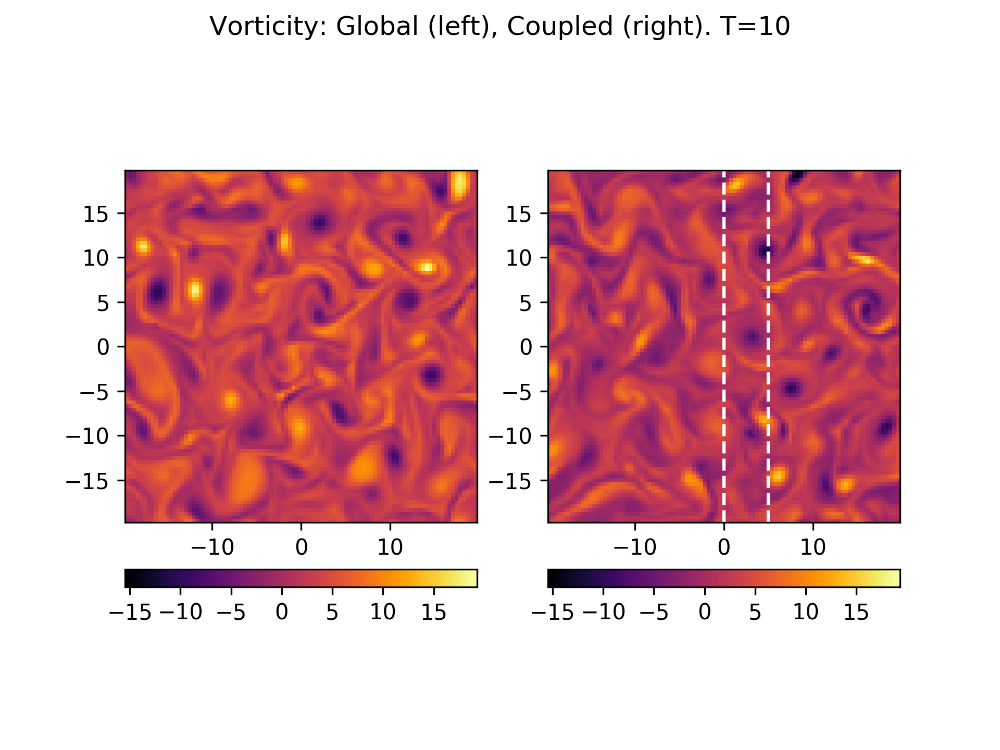

:Author: Ammar Hakim
:Date: 16th August 2017
:Completed: 
:Last Updated:

JE30: Solving the Hasegawa-Wakatani equations on overlapping domains
====================================================================

.. note::

  This note is written in conjunction with `Lee Ricketson
  <http://cims.nyu.edu/~lfr224/>`_ of LLNL, and is part of the fusion
  exascale effort to produce a whole device gyrokinetic simulation of
  tokamak plasmas.

.. contents::

Introduction
------------

Plasma dynamics occurs on a vast range of spatial and temporal
scales. Often, specialized tools are developed to study one aspect of
plasma physics, treating other aspects usings simplified models or
boundary conditions. One way to reuse existing tools to simulate more
complete physics is to couple solvers (codes) together, each solver
working on a different region, the coupling between them provided by
boundary or overlap conditions. In this note I test a particular
coupling scheme on the Hasegawa-Wakatani (H-W) equations. See
:doc:`JE17 <../je17/je17-hasegawa-wakatani>` for details on the
solution method for the H-W equations.

The Hasegawa-Wakatani (HW) system is a coupled set of equations for
the plasma density and electrostatic potential that describe resistive
drift wave turbulence. These can be written as

.. math::

  \frac{\partial \zeta}{\partial t} + \{\phi,\zeta \} &= \alpha(\phi-n)
  - \mu \nabla^4\zeta
  \\
  \frac{\partial n}{\partial t} + \{\phi,n \} &= \alpha(\phi-n)
  - \kappa \frac{\partial \phi}{\partial y}
  - \mu \nabla^4 n

where :math:`\zeta` is the vorticity, :math:`\phi` the electrostatic
potential, and :math:`n` the perturbed number density. Also,
:math:`\kappa = -\partial/\partial x \ln{n_0}` is a constant density
gradient scale-length, :math:`\alpha` is the adiabaticity operator and
:math:`\mu` is a hyper-diffusion coefficient. Also, :math:`\{a,b\}` is
the standard canonical Poisson bracket operator. The electrostatic
potential itself is determined by solving a Poisson equation

.. math::

  \nabla_{\perp}^2\phi = \zeta.

In these equations, :math:`\alpha` is a constant, making the problem
2D. The goal of this note is to solve the H-W equations on two
overlapping domains and compare the results with a global, single
domain result. This will allow studying stability and effectiveness of
proposed couplig schemes, giving guidance on how to proceed with the
more complex case of coupling the two gyrokinetic codes together.

Coupling Scheme
---------------

There are several possible ways in which simulations running on two
different (but partially overlapping) domains can be coupled. In this
note I use the following coupling scheme:

- The density and vorticity equations are solved on separate but
  overlapping domains.

- The potential equation is solved on a single, global domain that is
  the union of the two domains on which the density and vorticity are
  evolved.

Obviously, one needs to somehow couple the two domains to simulate the
physics consistently. Call the left domain :math:`D_L`, the right
domain :math:`D_R` and the global domain :math:`D_G = D_L \cup D_R`,
and the overlapping region :math:`D_O = D_L \cap D_R`. Then, the
coupling algorithm has the following steps: In *each* RK stage do

- Evolve :math:`\zeta` and :math:`n` on :math:`D_L` and :math:`D_R`
  using local potentials. For this step, the ghost cells of each
  domain are filled with the appropriate interior values from the
  other domain.

- From the updated vorticity compute a global voriticity that takes
  the left/right domain values in the non-overlapping region, and
  takes average values in the overlapping region.

- Use this global vorticity to solve the Poisson equation to determine
  potential on :math:`D_G`.

- "Split" this potential by copying data from the global field to
  local fields stored on each sub-domain.

For completeness: I use a piecewise quadratic Serendipity basis
discontinous Galerkin scheme to evolve the vorticity and
number-density, and a :math:`C^0` finite-element method to update the
potential. For time-stepping I use a strong-stability preserving third
order Runge-Kutta (SSP-RK3) scheme. The coupling is performed after
each RK stage. Perhaps another option would be to couple only after
each *time-step* but this seems like a reasonable choice for now.

The solution is assumed to be doubly periodic. Note that this means
that the left/right domains couple at *two* boundaries: the interior
overlapping boundary and the shared boundary in the periodic
direction. The overlap conditions and overlap averaging is performed
by different updaters. This allows testing various sequence of steps
directly in the Lua script by calling these updaters in different
orders.
  
Results: Noise-free coupling scheme
-----------------------------------

In this first set of tests, results from a coupled simulation is
compared to the single domain results. To ensure that the only errors
are due to coupling, I force both the simulations to use the same
time-steps. The global domain uses a :math:`32\times 32` grid to
discretize :math:`D_G = [40\times 40]` box. The left domain uses
:math:`20\times 32` grid to discretize a :math:`D_L = [25\times 40]`
box, and the left domain uses :math:`16\times 32` grid to discretize a
:math:`D_L = [20\times 40]` box. Note that the two domains overlap by
4 cells. A value of :math:`\alpha = 0.3` is used for the adiabaticity
coefficient. (Recall that :math:`\alpha = 0` is incompressible Euler
limit, and that :math:`\alpha \rightarrow \infty` is the Hasegawa-Mima
limit).

The coupling scheme in the case there is no interface noise (to mimic
coupling errors) should give exactly the same results for the single
domain and the coupled simulations. However, even small numerical
roundoff errors in the sequence of steps (i.e. in finite precision,
for example, operators that otherwise commute, don't) can eventually
add up, leading to a different turbulent realization. Note that for a
turbulent simulation this is to be expected. What we want is to
recover the *statistical behaviour*, even though the exact
realizations of the turbulent flow field may be different.

Early in time, drift wave turbulence is developing the global and
coupled simulations produce identical results. See plot of vorticity
below:

  Vorticity at :math:`t=5` from global (left) and coupled (right)
  simulations. White vertical lines represent locations at which
  coupling boundary conditions are applied, and the region between
  them is the overlap region. At this point, the global and coupled
  simulations give identical results.

However, late in time when the system has become turbulent the
solutions look visually different. See below:

  Vorticity at :math:`t=10` from global (left) and coupled (right)
  simulations. White vertical lines represent locations at which
  coupling boundary conditions are applied, and the region between
  them is the overlap region. At this point, the global and coupled
  simulations show *different* realizations of the flow, even though
  it appears that the two simulations have the same statistics.

Note that even though the results look different, it is hard to tell
if this is really a problem. For turbulent flows, it is likely that
any errors (even machine-precision errors) will eventually build up
enough to lead to a different realization of the flow. The question we
must ask: **what are metrics for comparing results of turbulent
flows?** Perhaps one should look at time-average fluxes or tubulent
spectra etc. 

Results: 10% noise at coupling boundaries
-----------------------------------------

In this set of calculations I add 10% random noise to the overlap
condition: I pick a random number and use that to perturb the ghost
cells values by 10%. This mimics (perhaps not very well) particle
noise from a PIC solver. Note that the noise is *grid-noise*, i.e. has
a spectrum peaked at high-k values.

Due to the coupling noise in this case, even early in time the results
between global and coupled simulations are different. See plot of
vorticity below:

  Vorticity at :math:`t=5` from global (left) and coupled (right)
  simulations. White vertical lines represent locations at which
  coupling boundary conditions are applied, and the region between
  them is the overlap region. Even though early in time, the random
  perturbations lead to different realizations of the flow.

A lineout of the vorticity across the domain at :math:`Y=0.0` shows
the differences in the solution more clearly:

.. figure:: c3-coupled-chi-1d-cmp-t5.png
  :width: 100%
  :align: center

  Lineout of vorticity at :math:`t=10` from global (magenta) and
  coupled (black) simulations. Blue vertical lines represent locations
  at which coupling boundary conditions are applied, and the region
  between them is the overlap region. The global and coupled
  simulations show *different* realizations of the flow.
  perturbations lead to different realizations of the flow.

Late in time when the system has become turbulent the solutions look
visually different, but seem to be statistically similar. See below:

	  
  Vorticity at :math:`t=5` from global (left) and coupled (right)
  simulations. White vertical lines represent locations at which
  coupling boundary conditions are applied, and the region between
  them is the overlap region. Even though early in time, the random
  perturbations lead to different realizations of the flow.

Conclusions (provisional)
-------------------------

It seems that the coupling scheme is very robust, that is, even though
the turbulent flow realization are visually different, the scheme does
not blow up or go unstable in any other way. However, we should come
up with some metrics to measure errors from coupling when the flow
itself is turbulent. This will be case in the case of the gyrokinetic
coupling also as the system is inherently turbulent.

Solving the potential equation globally may not be the best way to
move formward. Note that as the potential evolves in configuration
space (and not phase-space) it is very cheap to update (compared to
updating the distribution function). However, the software mechanisms
to move number density and currents (and potential) between two codes
onto/from a global mesh may be complex. Hence, an alternate approach
might be to also solve the potential equations on local domains. I
have not implemented this (yet) but will do so soon.

