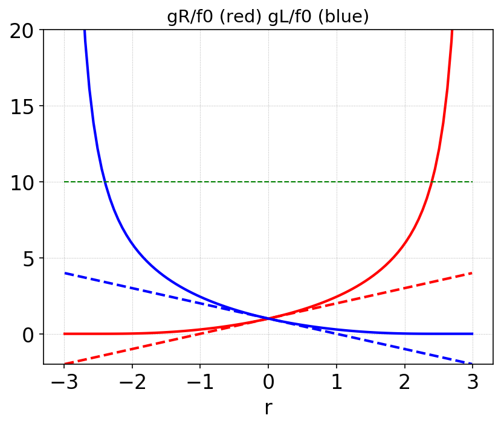

:Author: Ammar Hakim
:Date: 11th September 2017
:Completed: 
:Last Updated:

JE31: Enhancers or anti-limiters for robust evolution of distribution functions
===============================================================================

.. note::

  This note is written in conjunction with `Greg Hammett
  <http://w3.pppl.gov/~hammett/>`_ of PPPL.

.. contents::

Introduction
------------

The distribution function of particles is a non-negative scalar
function. That is :math:`f(\mathbf{x},\mathbf{v},t)\ge 0`. However,
there is no guarantee that a numerical scheme will preserve this
property. In the discontinuous Galerkin (DG) scheme the distribution
function in each cell is expanded in polynomial basis
functions. Standard DG scheme does not guarantee that the value of the
distribution function inside all cells remains positive. Even the
positivity of the cell average is not guaranteed (for higher than
piecewise constant basis functions) unless significant care is
taken.

Standard positivity limiting, for example, the Zhang-Shu algorithm
described in [Zhang2011]_, can't be used for evolution of kinetic
equations, when applied as a post-processing step. The reason for this
is that the algorithms that change the moments of the distribution
function (while maintaining cell averages) will change the particle
energy. (The energy conservation in kinetic system is indirect, unlike
fluid systems in which one evolves an explicit energy
equation). Hence, use of such "sub-diffusion" based positivity schemes
should be minimized or avoided altogether, if possible.

In the original Zhang-Shu algorithm, in which sub-cell diffusion is
added in the spatial operator only, unless something is done to bound
slopes (like monotonicity limiters) the slopes will grow in an
unbounded manner. Hence, the Zhang-Shu algorithm needs an additional
monotonicity or sub-cell diffusion post-processing step, again
changing the particle energy.

In this note we show how one can obtain a positivity preserving DG
scheme (defined precisely below), significantly improving robustness
of algorithms for gyrokinetic and fully kinetic DG solvers. Although
the use of anti-limiters does not completely eliminate the need to
apply additional sub-cell diffusion, it significantly reduces the need
for such additional corrections, dramatically improving the energy
conservation property of the scheme.

(As additional diffusion can be applied to volume integrals also, in
which case it may be possible to *completely eliminate* the need to
apply sub-cell diffusion).

Exponential reconstruction
--------------------------

The DG scheme, in a sense, does not tell us the solution, but only the
*moments* of the solution in each cell. However, we know that an
infinite number of functions can be constructed from given set of
moments. For problems in plasma physics we know that locally, the
solution should be well approximated by a exponential function, which,
by definition, is positive. Hence, one can take the moments (expansion
coefficients) from a DG scheme and construct a positive function
(exponential) with the same moments, and treat that as the
solution. This can be thought of as a *definition* of a positivity
preserving scheme: i.e. *if a function that is positive everywhere in
the cell can be constructed, then the scheme is called positivity
preserving*. Note that we do not actually need to construct the
positive function, but simply show that some such function exists.

Then, the question becomes: given a set of moments, is it always
possible to reconstruct an exponential? Or, are there some bounds on
the moments that permit the construction of an exponential?

Consider a distribution function :math:`f(x) = f_0 + f_1 x`, for
:math:`x\in[-1,1]`. Now, consider finding a new function :math:`g(x) =
\exp(g_0 + g_1 x)` such that the moments match. We will write this as

.. math::

   f(x) \doteq g(x)

(Note this is not strict equality, only equality in the :math:`L_2`
sense, that the projection of both sides on a set of basis functions
are the same). Taking moments with the definition :math:`\langle \cdot
\rangle\equiv \int_{-1}^1 (\cdot)\thinspace dx`, we get

.. math::
   
  2 f_0 &= \frac{1}{g_1} (g_R - g_L) \\
  \frac{2}{3} f_1 &= \frac{1}{g_1^2} \left[(g_1-1) g_R + (g_1+1) g_L \right]

where :math:`g_R = e^{g_0+g_1}` and :math:`g_L = e^{g_0-g_1}`. This is
a coupled set of nonlinear equations for :math:`g_1` and :math:`g_2`
and can be solved with the following Python code

.. code-block:: python

  from numpy import *
  import scipy.optimize

  def func(an, f0, f1):
      a0 = an[0]; a1 = an[1]
      rhs0 = (exp(a1+a0) - exp(a0-a1))/a1
      rhs1 = ((a1-1)*exp(a0+a1) + (a1+1)*exp(a0-a1))/a1**2

      return rhs0-2*f0, rhs1-2.0/3.0*f1

  # compute g0 and g1 for f0=1, f1=1.0 with initial guess 1.0, 0.01
  aout = scipy.optimize.fsolve(func, [1.0, 0.01], args=(1.0, 1.0))
  g0 = aout[0] # -0.18554037586019248
  g1 = aout[1] # 1.0745628995369829

To gain some insight use the first equation to express :math:`g_1` and
substitute this in the second equation to solve for :math:`g_R`, for
example, to get

.. math::
  g_R = \frac{6f_0^2 - (3 f_0+f_1) g_L}{3 f_0 - f_1}.

This shows that as :math:`f_1 \rightarrow 3 f_0`, :math:`g_R
\rightarrow \infty`. Similarly, we can show that as :math:`f_1
\rightarrow -3 f_0`, :math:`g_L \rightarrow \infty`, hence showing
that we must have the bound

.. math::

   |f_1| \le 3 f_0.

Defining :math:`r \equiv f_1/f_0` we see that for a exponential
reconstruction to exist, we must have :math:`|r| \le 3`. Hence, in 1D
for piecewise linear basis functions, we say that the scheme is
positivity preserving if :math:`f_0>0` and :math:`|f_1|/f_0 \le 3`.

The figure
below shows :math:`g_L` and :math:`g_R` as a function of :math:`r`.

  Exact nonlinear fits of :math:`g_R/f_0` (solid red), :math:`g_L/f_0`
  (solid blue) as a function of :math:`r=f_1/f_0`. Also shown are the
  cell edge values computed from :math:`f_0(1 \pm r)` (dashed
  red/blue). The exponential fit, even though has the same moments as
  the linear function, always gives larger edge values than those
  computed from the linear function. The green dashed line is a
  "out-flow flux capping" limit, explained further below.

Enhancers or anti-limiters
--------------------------

Consider the the advection equation in 1D

.. math::
   
  \frac{\partial f}{\partial t} + u\frac{\partial f}{\partial x} = 0

where :math:`u>0`. A DG scheme is derived here in the standard way. Let :math:`\varphi` be a
test function in some function space. Let :math:`I_i\equiv
[x_{j+1/2},x_{j-1/2}]` be a cell in the grid, and let :math:`x_j
\equiv(x_{j+1/2}+x_{j-1/2})/2`. Then, multiplying the advection
equation by :math:`\varphi` and integrating by parts one gets the
*discrete weak-form*

.. math::

  \int_{I_j} \varphi\frac{\partial f}{\partial t} dx
  + 
  \varphi(x_{j+1/2}^-)\hat{F}_{j+1/2} -
  \varphi(x_{j-1/2}^+)\hat{F}_{j-1/2}
  - \int_{I_j} \frac{\partial \varphi}{\partial x} u f dx = 0,

where now :math:`f(x,t)` lies in the discrete function space,
:math:`\hat{F}_{j\pm1/2}` are numerical fluxes at cell interfaces and
the :math:`\varphi(x_{j\pm1/2}^\mp)` indicate evaluation of the test
functions just inside the cell :math:`I_{j}`. The numerical fluxes are
computed using simple upwinding as

.. math::
  \hat{F}_{j+1/2} = u f_{j+1/2}^-, \qquad \hat{F}_{j-1/2} = u f_{j-1/2}^-,

where :math:`f_{j\pm1/2}^{\mp}` are the evaluation of the discrete
distribution function just inside the cell :math:`I_j`.

For a piecewise linear DG scheme :math:`\varphi \in \{1,
2(x-x_j)/\Delta x\}` is selected, and the solution is expanded in each
cell :math:`f_j(x,t) = f_{j,0} + 2f_{j,1}(x-x_j)/\Delta x`. The update
formula for piecewise linear case can now be derived by putting each
of the :math:`\varphi` in turn to get

.. math::

   f^{n+1}_{j,0} &=
  f_{j,0}^n
  - \sigma
      \left(\hat{f}_{j+1/2}-\hat{f}_{j-1/2} \right)
  \label{eq:p1-f0} \\
  f^{n+1}_{j,1} &=
  f_{j,1}^n
  - 3\sigma
  \left(
    \hat{f}_{j+1/2}+\hat{f}_{j-1/2}
  \right)
  + 6\sigma f_{j,0}

where :math:`\sigma \equiv u\Delta t/\Delta x`.
    
In a standard DG scheme we would compute the edge values needed in the
numerical flux with :math:`\hat{f}_{j+1/2}=f_{j,0}+f_{j,1}` and
:math:`\hat{f}_{j-1/2}=f_{j-1,0}+f_{j-1,1}`. Instead, in our
**enhancer or anti-limiter based scheme** we compute the edge values
as

.. math::

   \hat{f}_{j-1/2} = g_L , \qquad \hat{f}_{j+1/2} = g_R

where :math:`g_L` and :math:`g_R` are the edge values computed from an
exponential reconstruction (or an approximation to it). (**Need to
explain why enhancement is better than standard DG scheme**.)

The complete 1D scheme is hence:

- At each step, given :math:`f_0` and :math:`f_1` compute estimates of
  :math:`g_L` and :math:`g_R`

- Cap the outgoing flux such that in a step or RK stage the cell
  average does not go negative (i.e. ensure that we don't remove so
  many particles from a cell in a single step such that the
  distribution function goes negative). The first of the update
  equations shows that this means that we must cap :math:`g_R \le
  f^n_0/\sigma`. This is the green dashed line in the above plot.

**Note that this scheme guarantees that the cell average will remain
positive, however, does not guarantee that the cell slope bound of**
:math:`|f_1|/f_0 \le 3` **will be maintained.**

Extension to multiple dimensions
--------------------------------

In higher dimensions we can take one of two approaches to construct an
anti-limiter. Either we can attempt to reconstruct a multi-dimensional
exponential function from the expansion coefficients, or use a
dimension-by-dimension reconstruction, reusing the 1D reconstruction
scheme multiple times. We use the latter appoarch in the following
tests.

(**Need to explain the 2D algorithm in detail, and why it seems to
work so well**)

Sub-cell diffusion
------------------

Even with anti-limiters the scheme does not guarantee that the slope
bounds will be preserved, even in 1D. In 2 or higher dimensions
determining slope bounds is a very hard problem and hence, instead,
some other means are needed to ensure slope bounds are
maintained. (**Description of sub-cell diffusion scheme**)

Convergence tests in 2D
-----------------------

To check convergence of the scheme, I initialize a simulation with a
Gaussian initial condition

.. math::

   f(x,y) = e^{-50r^2}

where :math:`r^2 = (x-x_c)^2+(y-y_c)^2` and :math:`x_c, y_c` is the
domain center coordinates. Simulations are performed with polyOrder 1
basis functions on :math:`1\times 1` domain with a sequence of grids
with :math:`8\times 8`, :math:`16\times 16` and :math:`32\times 32`
resolution. The time-step for each simulation is held fixed. The
Gaussian propagates diagonally and, due to periodic boundary
conditions, returns back to the origin at the end of simulation.

To compute error I use two measures. First, the :math:`L_2` difference
between the initial and final distribution function:

.. math::

   E = \sqrt{\int |f(x,y,1) - f(x,y,0)|^2 dx\thinspace dy}

and the second the :math:`L_2` difference between the *interpolation*
of the initial and final distribution function. Note that in DG scheme
will demonstrate super-convergence in the first norm. The second norm
is used to simply illustrate naive projections/interpolations are not
a good way to extra information available in a DG expansion.

.. list-table:: Convergence of naive DG (no anti-limiters)
  :header-rows: 1
  :widths: 20,40,20,40,20

  * - Cell size
    - :math:`L_2` Error
    - :math:`L_2` Order
    - Projected Error
    - Projected Order      
  * - :math:`1/8`
    - :math:`2.6113 \times 10^{-3}`
    -
    - :math:`1.37211 \times 10^{-2}`
    -
  * - :math:`1/16`
    - :math:`3.7873\times 10^{-5}`
    - 6.1
    - :math:`1.97533 \times 10^{-3}`
    - 2.8
  * - :math:`1/32`
    - :math:`5.0805 \times 10^{-7}`
    - 6.2
    - :math:`1.70844 \times 10^{-4}`
    - 3.5

.. list-table:: Convergence of DG with anti-limiters
  :header-rows: 1
  :widths: 20,40,20,40,20

  * - Cell size
    - :math:`L_2` Error
    - :math:`L_2` Order
    - Projected Error
    - Projected Order      
  * - :math:`1/8`
    - :math:`1.94458 \times 10^{-3}`
    -
    - :math:`9.73753 \times 10^{-3}`
    -
  * - :math:`1/16`
    - :math:`2.47974\times 10^{-5}`
    - 6.3
    - :math:`9.51244 \times 10^{-4}`
    - 3.4
  * - :math:`1/32`
    - :math:`1.57627 \times 10^{-7}`
    - 7.3
    - :math:`8.96466 \times 10^{-5}`
    - 3.4

Two observations:

- The anti-limiters do not change the order of conservation
- The anti-limiters based DG scheme has a smaller absolute error than
  standard DG. This is because the anti-limiters act add
  "anti-diffusion", reducing the diffusion in standard DG in capturing
  the peak of the Gaussian.

      
Cylinder advection test
-----------------------

XYZ

Square-top-hat advection test
-----------------------------

XYZ

Conclusions
-----------

XYZ

References
----------

.. [Zhang2011] X. Zhang and C.W Shu. (2011). "Maximum-principle-satisfying and
    positivity-preserving high-order schemes for conservation laws:
    survey and new developments", *Proceedings of the Royal Society a:
    Mathematical, Physical and Engineering Sciences*, **467**(2134),
    2752–2776. http://doi.org/10.1098/rspa.2011.0153
