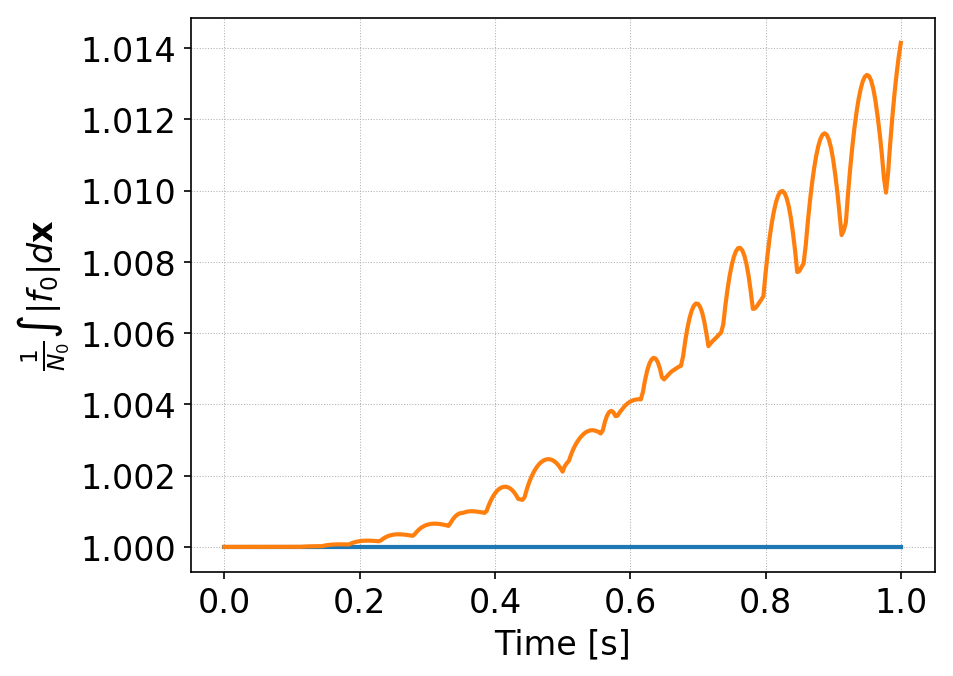
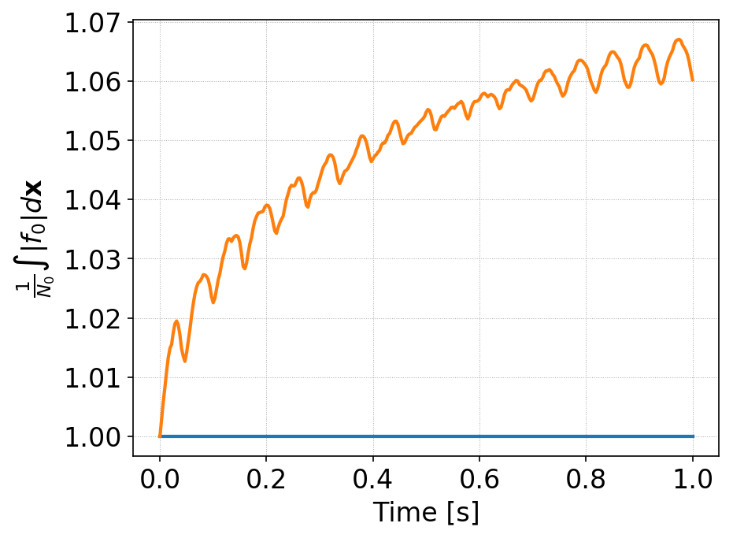
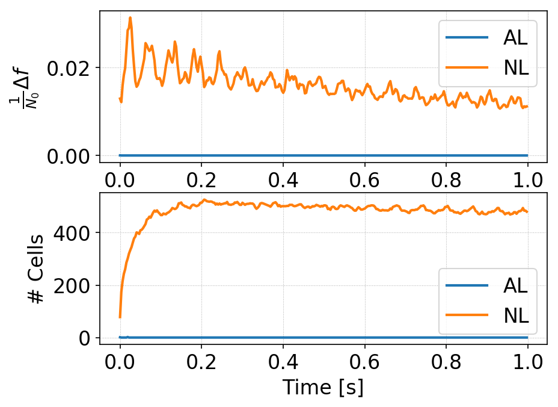
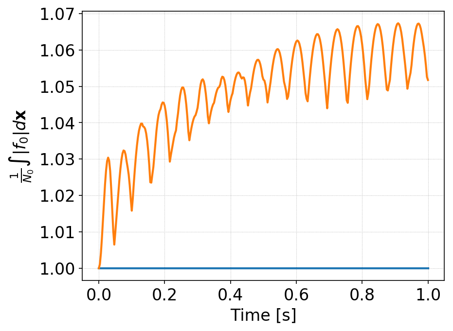
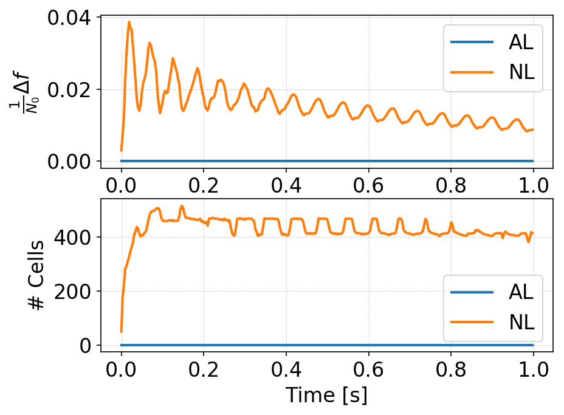

:Author: Ammar Hakim
:Date: 11th September 2017
:Completed: 12th September 2017
:Last Updated:

JE31: Enhancers or anti-limiters for robust evolution of distribution functions
===============================================================================

.. note::

  This note is written in conjunction with `Greg Hammett
  <http://w3.pppl.gov/~hammett/>`_ of PPPL.

.. contents::

Introduction
------------

The distribution function of particles is a non-negative scalar
function. That is :math:`f(\mathbf{x},\mathbf{v},t)\ge 0`. However,
there is no guarantee that a numerical scheme will preserve this
property. In the discontinuous Galerkin (DG) scheme the distribution
function in each cell is expanded in polynomial basis
functions. Standard DG scheme does not guarantee that the value of the
distribution function inside all cells remains positive. Even the
positivity of the cell average is not guaranteed (for higher than
piecewise constant basis functions) unless significant care is
taken.

Standard positivity limiting, for example, the Zhang-Shu algorithm
described in [Zhang2011]_, can't be used for evolution of kinetic
equations, when applied as a post-processing step. The reason for this
is that the algorithms that change the moments of the distribution
function (while maintaining cell averages) will change the particle
energy. (The energy conservation in kinetic system is indirect, unlike
fluid systems in which one evolves an explicit energy
equation). Hence, use of such "sub-diffusion" based positivity schemes
should be minimized or avoided altogether, if possible.

In the original Zhang-Shu algorithm, in which sub-cell diffusion is
added in the spatial operator only, unless something is done to bound
slopes (like monotonicity limiters) the slopes will grow in an
unbounded manner. Hence, the Zhang-Shu algorithm needs an additional
monotonicity or sub-cell diffusion post-processing step, again
changing the particle energy.

In this note we show how one can obtain a positivity preserving DG
scheme (defined precisely below), significantly improving robustness
of algorithms for gyrokinetics and fully kinetic DG solvers. Although
the use of anti-limiters does not completely eliminate the need to
apply additional sub-cell diffusion, it significantly reduces the need
for such additional corrections, dramatically improving the energy
conservation property of the scheme.

(As additional diffusion can be applied to volume integrals also, in
which case it may be possible to *completely eliminate* the need to
apply sub-cell diffusion. This diffusion does not change the energy in
gyrokinetic equations).

Exponential reconstruction
--------------------------

The DG scheme, in a sense, does not tell us the solution, but only the
*moments* of the solution in each cell. However, we know that an
infinite number of functions can be constructed from given set of
moments. For problems in plasma physics we know that locally, the
solution should be well approximated by a exponential function, which,
by definition, is positive. Hence, one can take the moments (expansion
coefficients) from a DG scheme and construct a positive function
(exponential) with the same moments, and treat that as the
solution. This can be thought of as a *definition* of a positivity
preserving scheme: i.e. *if one can construct a function that is
positive everywhere in the cell, then the scheme is called positivity
preserving*. Note that we do not actually need to construct the
positive function, but simply show that some such function exists.

Then, the question becomes: given a set of moments, is it always
possible to reconstruct an exponential? Or, are there some bounds on
the moments that permit the construction of an exponential?

Consider a distribution function :math:`f(x) = f_0 + f_1 x`, for
:math:`x\in[-1,1]`. Now, consider finding a new function :math:`g(x) =
\exp(g_0 + g_1 x)` such that the moments match. We will write this as

.. math::

   f(x) \doteq g(x)

(Note this is not strict equality, only equality in the :math:`L_2`
sense, that the projection of both sides on a set of basis functions
are the same). Taking moments with the definition :math:`\langle \cdot
\rangle\equiv \int_{-1}^1 (\cdot)\thinspace dx`, we get

.. math::
   
  2 f_0 &= \frac{1}{g_1} (g_R - g_L) \\
  \frac{2}{3} f_1 &= \frac{1}{g_1^2} \left[(g_1-1) g_R + (g_1+1) g_L \right]

where :math:`g_R = e^{g_0+g_1}` and :math:`g_L = e^{g_0-g_1}`. This is
a coupled set of nonlinear equations for :math:`g_1` and :math:`g_2`
and can be solved with the following Python code

.. code-block:: python

  from numpy import *
  import scipy.optimize

  def func(an, f0, f1):
      a0 = an[0]; a1 = an[1]
      rhs0 = (exp(a1+a0) - exp(a0-a1))/a1
      rhs1 = ((a1-1)*exp(a0+a1) + (a1+1)*exp(a0-a1))/a1**2

      return rhs0-2*f0, rhs1-2.0/3.0*f1

  # compute g0 and g1 for f0=1, f1=1.0 with initial guess 1.0, 0.01
  aout = scipy.optimize.fsolve(func, [1.0, 0.01], args=(1.0, 1.0))
  g0 = aout[0] # -0.18554037586019248
  g1 = aout[1] # 1.0745628995369829

To gain some insight use the first equation to express :math:`g_1` and
substitute this in the second equation to solve for :math:`g_R`, for
example, to get

.. math::
  g_R = \frac{6f_0^2 - (3 f_0+f_1) g_L}{3 f_0 - f_1}.

This shows that as :math:`f_1 \rightarrow 3 f_0`, :math:`g_R
\rightarrow \infty`. Similarly, we can show that as :math:`f_1
\rightarrow -3 f_0`, :math:`g_L \rightarrow \infty`, hence showing
that we must have the bound

.. math::

   |f_1| \le 3 f_0.

Defining :math:`r \equiv f_1/f_0` we see that for a exponential
reconstruction to exist, we must have :math:`|r| \le 3`. Hence, in 1D
for piecewise linear basis functions, we say that the scheme is
positivity preserving if :math:`f_0>0` and :math:`|f_1|/f_0 \le 3`.

The figure
below shows :math:`g_L` and :math:`g_R` as a function of :math:`r`.

  Exact nonlinear fits of :math:`g_R/f_0` (solid red), :math:`g_L/f_0`
  (solid blue) as a function of :math:`r=f_1/f_0`. Also shown are the
  cell edge values computed from :math:`f_0(1 \pm r)` (dashed
  red/blue). The exponential fit, even though has the same moments as
  the linear function, always gives larger edge values than those
  computed from the linear function. The green dashed line is a
  "out-flow flux capping" limit, explained further below.

Enhancers or anti-limiters
--------------------------

Consider the the advection equation in 1D

.. math::
   
  \frac{\partial f}{\partial t} + u\frac{\partial f}{\partial x} = 0

where :math:`u>0`. A DG scheme is derived here in the standard way. Let :math:`\varphi` be a
test function in some function space. Let :math:`I_i\equiv
[x_{j+1/2},x_{j-1/2}]` be a cell in the grid, and let :math:`x_j
\equiv(x_{j+1/2}+x_{j-1/2})/2`. Then, multiplying the advection
equation by :math:`\varphi` and integrating by parts one gets the
*discrete weak-form*

.. math::

  \int_{I_j} \varphi\frac{\partial f}{\partial t} dx
  + 
  \varphi(x_{j+1/2}^-)\hat{F}_{j+1/2} -
  \varphi(x_{j-1/2}^+)\hat{F}_{j-1/2}
  - \int_{I_j} \frac{\partial \varphi}{\partial x} u f dx = 0,

where now :math:`f(x,t)` lies in the discrete function space,
:math:`\hat{F}_{j\pm1/2}` are numerical fluxes at cell interfaces and
the :math:`\varphi(x_{j\pm1/2}^\mp)` indicate evaluation of the test
functions just inside the cell :math:`I_{j}`. The numerical fluxes are
computed using simple upwinding as

.. math::
  \hat{F}_{j+1/2} = u f_{j+1/2}^-, \qquad \hat{F}_{j-1/2} = u f_{j-1/2}^-,

where :math:`f_{j\pm1/2}^{\mp}` are the evaluation of the discrete
distribution function just inside the cell :math:`I_j`.

For a piecewise linear DG scheme :math:`\varphi \in \{1,
2(x-x_j)/\Delta x\}` is selected, and the solution is expanded in each
cell :math:`f_j(x,t) = f_{j,0} + 2f_{j,1}(x-x_j)/\Delta x`. The update
formula for piecewise linear case can now be derived by putting each
of the :math:`\varphi` in turn to get

.. math::

   f^{n+1}_{j,0} &=
  f_{j,0}^n
  - \sigma
      \left(\hat{f}_{j+1/2}-\hat{f}_{j-1/2} \right)
  \label{eq:p1-f0} \\
  f^{n+1}_{j,1} &=
  f_{j,1}^n
  - 3\sigma
  \left(
    \hat{f}_{j+1/2}+\hat{f}_{j-1/2}
  \right)
  + 6\sigma f_{j,0}

where :math:`\sigma \equiv u\Delta t/\Delta x`.
    
In a standard DG scheme we would compute the edge values needed in the
numerical flux with :math:`\hat{f}_{j+1/2}=f_{j,0}+f_{j,1}` and
:math:`\hat{f}_{j-1/2}=f_{j-1,0}+f_{j-1,1}`. Instead, in our
**enhancer or anti-limiter based scheme** we compute the edge values
as

.. math::

   \hat{f}_{j-1/2} = g_L , \qquad \hat{f}_{j+1/2} = g_R

where :math:`g_L` and :math:`g_R` are the edge values computed from an
exponential reconstruction (or an approximation to it). (**Need to
explain why enhancement is better than standard DG scheme**.)

The complete 1D scheme is hence:

- At each step, given :math:`f_0` and :math:`f_1` compute estimates of
  :math:`g_L` and :math:`g_R`

- Cap the outgoing flux such that in a step or RK stage the cell
  average does not go negative (i.e. ensure that we don't remove so
  many particles from a cell in a single step such that the
  distribution function goes negative). The first of the update
  equations shows that this means that we must cap :math:`g_R \le
  f^n_0/\sigma`. This is the green dashed line in the above plot.

**Note that this scheme guarantees that the cell average will remain
positive, however, does not guarantee that the cell slope bound of**
:math:`|f_1|/f_0 \le 3` **will be maintained.**

Extension to multiple dimensions
--------------------------------

In higher dimensions we can take one of two approaches to construct an
anti-limiter. Either we can attempt to reconstruct a multi-dimensional
exponential function from the expansion coefficients, or use a
dimension-by-dimension reconstruction, reusing the 1D reconstruction
scheme multiple times. We use the latter approach in the following
tests.

(**Need to explain the 2D algorithm in detail, and why it seems to
work so well**)

Sub-cell diffusion
------------------

Even with anti-limiters the scheme does not guarantee that the slope
bounds will be preserved, even in 1D. In 2 or higher dimensions
determining slope bounds is a very hard problem and hence, instead,
some other means are needed to ensure slope bounds are
maintained. (**Description of sub-cell diffusion scheme**)

Convergence tests in 2D
-----------------------

To check convergence of the scheme, I initialize a simulation with a
Gaussian initial condition

.. math::

   f(x,y) = e^{-50r^2}

where :math:`r^2 = (x-x_c)^2+(y-y_c)^2` and :math:`x_c, y_c` is the
domain center coordinates. Simulations are performed with polyOrder 1
basis functions on :math:`1\times 1` domain with a sequence of grids
with :math:`8\times 8`, :math:`16\times 16` and :math:`32\times 32`
resolution. The time-step for each simulation is held fixed. The
Gaussian propagates diagonally and, due to periodic boundary
conditions, returns back to the origin at the end of simulation.

To compute error we use the measure

.. math::

   E = \sqrt{\int |f(x,y,1) - f(x,y,0)|^2 dx\thinspace dy}

As seen below DG scheme demonstrates super-convergence in this
norm.

.. list-table:: Convergence of naive DG (no anti-limiters)
  :header-rows: 1
  :widths: 20,40,20

  * - Cell size
    - :math:`L_2` Error
    - :math:`L_2` Order
  * - :math:`1/8`
    - :math:`4.17808 \times 10^{-2}`
    -
  * - :math:`1/16`
    - :math:`1.21194\times 10^{-3}`
    - 5.1
  * - :math:`1/32`
    - :math:`3.25152 \times 10^{-5}`
    - 5.2

.. list-table:: Convergence of DG with anti-limiters
  :header-rows: 1
  :widths: 20,40,20

  * - Cell size
    - :math:`L_2` Error
    - :math:`L_2` Order
  * - :math:`1/8`
    - :math:`3.11133 \times 10^{-2}`
    -
  * - :math:`1/16`
    - :math:`7.93518\times 10^{-4}`
    - 5.3
  * - :math:`1/32`
    - :math:`1.00881 \times 10^{-5}`
    - 6.3

      
Two observations:

- The anti-limiters do not change the order of convergence
- The anti-limiters based DG scheme has a smaller absolute error than
  standard DG. This is because the anti-limiters act add
  "anti-diffusion", reducing the diffusion in standard DG in capturing
  the peak of the Gaussian.

A comparison of the solutions along :math:`x` at :math:`y=1/2` of two
schemes (naive DG and AL-DG) is shown below.

  Comparison of distribution function along :math:`y=1/2` between
  standard DG (orange line) and anti-limiter based DG (blue line). The
  initial condition is shown in black. Due to the anti-diffusive
  property of the AL-DG, the solution matches exact results more
  closely. The AL-DG scheme maintains positivity of cell averages as
  well as at control points. Small negative errors are seen in the
  standard DG scheme even for this smooth initial condition. See plot
  below.

To test if the schemes preserve positivity of cell averages, we compute

.. math::

   F = \frac{1}{N_0} \int | f_0 | dx\thinspace dy

where :math:`N_0` is the total number of particles in the domain at
:math:`t=0`. This should remain constant if the scheme conserves
positivity of cell averages. The figure below shows that even for this
smooth initial condition, the standard DG scheme creates small amount
of regions with negative cell averages.

  Time history of :math:`\int f_0 d\mathbf{x}` for standard DG
  (orange) and AL-DG (blue). The AL-DG scheme preserves positivity of
  the cell averages exactly. In addition, though not obvious from this
  plot, the solution is also positive at interior control nodes.
  
      
Cylinder advection test
-----------------------

In this test, we initialize the simulation with a cylindrical initial
condition, that is

.. math::

   f(x,y,0) &= 1 \qquad \sqrt{(x-x_c)^2+(y-y_c)^2} < 1/4 \\
            &= 10^{-5} \quad \textrm{otherwise}

A :math:`16\times 16` grid is used and the simulation is till the
cylinder, advecting diagonally. returns back to its initial position.

A line-out of the solutions along X is shown below.

  Comparison of distribution function along :math:`y=1/2` between
  standard DG (orange line) and anti-limiter based DG (blue line), for
  cylindrical initial condition. The initial condition is shown in
  black. The standard DG scheme shows severe positivity errors, while
  the AL-DG scheme maintains positivity of cell-averages exactly. Due
  to the anti-diffusive property of the AL-DG, the monotonicity of the
  solution is violated more than in the standard DG scheme.

The degree with which the schemes violate positivity of cell averages
is shown below:

  Time history of :math:`\int f_0 d\mathbf{x}` for standard DG
  (orange) and AL-DG (blue), for cylindrical initial condition. The
  AL-DG scheme preserves positivity of the cell averages exactly. Note
  that for this case the AL-DG scheme does not enforce positivity at
  interior control nodes.

For this initial condition even the AL-DG scheme does not maintain
positivity at interior control points. To check the impact of this, we
re-run both the standard DG and AL-DG schemes with sub-cell diffusion
applied as post-processing after each RK stage. To measure the amount
of change we compute the following metric

.. math::

   \Delta f = \frac{1}{N_0}\sqrt{\int (f^* - f)^2 dx\thinspace dy}

where :math:`f^*` is the sub-cell diffusion corrected distribution
function.

The time-history of total modifications of the distribution function
as well as the number of cells changed *per time-step* for the two
schemes are shown below. Note that the anti-diffusion is applied per
RK-stage.

  Cylindrical initial conditions. Time history of :math:`\Delta f`
  (top) for standard DG (orange) and AL-DG (blue) and of the total
  number of cells changed per-step (bottom) for standard DG (orange)
  and AL-DG (blue). The standard DG scheme needs constant correction
  to about 65% of the cells in each RK stage, while the AL-DG scheme
  needs far fewer corrections and only at the start of the
  simulation. Once the cylinder diffuses a little, the amount of
  correction in the AL-DG scheme drops to zero.

  
Square-top-hat advection test
-----------------------------

As a severe test of the algorithm we initialize the simulation with a
"square top-hat", i.e.

.. math::

   f(x,y,0) &= 1 \qquad |x-x_c| < 1/4\ \textrm{and}\ |y-y_c| < 1/4 \\
            &= 10^{-5} \quad \textrm{otherwise}

A :math:`16\times 16` grid is used and the simulation is till the
cylinder, advecting diagonally. returns back to its initial position.

The figure below shows the final solutions computed with standard DG
and AL-DG for this IC. The regions that are negative are masked out
and appear as white patches.

  Comparison of distribution function for square-top-hat initial
  conditions with standard DG (left) and AL-DG (right). Regions where
  the distribution function goes negative are masked out and appear as
  white patches. Note the huge regions in which the standard DG shows
  positivity violation. As is also seen below, at this time in the
  simulation the AL-DG has no regions where the distribution function
  is negative.

A line-out of the solutions along X is shown below.
  

  Comparison of distribution function along :math:`y=1/2` between
  standard DG (orange line) and anti-limiter based DG (blue line), for
  square-top-hat initial condition. The initial condition is shown in
  black. The standard DG scheme shows severe positivity errors, while
  the AL-DG scheme maintains positivity of cell-averages exactly. Due
  to the anti-diffusive property of the AL-DG, the monotonicity of the
  solution is violated more than in the standard DG scheme.

The degree with which the schemes violate positivity of cell averages
is shown below:

  Time history of :math:`\int f_0 d\mathbf{x}` for standard DG
  (orange) and AL-DG (blue), for square-top-hat initial condition. The
  AL-DG scheme preserves positivity of the cell averages exactly. Note
  that for this case the AL-DG scheme does not enforce positivity at
  interior control nodes.

For this initial condition even the AL-DG scheme does not maintain
positivity at interior control points. To check the impact of this, we
re-run both the standard DG and AL-DG schemes with sub-cell diffusion
applied as post-processing after each RK stage.

The time-history of total modifications of the distribution function
as well as the number of cells changed *per time-step* for the two
schemes are shown below. Note that the anti-diffusion is applied per
RK-stage.

  Square-top-hat initial conditions. Time history of :math:`\Delta f`
  (top) for standard DG (orange) and AL-DG (blue) and of the total
  number of cells changed per-step (bottom) for standard DG (orange)
  and AL-DG (blue). The standard DG scheme needs constant correction
  to about 65% of the cells in each RK stage, while the AL-DG scheme
  needs far fewer corrections and only at the start of the
  simulation. Once the cylinder diffuses a little, the amount of
  correction in the AL-DG scheme drops to zero.

Convergence of corrections with time-step
-----------------------------------------

The anti-limiter caps the extrapolated values to :math:`1/\sigma`,
where the CFL number :math:`\sigma` is proportional to :math:`\Delta
t`. Hence, reducing the time-step will reduce the amount of sub-cell
diffusion corrections that are needed as the extra enhancements with
maintain slope bounds better. To test this, we ran the square-top-hat
simulation with :math:`1/2` and :math:`1/4` of the time-step. The
ratio of the corrections, :math:`\Delta f`, to the smallest time-step
values are shown below. As is clear, the errors reduce linearly with
:math:`1/\Delta t`, consistent with the amount of enhancement added by
the anti-limiter.

  Ratio of sub-cell diffusion corrections, :math:`\Delta f` as a
  function of time. The amount of correction needed reduces as the
  time-step is reduced, consistent with the property that the amount
  of enhancement allowed increases as the time-step is reduced.
  
Conclusions
-----------

We have presented an anti-limiter scheme based discontinuous Galerkin
scheme to handle the problem of positivity in kinetic equations. These
AL-DG will conserve energy much better, perhaps even exactly (in the
continuous time-limit) with additional fixes to the volume terms.

References
----------

.. [Zhang2011] X. Zhang and C.W
   Shu. (2011). "Maximum-principle-satisfying and
   positivity-preserving high-order schemes for conservation laws:
   survey and new developments", *Proceedings of the Royal Society a:
   Mathematical, Physical and Engineering Sciences*, **467** (2134),
   2752–2776. http://doi.org/10.1098/rspa.2011.0153
