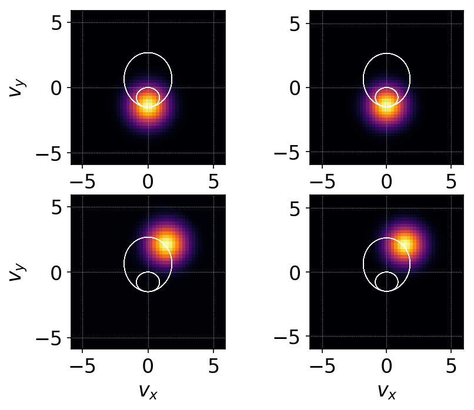
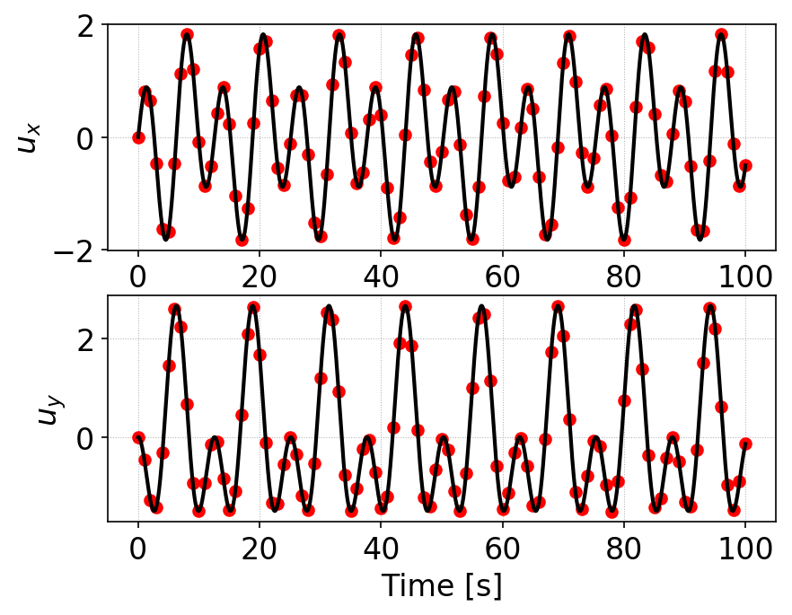
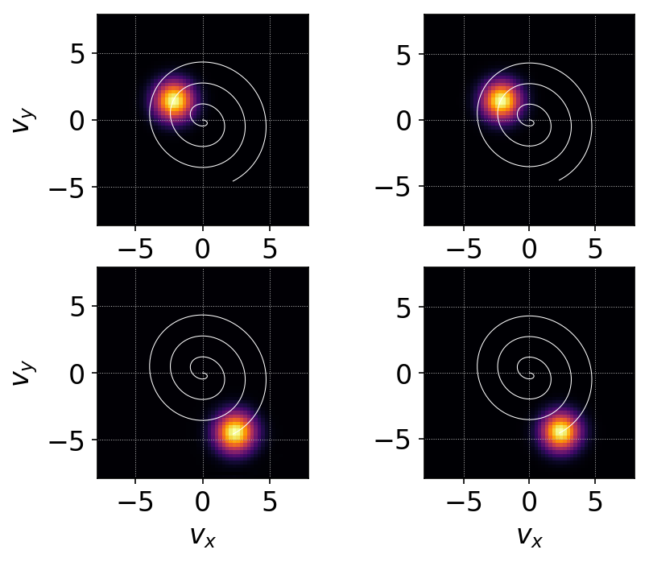
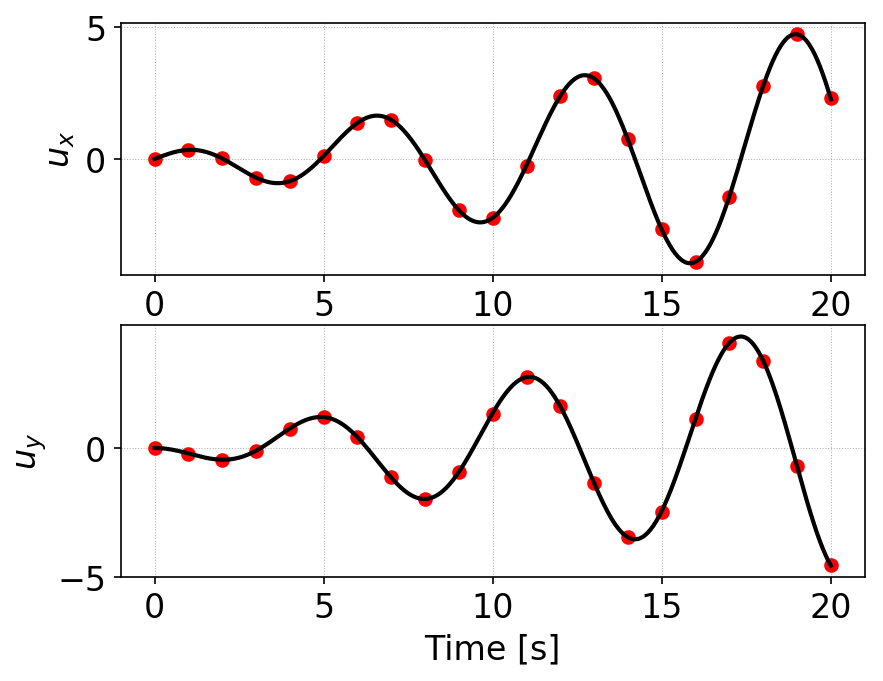

:Author: Ammar Hakim
:Date: 18th Feb 2018
:Completed: 
:Last Updated:

JE32: Test particles in an electromagnetic field: stochastic heating
====================================================================

.. contents::

In this note I study the motion of particles in a specified
electromagnetic field. For certain time-dependent fields, the motion
of particles can become stochastic, leading to heating of the
particles. The question one can ask: what is the connection between
stochastic motion and structure of distribution functions? This is not
a trivial problem: even though the Vlasov equation contains all the
information of single-particle motion, the connection between the two
is not obvious in general situations. In this note some tests are
performed for some simple situations to ensure that the basic
algorithms in Gkeyll are capable of handling these types of problems.

Note that the fields are not self-consistently coupled to the
particles. That is, even though the particles move in the specified
fields, the currents do not modify the fields. Hence, these problems
can be considered to belong to the class of "test particle"
simulations.

Uniform time-dependent electric field
--------------------------------------

In the first test the magnetic field is constant and pointing in the
z-direction, :math:`\mathbf{B} = B_0 \mathbf{e}_z`. The electric field
is time-dependent (but spatially uniform) and is given by

.. math::

   \mathbf{E}(t) = E_0 \cos(\omega t) \mathbf{e}_x.

I only consider the motion of ions in this field. This problem is
essentially a forced-harmonic oscillator. The particle velocities are
described by two coupled ODEs:

.. math::

   \dot{v}_x &= E_0 \cos(\omega t) + v_y \\
   \dot{v}_y &= -v_x

where I am assuming :math:`q = m = B_0 = 1`. (This means that
:math:`\omega` is normalized to ion-cyclotron frequency and time is
measured in its inverse). We can solve this sytem rather easily
(convert to uncoupled second order ODEs and find particular solution
for each) to get

.. math::

   v_x(t) &= w_x(t) + v_x(0)\cos(t) + v_y(0)\sin(t) \\
   v_y(t) &= w_y(t) - v_x(0)\sin(t) + v_y(0)\cos(t)

where :math:`w_{x,y}(t)` are given by, for non-resonant case
:math:`\omega \neq 1` as

.. math::

   w_x(t) &= \frac{E_0}{1-\omega^2}\left(\sin(t)-\omega\sin(\omega
   t)\right) \\
   w_y(t) &=
   \frac{E_0}{1-\omega^2}\left(\cos(t)-\cos(\omega t)\right)

For the resonant case, :math:`\omega =1`, these are given by

.. math::

   w_x(t) &= \frac{E_0}{2}\left(t\cos(t)+\sin(t)\right) \\
   w_y(t) &= -\frac{E_0}{2} t\sin(t)

As the distribution function remains constant along characteristics,
if initial distribution of the particles is given by
:math:`f_0(v_x,v_y)`, the distribution at any time is

.. math::

   f(v_x(t),v_y(t),t) = f_0(v_x(0),v_y(0),0).

In general, using this formula, the exact solution of the
characteristics derived above can be used to compute the distribution
function at any given time. However, consider the special case of a
Maxwellian

.. math::

   f_0(v_x,v_y) = \frac{n}{2\pi v_{th}^2} \exp
   \left(
     -\frac{v_x^2+v_y^2}{2 v_{th}^2}
   \right)

Using the solution above we can show that

.. math::

   \left(v_x(t)-w_x(t)\right)^2 + \left(v_y(t)-w_y(t)\right)^2
   =
   v_x(0)^2 + v_y(0)^2

which shows that the exact solution with an inital Maxwellian
distribution is simply a drifting Maxwellian with drift velocity given
by :math:`w_x(t), w_y(t)`.

Non-resonant case
+++++++++++++++++

In the first test I initialize a 1x2v simulation with :math:`\omega =
0.5` and :math:`E_0 = 1.0` on a :math:`2\times 16\times 16` grid with
Serendipity :math:`p=2` basis functions. The simulation is run to
:math:`t=100`.

For this case the phase-space orbits (starting at :math:`v_x=v_y=0.0`)
are periodic and are shown as a thin white line in the figures and
movie below.

  Comparison of Gkeyll distribution function (left column) and exact
  distribution function (right column) for test-particles in a
  oscillating electric (but uniform) field. Magnetic field is
  constant. The white line is the phase-space orbit starting at
  :math:`v_x=v_y=0.0`. The orbit is periodic and the solution is a
  drifting Maxwellian. This plot shows that Gkeyll solutions compares
  very well with the exact solution. See movie of simulation.

A more quantitative comparison can be made by plotting the drift
velocities from the simulation and the exact result. This plot is
shown below.

  Comparison of x-componenet (top) and y-component (bottom) of drift
  velocities from simulation (red dots) with exact solution (black
  lines). The Gkeyll solutions compares very well with the exact
  solution.

Resonant case
+++++++++++++

In the test I initialize a 1x2v simulation with :math:`\omega = 1.0`
and :math:`E_0 = 0.5` on a :math:`2\times 20\times 20` grid with
Serendipity :math:`p=2` basis functions. The simulation is run to
:math:`t=20`.

In the resonant case the velocity increases with time and the
phase-space orbit is a spiral. Eventually the velocity increases to a
point and the test-particle picture breaks down.

  Comparison of Gkeyll distribution function (left column) and exact
  distribution function (right column) for test-particles in a
  oscillating electric (but uniform) field. Resonant case. Magnetic
  field is constant. The white line is the phase-space orbit starting
  at :math:`v_x=v_y=0.0`. The orbit is periodic and the solution is a
  drifting Maxwellian. This plot shows that Gkeyll solutions compares
  very well with the exact solution. See movie of simulation.

A more quantitative comparison can be made by plotting the drift
velocities from the simulation and the exact result. This plot is
shown below.

  Comparison of x-componenet (top) and y-component (bottom) of drift
  velocities from simulation (red dots) with exact solution (black
  lines). The Gkeyll solutions compares very well with the exact
  solution.
