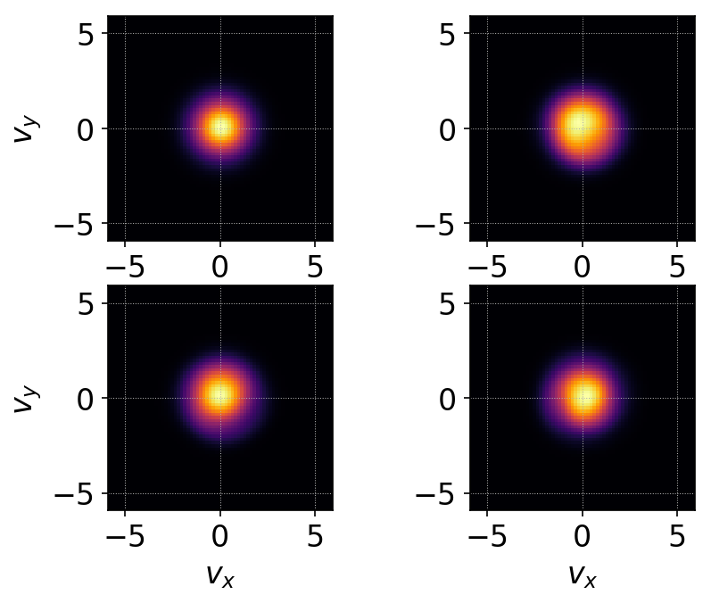
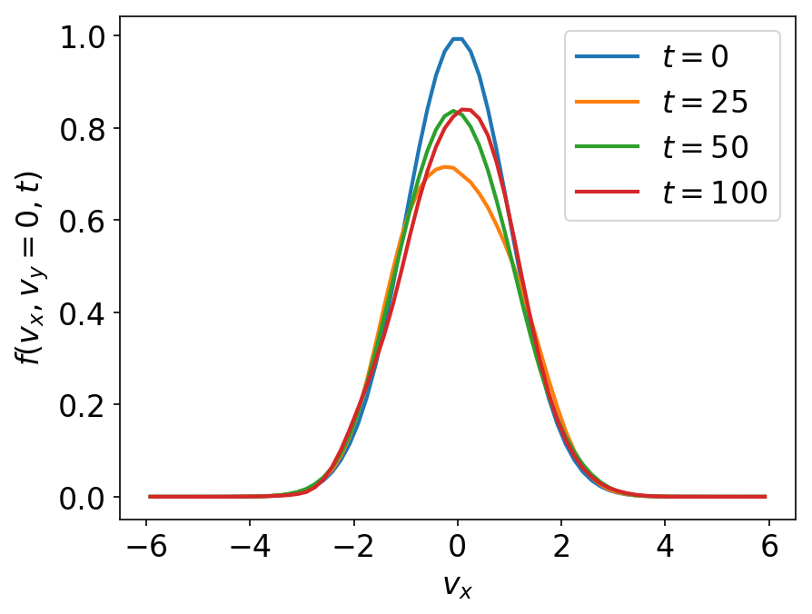
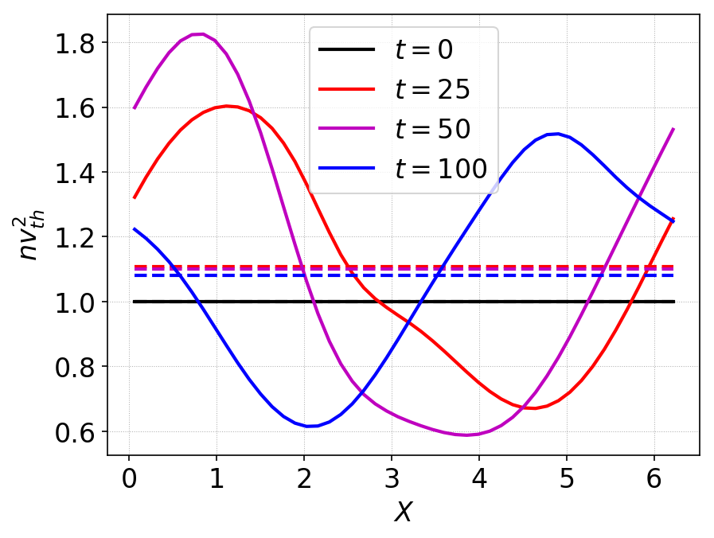
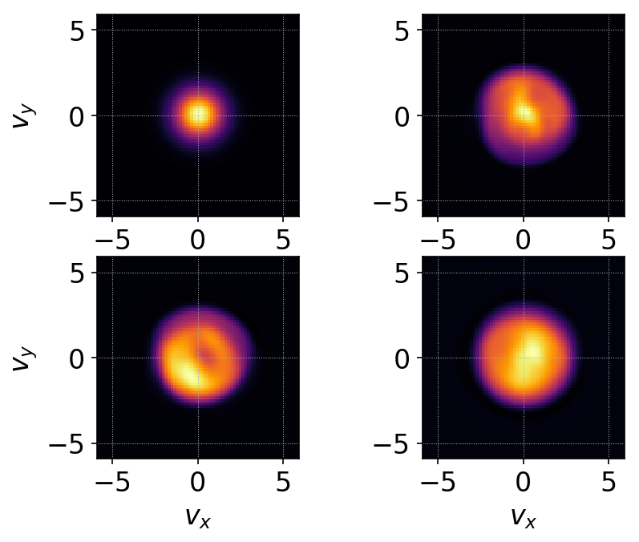
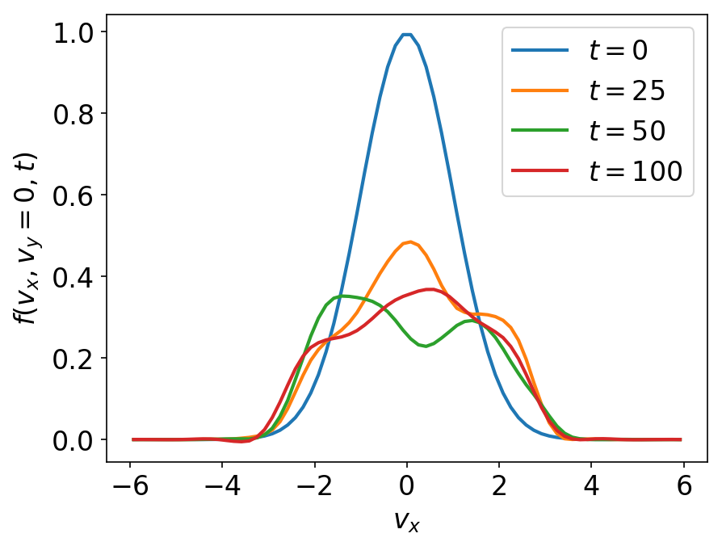
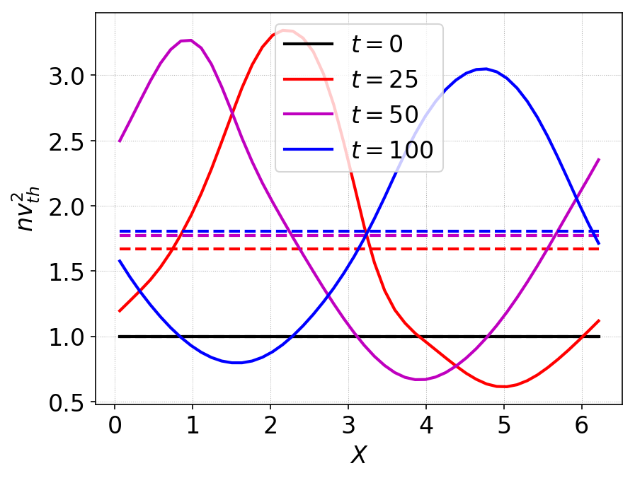

:Author: Ammar Hakim
:Date: 18th Feb 2018
:Completed: 23rd Feb 2018
:Last Updated:

JE32: Test particles in an electromagnetic field: stochastic heating
====================================================================

.. contents::

In this note I study the motion of particles in a specified
electromagnetic field. For certain time-dependent fields, the motion
of particles can become stochastic, leading to heating of the
particles. The question one can ask: what is the connection between
stochastic motion and structure of distribution functions? This is not
a trivial problem: even though the Vlasov equation contains all the
information of single-particle motion, the connection between the two
is not obvious in general situations. In this note some tests are
performed for some simple situations to ensure that the basic
algorithms in Gkeyll are capable of handling these types of problems.

Note that the fields are not self-consistently coupled to the
particles. That is, even though the particles move in the specified
fields, the currents do not modify the fields. Hence, these problems
can be considered to belong to the class of "test particle"
simulations.

Uniform time-dependent electric field
--------------------------------------

In the first test the magnetic field is constant and pointing in the
z-direction, :math:`\mathbf{B} = B_0 \mathbf{e}_z`. The electric field
is time-dependent (but spatially uniform) and is given by

.. math::

   \mathbf{E}(t) = E_0 \cos(\omega t) \mathbf{e}_x.

I only consider the motion of ions in this field. This problem is
essentially a forced-harmonic oscillator. The particle velocities are
described by two coupled ODEs:

.. math::

   \dot{v}_x &= E_0 \cos(\omega t) + v_y \\
   \dot{v}_y &= -v_x

where I am assuming :math:`q = m = B_0 = 1`. (This means that
:math:`\omega` is normalized to ion-cyclotron frequency and time is
measured in its inverse). We can solve this system rather easily
(convert to uncoupled second order ODEs and find particular solution
for each) to get

.. math::

   v_x(t) &= w_x(t) + v_x(0)\cos(t) + v_y(0)\sin(t) \\
   v_y(t) &= w_y(t) - v_x(0)\sin(t) + v_y(0)\cos(t)

where :math:`w_{x,y}(t)` are given by, for non-resonant case
:math:`\omega \neq 1` as

.. math::

   w_x(t) &= \frac{E_0}{1-\omega^2}\left(\sin(t)-\omega\sin(\omega
   t)\right) \\
   w_y(t) &=
   \frac{E_0}{1-\omega^2}\left(\cos(t)-\cos(\omega t)\right)

For the resonant case, :math:`\omega =1`, these are given by

.. math::

   w_x(t) &= \frac{E_0}{2}\left(t\cos(t)+\sin(t)\right) \\
   w_y(t) &= -\frac{E_0}{2} t\sin(t)

As the distribution function remains constant along characteristics,
if initial distribution of the particles is given by
:math:`f_0(v_x,v_y)`, the distribution at any time is

.. math::

   f(v_x(t),v_y(t),t) = f_0(v_x(0),v_y(0),0).

In general, using this formula, the exact solution of the
characteristics derived above can be used to compute the distribution
function at any given time. However, consider the special case of a
Maxwellian

.. math::

   f_0(v_x,v_y) = \frac{n}{2\pi v_{th}^2} \exp
   \left(
     -\frac{v_x^2+v_y^2}{2 v_{th}^2}
   \right)

Using the solution above we can show that

.. math::

   \left(v_x(t)-w_x(t)\right)^2 + \left(v_y(t)-w_y(t)\right)^2
   =
   v_x(0)^2 + v_y(0)^2

which shows that the exact solution with an initial Maxwellian
distribution is simply a drifting Maxwellian with drift velocity given
by :math:`w_x(t), w_y(t)`.

Non-resonant case
+++++++++++++++++

In the first test I initialize a 1x2v simulation with :math:`\omega =
0.5` and :math:`E_0 = 1.0` on a :math:`2\times 16\times 16` grid with
Serendipity :math:`p=2` basis functions. The simulation is run to
:math:`t=100`.

For this case the phase-space orbits (starting at :math:`v_x=v_y=0.0`)
are periodic and are shown as a thin white line in the figures and
`movie <../../_static/c2-oscc-E-vxvy.mov>`_ of distribution function.

.. figure:: c2-oscc-E-cmp.png
  :width: 100%
  :align: center

  Comparison of Gkeyll distribution function (left column) and exact
  distribution function (right column) for test-particles in a
  oscillating electric (but uniform) field. Magnetic field is
  constant. The white line is the phase-space orbit starting at
  :math:`v_x=v_y=0.0`. The orbit is periodic and the solution is a
  drifting Maxwellian. This plot shows that Gkeyll solutions compares
  very well with the exact solution. See :doc:`vlasov-test-ptcls/c2
  <c2-oscc-E>` for input file.

A more quantitative comparison can be made by plotting the drift
velocities from the simulation and the exact result. This plot is
shown below.

.. figure:: c2-oscc-E-c-cmp.png
  :width: 100%
  :align: center

  Comparison of x-component (top) and y-component (bottom) of drift
  velocities from simulation (red dots) with exact solution (black
  lines). The Gkeyll solutions compares very well with the exact
  solution. 

Resonant case
+++++++++++++

In the test I initialize a 1x2v simulation with :math:`\omega = 1.0`
and :math:`E_0 = 0.5` on a :math:`2\times 20\times 20` grid with
Serendipity :math:`p=2` basis functions. The simulation is run to
:math:`t=20`.

In the resonant case the velocity increases with time and the
phase-space orbit is a spiral. Eventually the velocity increases so
much that the test-particle picture breaks down.

.. figure:: c3-oscc-E-cmp.png
  :width: 100%
  :align: center

  Comparison of Gkeyll distribution function (left column) and exact
  distribution function (right column) for test-particles in a
  oscillating electric (but uniform) field. Resonant case. Magnetic
  field is constant. The white line is the phase-space orbit starting
  at :math:`v_x=v_y=0.0`. The orbit is a spiral and the solution is a
  drifting Maxwellian. This plot shows that Gkeyll solutions compares
  very well with the exact solution. See :doc:`vlasov-test-ptcls/c3
  <c3-oscc-E>` for input file.

A more quantitative comparison can be made by plotting the drift
velocities from the simulation and the exact result. This plot is
shown below.

.. figure:: c3-oscc-E-c-cmp.png
  :width: 100%
  :align: center

  Comparison of x-component (top) and y-component (bottom) of drift
  velocities from simulation (red dots) with exact solution (black
  lines). The Gkeyll solutions compares very well with the exact
  solution.

Time- and spatially-dependent electric field
--------------------------------------------

Now consider the magnetic field is constant and pointing in the
z-direction, :math:`\mathbf{B} = B_0 \mathbf{e}_z`. The electric field
is given by

.. math::

   \mathbf{E}(x,t) = E_0 \cos(kx - \omega t) \mathbf{e}_x.

The motion of ions in this field are given by three coupled ODEs

.. math::

   \dot{v}_x &= E_0 \cos(kx - \omega t) + v_y \\
   \dot{v}_y &= -v_x   \\
   \dot{x} &= v_x

where I am assuming :math:`q = m = B_0 = 1`. (This means that
:math:`\omega` is normalized to ion-cyclotron frequency and time is
measured in its inverse).

To understand the behavior of this system I solved it numerically
using a time-centered scheme. The plots below shows the Poincare plot
of the extended phase-space :math:`(v_x,x=0,t)`. The plots were made
by evolving eight particles over a 1000 periods and then plotting a
dot when the trajectory crosses the section (modulo
:math:`2\pi/\omega`).

Low-amplitude, non-stochastic case
++++++++++++++++++++++++++++++++++

First, consider :math:`E_0 = 0.5` and :math:`\omega=0.4567`. In this
low amplitude regime, the particle motion is regular. The domain is
:math:`[0,2\pi] \times [-6,6]^2` and is discretized with a
:math:`16\times 24^2` grid, using polyOrder 2 Serendipity basis
functions. The simulation is run to :math:`t=100` with a Maxwellian
initial condition with :math:`v_{th}= \sqrt{T/m} = 1`.

In this non-stochastic case we do not expect any significant heating
of the particles. To diagnose this I plot the distribution function
integrated over a single wavelength:

.. math::

   f(v_x,v_y,t) = \frac{1}{2\pi}\int_0^{2\pi} f(x,v_x,v_y,t)
   \thinspace dx

The following figure shows the integrated distribution function at four
different times.

  Integrated distribution function for time- and spatially dependent
  electric field case, at :math:`t=0` (top-left), :math:`t=25`
  (top-right), :math:`t=50` (bottom-left) and :math:`t=100`
  (bottom-right). This case has regular (non-stochastic) orbits and
  hence does not show any heating of the particles. Note that although
  the distribution function is non-Maxwellian the temperature has not
  changed significantly. See :doc:`vlasov-test-ptcls/c4 <c4-oscc-E>`
  for input file.

  One dimensional line-outs of the 2D integrated distribution
  functions shown in the pervious plot. The particles slosh around in
  the oscillating electric field, but the temperature has not changed
  significantly.

The thermal energy in the system, :math:`n v_{th}^2` is shown below. 

  Thermal energy :math:`n v_{th}^2` at various times. Dashed lines
  show the averaged thermal energy in the domain. This figure shows
  that the thermal energy only increases modestly (about 10%),
  indicating that the particles gains little energy from the fields.

Large-amplitude, stochastic case
++++++++++++++++++++++++++++++++

Now consider :math:`E_0 = 0.95` and :math:`\omega=0.4567`. In this
large amplitude regime, the particle motion is stochastic. The
simulation is run with the same parameters as the previous
calculations.

See `movie <../../_static/c5-oscc-E-f.mov>`_ of distribution function,
showing :math:`f(x=\pi,v_x,v_y)` and :math:`f(x,v_x,v_y=0)`. Complex
phase-space structure is seen and also temperature increase is
evident.

The following figure shows the integrated distribution function at
four different times.

  Integrated distribution function for time- and spatially dependent
  electric field case, at :math:`t=0` (top-left), :math:`t=25`
  (top-right), :math:`t=50` (bottom-left) and :math:`t=100`
  (bottom-right). This case has stochastic orbits and hence has
  significant stochastic heating of the particles. See
  :doc:`vlasov-test-ptcls/c5 <c5-oscc-E>` for input file.

  One dimensional line-outs of the 2D integrated distribution
  functions shown in the previous plot. The distribution function is
  significantly non-Maxwellian, showing flattening from stochastic
  heating.

The thermal energy in the system, :math:`n v_{th}^2` is shown below. 

  Thermal energy :math:`n v_{th}^2` at various times. Dashed lines
  show the averaged thermal energy in the domain. This figure shows
  that the thermal energy increases significantly (almost 80%),
  indicating that the particles gain significant energy from the
  fields.

Conclusion
----------

In this note I have tested some simple problems of test particle
evolution in specified electromagnetic fields. The code is first
benchmarked against exact solution and then two cases of motion in a
time-dependent field are studies. In the low amplitude regime the
particle motion is regular, with little heating of the particles. In
the large amplitude case the particle orbits are stochastic and this
leads to significant heating, leading to flattening of the
distribution function.

Questions: What are the signatures of stochastic particle orbits on
the distribution function?  Is it possible to develop Poincare type
plots (or other unambiguous signatures) using the distribution
function? Is there a self-consistent formulation, in which the
distribution function feeds current to the fields? These topics will
be explored later.
