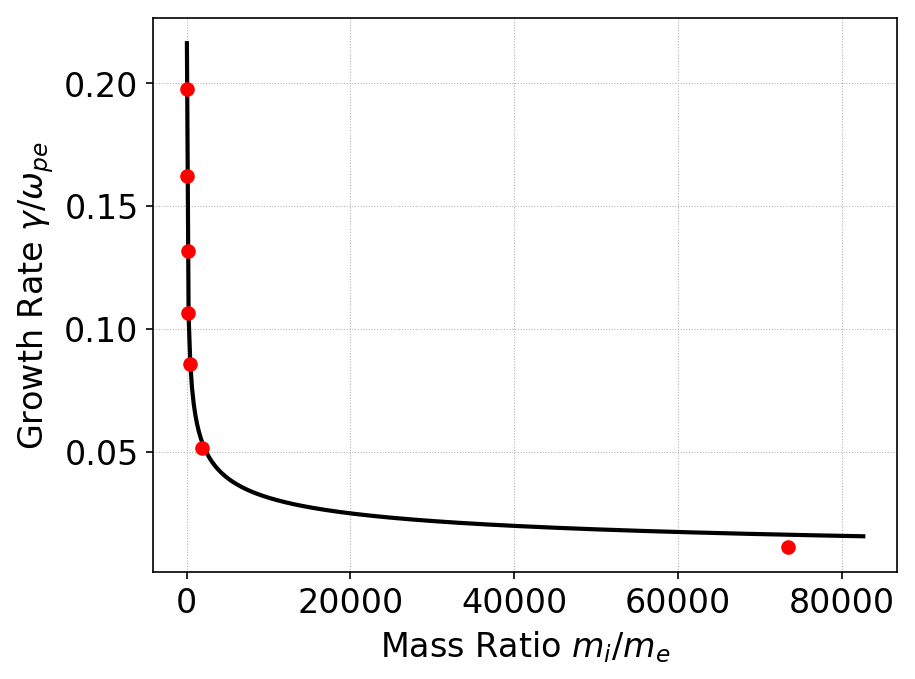

:Author: Ammar Hakim
:Date: Nov 21st 2018
:Completed: 
:Last Updated:

JE33: "Ghost Currents" and Kinetic simulations of the Buneman Instability
=========================================================================

.. contents::

In this note I study the Buneman instability with the Vlasov-Maxwell
solver in Gkeyll. This is in preparation for a more complex case in
which a magnetic field is also present. In the latter case the
instability is called "Electron Cyclotron Drift Instability" (ECDI),
often conjectured as causing anamalous electron transport observed in
Hall-thrusters.

Ghost Currents
--------------

Something or the other.

The linear stage
----------------

Consider a one-dimensional collisionless plasma in which the electrons
are drifting with respect to cold ions with speed :math:`V_0` much
larger than the electron thermal speed, i.e. :math:`V_0 \gg
v_{the}`. In this case an electron perturbation couples to ion plasma
oscillations, leading to an electrostatic instability called the
Buneman instability. Assuming cold ions and kinetic electrons the
dispersion relation for this instability is

.. math::

   1 - \frac{\omega_{pe}^2}{2 v_{the}^2k^2}
   Z'\left( \frac{\omega-kV_0}{\sqrt{2}v_{the}k} \right)
   -
   \frac{\omega_{pi}^2}{\omega^2} = 0.

(To a good approximation one can also assume that the electrons are a
cold fluid. In this case the dispersion relation becomes

.. math::

   1 - \frac{\omega_{pe}^2}{(\omega-k V_0)^2}
   -
   \frac{\omega_{pi}^2}{\omega^2} = 0.

The solution to this dispersion relation gives good insight into
the nature of the instability.)

The maximum growth of the instability occurs at resonance :math:`kV_0
= \omega_{pe}`. In this resonant case, as :math:`V_0 \gg v_{the}`, we
have :math:`\omega_{pe} \gg k v_{the}`. One can then show that the
growth rate can be approximately computed as

.. math::

   \frac{\gamma}{\omega_{pe}} = \frac{\sqrt{3}}{2}
   \left( \frac{m_e}{2m_i}  \right)^{1/3}
   \left[
      1 - \frac{1}{2} \left( \frac{m_e}{2m_i}  \right)^{1/3}
   \right].

In the first series of tests I initialized a simulation with
stationary ions with :math:`v_{te} = 1/50`, :math:`v_{ti}=10^{-3}` and
drift speed determined from resonance condition :math:`V_0 =
\omega_{pe}/k`. Mass ratio :math:`m_i/m_e` of :math:`25, 50, 100, 200,
400, 1836.2` and :math:`40\times 1836.2` (Argon ions) were used. The
linear growth rate was computed using the Postgkyl "growth" command
and results compared to values computed from the above formula. The
results are shown in the figure below.

  Comparison of linear growth rate for Buneman instability with
  various mass ratios computed from Gkeyll simulations (red dots) and
  analytical formula given in text (black). The growth rate of the
  instability reduces rapidly with increasing mass ratio
  (approximately :math:`(m_e/m_i)^{1/3}`). Note that this is for the
  resonant case in which :math:`k V_0 = \omega_{pe}`.
