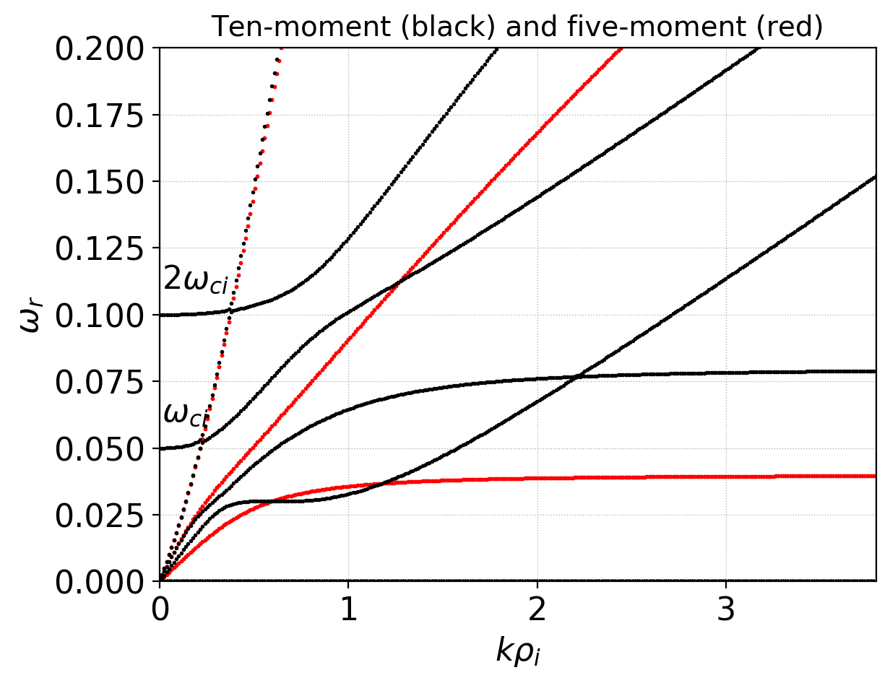

:Author: Ammar Hakim
:Date: September 8th 2020
:Completed: 
:Last Updated:

JE34: Multi-moment multifluid linear dispersion solvers
=======================================================

.. contents::

Introduction
------------

In this note I benchmark and document the multi-moment multifluid
dispersion solver tool in Gkeyll. This solver allows arbitrary number
of species, each of which can be either an isothermal fluid, a
five-moment fluid or a ten-moment fluid. The fields can be computed
from Maxwell equations or Poisson equations, with the option of some
species "ignoring" the background fields. Certain forms of closures,
including non-local Hammett-Perkins Landau fluid closures can be used.

For the list of equations and a brief overview of the algorithm used,
please see `this technical note
<../../_static/files/gkyl-mom-lin.pdf>`_. Essentially, the key idea of
this algorithm is to convert the problem of finding the dispersion
relation to an *eigenvalue problem* and then use a standard linear
algebra package (`Eigen
<http://eigen.tuxfamily.org/index.php?title=Main_Page>`_ in this case)
to compute the eigensystem. This allows great flexibility as there is
no need to directly find complex nonlinear polynomial roots or even
formulate the dispersion relation explicitly. I note that this
technique was described in my 2008 paper on the ten-moment model
[Hakim2008]_. Since then, it has been significantly developed and used
by Hausheng Xie and others. See, for example [Xie]_ and references
therein. As far as I know, however, the inclusion of the ten-moment
model and Landau closures is unique to Gkeyll.

Eventually, the goal is to perform a careful comparison of the linear
physics contained in the ten-moment system (especially with various
Landau and other simplified closures) with full kinetic
equations. Other applications are to computing initial conditions that
excite specific modes, computing RF wave-propagation and potential
extension to retain quadratic nonlinearities to allow study of
wave-wave scattering/coupling physics.

Note on running the dispersion solver tool
------------------------------------------

To run the tool create an input file (Lua script, see examples below
in various figure captions) and run it as::

  gkyl multimomlinear -i inp.lua

This will create a output file with the eigenvalues stored in a Gkeyll
"DynVector" object. For each element in the dynvector, the first three
components are the components of the wave-vector and the rest the
corresponding :math:`\omega_n(\mathbf{k})` with real and imaginary
parts stored separately (next to each other). You can plot the real
part of the frequencies as function of wave-vector (say :math:`k_x`)
as::

  pgkyl -f inp_frequencies.bp val2coord -x0 -y 3::2 pl -s -f0 --no-legend --xlabel "k" --ylabel "$\omega_r$"

And the imaginary parts as::

  pgkyl -f inp_frequencies.bp val2coord -x0 -y 4::2 pl -s -f0 --no-legend --xlabel "k" --ylabel "$\omega_i$"

Often, it is useful to plot the eigenvalues in the complex plane (real
part on X-axis and imaginary part on the Y-axis). For this do::

  pgkyl -f inp_frequencies.bp val2coord -x3::2 -y 4::2 pl -s -f0 --no-legend --xlabel "$\omega_r$" --ylabel "$\omega_i$"  

Note that the frequencies are not outputed in any particular
order. Hence it is not possible to easily extract a single "branch" of
the dispersion relation from the output. Please see pgkyl help to
understand what the ``val2coord`` and ``pl`` (short for ``plot``) do
and how to use them.

The boolean flag ``calcEigenVectors`` can be set to ``true`` to
optionally compute the eigenvectors. These are stored in a
``CartField`` object.

Waves in a uniform plasma
-------------------------

In the first test I look at the problem of waves in a uniform
plasma. The first test assumes the plasma is composed of cold
electrons and ions (:math:`m_i/m_e = 25`) with the background magnetic
field :math:`\mathbf{B}_0 = (1.0, 0.0, 0.75)` transverse to the
wave-vector pointing in the X-direction . The following plot shows the
various plasma waves that appear in the system.

  Waves in a cold magnetized plasma, with wave-vector transverse to
  the background magnetic field. Seen are the right (R) and left (L)
  polarized modes that asymptote to light waves at large
  :math:`k`. Also seen the second branch of the R mode which contains
  the Whistler mode at low-:math:`k` and also the Alfven mode. See
  input file :doc:`iso-1-wave <iso-1-wave>`.

In the next problem I use the five-moment model with a finite pressure
:math:`p = 0.1` for both electrons and ions. The dispersion relation
is compared to the corresponding cold case in the following plot.

  Waves in a cold (black) and five-moment finite-pressure (red)
  magnetized plasma, with wave-vector transverse to the background
  magnetic field. The finite pressure effect changes the sound-wave
  mediated branches, allowing them to propagating at high :math:`k`.
  See input file :doc:`5m-1-wave <5m-1-wave>`.

For the next test I use the ten-moment model with a diagonal pressure
tensor :math:`P_{xx} = P_{yy} = P_{zz} = 0.1` and all other components
set to zero. This gives the same scalar pressure as the previous
five-moment test. The ten-moment model has a a lot of modes. To
illustrate the differences between five-moments the following plot
shows the high-frequency branches of the dispersion relation. Note the
existence of *two* cyclotron harmonics marked with :math:`\omega_{ce}`
and :math:`2 \omega_{ce}` in the plot. These are missing in the
five-moment model. Also, the R- and L-mode structure is different,
with the lower cyclotron harmonic transitioning to the L-mode and the
upper cyclotron harmonic to the R-mode at larger :math:`k` values.

  Comparison of high-frequency branches of the dispersion relation for
  ten-moment (black) and five-moment (red) models. The ten-moment
  model contains the first two electron cyclotron harmonics which
  transition to the L- and R-mode at higher :math:`k`. See input file
  :doc:`10m-1-wave <10m-1-wave>`.

The following plot shows the low-frequency branches of the ten-moment
model compared to the five-moment model. Again, the two ion cyclotron
harmonics are seen as well as the various ion acoustic mediated
branches.

  Comparison of low-frequency branches of the dispersion relation for
  ten-moment (black) and five-moment (red) models. The first two ion
  cyclotron harmonics are seen. See input file :doc:`10m-1-wave
  <10m-1-wave>`.

The tests in these sections were done without any closures, and in
particular, without Landau closures. In the kinetic system many of the
modes seen above are damped.

The Buneman instability
-----------------------

In the next series of tests various instabilities are used as
benchmarks. First, consider the Buneman instability which was studied
extensively in :doc:`JE33 <../je33/je33-buneman>`. Consider a
one-dimensional, electrostatic, collisionless plasma in which the
electrons are drifting with respect to cold ions with speed
:math:`V_0` much larger than the electron thermal speed,
i.e. :math:`V_0 \gg v_{the}`. In this case an electron perturbation
couples to ion plasma oscillations, leading to an electrostatic
instability called the Buneman instability. The following plot shows
the growth rate of the instability for various wave-numbers for
several different mass ratios. Note that this figure is identical to
the one presented in :doc:`JE33 <../je33/je33-buneman>`, giving
confidence in the correctness of the linear dispersion solver
implementation.

  Growth rate as a function of :math:`k` for various ion-electron mass
  ratios: :math:`m_i/m_e = 25` (blue), :math:`m_i/m_e = 200` (orange)
  and :math:`m_i/m_e = 1836.2` (green). The instability grows slower
  with increasing mass ratio. For full study of this problem,
  including nonlinear kinetic simulations, see :doc:`JE33
  <../je33/je33-buneman>`. Also see tool input file for the
  :math:`m_e/m_e = 25` case :doc:`iso-2-bune <iso-2-bune>`.

To see which modes actually grow, the follow plot shows the spectrum
of the modes in the complex plane for the :math:`m_i/m_e = 1836.2`
case. Only a very narrow range of low-frequency modes grow, while the
higher frequency modes are merely oscillate.

  Spectrum of the modes in the complex plane for the Buneman
  instability. This plot shows that only the very low frequency modes
  grow, while the higher-frequency modes remain purely oscillating.

The Electron Cyclotron Drift Instability (ECDI)
-----------------------------------------------

The Electron Cyclotron Drift Instability (ECDI) is an electrostatic
current-driven instability that arizes due to
:math:`\mathbf{E}\times\mathbf{B}` motion of electrons. In the typical
setup the ions are unmagnetized and hence do not contribute an
:math:`\mathbf{E}\times\mathbf{B}` current. (Note that in general
there is no net :math:`\mathbf{E}\times\mathbf{B}` current in an
infinite plasma. However, in some situations it is possible that the
ions never complete a gyroperiod and hence the ion currents are never
set up). The ECDI is considered a mechanism of anomalous electron
transport in Hall thrusters.

In the first set of simulations the electrons and ions are treated as
isothermal fluids. The background electric field is set to :math:`E_y
= 0.2` and the background magnetic field to :math:`B_z = 1.0`. The
growth of the instability vs :math:`k` is shown below. The instability
is active only for a small range of wave-numbers. Further, increasing
mass-ratio reduces the growth rate and the range over which the
instability is active.

  Growth rate vs :math:`k` for the ECDI for a :math:`E\times B`
  velocity of 0.2 for mass ratio of 400 (blue) and 1836.2
  (orange). The instability is active for a narrow range of
  wave-numbers. The growth reduced with increasing mass ratio. See
  :doc:`iso-ecdi-2 <iso-ecdi-2>` for an input file for the
  :math:`m_i/m_e = 1836.2` case.

As for the Buneman instability, in the isothermal limit the
instability only grows for low-frequency modes. See below.

  Spectrum of the modes in the complex plane for the ECDI. This plot
  shows that only the very low frequency modes grow, while the
  higher-frequency modes remain purely oscillating.

We can also look at the ECDI with the ten-moment model. Here, due to
the second cyclotron harmonic there is a *second* unstable branch that
appears at even higher :math:`k`. However, at least for the parameters
used here, the second mode grows more slowly, showing that in this
setup the shorter :math:`k` modes will be dominant.

  Growth rate of ECDI using the ten-moment model for both electrons
  and ions (orange) for mass-ratio :math:`m_i/m_e = 400`. Also shown
  for comparison are the growth rates from the isothermal case
  (blue). Note that there is a *second* unstable mode present in the
  ten-moment case due to the presence of the second harmonic. This
  mode, however, grows slower, indicating that the smaller :math:`k`
  unstable modes will be dominant. See :doc:`10m-ecdi-1 <10m-ecdi-1>`
  for tool input file.

  Spectrum of the modes in the complex plane for the ECDI using
  ten-moment model. This plot shows that only the very low frequency
  modes grow. Note the second set of unstable modes.

We can also look at the real frequencies of the various modes and
identify the modes that grow. In this system there are huge number of
modes but as seen from the above plots only those in a narrow range
are unstable. The following plot shows a zoom into the low-frequency
branches of the dispersion relation with the unstable modes colored in
red. Again, note that there are two set of modes that are unstable,
corresponding to the fact that there are two cyclotron harmonics
included in the ten-moment model.

  Low-frequency branches of the dispersion relation for ten-moment
  ECDI problem. Marked in red are the unstable modes that lead to the
  ECDI. Note the narrow region of :math:`k` over which the instability
  is active. The two set of modes marked in red correspond to the two
  cyclotron harmonics included in the ten-moment model.

	  
References
----------

.. [Hakim2008] A.H. Hakim. "Extended MHD Modelling with the Ten-Moment
    Equations". *Journal of Fusion Energy*, **27** (1-2),
    36–43. http://doi.org/10.1007/s10894-007-9116-z

.. [Xie] H. Xie, Y. Xiao. "PDRK: A General Kinetic Dispersion Relation
    Solver for Magnetized Plasma". *Plasma Science and Technology*,
    **18** (2), 97–107. http://doi.org/10.1088/1009-0630/18/2/01
