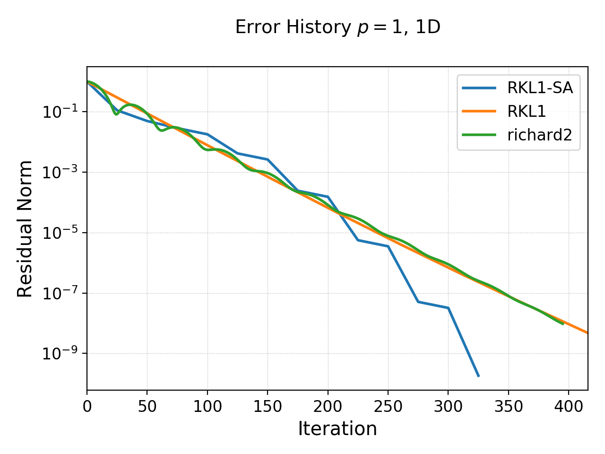
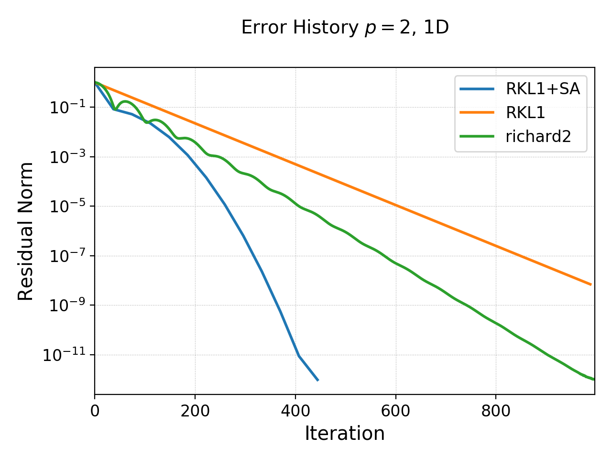
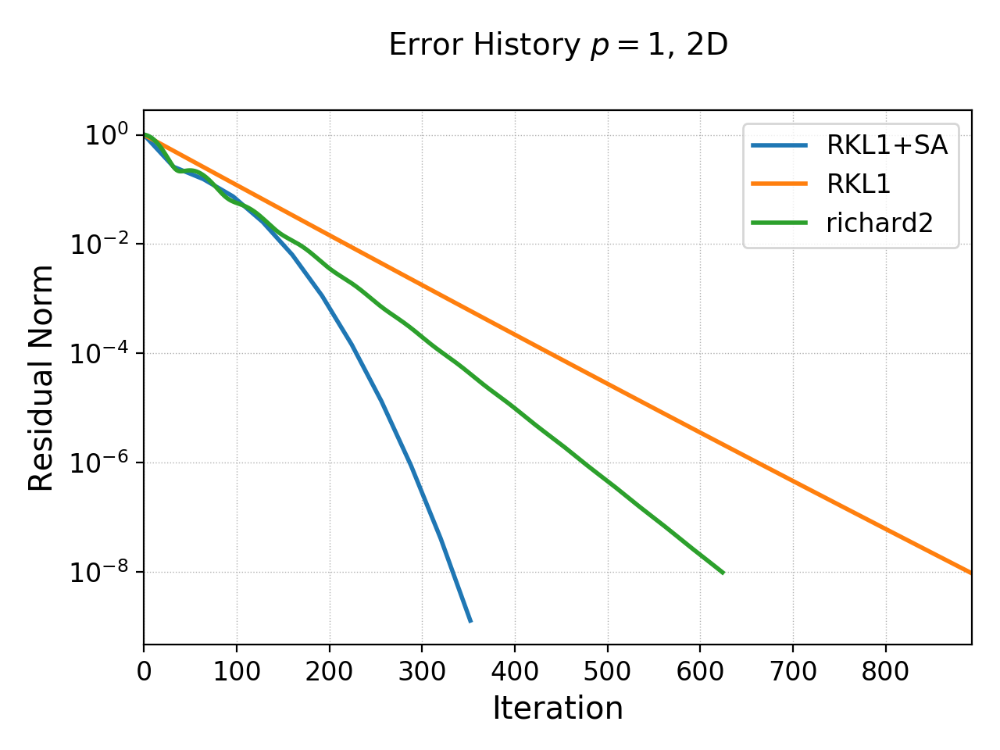
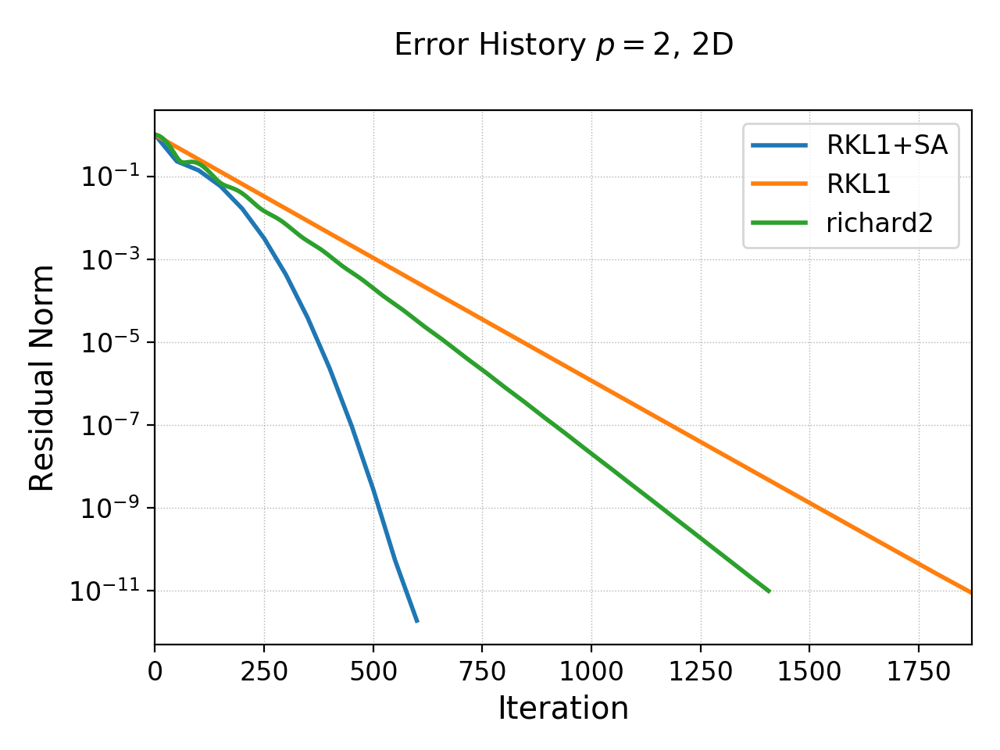
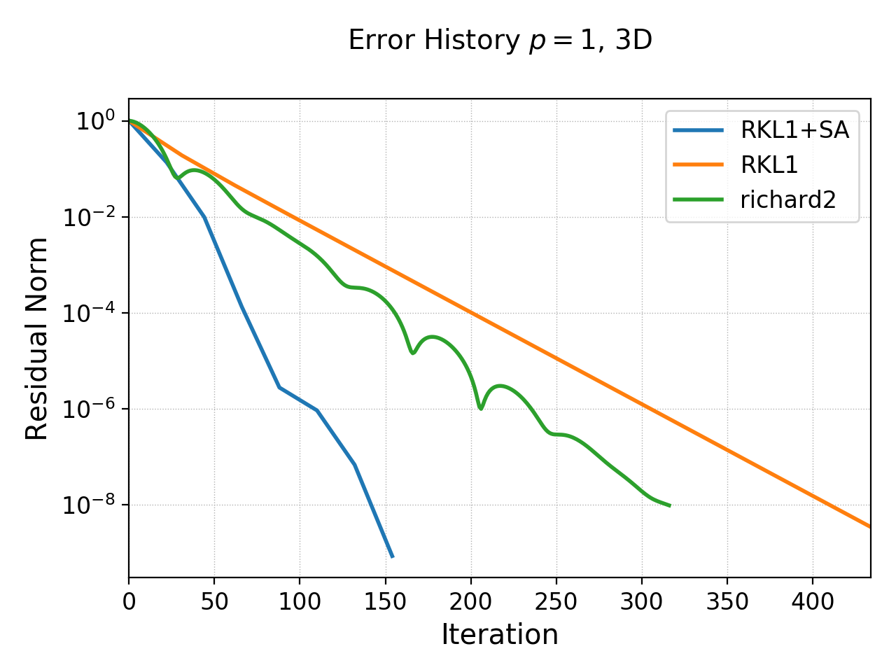

:Author: Ammar Hakim
:Date: November 11th 2020
:Completed: November 13th 2020
:Last Updated:

JE35: Benchmarking an iterative discontinuous Galerkin Poisson solver
=====================================================================

.. contents::

Introduction
------------

In this note I document and test an iterative solver for Poisson
equation:

.. math::

  \nabla^2 f = -s

The solver uses a recovery DG scheme (RDG). This details of the solver
will be presented later, however, the essential idea is to multiply
the equation by basis functions and perform two integration by
parts. Each surface term then is evaluated by recovering a continuous
function across the two cells, and taking the derivatives as
needed. The recovery process is subtle and needs care, specially in
higher dimensions. Also, boundary conditions need to be incorporated
in the recovery to obtain full accuracy. For now, I am only using
periodic BCs and will show results with other BCs later.

Gkeyll already has a direct solver for the RDG-based Poisson
equation. However, it is not parallel (and is difficult to
parallelize) and being a direct solver scales poorly with problem
size. Hence, in this note I explore two iterative solvers that in
their inner loop use the discrete RDG poisson operator to march a
pseudo-time-dependent problem to convergence. As the iterative solver
uses the *local* stencil to update the Laplacian it is trivial to
parallelize.

Super Time-Stepping Scheme
--------------------------

In the first scheme a diffusion equation is marched to steady-state:

.. math::

   \frac{\partial f}{\partial t} = \nabla^2 f + s

An explicit scheme would be very slow for this equation: the time-step
would be go as :math:`\Delta x^2` and so the number of iterations to
converge to steady-state would go as :math:`N^2`, where :math:`N` is
the number of cells in each direction. Hence, instead one can use the
Super-Time Stepping Scheme (STS) to accelerate the convergence. In
particular, I use the first-order (in time) Runge-Kutta-Legendre
(RKL1) scheme as described in [Meyer2014]_. In this scheme the
equations are marched in (pseudo) time using a :math:`s`-stage RK
scheme, where the number of stages are determined by how large a
time-step we wish to take. The RK scheme is given by

.. math::

   Y_0 &= f^n \\
   Y_1 &= Y_0 + \tilde{\mu}_1\Delta \tau L[Y_0] \\
   Y_j &= \mu_j Y_{j-1} + \nu_j Y_{j-2} + \tilde{\mu}_j \Delta \tau L[Y_{j-1}]

for :math:`2\le j \le s` and where

.. math::

   L[f] = \nabla^2_h f + s

where :math:`\nabla^2_h` is the *discrete* Laplacian operator computed
using the RDG scheme. The various coefficients are given by

.. math::

   \mu_{j} &=\frac{2 j-1}{j} ; \quad v_{j}=\frac{1-j}{j} \\
   \tilde{\mu}_{j} &=\frac{2 j-1}{j} \frac{2}{s^{2}+s}

If :math:`\Delta t_e` is the maximum time-step for an explicit scheme
and we wish to take a time-step that is :math:`W` times larger, then
the number of stages is computed from

.. math::

   s = \frac{1}{2} \lceil\sqrt{1+8W} - 1 \rceil + s_0

where :math:`s_0` are extra stages. Note that :math:`\Delta \tau = W
\Delta t_e`. Hence, in this scheme, the free parameters one must
choose are :math:`W` and :math:`s_0`. In Gkeyll one chooses this
scheme using the "RKL1" parameter in the `IterPoisson` updater. On top
of the "inner" STS stages one can also use a sequence acceleration
method that drives the system to steady-state even faster.

Second order Richardson Iteration
---------------------------------

In the second scheme we use a damped wave-equation to march to
steady-state:

.. math::

   \frac{\partial^2 f}{\partial t^2}
   + 2\nu \frac{\partial f}{\partial t}
   = 
   \nabla^2 f + s.

This scheme is a form of second order Richardson iterative method. See
[Golub1961]_ for general analysis of such schemes. For this specific
scheme see [Jardin2010]_ Chapter 3, Section 5.2. (Jardin uses
:math:`\tau = 1/\nu` instead, and calls this scheme "Dynamic
Relaxation"). The time-derivatives are replaced by simple central
differences to get the time-marching scheme:

.. math::

   \frac{f^{n+1} - 2f^n + f^{n-1}}{\Delta t^2}
   + \nu \frac{f^{n+1} - f^{n-1}}{\Delta t}
   = \nabla^2_h f^n + s.

The free parameter in this scheme is :math:`\nu`. To pick this, first
write the solution as :math:`f = f_0 + f_1`, where :math:`f_0` is the
steady-state solution and :math:`f_1` is the error. The error itself
satisfies the equation

.. math::

   \frac{\partial^2 f_1}{\partial t^2}
   + 2\nu \frac{\partial f_1}{\partial t}
   = 
   \nabla^2 f_1.

Now assume a mode :math:`f_1 \sim e^{-i\omega t}e^{i k
\mathbf{x}}`. Then we get the dispersion relation

.. math::

   \omega(\mathbf{k}) = -i\nu \pm \sqrt{ k^2 - \nu^2 }.

Hence, to ensure that all modes damp (and the second term remains
purely oscillatory) we choose

.. math::

   \nu = k_{min}

where :math:`k_{min}` is the smallest wavenumber that can be
represented on the grid. Typically, in 1D we have :math:`k_{min} =
2\pi/L`, where :math:`L` is the domain size. Note that the fastest
*frequency* we must resolve is approximately :math:`k_{max}` and the
time-step we must choose is :math:`k_{max} \Delta t \lt 2`. For simple
spectral approximation to the Laplacian we have :math:`k_{max} =
\pi/\Delta x`, or that the maximum stable time-step must be

.. math::

   \Delta t \lt \frac{2 \Delta x}{\pi}.

For central difference approximation :math:`\Delta t \lt \Delta
x/\sqrt{2}`.

In either case, as the (pseudo) time-step is *linearly* dependent on
the cell spacing, indicates that the scheme will converge *linearly*
with the number of cells in each direction. So, doubling the number of
cells in each direction in 3D will lead to twice as many
iterations. As there are 8 times more cells now, the scheme will hence
take 16 times longer to converge. This is scaling is dramatically
better than a direct solver, which would be :math:`8^3 = 512` times
more expensive due to the cost scaling of the LU decomposition.

.. note::

   I am grateful to Greg Hammett for discussions on the second-order
   Richardson iteration scheme.

Nishikawa's First Order Scheme
------------------------------

In [Nishikawa2007]_ studied a system of first-order relaxation
equations that reduce to the Poisson equation at steady-state:

.. math::

   \frac{\partial f}{\partial t} &= \alpha
   \left(
   \nabla\cdot\mathbf{g} + s
   \right) \\
   \frac{\partial \mathbf{g}}{\partial t} &= -\frac{1}{T_r}
   \left(
   \mathbf{g} - \nabla f
   \right)

where :math:`\alpha` and :math:`T_r` are parameters. In 3D, for
example, this is a system of 4 first-order equations. At steady-state
:math:`\mathbf{g} = \nabla f` and hence the system will converge to
the solution of the Poisson equation.

Now, write :math:`f = f_0 + f_1` and :math:`\mathbf{g} =
\mathbf{g}_0 + \mathbf{g}_1`, where :math:`f_0` and
:math:`\mathbf{g}_0` are steady-state solution. Then the errors
satisfy

.. math::

   \frac{\partial f_1}{\partial t} &= \alpha \nabla\cdot\mathbf{g}_1 \\
   \frac{\partial \mathbf{g}_1}{\partial t} &= -\frac{1}{T_r}
   \left(
   \mathbf{g}_1 - \nabla f_1
   \right).

Consider the 1D case and write this as

.. math::

   \frac{\partial }{\partial t}
   \left[
    \begin{matrix}
      f_1 \\
      g_x
    \end{matrix}
   \right]    
    +
    \left[
    \begin{matrix}
      0 & -\alpha \\
      -1/T_r & 0
    \end{matrix}    
   \right]
   \frac{\partial }{\partial x}
   \left[
    \begin{matrix}
      f_1 \\
      g_x
    \end{matrix}
   \right]
   =
   -\frac{1}{T_r}
   \left[
    \begin{matrix}
      0 \\
      g_x
    \end{matrix}
   \right].

As is easily seen, the eigenvalues of the Jacobian matrix are simply

.. math::

   \lambda_{1,2} = \pm \sqrt{\frac{\alpha}{T_r}}.

What this means is that the errors propagate at a finite speed and,
due to the relaxation term, damp away as they propagate.

Now, take the time-derivative of the first of these equations, use the
second equation and then the first equation to see that

.. math::

   \frac{\partial^2 f_1}{\partial t^2}
   + \frac{1}{T_r} \frac{\partial f_1}{\partial t}
   = 
   \frac{\alpha}{T_r}\nabla^2 f_1.

Hence, Nishikawa's scheme is identical the second order Richardson
iteration if we choose :math:`\alpha = T_r` and :math:`T_r =
1/2\nu`. Other choices are also possible, of course, and could lead to
iterative schemes with different properties.

As Nishikawa's scheme essentially reduces to solving a system of
hyperbolic (plus relaxation source) equations, the time-step for
stability will also be linearly proportional to :math:`\Delta x`, and
hence will have the same cost scaling as the two schemes described
above. In fact, for the choice :math:`\alpha = T_r` we will have
:math:`\lambda_{1,2} = \pm 1` and hence :math:`\Delta t = \Delta x`
(in 1D).

However, one serious disadvantage of this scheme is that it involves
solving *four* first-order equations in 3D, while the scheme in the
previous section has only a single second-order equation. The RDG
implementation for the second-order system in Gkeyll has the *same
cost* as the cost of a single first-order equation, and hence
Nishikawa's scheme will be approximately four times more expensive (in
3D) if the number of iterations are approximately the same. However,
an advantage is that Nishikawa's scheme also gives us the gradient of
:math:`f`, which is typically what is needed in many simulations.

Residual norm, updater structure
--------------------------------

To check convergence of the solution we use the *residual norm*
computed as

.. math::

   R_2[f,s] = \frac{\lVert \nabla_h f + s \rVert_2 }{\lVert s
   \rVert_2}

where :math:`\lVert \cdot \rVert_2` is the :math:`l_2`-norm of the
discrete solution. See `this note
<https://gkeyll.readthedocs.io/en/latest/dev/modalbasis.html#convolution-of-two-functions>`_
on how to compute :math:`l_2`-norm of the from the Gkeyll
representation of the DG solution.  For all tests below I use the
initial guess of zero, and hence the initial residual norm is
always 1. Typically, I set the condition of :math:`R_2 \lt 10^{-8}` as
the discretization error is typically larger than this. For some
:math:`p=2` tests with high resolution one needs a more stringent
error criteria.

An example of the use of the updater is below:

.. code:: lua

  local iterPoisson = Updater.IterPoisson {
     onGrid = grid,
     basis = basis,
     errEps = 1e-8, -- maximum residual error
     stepper = 'richard2',
     verbose = true,
  }
  iterPoisson:advance(0.0, {fIn}, {fOut})

Note the parameter `stepper` is set to "richard2" to select the second
order Richardson iteration scheme.  When the `verbose` flag is set the
updater will show messages on the console. You can also save the error
history by calling the `writeDiagnostics()` method after the updater
has converged:

.. code:: lua

  iterPoisson:writeDiagnostics()

This will produce a DynVector BP file which can be plotted in the
usual way. For example::

  pgkyl -f f1-r2-iter-periodic_errHist.bp pl --logy

Note that the `IterPoisson` updater is not really restricted to only
DG discretization of the Poisson equation. In fact, any equation
system and discretization can be used. For example, density weighted
diffusion or FEM discretization. The updater simply calls the
appropriate equation object to compute the residual and does not use
any equation or discretization specific information.
  
Convergence tests in 1D
-----------------------

For 1D convergence tests I used the source

.. math::

   s(x) = -\frac{1}{N} \sum_m m^2[ a_m \cos(mx) + b_m \sin(mx) ]

with :math:`x\in [0,2\pi]` on a periodic domain. This source source is
set in code as:

.. code:: lua

  local initSource = Updater.ProjectOnBasis {
     onGrid = grid,
     basis = basis,
     evaluate = function(t, xn)
        local x = xn[1]
        local am = {0, 5, -10} 
        local bm = {10, 5, 10}
        local t1, t2 = 0.0, 0.0
        local f = 0.0
        for m = 0,2 do
	   for n = 0,2 do
	      t1 = am[m+1]*math.cos(m*x)
	      t2 = bm[m+1]*math.sin(m*x)
	      f = f-m*m*(t1+t2)
	   end
        end
        return -f/50.0
     end,
  }	  

The exact solution for this problem is

.. math::

   f_e(x) = \frac{1}{N} \sum_m a_m \cos(mx) + b_m \sin(mx).

The error in the :math:`l_2`-norm is measured:

.. math::

   E = \sqrt{\int (f - f_e)^2 \thinspace dx}

Gird size of :math:`8`, :math:`16`, :math:`32`, :math:`64` cells were
used.  The errors, convergence order and number of iterations to
converge to a residual norm of :math:`10^{-8}` are given below. Note
that both the "RKL1" and "richard2" converge to the *same*
:math:`l_2`-norm error.

.. list-table:: Poisson solver convergence for 1D, :math:`p=1`
		periodic BCs
  :header-rows: 1
  :widths: 10,30,20,20,20
	   
  * - :math:`N_x`
    - :math:`l_2`-error
    - Order
    - :math:`N_{RKL1}`
    - :math:`N_{rich}`
  * - 8
    - :math:`2.38715\times 10^{-2}`
    - 
    - 36
    - 52
  * - 16
    - :math:`2.54502\times 10^{-3}`
    - 3.23
    - 91
    - 100
  * - 32
    - :math:`2.99617\times 10^{-4}`
    - 3.1
    - 156
    - 197
  * - 64
    - :math:`3.68094\times10^{-5}`
    - 3.0
    - 300
    - 394

Clearly, both the "RKL1" and "richard2" schemes converge linear with
the grid size and attain a 3rd order convergence error. Note that a
conventional DG scheme would only obtain a 2nd order convergence
rate. The following plot shows the history of the residual norm with
iteration for the :math:`64` cell case.

  History of residual norm for :math:`p=1`, 1D :math:`64` cell case
  for "RKL1" (blue) and "richard2" (orange) schemes. Note the
  exponential decay in errors, with the "RKL1" further converging
  faster due to the sequence acceleration. The "richard2" scheme has
  some oscillatory mode (as can be seen from the dispersion relation
  also).

The convergence of the :math:`p=2` scheme is shown in the following
table.
  
.. list-table:: Poisson solver convergence for 1D, :math:`p=2`
		periodic BCs
  :header-rows: 1
  :widths: 10,30,20,20,20
	   
  * - :math:`N_x`
    - :math:`l_2`-error
    - Order
    - :math:`N_{RKL1}`
    - :math:`N_{rich}`
  * - 8
    - :math:`1.91262\times 10^{-3}`
    - 
    - 50
    - 84
  * - 16
    - :math:`1.16559\times 10^{-4}`
    - 4
    - 90
    - 165
  * - 32
    - :math:`7.18317\times 10^{-6}`
    - 4
    - 162
    - 328
  * - 64
    - :math:`4.4714\times 10^{-7}`
    - 4
    - 333
    - 741

  History of residual norm for :math:`p=2`, 1D :math:`64` cell case
  for "RKL1" (blue) and "richard2" (orange) schemes. Note the
  exponential decay in errors, with the "RKL1" further converging
  faster due to the sequence acceleration. The "richard2" scheme has
  some oscillatory mode (as can be seen from the dispersion relation
  also).

Convergence tests in 2D
-----------------------

For 2D convergence tests I used the source

.. math::

   s(x,y) = -\frac{1}{N}\sum_{m,n} (m^2+n^2) \left[
    a_{mn} \cos(mx) \cos(ny) + 
    b_{mn} \sin(mx) \sin(ny)
  \right].

with :math:`x\in [0,2\pi]` and :math:`y\in [0,2\pi]` on a periodic
domain. This source source is set in code as:

.. code:: lua

  local initSource = Updater.ProjectOnBasis {
     onGrid = grid,
     basis = basis,
     evaluate = function(t, xn)
        local x, y = xn[1], xn[2]
        local amn = {{0,10,0}, {10,0,0}, {10,0,0}}
        local bmn = {{0,10,0}, {10,0,0}, {10,0,0}}
        local t1, t2 = 0.0, 0.0
        local f = 0.0
        for m = 0,2 do
	   for n = 0,2 do
	      t1 = amn[m+1][n+1]*math.cos(m*x)*math.cos(n*y)
	      t2 = bmn[m+1][n+1]*math.sin(m*x)*math.sin(n*y)
	      f = f + -(m*m+n*n)*(t1+t2)
	   end
        end
        return -f/50.0
     end,
  }

The exact solution for this problem is

.. math::

   f_e(x,y) = \frac{1}{N}\sum_{m,n} \left[
    a_{mn} \cos(mx) \cos(ny) + 
    b_{mn} \sin(mx) \sin(ny)
  \right].

Gird size of :math:`8\times 8`, :math:`16\times 16`, :math:`32\times
32`, :math:`64 \times 64` cells were used.  The errors, convergence
order and number of iterations to converge to a residual norm of
:math:`10^{-8}` are given below. Note that both the "RKL1" and
"richard2" converge to the *same* :math:`l_2`-norm error.

.. list-table:: Poisson solver convergence for 2D, :math:`p=1`
		periodic BCs
  :header-rows: 1
  :widths: 10,30,20,20,20
	   
  * - :math:`N_x`
    - :math:`l_2`-error
    - Order
    - :math:`N_{RKL1}`
    - :math:`N_{rich}`
  * - :math:`8\times 8`
    - :math:`1.42428\times 10^{-2}`
    - 
    - 40
    - 80
  * - :math:`16\times 16`
    - :math:`1.5217\times 10^{-3}`
    - 3.23
    - 81
    - 156
  * - :math:`32\times 32`
    - :math:`1.79333 \times 10^{-4}`
    - 3.1
    - 153
    - 311
  * - :math:`64\times 64`
    - :math:`2.20389\times10^{-5}`
    - 3.0
    - 320
    - 623

  History of residual norm for :math:`p=1`, 2D :math:`64\times 64`
  cell case for "RKL1" (blue) and "richard2" (orange) schemes. Note
  the exponential decay in errors, with the "RKL1" further converging
  faster due to the sequence acceleration. The "richard2" scheme has
  some oscillatory mode (as can be seen from the dispersion relation
  also).

.. list-table:: Poisson solver convergence for 2D, :math:`p=2`
		periodic BCs
  :header-rows: 1
  :widths: 10,30,20,20,20
	   
  * - :math:`N_x`
    - :math:`l_2`-error
    - Order
    - :math:`N_{RKL1}`
    - :math:`N_{rich}`
  * - :math:`8\times 8`
    - :math:`1.13367\times 10^{-3}`
    - 
    - 88
    - 131
  * - :math:`16\times 16`
    - :math:`6.90935\times 10^{-5}`
    - 4.0
    - 117
    - 260
  * - :math:`32\times 32`
    - :math:`4.25829 \times 10^{-6}`
    - 4.0
    - 225
    - 519
  * - :math:`64\times 64`
    - :math:`2.67645\times10^{-7}`
    - 4.0
    - 450
    - 1038
      

  History of residual norm for :math:`p=2`, 2D :math:`64\times 64`
  cell case for "RKL1" (blue) and "richard2" (orange) schemes. Note
  the exponential decay in errors, with the "RKL1" further converging
  faster due to the sequence acceleration. The "richard2" scheme has
  some oscillatory mode (as can be seen from the dispersion relation
  also).

In the following plot the RDG solution is compared with the exact
solution for the :math:`p=2` case, showing the accuracy of the scheme
on a coarse grid of :math:`8\times 8` grid.

  Lineout of RDG solution (orange) and exact solution (blue) for 2D
  :math:`8\times 8` grid with :math:`p=2` basis functions. The two
  curves essentially overlap, showing the accuracy of the RDG scheme
  for this problem.

Convergence tests in 3D
-----------------------

For 3D convergence tests I used the source

.. math::

   s(x,y,z) = -\frac{1}{N}\sum_{m,n} (m^2+n^2+9) \left[
    a_{mn} \cos(mx) \cos(ny) + 
    b_{mn} \sin(mx) \sin(ny)
  \right]\sin(3z).

with :math:`x,y,z\in [0,2\pi]` on a 3D periodic domain. This source
source is set in code as:

.. code:: lua

   local initSource = Updater.ProjectOnBasis {
      onGrid = grid,
      basis = basis,
      evaluate = function(t, xn)
	 local x, y, z = xn[1], xn[2], xn[3]
	 local amn = {{0,10,0}, {10,0,0}, {10,0,0}}
	 local bmn = {{0,10,0}, {10,0,0}, {10,0,0}}
	 local t1, t2 = 0.0, 0.0
	 local f = 0.0
	 for m = 0,2 do
	    for n = 0,2 do
	       t1 = amn[m+1][n+1]*math.cos(m*x)*math.cos(n*y)*math.sin(3*z)
	       t2 = bmn[m+1][n+1]*math.sin(m*x)*math.sin(n*y)*math.sin(3*z)
	       f = f + -(m*m+n*n+9)*(t1+t2)
	    end
	 end
	 return -f/50.0
      end,
   }

The exact solution for this problem is

.. math::

   f_e(x,y,z) = \frac{1}{N}\sum_{m,n} \left[
    a_{mn} \cos(mx) \cos(ny) + 
    b_{mn} \sin(mx) \sin(ny)
  \right] \sin(3z)

Gird size of :math:`8\times 8`, :math:`16\times 16`, :math:`32\times
32`, :math:`64 \times 64` cells were used.  The errors, convergence
order and number of iterations to converge to a residual norm of
:math:`10^{-8}` are given below. Note that both the "RKL1" and
"richard2" converge to the *same* :math:`l_2`-norm error.

.. list-table:: Poisson solver convergence for 3D, :math:`p=1`
		periodic BCs
  :header-rows: 1
  :widths: 10,30,20,20,20
	   
  * - :math:`N_x`
    - :math:`l_2`-error
    - Order
    - :math:`N_{RKL1}`
    - :math:`N_{rich}`
  * - :math:`8\times 8\times 8`
    - :math:`1.4831\times 10^{-1}`
    - 
    - 36
    - 35
  * - :math:`16\times 16\times 16`
    - :math:`1.53151\times 10^{-2}`
    - 3.3
    - 60
    - 76
  * - :math:`32\times 32\times 32`
    - :math:`1.83854 \times 10^{-3}`
    - 3.05
    - 110
    - 156
  * - :math:`64\times 64\times 64`
    - :math:`2.27614\times 10^{-4}`
    - 3.0
    - 220
    - 315

  History of residual norm for :math:`p=1`, 3D :math:`64\times
  64\times 64` cell case for "RKL1" (blue) and "richard2" (orange)
  schemes. Note the exponential decay in errors, with the "RKL1"
  further converging faster due to the sequence acceleration. For the
  3D case it seems there is persistent oscillatory modes which seem
  absent in 1D or 2D.

Though not shown here, a similar trend is seen for :math:`p=2` 3D case
and the scheme converges with 4th order accuracy.

Some concluding notes
---------------------

It seems that the iterative Poisson solver is working well, and both
the schemes converge with the best possible scaling for a *local*
(3-point) iterative scheme. Multigrid schemes may scale better and be
faster for large problems, but a side-by-side comparison remains to be
done. Some concluding notes follow.

- The sequence acceleration implemented for the "RKL1" scheme makes it
  converge faster than the "richard2" scheme as well as without the
  sequence acceleration. The same sequence acceleration scheme *does
  not work* for "richard2" scheme, probably due to the presence of the
  oscillatory modes. Perhaps there is a way to apply such an
  acceleration to the "richard2" scheme also.

- Although the "RKL1" consistently outperforms the "richard2" scheme,
  the parameters are hard to choose and significant experimentation is
  needed. (Though the parameters are geometry dependent and do not
  depend on the source term). Hence, for now, "richard2" scheme is
  easier to use. Auto-selecting the parameter remains ongoing
  research. (A hint here is that once one determines the parameter for
  a given resolution then the parameters for doubling the grid in each
  direction are easy to determine).

- Compared to a direct solver, the iterative solvers are significantly
  faster for even modest size problems. For example, for
  :math:`16\times 16\times 16`, :math:`p=1` problem the iterative
  solver is about 600x faster! (The number of degrees of freedom are
  :math:`16\times 16\times 16\times 8 = 32768`) The bulk of the time
  is spent in the LU factorization. Further, even though the matrix is
  sparse, the LU factor are not and storing these may be an
  issue. However, for small problems for which the factorization can
  be done once and the LU factors stored, the direct solver can be
  faster as for each solve (after factorization) only a
  back-substitution is needed.

- The iterative solver works in parallel. The :math:`64\times 64\times
  64`, :math:`p=1` problem runs about 1.98x faster on 2 cores and 3.4x
  faster on 4 cores.

      
References
----------

.. [Meyer2014] C.D. Meyer, D.S. Balsara, T.D. Aslam. "A stabilized
   Runge–Kutta–Legendre method for explicit super-time-stepping of
   parabolic and mixed equations". Journal of Computational Physics,
   **257** (PA), 594–626. http://doi.org/10.1016/j.jcp.2013.08.021,
   (2014).

.. [Golub1961] G.H Golub, R.S. Varga. "Chebyshev semi-iterative
   methods, successive overrelaxation iterative methods and second
   order Richardson iterative methods", Numerische Mathematik **3**,
   147–156. (1961)

.. [Jardin2010] S. Jardin. "Computational Methods in Plasma Physics",
   Chapman & Hall/CRC Computational Science Series (2010).

.. [Nishikawa2007] H. Nishikawa. "A first-order system approach for
   diffusion equation. I: Second-order residual-distribution
   schemes". Journal of Computational Physics, **227** (1),
   315–352. http://doi.org/10.1016/j.jcp.2007.07.029 (2007)
