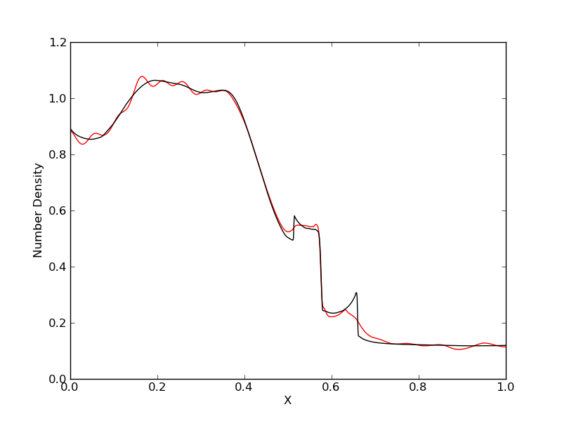
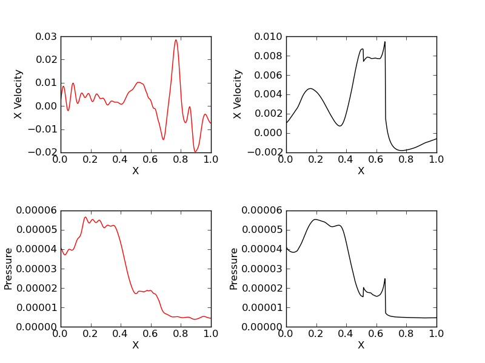
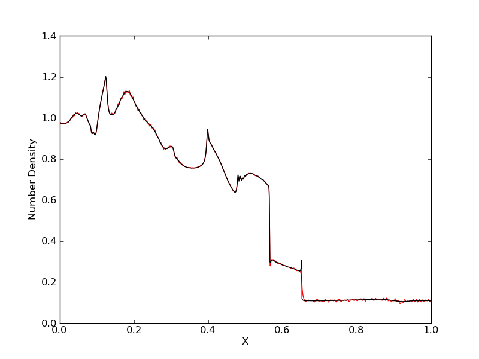
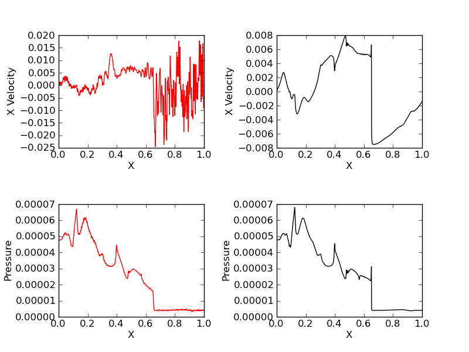
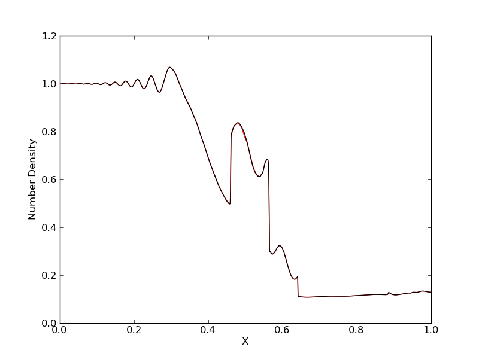
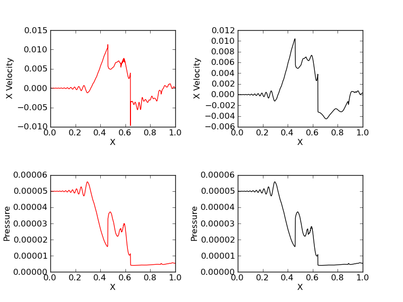
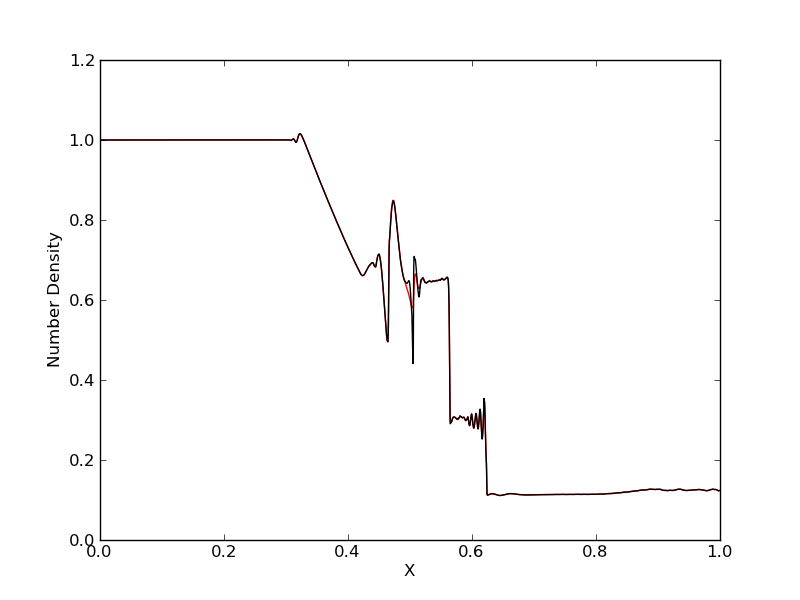
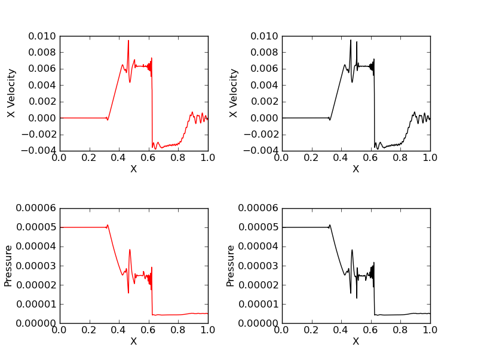

:Author: Ammar Hakim
:Date: September 21st 2011

JE4: Two-fluid electromagnetic Riemann problems
===============================================

.. contents::

In this entry I present solutions of Riemann problems for two-fluid
plasma equations. These problems are not physical but illustrate the
basic mathematical structure of two-fluid solution. There are no exact
solutions to this problems and reference solutions are published in
[Hakim2006]_ and [Loverich2011]_ using two different methods
(wave-propagation and discontinuous Galerkin schemes). In this note I
test the ability of the wave-propagation scheme to solve the two-fluid
equations.

Initial conditions
------------------

The initial conditions are two constant states separated at
:math:`x=0.5`. The states left and right initial states are given by

.. math::

  \left[
    \begin{matrix}
     \rho_e \\
     u_e \\
     v_e \\
     w_e \\
     p_e \\
     \rho_i \\
     u_i \\
     v_i \\
     w_i \\
     E_x \\
     E_y \\
     E_z \\
     B_x \\
     B_y \\
     B_z
    \end{matrix}
  \right]_l
  = 
  \left[
    \begin{matrix}
      1.0 m_e/m_i \\
      0 \\
      0 \\
      0 \\
      5\times 10^{-5} \\
      1.0 \\
      0 \\
      0 \\
      0 \\
      5\times 10^{-5} \\
      0 \\
      0 \\
      0 \\
      0.75\times 10^{-2} \\
      0.0 \\
      1.0\times 10^{-2}
    \end{matrix}
  \right]
  \qquad
  \left[
    \begin{matrix}
     \rho_e \\
     u_e \\
     v_e \\
     w_e \\
     p_e \\
     \rho_i \\
     u_i \\
     v_i \\
     w_i \\
     E_x \\
     E_y \\
     E_z \\
     B_x \\
     B_y \\
     B_z
    \end{matrix}
  \right]_r
  = 
  \left[
    \begin{matrix}
      0.125 m_e/m_i \\
      0 \\
      0 \\
      0 \\
      5\times 10^{-6} \\
      0.125 \\
      0 \\
      0 \\
      0 \\
      5\times 10^{-6} \\
      0 \\
      0 \\
      0 \\
      0.75\times 10^{-2} \\
      0.0 \\
      -1.0\times 10^{-2}
    \end{matrix}
  \right]

The domain is :math:`0<x<1` and the simulations are run to
:math:`t=10`. The mass ratio is set to :math:`m_e/m_i =
1/1836.2`. Simulations are run with with :math:`q_i/m_i =
1,10,100,1000`. These choices seem odd and very artificial but
essentially increasing :math:`q_i/m_i` reduces the ion-skin depth
(relative to the domain size) and drives the plasma regime to
ideal-MHD.

Overview of solution procedure
------------------------------

There isn't a two-fluid solver in Lucee. The two-fluid equations can
be solved by combining the electron and ion solutions (Euler
equations) with the electromagnetic field solutions via source
terms. Hence, the overall solution procedure is to evolve the fluids
and fields independently and then couple them via source terms
(Lorentz forces and current). This makes the Lua program to solve the
two-fluid system a bit complicated as each of the steps needs to be
programmed up separately. However, this has the advantage that
different schemes can be used for each of the subsystems (fluids
and/or fields) to get a more accurate and robust solution. In
particular, it would be possible (and perhaps required) to use a
different scheme for Maxwell equations than preserves the divergence
constraints on the electric and magnetic field. This was not done in
the simulations performed in this note.

Case 1: :math:`q_i/m_i = 1`
---------------------------

In this simulation 1000 grid points were used to solve the
equations. The results are shown below.

  Electron number density (red) compared with ion number density
  (black) for simulation [:doc:`s36
  <../../sims/s36/s36-twofluid-shock>`] with :math:`q_i/m_i =
  1`. Significant charge separation is seen.

  Electron (red) and ion (black) x-velocity (top row) and pressure
  (bottom row).

Case 2: :math:`q_i/m_i = 10`
----------------------------

In this simulation 5000 grid points were used to solve the
equations. The results are shown below.

  Electron number density (red) compared with ion number density
  (black) for simulation [:doc:`s37
  <../../sims/s37/s37-twofluid-shock>`] with :math:`q_i/m_i = 10`. The
  charge separation is seen to reduce.

  Electron (red) and ion (black) x-velocity (top row) and pressure
  (bottom row).

Case 3: :math:`q_i/m_i = 100`
-----------------------------

In this simulation 5000 grid points were used to solve the
equations. The results are shown below.

  Electron number density (red) compared with ion number density
  (black) for simulation [:doc:`s38
  <../../sims/s38/s38-twofluid-shock>`] with :math:`q_i/m_i =
  100`.

  Electron (red) and ion (black) x-velocity (top row) and pressure
  (bottom row).

Case 4: :math:`q_i/m_i = 1000`
------------------------------

In this simulation 5000 grid points were used to solve the
equations. With this charge to mass ratio the limiting time-step for
stability is due to the plasma frequency. The CFL number needs to be
reduced to 0.1 due to which the simulation takes a long time to run
(more than 4 hours on a new Mac laptop). The results are shown below.

  Electron number density (red) compared with ion number density
  (black) for simulation [:doc:`s39
  <../../sims/s39/s39-twofluid-shock>`] with :math:`q_i/m_i = 1000`.

  Electron (red) and ion (black) x-velocity (top row) and pressure
  (bottom row).

References
----------

.. [Hakim2006] A. Hakim, J. Loverich, U. Shumlak, "A high resolution
  wave propagation scheme for ideal Two-Fluid plasma equations",
  *Journal of Computational Physics*, **219**, 2006.

.. [Loverich2011] John Loverich, Ammar Hakim and Uri Shumlak. "A
  Discontinuous Galerkin Method for Ideal Two-Fluid Plasma Equations",
  *Communications in Computational Physics*, **9** (2), Pg. 240-268,
  2011.