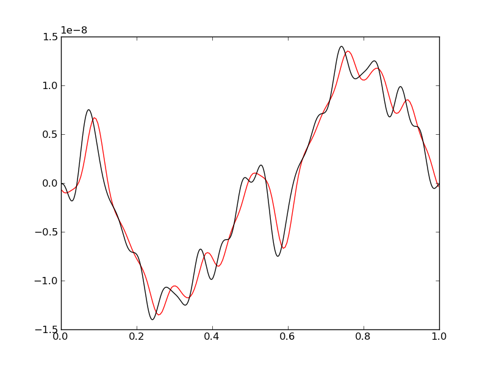
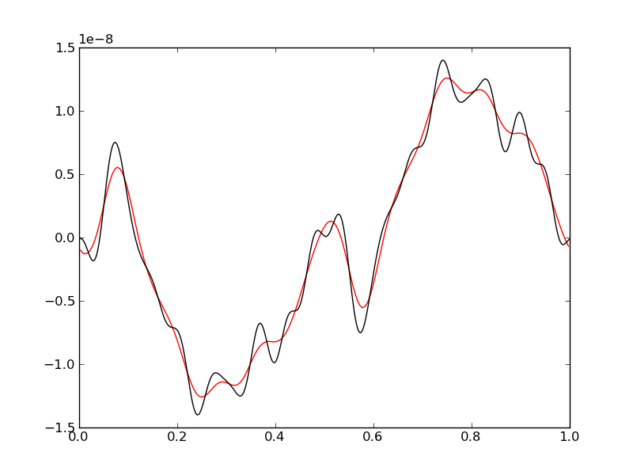
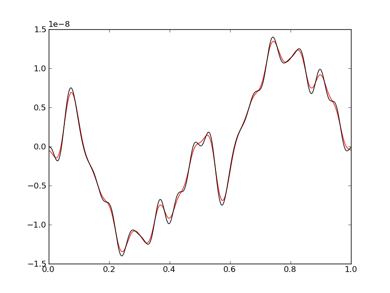

:Author: Ammar Hakim
:Date: September 23st 2011

JE5: Hyperbolic balance laws with dispersive source terms
========================================================

.. contents::

While solving the :doc:`two-fluid Riemann problems
<../je4/je4-twofluid-shock>` small oscillations are observed in the
solution. On first sight it might be thought that these oscillations
are numerical and do not reflect a correct solution to the ideal
two-fluid equation system. In this note I show that such solutions can
(and do) occur when certain types of source terms are present and the
homogeneous system is hyperbolic.

Linearization and hyperbolic balance laws with dispersive sources
-----------------------------------------------------------------

Linearizing a hyperbolic balance law can lead to important insights
into the structure of solutions, although linearization can not reveal
the rich non-linear phenomena (shocks, rarefactions and contact
discontinuities) that are described by these equations. We start from
the non-conservative form of the equations

.. math::

  \frac{\partial \mathbf{v}}{\partial t} 
  + \mathbf{A}_p\frac{\partial \mathbf{v}}{\partial x} = \mathbf{s}_p

where :math:`\mathbf{v}` are the primitive variables,
:math:`\mathbf{A}_p` is a Jacobian matrix and :math:`\mathbf{s}_p` are
source terms. Linearize about a uniform equilibrium
:math:`\mathbf{v}_0` to write :math:`\mathbf{v} = \mathbf{v}_0 +
\mathbf{v}_1`, where :math:`\mathbf{v}_1` is a small
perturbation. Using a Taylor series expansion to first-order to write
:math:`\mathbf{s}_p(\mathbf{v}) = \mathbf{s}_p(\mathbf{v}_0) + \left(
{\partial \mathbf{s}_p}/{\partial \mathbf{v}} \right)_{\mathbf{v}_0}
\mathbf{v}_1` and :math:`\mathbf{A}_p(\mathbf{v}) =
\mathbf{A}_p(\mathbf{v}_0) + \left( {\partial \mathbf{A}_p}/{\partial
\mathbf{v}} \right)_{\mathbf{v}_0} \mathbf{v}_1` and letting
:math:`\mathbf{M}_p \equiv {\partial \mathbf{s}_p}/{\partial
\mathbf{v}}`, the linear form of the non-conservative equation becomes

.. math::

  \frac{\partial \mathbf{v}_1}{\partial t} 
  + \mathbf{A}_p(\mathbf{v}_0)\frac{\partial \mathbf{v}_1}{\partial x} 
  = \mathbf{M}_p(\mathbf{v}_0)\mathbf{v}_1.

To understand the mathematical structure of the linear equation a
Fourier representation of the solution is assumed and each mode is
represented as :math:`\mathbf{v}_1 = \mathbf{\hat{v}}_1 e^{i\omega t}
e^{i k x}`, where :math:`\omega` is the frequency and :math:`k` is the
wavenumber. Using this we obtain

.. math::

  \left[
    i\omega\mathbf{I} + ik\mathbf{A}_p(\mathbf{v}_0) - \mathbf{M}_p(\mathbf{v}_0)
    \right] \mathbf{v}_1 = 0,

where :math:`\mathbf{I}` is a unit matrix. For non-trivial solutions
the determinant of the matrix in the square brackets must
vanish. Another way to state this condition is that the frequency and
wavenumbers must be related by the *dispersion relations*
:math:`\omega = \omega(k)` which are the eigenvalues of the matrix
:math:`-k\mathbf{A}_p(\mathbf{v}_0) -
i\mathbf{M}_p(\mathbf{v}_0)`. Thus if
:math:`\lambda^p(k,\mathbf{v}_0)` is the :math:`p^{\textrm{th}}`
eigenvalue of this matrix then the :math:`p^{\textrm{th}}` branch of
the dispersion relation is :math:`\omega = \lambda^p(k,\mathbf{v}_0)`.

If the dispersion relation is purely real then the equation system
will support non-decaying waves. Further, if the dispersion relation
is *linear*, then a wave packet will propagate without distortion. If,
however, if the dispersion relation is non-linear (but still real),
the wave packet will suffer dispersion, i.e. waves with different
wave-numbers will propagate with different group and phase speeds.

For the simple case of vanishing sources (:math:`\mathbf{s}_p=0`) the
dispersion relation reduces to :math:`\omega = \lambda^p k`, where
:math:`\lambda^p` are the eigenvalues of the Jacobian matrix
:math:`\mathbf{A}_p`. As the homogeneous equation is assumed to be
hyperbolic the eigenvalues are all real, indicating that for the
homogeneous case waves will propagate without dispersion or decay.

This simple analysis indicates that the linear solution will depend on
the nature of the eigenvalues of the source Jacobian matrix
:math:`\mathbf{M}_p`. In case the eigenvalues of this matrix are
*purely imaginary*, the dispersion relation will be real but waves
will sufferer dispersion as they propagate in the background uniform
equilibrium. In this case the system of equations is called
*hyperbolic balance laws with dispersive source terms*. (This is my
own terminology and I have not seen such equations discussed in the
literature).

The Dispersive Euler Equations
------------------------------

Several simple hyperbolic balance laws with dispersive source terms can
be constructed. However, a particularly useful system that has
properties similar to the ideal two-fluid equations is the following
*dispersive Euler* system

.. math::

  &\frac{\partial \rho}{\partial t} + \nabla\cdot(\rho\mathbf{u}) = 0 \\
  &\frac{\partial \mathbf{u}}{\partial t} + 
  \mathbf{u}\cdot\nabla\mathbf{u} =
  -\nabla p/\rho + \lambda\mathbf{u}\times\mathbf{b} \\
  &\frac{\partial p}{\partial t} + \mathbf{u}\cdot\nabla p = 
  -\gamma p \nabla\cdot\mathbf{u}

where :math:`\mathbf{b}(\mathbf{x})` is a time-independent vector
field and :math:`\lambda` is a constant.

Consider solving the linearized system in one-dimension. Linearizing
around stationary uniform initial state :math:`\rho = \rho_0`,
:math:`p = p_0` and assuming :math:`\mathbf{b} = (0,0,b_z)`, where
:math:`b_z` is constant leads to the linear system

.. math::

  \frac{\partial \rho_1}{\partial t} 
  &= -\rho_0\frac{\partial  u_1}{\partial x} \\
  \rho_0\frac{\partial u_1}{\partial t} &= 
  -\frac{\partial p_1}{\partial x} + \rho_0 \lambda v_1 b_z \\
  \rho_0\frac{\partial v_1}{\partial t} &= -\rho_0 \lambda u_1 b_z \\
  \frac{\partial p_1}{\partial t} &= 
  -\gamma p_0 \frac{\partial u_1}{\partial x}

Assuming solutions of the form

.. math::

  f(x,t) = \sum_{n=0}^\infty f_n e^{i(k_n x + w_n t)}

for :math:`f\in \{\rho_1,u_1,v_1,p_1\}` and :math:`k_n` is the wave
number and :math:`\omega_n` is frequency we get the algebraic
equations

.. math::

  i \omega_n \rho_1 &= - i k_n u_1 \rho_0  \\
  i \omega_n u_1 \rho_0 &= -i k_n p_1 + \lambda v_1 b_z \\
  i \omega_n v_1 \rho_0 &= - \rho_0 \lambda u_1 b_z \\
  i \omega_n p_1 &= i \gamma p_0 k_n u_1. 

From this the dispersion relation can be computed as

.. math::

  \omega_n = \pm ( k_n^2 c_{s0}^2 + \omega_c^2 )^{1/2}

Here :math:`c_{s0} \equiv \sqrt{\gamma p_0/\rho_o}` is the speed of
sound and :math:`\omega_c \equiv \lambda b_z` is the eigenvalue of the
source Jacobian.

Exact solution for initial step function perturbation
-----------------------------------------------------

Consider a initial perturbation of the form :math:`u(x,0)` where

.. math::

  u_1(x,t) = U_0 \sum_{n=0}^N 
  \frac{i}{2n+1} e^{i k_nx} e^{i \omega_n t}

with :math:`k_n = 2\pi(2n+1)`. For :math:`N\rightarrow \infty` this
represents a the propagation of a step function perturbation. Letting
:math:`u_i^{(n)} \equiv i U_0 /(2n+1) e^{i(k_nx+\omega_nt)}` the
Fourier components of the other flow variable perturbations are given
by

.. math::

  \rho_1^{(n)} &= -\frac{k_n\rho_0}{\omega_n} u_1^{(n)} \\
  v_1^{(n)} &= -i\frac{\lambda b_z}{\omega_n} u_1^{(n)} \\
  p_1^{(n)} &= -\frac{\gamma k_n p_0}{\omega_n} u_1^{(n)},

summing which over :math:`n=0,\ldots,N` gives the exact solution to
the linear problem. The following figure shows the exact solution for
:math:`N=5000`, :math:`\omega_c = 10` and :math:`c_s = \sqrt{2}`
at time 1000.

  Exact solution [:doc:`s41 <../../sims/s41/s41-sqpulse-exact>`] of
  the linear dispersive Euler equation for :math:`N=5000`,
  :math:`\omega_c = 10` and :math:`c_s = \sqrt{2}` at time 1000. Very
  fine small-scale features are seen which, in a numerical solution,
  might be mistaken for numerical noise.

A note on solving dispersive Euler equations with Lucee
-------------------------------------------------------

The dispersive Euler equations can be solved by adding a source term
to the Euler equations. The source terms can be implemented using a
Lorentz force object. This object needs an electric and magnetic field
as input. Hence, we need to allocate memory for all the field
components and set the electric field to zero. Due to the peculiarity
of the point ODE integrator, this memory needs to be part of the fluid
fields. Hence, in the simulations shown below (see, for example,
:doc:`s40 <../../sims/s40/s40-dispersive-euler>`) the fields have 11
components (5 for fluids and 3 for electric field and 3 for magnetic
field).

Problem 1: Case :math:`\omega_c = 10`
-------------------------------------

A series of simulations was performed for the case of :math:`\omega_c
= 10` and :math:`c_s = \sqrt{2}`. To avoid exciting all the Fourier
modes in the step function, the expansion was carried out to only
:math:`N=9` modes. The solution was computed on grids of 100, 200, 300
and 400 cells. The results of velocity :math:`u(x,t)` are shown below
at :math:`t=3`. The wave-propagation scheme has intrinsic diffusion
due to which the small wavelength features are poorly resolved when
the grid is relatively coarse.

  Velocity at :math:`t=3` for :math:`\omega_c = 10` for different grid
  resolutions. The red lines are the numerical results while the black
  lines is the exact solution. The top-left figure shows 100 cell
  results [:doc:`s40 <../../sims/s40/s40-dispersive-euler>`],
  top-right 200 cell results [:doc:`s42
  <../../sims/s42/s42-dispersive-euler>`], bottom-left 300 cell
  results [:doc:`s43 <../../sims/s43/s43-dispersive-euler>`] and
  bottom-right 400 cell results [:doc:`s44
  <../../sims/s44/s44-dispersive-euler>`]. At low resolution the small
  wavelength features are poorly resolved due to numerical diffusion
  of the scheme.

Problem 2: Case :math:`\omega_c = 100`
--------------------------------------

In these simulations, the influence from sources was increased by
setting :math:`\omega_c = 100`. The simulation is run on a grid with
200 cells. The time-step for this case is constrained by the need to
resolve the oscillations from the source terms. Taking :math:`k
\approx 1/\Delta x = 1/200` we get the largest frequency as
approximately 283. To resolve this the time-step needs to much smaller
than :math:`1/238 \approx 0.0035`. This forces a more restrictive CFL
number (0.5) than allowed by stability of just the hyperbolic part. If
the oscillations are not resolved significant phase errors are seen in
the solution.

  Velocity at :math:`t=3` for :math:`\omega_c = 100` with 200 cells
  [:doc:`s48 <../../sims/s48/s48-dispersive-euler>`] and with a CFL
  number of 0.9. The red line is the numerical result while the black
  line is the exact solution. The numerical solution is not only
  highly diffuse but the peaks are not in the correct location,
  showing phase errors in resolving the oscillations from the
  dispersive terms. The reason for these phase errors, even though the
  time-step satisfies the fluid CFL condition, is that the oscillation
  period of the smallest wavenumber waves is not adequately resolved.

  Velocity at :math:`t=3` for :math:`\omega_c = 100` with 200 cells
  [:doc:`s45 <../../sims/s45/s45-dispersive-euler>`] with a CFL nu,ber
  of 0.5.  The red line is the numerical result while the black line
  is the exact solution. Significant diffusion is seen in the results
  as well as small phase errors. Taking an even smaller time step will
  reduce the phase error but add even more diffusion.

The simulation was next run with 400 cells. This significantly
improves the numerical solution even though some small-scale features
are still not resolved correctly.

  Velocity at :math:`t=3` for :math:`\omega_c = 100` with 400 cells
  [:doc:`s46 <../../sims/s46/s46-dispersive-euler>`].  The red line is
  the numerical result while the black line is the exact
  solution. The solution is now much better resolved, although some
  small scale features are not resolved well.

Problem 3: Sod-shock problem
----------------------------

The previous simulations show the effect of dispersive source terms on
linear problems. In this simulation I solve the sod-shock problem for
the dispersive Euler equations. This is a highly non-linear problem
and shows complex shock structure. The problem is initialized with a
discontinuity at :math:`x=0.5` and with left and right states

.. math::

  \left[
    \begin{matrix}
      \rho_l \\
      p_l
    \end{matrix}
  \right]
  = 
  \left[
    \begin{matrix}
      3.0 \\
      3.0
    \end{matrix}
  \right],
  \qquad
  \left[
    \begin{matrix}
      \rho_r \\
      p_r
    \end{matrix}
  \right]
  = 
  \left[
    \begin{matrix}
      1.0 \\
      1.0
    \end{matrix}
  \right].

and is run to :math:`t=0.1` on a grid of 800 cells with
:math:`\mathbf{b} = (0.75, 0.0, 1.0)`, :math:`\lambda=100` and
:math:`\gamma = 5/3`.

The results are shown below. These show significant differences
between the zero-source case and the one with the dispersive
sources. Note that the solution looks like the two-fluid solutions to
the Riemann problem.

  Solution at :math:`t=0.1` for Sod-shock problem [:doc:`s47
  <../../sims/s47/s47-dispersive-euler>`]. Density (top left),
  velocity (top right), pressure (bottom left) and internal energy
  (bottom right). Solutions are significantly different from the
  homogeneous case and look similar to the two-fluid Riemann
  solutions.

Conclusions
-----------

One conclusion from these series of simulations is that dispersive
source terms can cause small-scale features in the solution. To
resolve these features sufficient spatial *and* temporal resolution is
needed. Poor spatial resolution can diffuse the oscillations while
poor temporal resolution can lead to phase errors. In physical
problems (for example multi-fluid plasmas) there is usually some
diffusion that is active at small scales and can be important when the
gradients change rapidly over a few grid cells. This physical
diffusion will wipe out the oscillations from the dispersive
sources. Hence, in such cases the resolution of the oscillations might
not be so important. However, from a mathematical view-point the
numerical schemes need to be accurate enough to resolve such features.