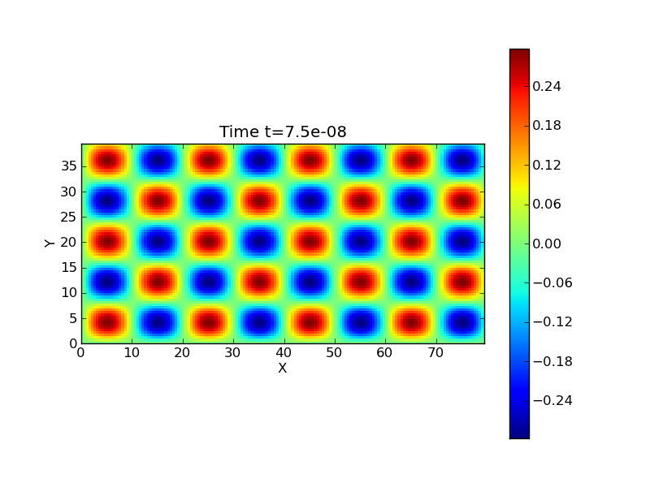
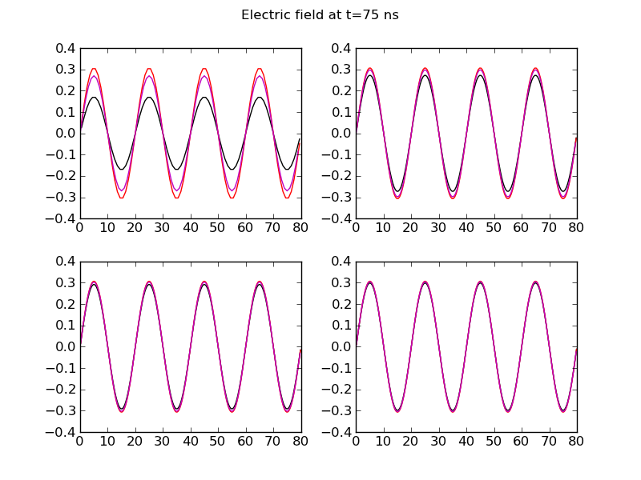
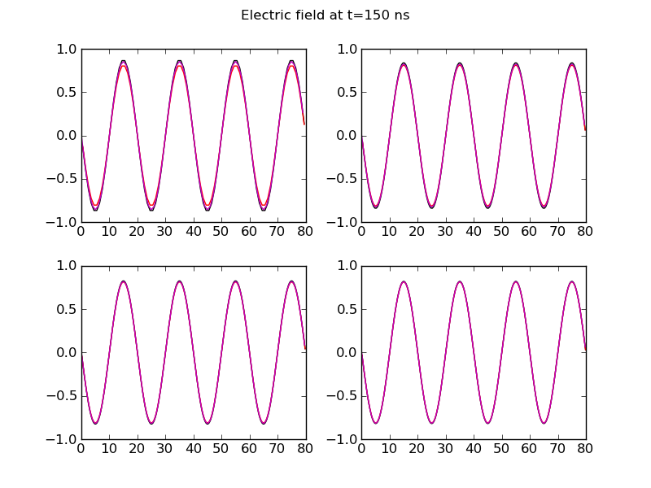

:Author: Ammar Hakim
:Date: September 28th 2011

JE6: Solving Maxwell equations with wave-propagation and FDTD schemes
=====================================================================

.. contents::

In this note I compare solutions for Maxwell equations obtained with
the wave-propagation scheme and Finite-Difference Time Domain (FDTD)
scheme. These schemes actually solve different forms of the equations
and with different layout of the electromagnetic fields on the
grid. The wave-propagation scheme collocates all field components
while the FDTD scheme staggers the field components on the cell faces
and edges. The advantage of the collocated fields is that limiters can
be applied that allow the solver to be used when the fields have
discontinuities or sharp gradients. The staggered field formulation,
on the other hand, satisfies basic vector identities for the discrete
fields. This is specially important for the Maxwell equations in which
the divergence relations on electric and magnetic fields are not
explicitly used in the update equations. However, the staggered field
formulation is harder to extend to non-rectangular grids.

One of the intended applications of these Maxwell solvers is to the
solution of two-fluid equations. It is straightforward to apply the
wave-propagation Maxwell scheme to solve the two-fluid
equations. However, some work is required to make the FDTD scheme work
with the cell-centered fluid solvers, in particular, the staggered
fields need to be interpolated back to cell centers before computing
the Lorentz force.

Problem 1: 2D Transverse Magnetic modes in a box
------------------------------------------------

In this problem the domain is a rectangular metal box :math:`[0, X]
\times [0, Y]`. The electric field is initialized with

.. math::

  E_z = E_0 \sin(ax) \sin(by)

where :math:`a = m\pi/X` and :math:`b = n\pi/Y`. All other field
components are set to zero. Also, :math:`E_0 = 1`, :math:`m=8`,
:math:`n=5`, :math:`X = 80` and :math:`Y=40`. All quantities are in SI
units. The simulation is evolved to 150 ns. The exact solution for
:math:`E_z` is

.. math::

  E_z = E_0 \sin(ax) \sin(by) \cos(\omega t)

where the frequency :math:`\omega = c \sqrt{a^2 + b^2}` and :math:`c`
is the speed of light.

The first set of simulations were performed to test the convergence of
the schemes. The simulations were run on grids :math:`80 \times 40`,
:math:`160 \times 80`, :math:`240 \times 120` and :math:`320 \times
160`. The time-step was selected to satisfy the CFL condition for that
grid resolution. This *does not* check the convergence of just the
spatial discretization (for which we would have to use the same
time-step for all grids) but of both the temporal *and* spatial
discretization. For each scheme the error was computed as the average
error in :math:`E_z` at two time slices, 75 ns and 150 ns.

.. math::

  \epsilon = \frac{1}{N_x N_y} \sum_{i,j} | \hat{E}_z - E_z |

where :math:`\hat{E}_z` is the numerical solution and :math:`N_x
\times N_y` is the grid size. The summation is performed over all
cells.

Convergence of the wave-propagation scheme
++++++++++++++++++++++++++++++++++++++++++

The following table shows the errors and order of convergence of the
wave-propagation scheme at :math:`t=75` ns.

.. list-table:: Wave-propagation at :math:`t=75` ns
  :header-rows: 1
  :widths: 20,40,20,20

  * - Grid size :math:`\Delta x`
    - Average error
    - Order
    - Simulation
  * - :math:`1.00`
    - :math:`5.4325\times 10^{-2}`
    - 
    - :doc:`s49 <../../sims/s49/s49-tm-maxwell-wave>`
  * - :math:`0.50`
    - :math:`1.3455\times 10^{-2}`
    - :math:`2.01`
    - :doc:`s50 <../../sims/s50/s50-tm-maxwell-wave>`
  * - :math:`0.3\overline{3}`
    - :math:`5.9281\times 10^{-3}`
    - :math:`2.02`
    - :doc:`s51 <../../sims/s51/s51-tm-maxwell-wave>`
  * - :math:`0.25`
    - :math:`3.3175\times 10^{-3}`
    - :math:`2.01`
    - :doc:`s52 <../../sims/s52/s52-tm-maxwell-wave>`

The following table shows the errors and order of convergence of the
wave-propagation scheme at :math:`t=150` ns.

.. list-table:: Wave-propagation at :math:`t=150` ns
  :header-rows: 1
  :widths: 20,40,20,20

  * - Grid size :math:`\Delta x`
    - Average error
    - Order
    - Simulation
  * - :math:`1.00`
    - :math:`3.2705\times 10^{-2}`
    - 
    - :doc:`s49 <../../sims/s49/s49-tm-maxwell-wave>`
  * - :math:`0.50`
    - :math:`1.3102\times 10^{-2}`
    - :math:`1.32`
    - :doc:`s50 <../../sims/s50/s50-tm-maxwell-wave>`
  * - :math:`0.3\overline{3}`
    - :math:`6.3531\times 10^{-3}`
    - :math:`1.79`
    - :doc:`s51 <../../sims/s51/s51-tm-maxwell-wave>`
  * - :math:`0.25`
    - :math:`3.7010\times 10^{-3}`
    - :math:`1.88`
    - :doc:`s52 <../../sims/s52/s52-tm-maxwell-wave>`

It seems a bit odd that the late time solution converges slower than
the second-order convergence seen earlier in time. This is probably
because phase error in the waves accumulates, reducing the accuracy of
the solution.

The following figure shows the wave-propagation solution at
:math:`t=75` ns.

  Solution computed with the wave-propagation scheme for :math:`E_z`
  at :math:`t=75` ns for :math:`160 \times 80` cells [:doc:`s50
  <../../sims/s50/s50-tm-maxwell-wave>`].

Convergence of the FDTD scheme
++++++++++++++++++++++++++++++

The FDTD scheme requires the electric field at :math:`t=0` as well as
the magnetic field at :math:`t=\Delta t/2`. Although in general the
exact magnetic field is not available at :math:`t=\Delta t/2`, it can
be computed by using the curl updater and a forward difference in
time. If this is not done (i.e. the magnetic field is just initialized
at :math:`t=0`) the overall scheme becomes first-order. The
simulations performed with Lucee use this technique to initialize the
simulation.

The following table shows the errors and order of convergence of the
FDTD scheme at :math:`t=75` ns.

.. list-table:: FDTD at :math:`t=75` ns
  :header-rows: 1
  :widths: 20,40,20,20

  * - Grid size :math:`\Delta x`
    - Average error
    - Order
    - Simulation
  * - :math:`1.00`
    - :math:`1.4680\times 10^{-2}`
    - 
    - :doc:`s53 <../../sims/s53/s53-tm-maxwell-fdtd>`
  * - :math:`0.50`
    - :math:`3.7292\times 10^{-3}`
    - :math:`1.98`
    - :doc:`s54 <../../sims/s54/s54-tm-maxwell-fdtd>`
  * - :math:`0.3\overline{3}`
    - :math:`1.6707\times 10^{-3}`
    - :math:`1.98`
    - :doc:`s55 <../../sims/s55/s55-tm-maxwell-fdtd>`
  * - :math:`0.25`
    - :math:`9.4569\times 10^{-4}`
    - :math:`1.98`
    - :doc:`s56 <../../sims/s56/s56-tm-maxwell-fdtd>`

The following table shows the errors and order of convergence of the
FDTD scheme at :math:`t=150` ns.

.. list-table:: FDTD at :math:`t=150` ns
  :header-rows: 1
  :widths: 20,40,20,20

  * - Grid size :math:`\Delta x`
    - Average error
    - Order
    - Simulation
  * - :math:`1.00`
    - :math:`1.6899\times 10^{-2}`
    - 
    - :doc:`s53 <../../sims/s53/s53-tm-maxwell-fdtd>`
  * - :math:`0.50`
    - :math:`4.4830\times 10^{-3}`
    - :math:`1.91`
    - :doc:`s54 <../../sims/s54/s54-tm-maxwell-fdtd>`
  * - :math:`0.3\overline{3}`
    - :math:`2.0188\times 10^{-3}`
    - :math:`1.97`
    - :doc:`s55 <../../sims/s55/s55-tm-maxwell-fdtd>`
  * - :math:`0.25`
    - :math:`1.1428\times 10^{-3}`
    - :math:`1.98`
    - :doc:`s56 <../../sims/s56/s56-tm-maxwell-fdtd>`

The following figure shows the FDTD solution at :math:`t=75` ns.

  Solution computed with the FDTD scheme for :math:`E_z` at
  :math:`t=75` ns for :math:`160 \times 80` cells [:doc:`s54
  <../../sims/s54/s54-tm-maxwell-fdtd>`].

Comparison of wave-propagation and FDTD solutions
+++++++++++++++++++++++++++++++++++++++++++++++++

The following plots compare the solutions obtained by the
wave-propagation scheme and the FDTD scheme along the slice
:math:`y=20` for different grid resolutions.

  Comparison of wave-propagation solution (black) to FDTD solution
  (magenta) with exact solution (red) for :math:`80\times 40`
  (top-left), :math:`160\times 80` (top-right), :math:`240\times 120`
  (bottom-left) and :math:`320\times 160` (bottom-right) at
  :math:`t=75` ns. At lower resolution the FDTD scheme is more
  accurate but both schemes give good results with higher resolution.

  Comparison of wave-propagation solution (black) to FDTD solution
  (magenta) with exact solution (red) for :math:`80\times 40`
  (top-left), :math:`160\times 80` (top-right), :math:`240\times 120`
  (bottom-left) and :math:`320\times 160` (bottom-right) at
  :math:`t=150` ns. Both schemes give good results late in time,
  although the wave-propagation scheme converges slower than the FDTD
  scheme.

Conclusions
-----------

The FDTD scheme is more efficient and accurate than the
wave-propagation scheme when the fields are smooth. This is not
surprising as a Riemann problem needs to be solved at each interface
making the scheme slower and upwinding adds diffusion. The FDTD scheme
also preserves the divergence constraints due to the staggered fields
and leap-frog time-stepping. On the other hand, the wave-propagation
scheme needs some sort of divergence cleaning to maintain the
divergence relations. The advantage of the wave-propagation (and other
colocated field schemes) is that it handles discontinuities and is
easier to extend to non-rectangular grids. It should be possible to
develop a hybrid scheme that has best of both these schemes by
utitlizing the duality property of fluxes in the Riemann solver based
schemes and the fields in FDTD scheme.
