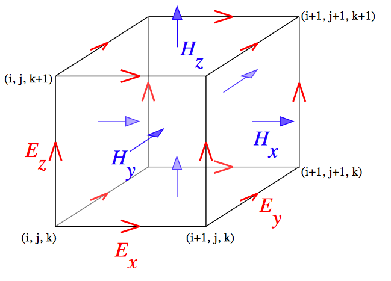
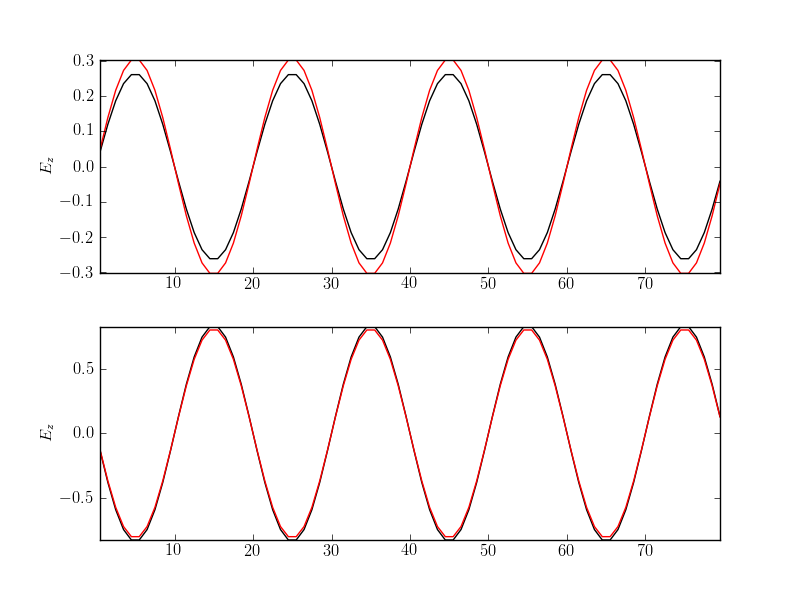
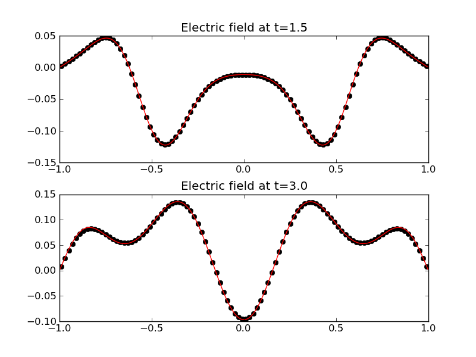

:Author: Ammar Hakim

JE7: The dual Yee-cell FDTD scheme
==================================

.. contents::

Overview
--------

The Finite-Difference Time Domain (FDTD) scheme uses the Yee cell to
store the electromagnetic fields. The electric field components are
stored on the corresponding cell edges, while the magnetic field
components are stored on the corresponding face centers. See the
following figure.

The advantage of the Yee-cell (and its dual) is that the discrete curl
operators "move" the edge-based fields to the face centers and the
face-based fields to edges. This provides a natural centering of the
differencing operators, which when combined with a leap-frog time
differencing leads to a second-order accurate scheme both in space and
time. Further, the divergence relations are automatically satisfied
[#divergence]_.

  Standard Yee-cell. The electric field components are located on the
  edges while the magnetic field components are located on the face
  centers. In the dual Yee-cell the location of the electric and
  magnetic field components are swapped. Figure taken from `Wikipedia
  <http://en.wikipedia.org/wiki/Finite-difference_time-domain_method>`_.

The standard Yee-cell is usually preferred for most EM problems
because it is easier to apply perfect electric conductor (PEC)
boundary conditions. In certain situations, however, the dual
Yell-cell is required due to constraints on the field locations from
some other solves needed to study the physics. This is true for the
two-fluid hybrid FV/FDTD scheme in which the current components are
computed are face centers. In this note use Lucee to solve and test
the EM equations on the dual Yee-cell (the standard Yee-cell was
tested in :doc:`JE6 <../je6/je6-maxwell-solvers>`). This is in
preparation of using this solve in a full two-fluid FV/FDTD divergence
preserving scheme.

A note on the algorithms and boundary conditions
------------------------------------------------

The FDTD method on the standard Yee-cell can be schematically written
as

.. math::

  \mathbf{E}^{n+1} &= 
     \mathbf{E}^n + \Delta t/c^2\thinspace \nabla_F\times\mathbf{B}^{n+1/2} \\
  \mathbf{B}^{n+3/2} &= 
     \mathbf{B}^{n+1/2} - \Delta t\thinspace \nabla_E\times\mathbf{E}^{n+1}

Here, the symbols :math:`\nabla_F\times` and :math:`\nabla_E\times`
represent the discrete curl operators on face-located and edge-located
fields respectively. For PEC boundary conditions the magnetic field
components are copied on each of the lower boundaries, while the
electric field components are set to zero on each of the upper
boundaries.

The FDTD method of the dual Yee-cell can be schematically written as

.. math::

  \mathbf{B}^{n+1/2} &= 
     \mathbf{B}^{n-1/2} - \Delta t\thinspace \nabla_F\times\mathbf{E}^{n} \\
  \mathbf{E}^{n+1} &= 
     \mathbf{E}^n + \Delta t/c^2\thinspace \nabla_E\times\mathbf{B}^{n+1/2}

For PEC boundary conditions the tangential electric field components
are copied out on lower boundaries and the normal magnetic field
components are copied on upper boundaries. Note that is not strictly
necessary to apply the magnetic field BCs in this case as the normal
derivative of normal field components never show up in the Maxwell
equations. In addition, the electric field needs to be updated in one
extra layer of cells on each upper boundary to ensure the correct
update of the interior magnetic field.

Note that the order of updates in the two schemes is reversed,
although the electric and magnetic fields are available at the same
time levels.

Problem 1: 2D Transverse Magnetic modes in a box
------------------------------------------------

This problem is identical to :ref:`je6_problem1-ref`. See that section
for the initial and boundary conditions. The simulation was run on a
:math:`80 \times 40` grid and the electric field along the slice
:math:`Y=20` was compared to the exact solution. The results are shown
below.

  Electric field :math:`E_z` along the slice :math:`Y=20` as computed
  from the dual Yee-cell FDTD scheme (black) compared to exact
  solution (red) at :math:`t=75` ns (top) and :math:`t=150` ns
  (bottom). See [:doc:`s63 <../../sims/s63/s63-tm-maxwell-fdtd-dual>`]
  for input file.

Problem 2: Electromagnetic pulse in a box
-----------------------------------------

This problem is identical to :ref:`je6_problem2-ref`. See that section
for the initial conditions and boundary conditions. The simulation was
run on a :math:`100 \times 100` grid and compared with a :math:`400
\times 400` grid solution computed with the wave-propagation
scheme. The results are shown below.

  Electric field :math:`E_z` along the slice :math:`Y=0` as computed
  from the dual Yee-cell FDTD scheme (black dots) compared to
  converged solution (red) at :math:`t=1.5` (top) and :math:`t=3.0`
  (bottom). See [:doc:`s64 <../../sims/s64/s64-pulsebox-fdtd-dual>`]
  for input file.

Conclusions
-----------

The FDTD scheme on dual Yee-cell is tested and shown to work
correctly. One note (for the record) is that it took some time to get
this algorithm to work correctly, specially the updates at the
boundaries.

.. [#divergence] This is strictly true only in free-space. When
   charges and currents are present the currents need to be spatially
   co-located with the electric field and staggered by half a
   time-step. In essence what this means is that the charge
   conservation relation needs to be consistently discretized with the
   curl equations.
