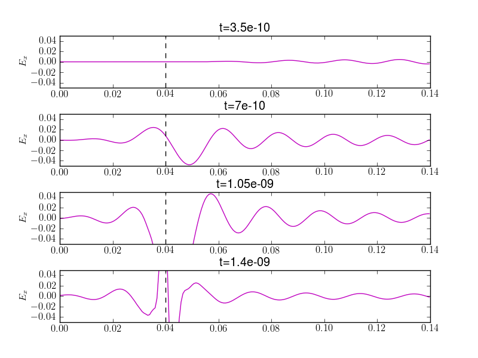

:Author: Ammar Hakim
:Date: October 26th 2011
:Completed: 

JE9: Tunneling through an electron-cyclotron cutoff layer
=========================================================

In this note I study the propagation of an radio-frequency (RF) wave
into a electron-cyclotron cutoff layer. As in the plasma beach
problem, the ions are assumed to be stationary and are not
evolved. The plasma is initialized with a uniform density and is
threaded with a non-uniform static transverse field. This static field
exerts a Lorentz force on the electrons but is not evolved or included
in the electric field update equations. What this means physically is
that the static field is assumed to be created from a set of external
coils and hence its curl is zero.

The domain is one-dimensional, :math:`0 <x < 0.14`, with open boundary
conditions on either end. The plasma density is set to
:math:`1\times10^{17}`/m :math:`^3`. An electromagnetic wave is driven
by a current applied at the center of the last cell, i.e.,

.. math::

  J_y(t) = J_0\sin(2\pi f_d t)
  \sin\big(0.5\pi \min(1, 0.1 f_d t)\big)

where :math:`f_d = 15\times 10^9` Hz is the drive frequency. The
second factor in the above equation ramps up the source slowly so as
to avoid exciting small scale oscillations and extraneous modes. The
static magnetic field is set to

.. math::

  B_z(x) = B_0\frac{R_0+x_c}{R_0+x}

where :math:`B_0 = 0.536` Tesla, :math:`R_0 = 5\times10^{-3}` and
:math:`x_c = 0.04` m is the location at which the electron cyclotron
frequency matches the drive frequency. The electron temperature is set
to :math:`1\times10^{-2}` eV, i.e. the electrons are cold.

The problem was run on a 200 cell grid and run to :math:`1.4` ns. The
results of :math:`E_x` and :math:`E_y` are plotted below at different
time frames. The results show that the EM wave suffers a cutoff at
:math:`x_c` and tunnels into the cyclotron layer. It is also seen that
the electrostatic field develops a sharp spike around the cutoff layer
as the wave number becomes infinite there.

.. figure:: s72-Ey.png
  :width: 100%
  :align: center

  The electric field (:math:`E_y`) of the EM wave at different
  times. The black dashed line shows the location of the cyclotron
  cutoff. The wave tunnels through the electron cyclotron resonance
  layer, forming a distinct standing wave pattern late in time.

  The electrostatic field (:math:`E_x`) wave at different times. The
  black dashed line shows the location of the cyclotron cutoff. A very
  sharp spike develops at the cutoff location as the wave number
  becomes infinite.
