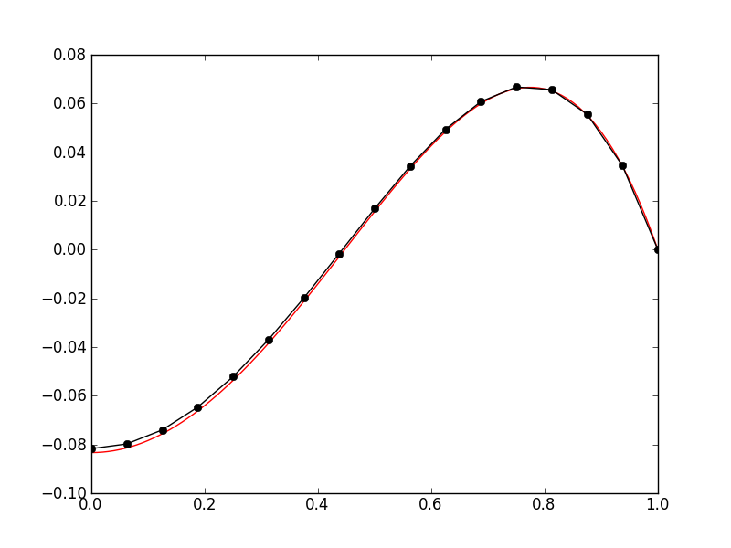
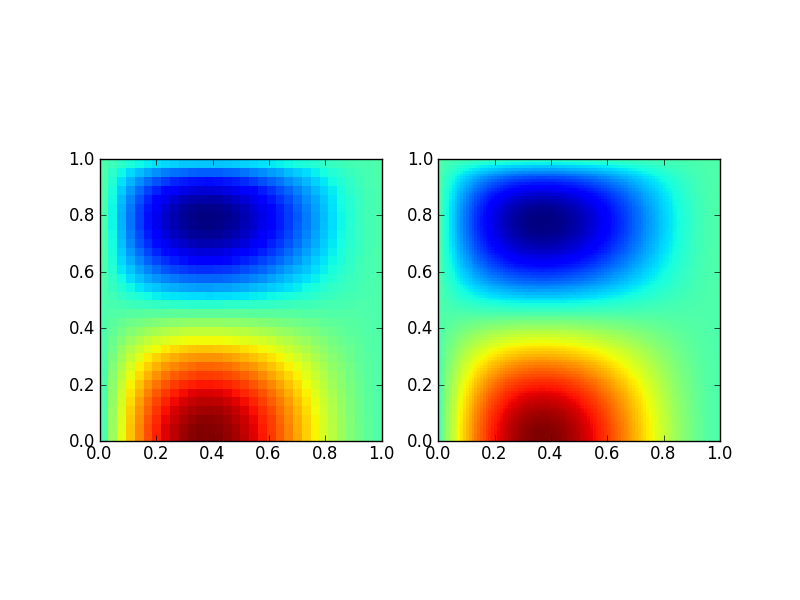
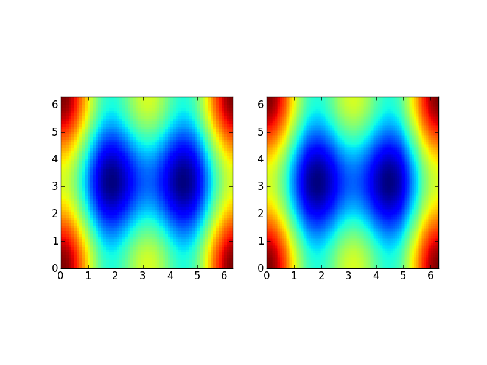

:Author: Ammar Hakim
:Date: March 13th 2012
:Completed: March 13th 2012
:Last Updated:  April 9th 2012

JE11: Benchmarking a finite-element Poisson solver
==================================================

.. contents::

In this entry I benchmark and test a finite-element method (FEM)
Poisson solver. The solver is implemented in Lucee/Gkeyll as the class
``FemPoissonStructUpdater`` and solves the equation

.. math::

  \nabla^2 \psi = s

where :math:`s` is the spatially dependent source term. This updater
works in 1D, 2D and 3D and is agnostic of the underlying nodal basis
functions, which need to be provided separately.

Convergence of 1D solver
------------------------

In this test the convergence of the 1D solver is tested with an exact
solution. The source is chosen to be

.. math::

 s(x) = 1-ax^2

where :math:`a=2`. With this the exact solution is

.. math::

 \psi(x) = \frac{x^2}{2} - \frac{ax^4}{12} + c_0 x + c_1

where :math:`c_0` and :math:`c_1` are constants of integration. 

Dirichlet boundary conditions
+++++++++++++++++++++++++++++

For the first test we pick the domain :math:`x\in [0,1]` and Dirichlet
boundary conditions :math:`\psi(0)=\psi(1)=0`. With these we get
:math:`c_1=0` and :math:`c_0=a/12-1/2`.

The following table shows the errors for the second-order Lobatto
scheme with different cell sizes corresponding to 8, 16, 32, and 64
elements and with :math:`a=2`.

.. list-table:: Poisson solver convergence for second-order FEM with
		Dirichlet boundary conditions
  :header-rows: 1
  :widths: 20,40,20,20

  * - Grid size :math:`\Delta x`
    - Average error
    - Order
    - Simulation
  * - :math:`0.125`
    - :math:`3.797 \times 10^{-4}`
    - 
    - :doc:`s77 <../../sims/s77/s77-poisson-1d>`
  * - :math:`0.0625`
    - :math:`1.01725 \times 10^{-4}`
    - 1.90
    - :doc:`s78 <../../sims/s78/s78-poisson-1d>`
  * - :math:`0.03125`
    - :math:`2.627\times 10^{-5}`
    - 1.95
    - :doc:`s79 <../../sims/s79/s79-poisson-1d>`
  * - :math:`0.015625`
    - :math:`6.675726\times 10^{-6}`
    - 1.98
    - :doc:`s80 <../../sims/s80/s80-poisson-1d>`

An example solution with 16 elements is shown below.

.. figure:: s78-poisson-cmp.png
  :width: 100%
  :align: center

  Solution computed with the 1D Poisson finite-element updater (black)
  compared to the exact solution (red) for 16 elements [:doc:`s78
  <../../sims/s78/s78-poisson-1d>`] and Dirichlet boundary conditions.

Dirichlet/Neumann boundary conditions
+++++++++++++++++++++++++++++++++++++

For the second test we use Dirichlet and Neumann boundary conditions
:math:`{\partial \psi}/{\partial x}=0` at :math:`x=0` and
:math:`\psi(1)=0`. With these we get :math:`c_0=0` and
:math:`c_1=a/12-1/2`.

The following table shows the errors for the second-order Lobatto
scheme with different cell sizes corresponding to 8, 16, 32, and 64
elements and with :math:`a=5`.

.. list-table:: Poisson solver convergence for second-order FEM with
		Dirichlet/Neumann boundary conditions
  :header-rows: 1
  :widths: 20,40,20,20

  * - Grid size :math:`\Delta x`
    - Average error
    - Order
    - Simulation
  * - :math:`0.125`
    - :math:`4.20464 \times 10^{-3}`
    - 
    - :doc:`s81 <../../sims/s81/s81-poisson-1d>`
  * - :math:`0.0625`
    - :math:`1.06812 \times 10^{-3}`
    - 1.98
    - :doc:`s82 <../../sims/s82/s82-poisson-1d>`
  * - :math:`0.03125`
    - :math:`2.69148\times 10^{-4}`
    - 1.99
    - :doc:`s83 <../../sims/s83/s83-poisson-1d>`
  * - :math:`0.015625`
    - :math:`6.75519\times 10^{-5}`
    - 1.99
    - :doc:`s84 <../../sims/s84/s84-poisson-1d>`

An example solution with 16 elements is shown below.

  Solution computed with the 1D Poisson finite-element updater (black)
  compared to the exact solution (red) for 16 elements [:doc:`s82
  <../../sims/s82/s82-poisson-1d>`] and Neumann boundary conditions on
  left and Dirichlet boundary conditions on right.

Convergence of high order 1D Poisson solver
-------------------------------------------

In this test the convergence of the 3rd and 4th order 1D solvers is
tested with an exact solution. The source is chosen to be

.. math::

 s(x) = 1+ax^2+bx^4

where :math:`a=2` and :math:`b=-12`. With this the exact solution is

.. math::

 \psi(x) = \frac{x^2}{2} + \frac{ax^4}{12} + \frac{bx^6}{30} + c_0 x + c_1

where :math:`c_0` and :math:`c_1` are constants of integration. For
the first test we pick the domain :math:`x\in [0,1]` and Dirichlet
boundary conditions :math:`\psi(0)=\psi(1)=0`. With these we get
:math:`c_1=0` and :math:`c_0=-(1/2+a/12+b/30)`.

Convergence of third-order method
+++++++++++++++++++++++++++++++++

The following table shows the errors for the third-order Lobatto
scheme with different cell sizes corresponding to 4, 8, 16, and 32
elements and with :math:`a=2`.

.. list-table:: Poisson solver convergence for third-order FEM with
		Dirichlet boundary conditions
  :header-rows: 1
  :widths: 20,40,20,20

  * - Grid size :math:`\Delta x`
    - Average error
    - Order
    - Simulation
  * - :math:`0.25`
    - :math:`7.742 \times 10^{-5}`
    - 
    - :doc:`s89 <../../sims/s89/s89-poisson-o3-1d>`
  * - :math:`0.125`
    - :math:`5.397 \times 10^{-6}`
    - 3.84
    - :doc:`s90 <../../sims/s90/s90-poisson-o3-1d>`
  * - :math:`0.0625`
    - :math:`3.535 \times 10^{-7}`
    - 3.93
    - :doc:`s91 <../../sims/s91/s91-poisson-o3-1d>`
  * - :math:`0.03125`
    - :math:`2.249\times 10^{-8}`
    - 3.97
    - :doc:`s92 <../../sims/s92/s92-poisson-o3-1d>`

Note that the 3rd order scheme is actually converging with 4th order
accuracy. In fact, the 3rd order scheme gives the exact solution when
the same source as was used in testing the 2nd order scheme is used.

Convergence of fourth-order method
++++++++++++++++++++++++++++++++++

The following table shows the errors for the fourth-order Lobatto
scheme with different cell sizes corresponding to 4, 8, 16, and 32
elements and with :math:`a=2`.

.. list-table:: Poisson solver convergence for fourth-order FEM with
		Dirichlet boundary conditions
  :header-rows: 1
  :widths: 20,40,20,20

  * - Grid size :math:`\Delta x`
    - Average error
    - Order
    - Simulation
  * - :math:`0.5`
    - :math:`5.536 \times 10^{-5}`
    - 
    - :doc:`s93 <../../sims/s93/s93-poisson-o4-1d>`
  * - :math:`0.25`
    - :math:`1.847 \times 10^{-6}`
    - 4.90
    - :doc:`s94 <../../sims/s94/s94-poisson-o4-1d>`
  * - :math:`0.125`
    - :math:`5.994 \times 10^{-8}`
    - 4.94
    - :doc:`s95 <../../sims/s95/s95-poisson-o4-1d>`
  * - :math:`0.0625`
    - :math:`1.910\times 10^{-8}`
    - 4.97
    - :doc:`s96 <../../sims/s96/s96-poisson-o4-1d>`

Convergence of 2D solver
------------------------

In this test the convergence of the 2D solver is tested with an exact
solution. The exact solution is chosen to be

.. math::

 \psi(x,y) = f(x;a,c_0,c_1)f(y;b,d_0,d_1)

where

.. math::

 f(x;a,c_0,c_1) = \frac{x^2}{2} - \frac{ax^4}{12} + c_0 x + c_1

Here, I have chosen :math:`a=2`, :math:`b=5`, :math:`c_1=d_0=0` and
:math:`c_0=a/12-1/2` and :math:`d_1=b/12-1/2`. This corresponds to
Dirichlet boundary conditions on the left, right and top edge and a
Neumann boundary condition on the bottom edge.

The following table shows the errors for the second-order Lobatto
scheme with different cell sizes corresponding to :math:`8\times 8`,
:math:`16\times 16`, :math:`32\times 32`, and :math:`64\times 64`
element grids.

.. list-table:: Poisson solver convergence for second-order FEM with
		Dirichlet/Neumann boundary conditions
  :header-rows: 1
  :widths: 20,40,20,20

  * - Grid size :math:`\Delta x`
    - Average error
    - Order
    - Simulation
  * - :math:`0.125`
    - :math:`2.90322 \times 10^{-5}`
    - 
    - :doc:`s85 <../../sims/s85/s85-poisson-2d>`
  * - :math:`0.0625`
    - :math:`7.8699 \times 10^{-6}`
    - 1.88
    - :doc:`s86 <../../sims/s86/s86-poisson-2d>`
  * - :math:`0.03125`
    - :math:`2.04355\times 10^{-6}`
    - 1.95
    - :doc:`s87 <../../sims/s87/s87-poisson-2d>`
  * - :math:`0.015625`
    - :math:`5.5524\times 10^{-7}`
    - 1.89
    - :doc:`s88 <../../sims/s88/s88-poisson-2d>`

  Solution computed with the 2D Poisson finite-element updater (left)
  compared to the exact solution (right) for :math:`32\times 32`
  element grid [:doc:`s87 <../../sims/s87/s87-poisson-2d>`]. This
  corresponds to Dirichlet boundary conditions on the left, right and
  top edge and a Neumann boundary condition on the bottom edge.

Convergence of third-order 2D solver
------------------------------------

In this test the convergence of the third-order 2D solver is tested
with an exact solution. The problem setup is the same as used in
testing the second-order solver, except using the third-order
Serendipity basis functions.

The following table shows the errors for the third-order scheme with
different cell sizes corresponding to :math:`8\times 8`,
:math:`16\times 16`, :math:`32\times 32`, and :math:`64\times 64`
element grids.

.. list-table:: Poisson solver convergence for third-order FEM with
		Dirichlet/Neumann boundary conditions
  :header-rows: 1
  :widths: 20,40,20,20

  * - Grid size :math:`\Delta x`
    - Average error
    - Order
    - Simulation
  * - :math:`0.25`
    - :math:`1.156 \times 10^{-5}`
    - 
    - :doc:`s97 <../../sims/s97/s97-poisson-o3-2d>`
  * - :math:`0.125`
    - :math:`8.767 \times 10^{-7}`
    - 3.72
    - :doc:`s98 <../../sims/s98/s98-poisson-o3-2d>`
  * - :math:`0.0625`
    - :math:`6.043 \times 10^{-8}`
    - 3.85
    - :doc:`s99 <../../sims/s99/s99-poisson-o3-2d>`
  * - :math:`0.03125`
    - :math:`5.200\times 10^{-9}`
    - 3.53
    - :doc:`s100 <../../sims/s100/s100-poisson-o3-2d>`

The solution converges with greater than third order, as it did for
the 1D solver.

Convergence of second-order solver with periodic boundary conditions
--------------------------------------------------------------------

The finite-element solver needs significant modification when periodic
boundary conditions need to be applied. First, we need to ensure that
the source integrated over the domain vanishes, i.e

.. math::

  \int_\Omega s(x,y) dx dy = 0

To ensure this condition the updater first computes the integrated
source and removes that when computing the global source vector.

Further, one needs to carefully build the stiffness matrix to take
into account those nodes that the identified with each other due to
the periodic boundary conditions. This needs careful book-keeping of
local to global index mappings and also accounting for the same
periodicity in computing the global source vector. Finally, the
stiffness matrix will be singular as with periodic BCs the solution is
only determined to an additive constant. To avoid problems with the
linear solve one needs to set one location in the domain to an
arbitrary value. I have chosen to set the bottom left corner as
:math:`\phi(0,0) = 0`. All these modifications are not trivial and
need 2X to 3X more code than needed to just support Dirichlet and/or
Neumann boundary conditions.

In this section I test the convergence of the solver using an exact
solution given by

.. math::

  \phi(x,y) = \frac{1}{N}\sum_{m,n} \left[
    a_{mn} \cos(mx) \cos(ny) + 
    b_{mn} \sin(mx) \sin(ny)
  \right]

where :math:`N` is a normalizing factor and :math:`a_{mn}` and
:math:`b_{mn}` are specified coefficients. The source corresponding to
this solution is

.. math::

  s(x,y) = -\frac{1}{N}\sum_{m,n} (m^2+n^2) \left[
    a_{mn} \cos(mx) \cos(ny) + 
    b_{mn} \sin(mx) \sin(ny)
  \right].

The domain is :math:`x \in [0,2\pi]` and :math:`y \in [0,2\pi]`. For
the other quantities used see the Lua scripts linked below.

The following table shows the errors for the second-order scheme with
different cell sizes corresponding to :math:`32\times 32`,
:math:`64\times 64` and :math:`128\times 128` element grids.

.. list-table:: Poisson solver convergence for second-order FEM with
		periodic boundary conditions
  :header-rows: 1
  :widths: 20,40,20,20

  * - Grid size :math:`\Delta x`
    - Average error
    - Order
    - Simulation
  * - :math:`2\pi/32`
    - :math:`3.718 \times 10^{-3}`
    - 
    - :doc:`s101 <../../sims/s101/s101-periodic-poisson-2d>`
  * - :math:`2\pi/64`
    - :math:`9.595 \times 10^{-4}`
    - 1.95
    - :doc:`s102 <../../sims/s102/s102-periodic-poisson-2d>`
  * - :math:`2\pi/128`
    - :math:`2.903 \times 10^{-4}`
    - 1.72
    - :doc:`s103 <../../sims/s103/s103-periodic-poisson-2d>`

  Solution computed with the 2D Poisson finite-element updater with
  periodic boundary conditions (left) compared to the exact solution
  (right) for :math:`64\times 64` element grid [:doc:`s102
  <../../sims/s102/s102-periodic-poisson-2d>`].

Conclusions
-----------

With these tests I am reasonably confident that the Poisson
finite-element updater works correctly. I have shown the expected
convergence behaviour of the 1D and 2D schemes. In 2D I also tested
periodic boundary conditions and showed second-order convergence. I
have not yet tested the periodic BCs in 1D or the third order 2D
periodic BC solver. I will update this entry when I do so.

