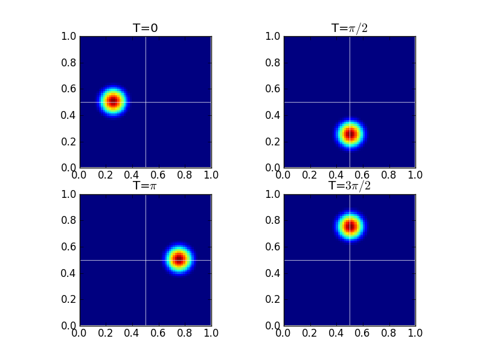
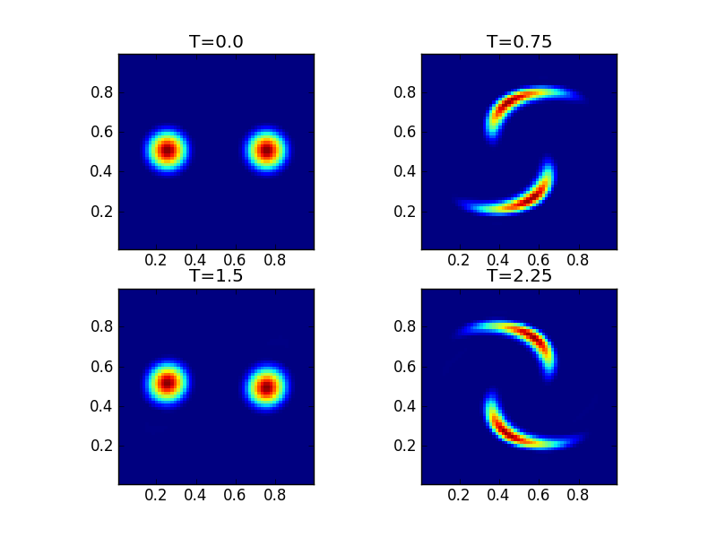
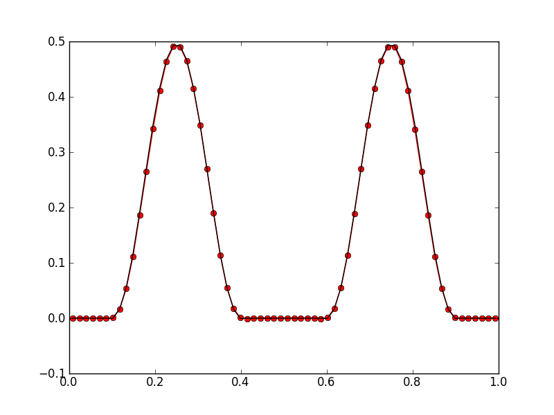
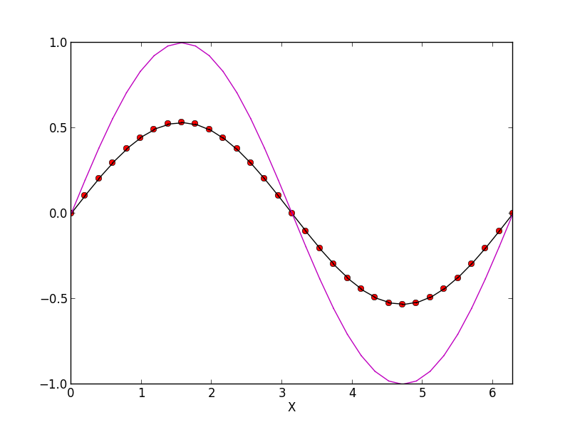

:Author: Ammar Hakim
:Date: December 4th
:Completed: 
:Last Updated:

JE16: Auxiliary equations and tests of local DG scheme for advection-diffusion equations
========================================================================================

.. contents::

The local DG scheme can be used to solve equations with diffusion
terms. This is achieved by replacing the second order terms in the
original system with first order terms. This leads to a system of
first order equations which can then be updated with the standard DG
algorithm.

Gkeyll has an arbitrary dimensional nodal DG updater that can be used
to solve such equations. The basic idea is to pass extra fields as
auxiliary variables. This allows a very general scheme in which
several different types of equations can be solved. In this document I
test the nodal DG updater and use the auxiliary variables framework to
solve a number of problems, including those with diffusion.

Auxiliary variables for solving 2D advection equations
------------------------------------------------------

In the journal entry :doc:`JE12 <../je12/je12-poisson-bracket>` the
Poisson bracket updater is tested with passive advection in a 2D flow
field given by :math:`u_x = \partial \psi/ \partial y` and :math:`u_y
= -\partial \psi/ \partial x`, where :math:`\psi` is a specified
potential. The same problems can also be solved with the nodal DG
updater by specifying the flow velocity as an auxiliary variable. This
allows tracing passive advection in a general flow field (i.e. not
constrained to be incompressible or 2D). In this set of tests this
ability is exercised by solving the 2D scalar advection equation

.. math::

  \frac{\partial f}{\partial t} + \nabla\cdot (\mathbf{u}f) = 0

with specified flow field :math:`\mathbf{u}(x,y,t)`. Note that as the
velocity field is specified explicitly and does not depend on the
solution, it must be passed into the DG updater as an *auxiliary*
variable. This requires creating extra fields and auxiliary equation
objects and passing them to the nodal DG updater. See the script
:doc:`s201 <../../sims/s201/s201-aux-dg-advection-rb>` for an example
of how this is done in Gkeyll.

Rigid-body rotating flow
++++++++++++++++++++++++

In this test a rigid body rotating flow is initialized as

.. math::

  u_x(x,y) &= -y+1/2 \\
  u_y(x,y) &= x-1/2

which represents a counter-clockwise rigid body rotation about
:math:`(x_c,y_c)=(1/2,1/2)` with period :math:`2\pi`. Hence,
structures in :math:`f` will perform a circular motion about
:math:`(x_c,y_c)`, returning to their original position at
:math:`t=2\pi`.

The simulation was performed with  with an initial cosine hump of the
form

.. math::

  f(x,y,0) = \frac{1}{4}
  \left[
    1 + \cos(\pi r)
  \right]

where

.. math::

  r(x,y) = \min(\sqrt{(x-x_0)^2 + (y-y_0)^2}, r_0)/r_0

For this problem, :math:`r_0=0.2` and :math:`(x_0,y_0) = (1/4,
1/2)`. To test convergence, the simulation was run to :math:`t=2\pi`
with grid sizes :math:`16\times 16`, :math:`32\times 32` and
:math:`64\times 64` grid (keeping time-step fixed). The results were
compared to the initial condition and errors computed and are shown in
the following table.

.. list-table:: Convergence for piecewise linear spatial scheme
  :header-rows: 1
  :widths: 20,40,20,20

  * - Cell size
    - Average Error
    - Order
    - Simulation
  * - :math:`1/16`
    - :math:`1.8302\times 10^{-2}`
    - 
    - :doc:`s201 <../../sims/s201/s201-aux-dg-advection-rb>`
  * - :math:`1/32`
    - :math:`5.0170\times 10^{-4}`
    - 1.76
    - :doc:`s202 <../../sims/s202/s202-aux-dg-advection-rb>`
  * - :math:`1/64`
    - :math:`1.0859\times 10^{-5}`
    - 2.22
    - :doc:`s203 <../../sims/s203/s203-aux-dg-advection-rb>`

Next, a piecewise quadratic spatial scheme was used to compute the
solution to :math:`t=4\pi` on a :math:`32\times 32` at which point the
cosine hump has advected twice about the origin. The figure below
shows the solution at four different times, indicating that the
algorithm essentially advects the initial hump without any significant
distortion.

  Rigid-body rotation solution on a :math:`32\times 32` grid using a
  piecewise quadratic discontinuous Galerkin scheme at different times
  [:doc:`s204 <../../sims/s204/s204-aux-dg-advection-rb>`]. The white
  lines are the axes drawn through the point around which the flow
  rotates. These figures show that the scheme advects the initial
  cosine hump without significant distortion even on a relatively
  coarse grid.

Swirling flow
+++++++++++++

In this problem we use a time-dependent velocity field

.. math::

  u_x(x,y,t) &= \sin^2(\pi x) \sin(2 \pi y) g(t) \\
  u_y(x,y,t) &= -\sin^2(\pi y) \sin(2 \pi x) g(t)

This represents a swirling flow that distorts the vorticity field,
reaching a maximum distortion at :math:`t=T/2`. At that point the flow
reverses and the vorticity profile returns to its initial value.

We use a piecewise quadratic scheme on a :math:`32\times 32` grid and
run the simulation to :math:`t=2T`. The results are show in the
following figure.

  Swirling flow solution on a :math:`32\times 32` using a piecewise
  quadratic discontinuous Galerkin scheme at different times
  [:doc:`s205 <../../sims/s205/s205-aux-dg-advection-swirl>`]. The
  figure shows the initial condition, the maximum distortion in the
  first half period after which the solution returns to its initial
  value, swinging back for a second oscillation.

In the following figure compares the final solution to the initial
conditions.

  Swirling flow solution on a :math:`32\times 32` grid using a
  piecewise quadratic order discontinuous Galerkin scheme at
  :math:`t=2T` (red dots) compared to the initial conditions (black
  line). The algorithm is able to handle this complicated flow pattern
  and show very little distortion of the final solution. See
  [:doc:`s205 <../../sims/s205/s205-aux-dg-advection-swirl>`].

Local DG for advection-diffusion equation
-----------------------------------------

The DG method can be used to solve equations that have a hyperbolic as
well as a parabolic part. Consider first the advection-diffusion
equation

.. math::

  \frac{\partial f}{\partial t} + a \frac{\partial f}{\partial x}
  = D \frac{\partial^2 f}{\partial x^2}

where the constants :math:`a` and :math:`D` are the advection speed
and the diffusion coefficient respectively. This can be rewritten as a
system of first order equations

.. math::

  \frac{\partial f}{\partial t} + a \frac{\partial f}{\partial x}
  + \frac{\partial w}{\partial x} &= 0 \\
  w + \frac{\partial g}{\partial x} &= 0

where :math:`g \equiv Df`. This system of two first-order equations
can now be solved using the standard DG algorithm. The first paper to
systematically study this *local* DG scheme, even though earlier uses
had appeared for solving Navier-Stokes equations, was done by Cockburn
and Shu [Cockburn1998]_.

Just as in the scalar case we need to compute a numerical flux at each
cell interface. Let :math:`\mathbf{Q} \equiv [f, w]^T` and
:math:`\mathbf{F} \equiv [w, g]^T`. Then, the numerical flux at
interface :math:`i+1/2` can be written in the usual form as

.. math::

  \mathbf{F}_{i+1/2}
  = 
  \left[
    \begin{matrix}
       (af)_{i+1/2} \\
       0
    \end{matrix}
  \right]
  +
  \frac{1}{2}
  \left[
    \begin{matrix}
       w_{i+1/2}^+ + w_{i+1/2}^- \\
       g_{i+1/2}^+ + g_{i+1/2}^-
    \end{matrix}
  \right]
  -
   \left[
    \begin{matrix}
       c_{11} & c_{12} \\
       c_{21} & c_{22}
    \end{matrix}
  \right]
  \left[
    \begin{matrix}
       f_{i+1/2}^+ - f_{i+1/2}^- \\
       w_{i+1/2}^+ - w_{i+1/2}^-
    \end{matrix}
  \right]
 
where :math:`(af)_{i+1/2}` is a suitable flux for the hyperbolic term
and :math:`c_{ij}` are some coefficients. Different selectiions of
these coefficients lead to different schemes with different stability
and accuracy properties. Note that to obtain an explicit scheme we
must set :math:`c_{22}=0` to avoid coupling neighbor values of
:math:`w` leading to an implicit equation.

For a central scheme we simply put :math:`c_{ij} = 0`. With this
choice one can show that for piecewise constant basis functions this
leads to a five-point central difference formula for approximating the
second derivatives

.. math::

  \frac{\partial^2 f_i}{\partial x^2}
  =
  \frac{1}{4 \Delta x^2}
  (f_{i+2} - 2f_i + f_{i-2}).

On the other hand, selecting :math:`c_{11} = 0` and :math:`c_{12} =
-1/2` and :math:`c_{21} = D/2` leads to (with piecewise constant basis
functions) the usual three-point formula for approximating the second
derivatives

.. math::

  \frac{\partial^2 f_i}{\partial x^2}
  =
  \frac{1}{\Delta x^2}
  (f_{i+1} - 2f_i + f_{i-1}).

Even though both choices lead to second-order accurate (for piecewise
constant basis functions) approximations the latter is preferred as it
avoids the odd-even decoupling of the solution. A more through
analysis of the different numerical fluxes and their stability and
accuracy properties is carried out in [Arnold2002]_ for the Poisson
equation.

In the algorithm coded up in the Lua scripts, the second equation is
first updated to compute :math:`w` given the :math:`f^n`. These are
then used to update the solution to give :math:`f^{n+1}`. Note that as
the resulting scheme is explicit the time-step is limited by *both*
the hyperbolic as well as the parabolic terms. Hence, it is possible
that for a sufficiently fine grid and/or large values of the diffusion
coefficients the time-step will have to be significantly smaller than
that allowed by the advection speed.

We are initially focussing on cases where the collision frequency is
very small so an explicit treatment should be sufficient. Extensions
to an implicit method for higher collisionality may be considered
later

To test the algorithms implemented in Gkeyll a series of tests were
performed to check convergence. The simulations are initialized with
:math:`f(x,0) = \sin(x)` are run on a domain :math:`[0,2\pi]`. The
exact solution to this problem is given by

.. math::

  f(x,t) = e^{-Dt}\sin(x-at).

and is compared with numerical results and convergence order
computed. Results are shown in the table below.

.. list-table:: Convergence for piecewise linear spatial scheme
  :header-rows: 1
  :widths: 20,40,20,20

  * - Cell size
    - Average Error
    - Order
    - Simulation
  * - :math:`2\pi/8`
    - :math:`1.2987\times 10^{-2}`
    - 
    - :doc:`s207 <../../sims/s207/s207-advect-diffuse>`
  * - :math:`2\pi/16`
    - :math:`1.6123\times 10^{-3}`
    - 3.01
    - :doc:`s208 <../../sims/s208/s208-advect-diffuse>`
  * - :math:`2\pi/32`
    - :math:`3.3429\times 10^{-4}`
    - 2.26
    - :doc:`s209 <../../sims/s209/s209-advect-diffuse>`
  * - :math:`2\pi/64`
    - :math:`9.4169\times 10^{-5}`
    - 1.82
    - :doc:`s210 <../../sims/s210/s210-advect-diffuse>`

The following figure shows the exact solution compared to numerical
results for the 32 cell case.

  Advection-diffusion with nodal local DG scheme. Magenta line shows
  initial conditions, black line numerical results at :math:`t=2\pi`
  and red dots the exact solution. See [:doc:`s209
  <../../sims/s209/s209-advect-diffuse>`] for input file.

References
----------

.. [Cockburn1998] Cockburn, B and Shu, C W, "The local discontinuous
   Galerkin method for time-dependent convection-diffusion systems."
   *SIAM Journal on Numerical Analysis*, **35** (6), pg. 2440, 1998.

.. [Arnold2002] Arnold, D N and Brezzi, F and Cockburn, B and Marini,
    L D, "Unified analysis of discontinuous Galerkin methods for
    elliptic problems", *SIAM Journal on Numerical Analysis*, **39**
    (5), pg. 1749, 2002.

