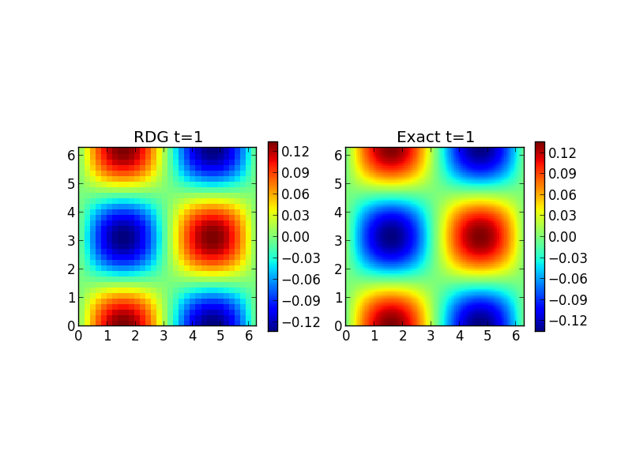

:Author: Ammar Hakim
:Date: 10th June 2013
:Completed: 14th June 2013
:Last Updated:

JE19: On diffusion operators with discontinuous Galerkin schemes
================================================================

.. contents::

In this note I describe and test a DG scheme for solving the diffusion
equation using the recovery procedure proposed by van Leer
[vanLeer2005]_.

Consider the problem of computing the second derivative of a function

.. math::

  g =  f_{xx}

where :math:`f(x)` is some function. As the DG representation of
:math:`f(x)` is, in general, discontinuous across cell boundaries it is
not clear how to compute :math:`g(x)`. Multiply the equation by a test
function :math:`\varphi(x)` and integrate over a cell :math:`I_j \equiv
[x_{j-1/2},x_{j+1/2}]` to get

.. math::

  \int_{I_j} \varphi g dx
  =
  (\varphi f_x - \varphi_x f)\bigg|^{x_{j+1/2}}_{x_{j-1/2}}
  +
  \int_{I_j} \varphi_{xx} f dx

where integration by parts had been used twice. Note that as the
function :math:`f(x)` is discontinuous across cell edges, it is not
clear how to evaluate the terms inside the bracket in the above
weak-form.

The recovery discontinuous Galerkin (RDG) scheme proposed by van Leer
replaces the the function :math:`f(x)` at each edge by a *recovered*
polynomial that is continuous across the cells shared by that
edge. I.e., we write instead the weak form

.. math::

  \int_{I_J} \varphi g dx
  =
  (\varphi \hat{f}_x - \varphi_x \hat{f})\bigg|^{x_{j+1/2}}_{x_{j-1/2}}
  +
  \int_{i_J} \varphi_{xx} f dx

where :math:`\hat{f}(x)` is the recovered polynomial, continuous
across a cell edge. As the recovered polynomial is continuous, its
derivative can be computed and used in the above weak-form, allowing
us to compute :math:`g(x)`.

Consider an edge :math:`x_{j-1/2}`. To recover a polynomial that is
continuous in cells :math:`I_{j-1}` and :math:`I_{j}` that share this
edge, we use :math:`L_2` minimization to give the conditions

.. math::

 \int_{I_{j-1}} (\hat{f}-f) \varphi_{j-1} dx &= 0 \\
 \int_{I_{j}} (\hat{f}-f) \varphi_{j} dx &= 0

This ensures that :math:`\hat{f}`, defined over :math:`I_{j-1}\cup
I_j` is identical to :math:`f(x)` in the least-square sense.

The reconstruction procedure is more complicated in higher dimensions,
specially when using non-rectangular meshes. For now, we have
developed a systematic method of computing the recovery polynomial for
arbitrary basis on rectangular meshes and this has been implemented in
Gkeyll. This will be extended to general non-rectangular meshes in the
future.

Implementation notes
--------------------

The `NodalHyperDiffusionUpdater` implements the diffusion operator and
computes (in 1D)

.. math::

  g =  f + \Delta t \nu f_{xx}

or, if the `incrementOnly` flag is specified,

.. math::

  g =  \nu f_{xx}

where, :math:`f(x,t)` is the input field, :math:`g(x,t)` is the output
field, :math:`\nu` is a diffusion coefficient and :math:`\Delta t` is
the time-step. Multiple calls to the updater can then be combined in a
RK time-stepper to solve a diffusion equation, for example.

Convergence of recovery DG scheme in 1D
---------------------------------------

To test the convergence of the scheme a series of 1D simulations were
performed. The heat-conduction equation was solved on a domain
:math:`[0,2\pi]` with diffusion coefficient :math:`1.0`. The initial
condition was a single mode :math:`\sin(x)`. The exact solution for
this problem is :math:`e^{-t}\sin(x)`.

The time-step was held fixed while 8, 16, 32, and 64 cell grids were
used. The results are shown in the following tables for polynomial
order 1 and 2 nodal basis functions.

.. note::

  To compute these errors I am compared the solution to exact solution
  at :math:`t=1`. The convergence rates are lower than what I expected
  from linear analysis. However, this could be due to the way in which
  the errors are computed. I plan to fix this later.

.. list-table:: Convergence of polynomial order 1 recovery DG scheme
  :header-rows: 1
  :widths: 20,40,20,20

  * - Grid size :math:`\Delta x`
    - Average error
    - Order
    - Simulation
  * - :math:`2\pi/8`
    - :math:`3.54322\times 10^{-3}`
    - 
    - :doc:`s242 <../../sims/s242/s242-dg-diffuse>`
  * - :math:`2\pi/16`
    - :math:`4.64979\times 10^{-4}`
    - 2.92
    - :doc:`s243 <../../sims/s243/s243-dg-diffuse>`
  * - :math:`2\pi/32`
    - :math:`5.88495\times 10^{-5}`
    - 2.98
    - :doc:`s244 <../../sims/s244/s244-dg-diffuse>`
  * - :math:`2\pi/64`
    - :math:`7.37923\times 10^{-6}`
    - 2.99
    - :doc:`s245 <../../sims/s245/s245-dg-diffuse>`

--------

.. list-table:: Convergence of polynomial order 2 recovery DG scheme
  :header-rows: 1
  :widths: 20,40,20,20

  * - Grid size :math:`\Delta x`
    - Average error
    - Order
    - Simulation
  * - :math:`2\pi/4`
    - :math:`8.101\times 10^{-3}`
    - 
    - :doc:`s246 <../../sims/s246/s246-dg-diffuse>`
  * - :math:`2\pi/8`
    - :math:`9.600\times 10^{-4}`
    - 3.0
    - :doc:`s247 <../../sims/s247/s247-dg-diffuse>`
  * - :math:`2\pi/16`
    - :math:`1.186\times 10^{-4}`
    - 3.0
    - :doc:`s248 <../../sims/s248/s248-dg-diffuse>`
  * - :math:`2\pi/32`
    - :math:`1.479\times 10^{-5}`
    - 3.0
    - :doc:`s249 <../../sims/s249/s249-dg-diffuse>`

Convergence of recovery DG scheme in 2D
---------------------------------------

To test the convergence of the scheme a series of 2D simulations were
performed. The heat-conduction equation was solved on a domain
:math:`[0,2\pi]\times[0,2\pi]` with diffusion coefficient
:math:`1.0`. The initial condition was :math:`\sin(x)\cos(y)`. The
exact solution for this problem is :math:`e^{-2t}\sin(x)\cos(y)`.

The time-step was held fixed while grid sizes of :math:`8\times 8`,
:math:`16\times 16`, :math:`32\times 32` and :math:`64\times 64`, cell
grids were used. The following figure shows the results from the
:math:`16\times 16` case compared to the exact solution.

  Solution to diffusion equation in 2D with recovery DG scheme (left)
  and exact solution (right). The simulation [:doc:`s251
  <../../sims/s251/s251-dg-diffuse-2d>`] was run on a :math:`16\times
  16` grid.

References
----------

.. [vanLeer2005] van Leer, Bram and Nomura, Shohei, "Discontinuous
   Galerkin for Diffusion", 17th AIAA Computational Fluid Dynamics
   Conference, AIAA 2005-5108.

