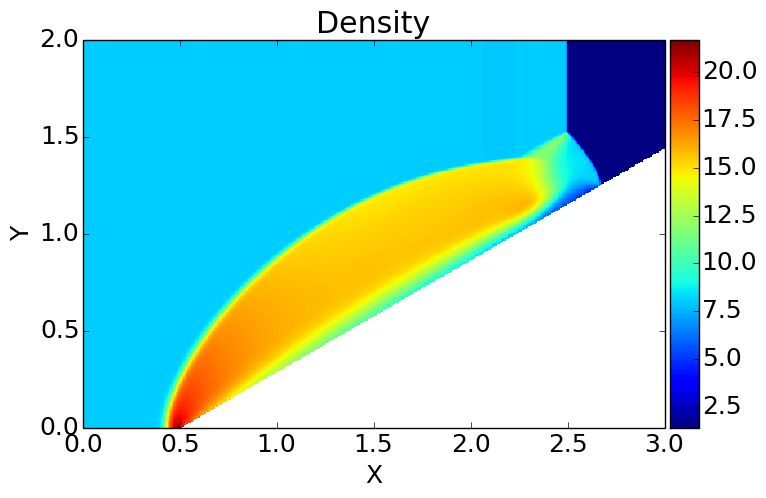
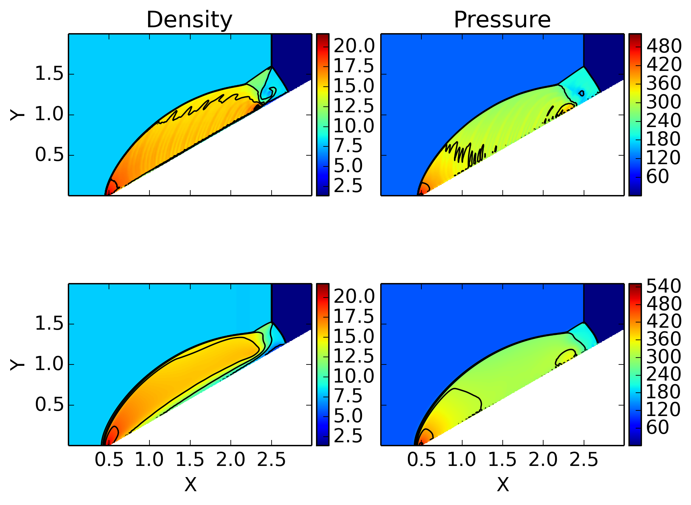
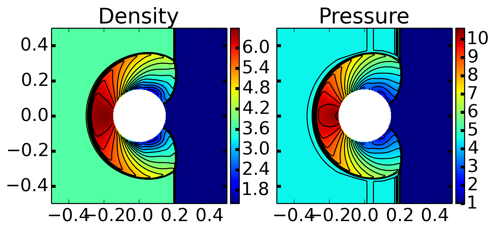
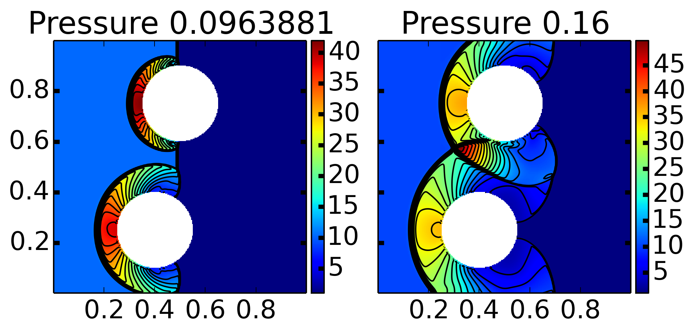
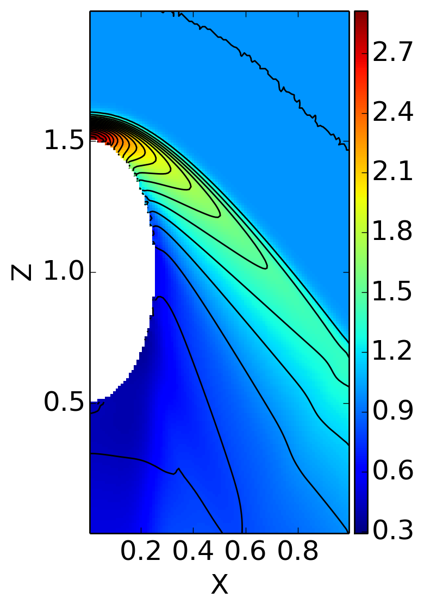
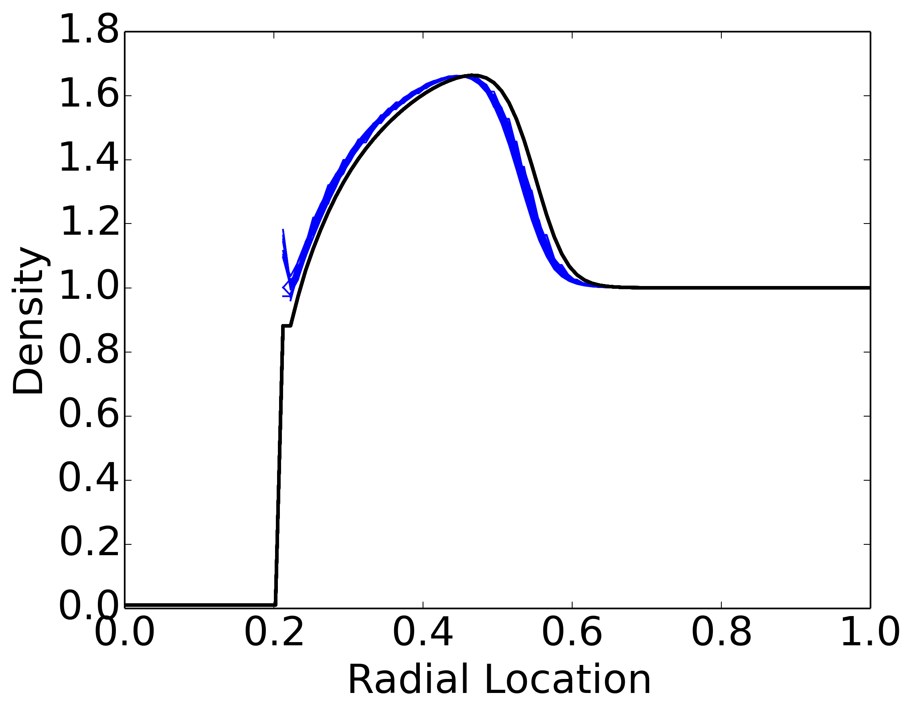

:Author: Ammar Hakim
:Date: July 15th 2014
:Completed: July 26th 2014
:Last Updated:

JE24: Tests for stair-stepped boundary Euler solver
===================================================

.. contents::

.. warning::

  There is a subtle bug in the present implementation, which I have
  not been able to track down. Basically, when running in parallel, if
  the MPI domain boundary and the embedded boundaries are coincident
  or separated by one cell, the results differ very slightly from
  serial results. Note that for all other cases in parallel the bug
  does not manifest itself.

In this note I test the finite-volume embedded boundary updater on the
Euler equations. At present, Gkeyll uses a stair-stepped mesh to
represent the surface of an object. Although crude, this is sufficient
to tackle many problems, including magnetosphere modeling. We are
interested in the latter problem, and most global magnetosphere codes
use a stair-stepped mesh to represent the planet/moon surface. The
representation of the boundary may be improved in the future by using
either a conformal cut-cell mesh, or using a multi-block body-fitted
mesh. Note that for viscous flows, using stair-stepped or even
cut-cell BCs is not a good idea as near a wall, to capture the
boundary layer accurately, one needs meshes aligned with the surface.

For now, stair-stepped meshes are sufficient.

Note on geometry representation and embedded boundary conditions
----------------------------------------------------------------

The key step in doing embedded boundary simulations is to setup the
geometry. For this, one needs to create an Gkeyll field with a single
component. This field should store a positive number when the
corresponding point is inside the domain and a negative number when it
is outside the domain. Rather complex objects can be created by
combining a set of elementary shapes (circles, boxes, ellipses, ...)
using shift/rotate and logical operators. For example, to represent a
circle one can use the Lua function

.. code-block:: lua

  function inCircle(x,y, xc,yc,rad)
    return (x-xc)^2 + (y-yc)^2 < rad^2 and 1.0 or -1.0
  end

This function evaluates to 1.0 when inside the sphere, and to -1.0
otherwise. Note that for flow *around* a sphere one needs to flip the
signs in the above equation.

Given two in/out functions :math:`d_A(x,y)` and :math:`d_B(x,y)` can
can create a new functions representing the union, intersection and
subtraction as follows

.. math::

  d_U(x,y) &= \max(d_A(x,y), d_B(x,y)) \qquad &\mathrm{union} \\
  d_I(x,y) &= \min(d_A(x,y), d_B(x,y)) \qquad &\mathrm{intersection} \\
  d_S(x,y) &= \min(d_A(x,y), -d_B(x,y)) \qquad &\mathrm{subtraction}.

In three dimensions several other operations are possible: rotation of
a 2D shape about some axis, extrusion of a 2D shape along a curve,
etc. Arbitrary shapes can be represented in this way, however, the
final function representing a complex shape may not be very readable.

Once the object geometry has been created, the boundary condition
update needs to be created (in 2D) using the `StairSteppedBc2D`
updater. This updater takes in the in/out field and a list of BCs to
apply. 

Note that due to the way in which BCs are applied this updater also
needs the direction in which to apply the BC (using a setDir
method). In essence, I am assuming that this updater is used as part
of a dimensionally-split algorithm in which the BC is applied in a
particular direction and then the update in that direction is
performed. For unsplit algorithms, embedded BCs require more
complicated data-structures.

Note on numerical fluxes
------------------------

In most of these simulations, I need to use HLLE fluxes (enabled using
numericalFlux = "lax" and useIntermediateWave = true in
HyperEquation.Euler constructor). The Roe fluxes causes severe
problems, including carbuncle problem and launch of spurious shocks
from stair-stepped cells. 

It appears that the numerical diffusion added by the HLLE flux
effectively acts to "smooth out" the jagged representation of the
boundary (effectively creating a numerical boundary layer), allowing
one to obtain reasonable results. However, as is obvious (and shown
below) if the flow is very sensitive to the flow along the boundary,
then stair-stepped meshes are not a good idea, and one will need to
use a body-fitted (structured or unstructured) mesh.

One should also keep in mind that using HLLE (or any diffusive flux)
with the WavePropagationUpdater is not usually a good idea: the
solution quality is very sensitive to the numerical flux, and best
results are usually obtained when using Roe fluxes.

Double Mach reflection
----------------------

In this problem, a Mach 10 shock reflects off a 30 degree ramp,
forming a complex Mach stem that separates the fluid into several
regions with different flow properties. This problem has been
extensively studied in the literature.

The shock is created using an initial state, with :math:`\rho=8, u =
8.25, p=116.5` for :math:`x<0.5` and :math:`\rho=1.4, u = 0, p=1.0`
for :math:`x>0.5`. The domain is :math:`3\times 2` and a grid of
:math:`450\times 300` is used. The wedge tip is at :math:`x=0`. The
density at :math:`t=0.2` is shown below.

  Density for double Mach reflection problem at :math:`t=0.2`. A Mach
  10 shock interacts with a 30 degree wedge, forming a curved shock
  and a complex triple Mach stem. This simulation uses a HLLE
  flux. Compared to published results, the Gkeyll results with
  stair-stepped boundaries look correct. However, notice the formation
  of a spurious boundary layer due to the numerical diffusion from the
  HLLE flux. See [:doc:`s418 <../../sims/s418/s418-euler-wedge-2d>`]
  for input file.

Notice that the solution using the HLLE flux is rather diffusive and
shows the formation of a spurious boundary layer. The simulation was
repeated using Roe flux, which is less diffusive, and compared with
the results obtained from the HLLE flux. The results are shown below.

  Density (left column) and pressure (right column) for double Mach
  reflection problem at :math:`t=0.2`. The upper row results were
  obtained using a Roe flux [:doc:`s419
  <../../sims/s419/s419-euler-wedge-2d>`] and the lower row, with HLLE
  flux [:doc:`s418 <../../sims/s418/s418-euler-wedge-2d>`]. The Roe
  flux results are sharper, resolving the Mach stem better, and do not
  have the spurious boundary layer on the wedge surface. However, the
  use of a stair-stepped boundary launches a series of spurious
  oblique shocks in the Roe flux simulation.

Although the Roe flux solution is sharper, resolving the Mach stem
better, spurious oblique shocks are launched from the stair-stepped
wedge surface. In contrast, the HLLE solution does not show these
spurious shocks, however, the results are more diffuse and a numerical
boundary layer is formed.

Shock interaction with cylinder
-------------------------------

In this problem I study the interaction of a Mach 2 shock with a
cylinder of radius :math:`0.15`. The shock starts at :math:`x=-0.3`,
with pre-shock values of :math:`\rho=1.4, p=1.0`. The shock interacts
with the cylinder, creating a Mach stem, separating the flow into
three regions. The problem has been studied by Berger
et. al. [#berger-2003]_ using a cut-cell approach.

The density and pressure at :math:`t=0.25` from a :math:`300\times
300` simulation are shown below.

  Density (left) and pressure (right) from a Mach 2 shock interaction
  with a circular cylinder at :math:`t=0.25` on a :math:`300\times
  300` grid. See [:doc:`s420 <../../sims/s420/s420-euler-cyl-2d>`] for
  details. A triple Mach stem is formed, dividing the fluid into three
  distinct regions. The results are visually very similar to the ones
  presented by Berger et. al. [#berger-2003]_, who solved the problem
  using a cut-cell approach.

The results shown above compare very well with those presented by
Berger et. al. [#berger-2003]_. Note that this case is in contrast to
the previous two problems, in which the solution quality was
relatively poor. The reason for this is that once the shock stands-off
from the cylindrical surface, the stair-stepped boundary influences
the rest of the flow only weakly.

To test the algorithm on a more complex geometry, the interaction of a
Mach 3 shock with two cylinders is studied. The pressure at
:math:`t=0.096` and :math:`t=0.16` are shown below. The results are in
excellent agreement with those presented in [#berger-2003]_.

  Density from a Mach 3 shock interaction with two circular cylinders
  centered at :math:`(0.4,0.35)` and :math:`(0.5,0.75)` on a
  :math:`300\times 300` grid. See [:doc:`s422
  <../../sims/s422/s422-euler-cyl-2d>`] for details.The results are in
  excellent agreement with those presented by Berger
  et. al. [#berger-2003]_, who solved the problem using a cut-cell
  approach.

Supersonic flow over blunt body
-------------------------------

In this problem I study supersonic flow over a ellipsiod with circular
cross-section. This allows one to treat the problem using a 2D
axi/symmetric solver. For note on the axisymmetric solver see
:doc:`JE23 <../je23/je23-euler-3d>`. The ellipsoid is given by

.. math::

  \frac{x^2}{a^2} + \frac{y^2}{b^2} + \frac{z^2}{c^2} = 1

with :math:`a=b=1/4` and :math:`c=1/2`. The free-stream flow is Mach 2
directed in the negative :math:`Z` direction, with :math:`\rho=1` and
:math:`p=1`. The domain is :math:`(r,z)\in [0,1]\times[0,2]` and grid
:math:`100\times 200`.

Density and pressure near steady-state are shown below. A detached bow
shock forms on the object. The flow in the downstream side seems not
to be in steady-state, however.

  Density and superimposed pressure contours for Mach 2 flow over an
  ellipsoid with circular cross section. An axisymmetric solver was
  used to solve the Euler equations. See [:doc:`s423
  <../../sims/s423/s423-euler-blunt-rz>`] for details. A detached bow
  shock forms over the nose of the ellipsoid.

The same problem was setup using a full 3D solver. This allows testing
of the 3D solver by comparing to axisymmetric results.

Two different resolutions were used: :math:`50\times 50\times 100` and
:math:`100\times 100\times 200`. Symmetry boundary conditions were
used at :math:`X=0` and :math:`Y=0`. Flow conditions were identical to
the axisymmetric problem described above.

The following figure shows the density and pressure contours from the
:math:`100\times 100\times 200` simulation. These compare very well
with the axisymmetric result shown above, giving some confidence that
the 3D code is working correctly.

  Density and superimposed pressure contours in the :math:`X-Z` plane
  for Mach 2 flow over an ellipsoid with circular cross section. An 3D
  solver was used to solve the Euler equations. See [:doc:`s425
  <../../sims/s425/s425-super-euler-3d>`] for details. The 3D results
  compare very well with the 2D axisymmetric results shown above,
  giving some confidence that the 3D code is working correctly.

A more quantitative comparison between the 3D and 2D axisymmetric
results can be obtained by computing radial lineouts from the 3D
results and comparing it with the 2D results. This is shown in the
figure below.

  Scatter plot of density (blue lines) from 3D simulation, compared to
  2D axisymmetric results (black line), computed at
  :math:`Z=1.25`. The 3D and 2D axisymmetric results compare reasonably
  well, except for a small shift. (These could just be a plotting
  issue or a small difference in which in/out fields are evaluated in
  2D v/s 3D).

Conclusions
-----------

I have performed basic tests of the stair-stepped boundaries in
Gkeyll. The key conclusion is that although stair-stepped boundaries
are easy to setup, the results are not very satisfactory for some
problems. For shock problems, in which shock angles, jump conditions
sensitively depend on geometry, a better boundary representation
should be used. However, the solutions give a qualitative indication
of the flow features.

For some problems, in particular shock interaction with embedded
objects, in which the shock standoff distance is significant, the use
of stair-stepped boundaries gives high-quality results comparable to
cut-cell conformal boundary methods.

For magnetosphere problems the shock properties depend on magnetic
field structure rather than the geometry of the planet/moon
surface. Hence, the impact of the stair-stepped boundary will be likely
weak. However, this remains to be verified.

References
----------

.. [#anderson-mcf] John D. Anderson, Jr. "Modern Compressible Flow".

.. [#berger-2003] M. J. Berger, C. Helzel and R. J. LeVeque "H-box
   methods for the approximation of one-dimensional conservation laws
   on irregular grids", *SIAM J. Numer. Anal.*, **41** (2003), pp
   893-918.
