:Author: Ammar Hakim
:Date: Nov 21st 2018
:Completed: 
:Last Updated:

JE33: "Ghost Currents" and Kinetic simulations of the Buneman Instability
=========================================================================

.. contents::

In this note I study the Buneman instability with the Vlasov-Maxwell
solver in Gkeyll. This is in preparation for a more complex case in
which a magnetic field is also present. In the latter case the
instability is called "Electron Cyclotron Drift Instability" (ECDI),
often conjectured as causing anomalous electron transport observed in
Hall-thrusters.

Ghost Currents
--------------

In an electrostatic (ES) problem if one uses Poisson equation as the
field equation, currents do not directly appear anywhere. However, if
one uses Maxwell equations (Ampere's law) instead, the field equation
becomes

.. math::

   \mu_0\epsilon_0 \frac{\partial E}{\partial t} = -\mu_0 J.

Hence, an *initial plasma current* will give rise to an electric
field, that in turn drives plasma currents that tend to cancel those
applied initially. An oscillation at the plasma frequency will be set
up. This is will not happen when using Poisson equation, however, as
the currents never appear in the field equation.

This is a manifestation of the fact a current flow will result in a
magnetic field that balances it. However, this effect is missing in
the ES approximation. Hence, when using Ampere's law to compute the
field, we must mock up the effect of the missing magnetic field that
will support a steady current.

There is another way to illustrate the difference between Poisson and
Ampere's law for fields in the electrostatic case. As
:math:`E=-\partial\phi / \partial x`, integrating this over the domain
and assuming periodic boundary conditions we get

.. math::

   \int_0^L E \ dx = \phi(0)-\phi(L) = 0

due to periodicity. Hence, integrating Ampere's equation over the
domain we should have

.. math::

   \mu_0\epsilon_0 \int_0^L \frac{\partial E}{\partial t} \ dx = 0 = -\mu_0
   \int_0^L J \ dx

Obviously, this condition is impossible to satisfy if we have a net
non-zero current!

In addition, if we use the electric field to compute the potential as

.. math::

   \phi(x) = \int_0^x E(x')\ dx'

the resulting potential *will not be periodic*, even if the field and
distribution functions are periodic.

Hence, when using the Vlasov-Maxwell system (as opposed to the
Vlasov-Poisson system) one needs some care to ensure that the ES
physics is captured correctly.

One way around this is to introduce a "ghost current" that exactly
cancels the plasma current. That is, we replace Ampere's law with

.. math::

   \mu_0\epsilon_0 \frac{\partial E}{\partial t} = -\mu_0 (J+J_g).

Here :math:`J_g` is a spatially uniform ghost current that is computed
at each time step as

.. math::

   J_g = -\frac{1}{L} \int_0^L J \ dx.

With this choice, the right hand side of the field equation will
vanish, satisfying the condition for periodicity of the
potential.

Note that in general, Ampere's law alone can't be used to do a ES
problem in more than one dimension. To see this, as :math:`E =
-\nabla\phi`, taking the curl of Ampere's law we get

.. math::

   \mu_0\epsilon_0 \nabla\times \frac{\partial \mathbf{E}}{\partial t}
   = 0 =
   -\mu_0 \nabla \times \mathbf{J}.

Obviously, there is no reason why this condition should be
satisfied. Again, this is a manifestation of the fact that in the ES
approximation currents do not cause magnetic fields. One can imagine
adding in a ghost-current in this case also:

.. math::

  \nabla \times (\mathbf{J} + \mathbf{J}_g) = 0.

However, the expression to compute :math:`\mathbf{J}_g` will be
*non-local* (requiring a Poisson solve of some sort), defeating the
purpose of using Ampere's law (to exploit its locality, that is).

A more abstract explanation is as follows. As the Maxwell equations
are hyperbolic while Poisson equation is elliptic, there is no way
that they will give the same physics in a time-dependent
situation. The above arguments about ghost currents, in fact, is a way
to restore the non-locality inherent in the elliptic Poisson equation
into Ampere's law to allow one to do consistent ES simulations [1]_.
   
The linear stage
----------------

Consider a one-dimensional collisionless plasma in which the electrons
are drifting with respect to cold ions with speed :math:`V_0` much
larger than the electron thermal speed, i.e. :math:`V_0 \gg
v_{the}`. In this case an electron perturbation couples to ion plasma
oscillations, leading to an electrostatic instability called the
Buneman instability. Assuming cold ions and kinetic electrons the
dispersion relation for this instability is

.. math::

   1 - \frac{\omega_{pe}^2}{2 v_{the}^2k^2}
   Z'\left( \frac{\omega-kV_0}{\sqrt{2}v_{the}k} \right)
   -
   \frac{\omega_{pi}^2}{\omega^2} = 0.

To a good approximation one can also assume that the electrons are a
cold fluid. In this case the dispersion relation becomes

.. math::

   1 - \frac{\omega_{pe}^2}{(\omega-k V_0)^2}
   -
   \frac{\omega_{pi}^2}{\omega^2} = 0.

The solution to this dispersion relation gives good insight into the
nature of the instability. Rearranging this expression, one finds that
the normalized growth rate, :math:`\omega/\omega_{pe}`, depends only
on the parameters :math:`k V_0/\omega_{pe}` and :math:`m_e/m_i`. This
dispersion relation can be solved in a couple of lines of Python
(code courtesy of Liang Wang)

.. code-block:: python

  import numpy as np

  def buneman_k2w_cold(k, m):
      """
      Args:
          k: k*v0/wpe
          m: mi/me

      Returns:
          ws: Complex frequency for the given k.
      """
      ws = np.roots((m, -2 * k * m, k**2 * m - (m + 1), 2 * k,  -k**2))
      return ws[np.argsort(ws.imag + 1j * ws.real)[::-1]]

The following plot shows the growth rate for various :math:`k
V_0/\omega_{pe}` as a function of mass ratio. Clearly, as expected,
for a given mass-ratio the growth rate is maximized around the
resonant case :math:`kV_0 = \omega_{pe}`.

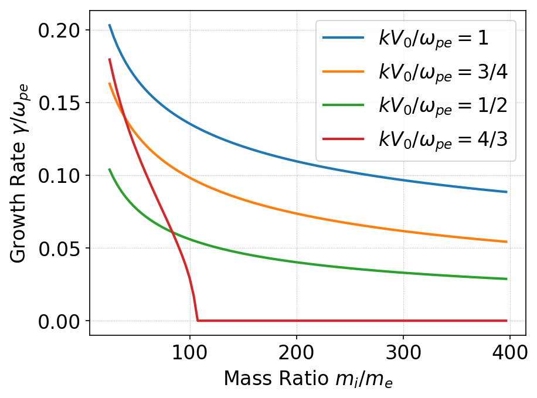

  Comparison of linear growth rate for Buneman instability as function
  of mass ratios computed for various values of :math:`k
  V_0/\omega_{pe}`. The growth is maximum for the resonant case
  :math:`kV_0 = \omega_{pe}`. For :math:`kV_0/\omega_{pe} > 1` and
  large enough mass-ratio there are no unstable modes, at least as
  predicted in the cold-fluid theory.

The following plot shows the growth rate as a function of wave-number
for various mass ratios. As seen below, consistent as the above plot,
the Buneman instability growth reduces with mass ratio and beyond a
certain wave-number the growth is zero.

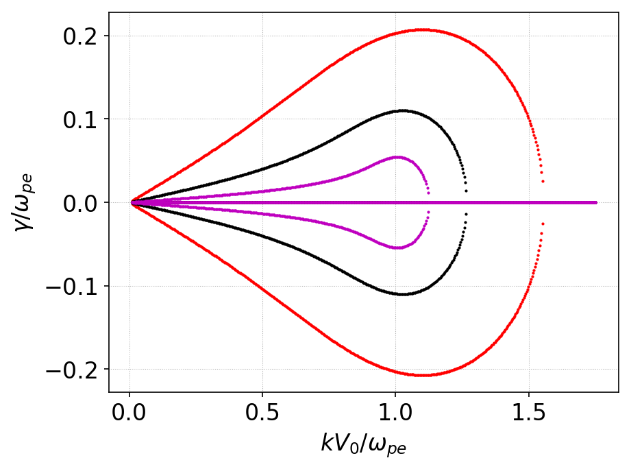

  Growth rate for Buneman instability as function of wave-number for
  various values of mass ratios: red :math:`m_i/m_e = 25`, black
  :math:`m_i/m_e = 200` and magenta :math:`m_i/m_e = 1836.2`. Growth
  reduces with mass ratio and beyond a certain wave-number becomes
  zero.

The Buneman instability also has a oscillatory component as seen in
the following plot. It shows the growth rate as a function of
oscillation frequency for different mass ratios.

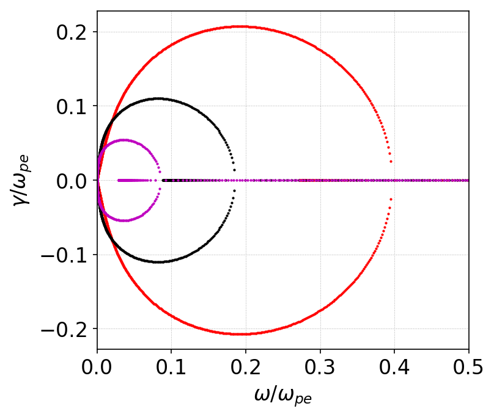

  Growth rate for Buneman instability as function of oscillation
  frequency for various values of mass ratios: red :math:`m_i/m_e =
  25`, black :math:`m_i/m_e = 200` and magenta :math:`m_i/m_e =
  1836.2`. Consistent with the previous figures, purely oscillatory
  modes exist beyond a critical oscillation frequency.

As seen in the above plots, the maximum growth of the instability
occurs approximately at resonance :math:`kV_0 = \omega_{pe}`. In this
resonant case, as :math:`V_0 \gg v_{the}`, we have :math:`\omega_{pe}
\gg k v_{the}`. One can then show that the growth rate can be
approximately computed as

.. math::

   \frac{\gamma}{\omega_{pe}} = \frac{\sqrt{3}}{2}
   \left( \frac{m_e}{2m_i}  \right)^{1/3}
   \left[
      1 - \frac{1}{2} \left( \frac{m_e}{2m_i}  \right)^{1/3}
   \right].

In the first series of tests I initialized a simulation with
stationary ions with :math:`v_{the} = 1/50`, :math:`v_{thi}=10^{-3}`
and drift speed determined from resonance condition :math:`V_0 =
\omega_{pe}/k`. Mass ratio :math:`m_i/m_e` of :math:`25, 50, 100, 200,
400, 1836.2` and :math:`40\times 1836.2` (Argon ions) were used. The
linear growth rate was computed using the Postgkyl "growth" command
and results compared to values computed from the above formula. The
results are shown in the figure below. The agreement with analytical
theory is very good, giving confidence in the numerical
solutions. (For an exact comparison one would need to solve the full
kinetic dispersion relation, something I have not yet done).

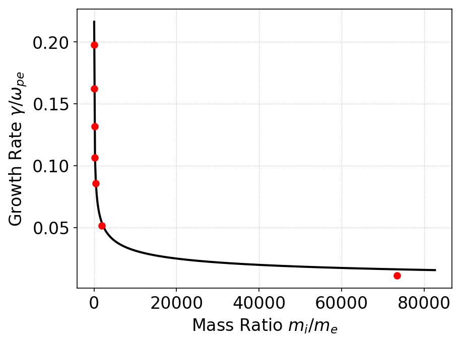

  Comparison of linear growth rate for Buneman instability with
  various mass ratios computed from Gkeyll simulations (red dots) and
  analytical formula given in text (black). The growth rate of the
  instability reduces rapidly with increasing ion mass (approximately
  :math:`(m_e/m_i)^{1/3}`). Note that this is for the resonant case in
  which :math:`k V_0 = \omega_{pe}`. See
  :doc:`es-buneman/b1 <b1-buneman>`,
  :doc:`es-buneman/b2 <b2-buneman>`,
  :doc:`es-buneman/b3 <b3-buneman>`,
  :doc:`es-buneman/b4 <b4-buneman>`,
  :doc:`es-buneman/b5 <b5-buneman>`,
  :doc:`es-buneman/b6 <b6-buneman>`,
  :doc:`es-buneman/b7 <b7-buneman>` for input files.

The nonlinear stage
-------------------

After a few multiples of :math:`\tau = 1/\gamma`, the linear growth
stops and the instability saturates. This saturation is due to the
slowing down of the electrons in the increasing electric field and
mode coupling to the ions. The electric field increases sufficiently
that some electrons no longer have the energy to cross the potential
barrier, and this eventually leads to particle trapping. As the
trapping continues the electron distribution flattens, moving the
system into a quasi-steady state.

Mass ratio :math:`m_i/m_e = 25`
+++++++++++++++++++++++++++++++

I looked at two non-linear cases, the first with :math:`m_i/m_e = 25`,
and the other for a hydrogen plasma, i.e. :math:`m_i/m_e =
1836.2`. The field energy as a function of time is plotted below for
the :math:`m_i/m_e = 25` case.

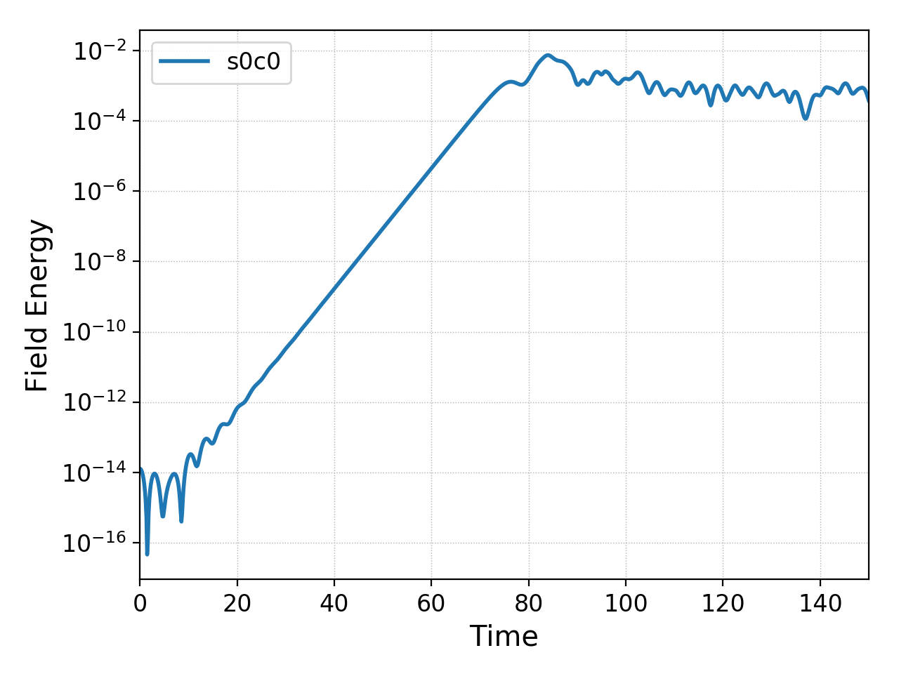

  Field energy for :math:`m_i/m_e = 25` case as a function of
  time. The growth period for this case is :math:`\tau = 1/\gamma
  \approx 5`.  The instability saturates about :math:`t\omega_{pe} =
  70`, followed by a second growth phase and then saturation. See
  :doc:`es-buneman/n1 <n1-buneman>` for input file.

The plot below shows the ion (top) and electron (bottom) distribution
at :math:`t\omega_{pe} = 90`. At this point electrons are trapped in
the electrostatic field.

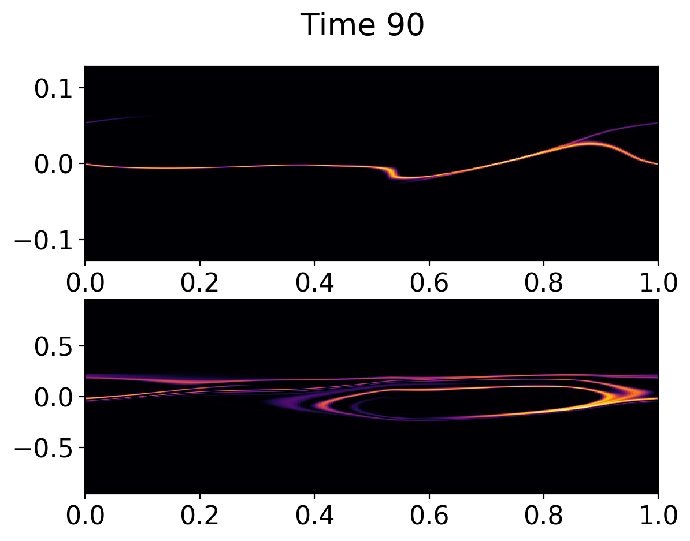

  Ion (top) and electron (bottom) distribution function at
  :math:`t\omega_{pe} = 90`. The electrons distribution function shows
  particle trapping which leads to the slowing down of the electron
  bulk velocity. As the ions are not very heavy they show significant
  acceleration in the field.

Deep in the nonlinear phase the electron trapping leads to a
flattening of the distribution function, showing complex fine-scale
features in the trapped region. However, a fraction of passing
particles are also present. See below.

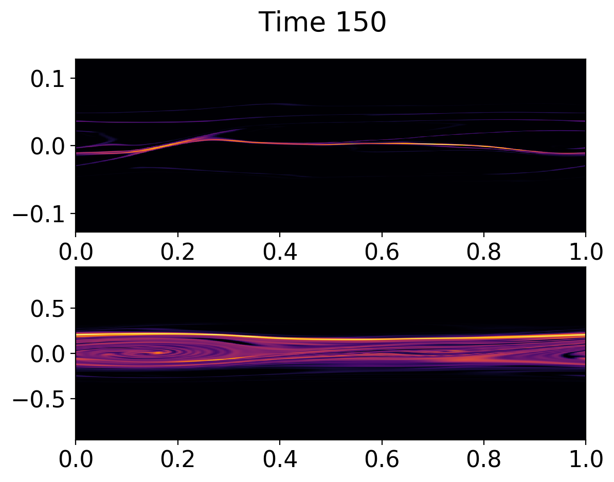

  Ion (top) and electron (bottom) distribution function at
  :math:`t\omega_{pe} = 150`. In this deeply nonlinear phase of the
  instability the electron distribution had flattened due to the
  particle trapping. However, a significant fraction of passing
  particles are also present.

Mass ratio :math:`m_i/m_e = 1836.2`
+++++++++++++++++++++++++++++++++++

For hydrogen ions the growth is slower and the particle trapping leads
to significant flattening of the distribution function. The following
plot shows the field energy as a function of time.

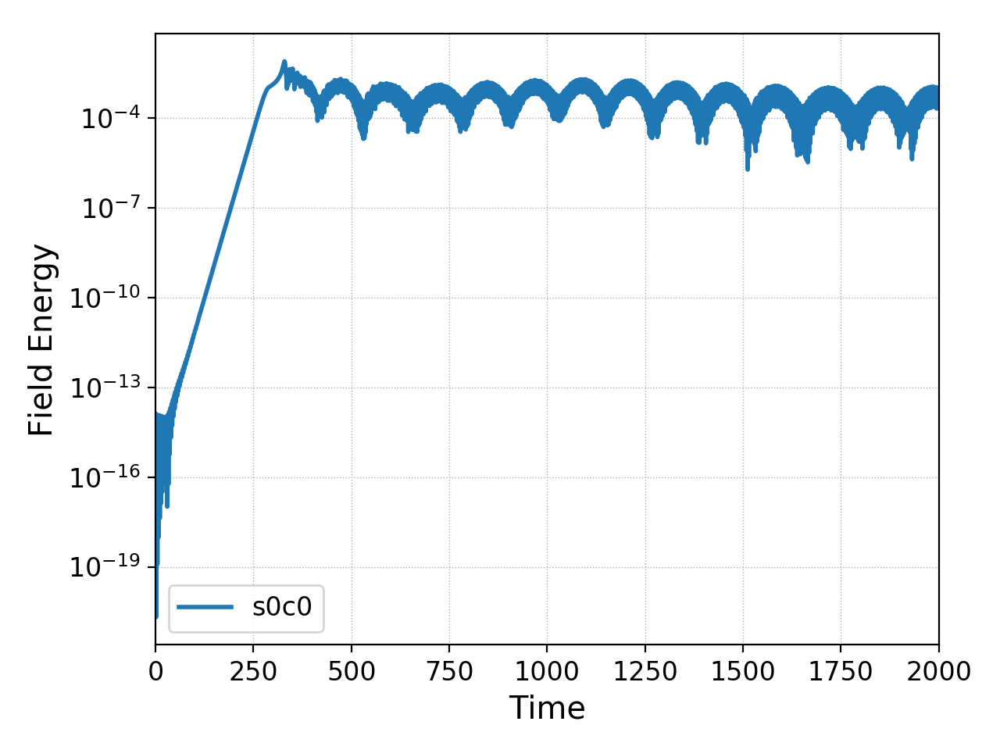

  Field energy for :math:`m_i/m_e = 1836.2` case as a function of
  time. The instability saturates about :math:`t\omega_{pe} = 250`,
  followed by a second growth phase and then saturation. After
  saturation there is a periodic exchange of energy between the
  electric field and ions. See :doc:`es-buneman/n6 <n6-buneman>` for
  input file.

Around :math:`t\Omega_{pe} = 320` particle trapping is significant, as
seen in the plot below.

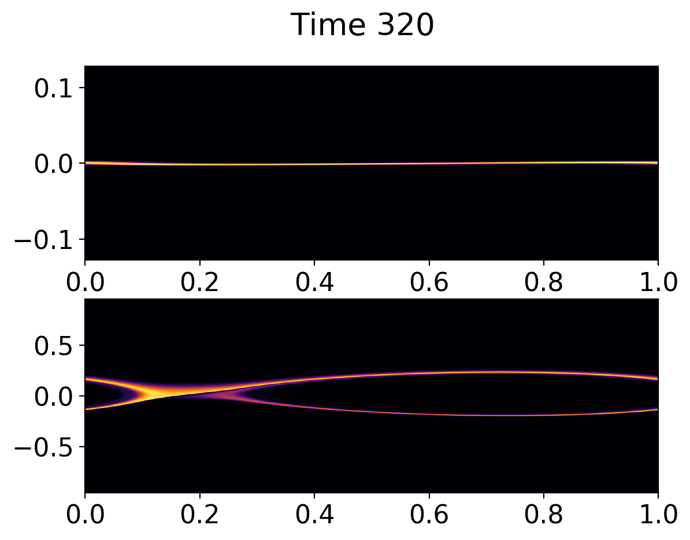

  Ion (top) and electron (bottom) distribution function at
  :math:`t\omega_{pe} = 320`. The electrons distribution function
  shows particle trapping which leads to the slowing down of the
  electron bulk velocity.

  
Deep in the nonlinear phase particle trapping leads to flattening of
the distribution function, though a persistent electron hole seems to
be present. Some fraction of passing particles are also seen.

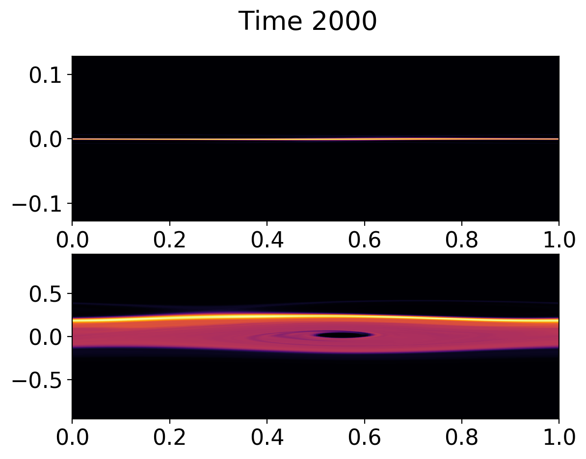

  Ion (top) and electron (bottom) distribution function at
  :math:`t\omega_{pe} = 2000`. The electrons distribution function has
  flattened due to particle trapping, although a persistent electron
  hole seems to be present. Small fraction of passing particles are
  also present.

The flattening is better seen in the following plot that shows
:math:`\int_0^L f(x,v,t)\ dx` at :math:`t\omega_{pe}=0` and
:math:`t\omega_{pe}=2000`. A small fraction of passing particles are
clearly visible.

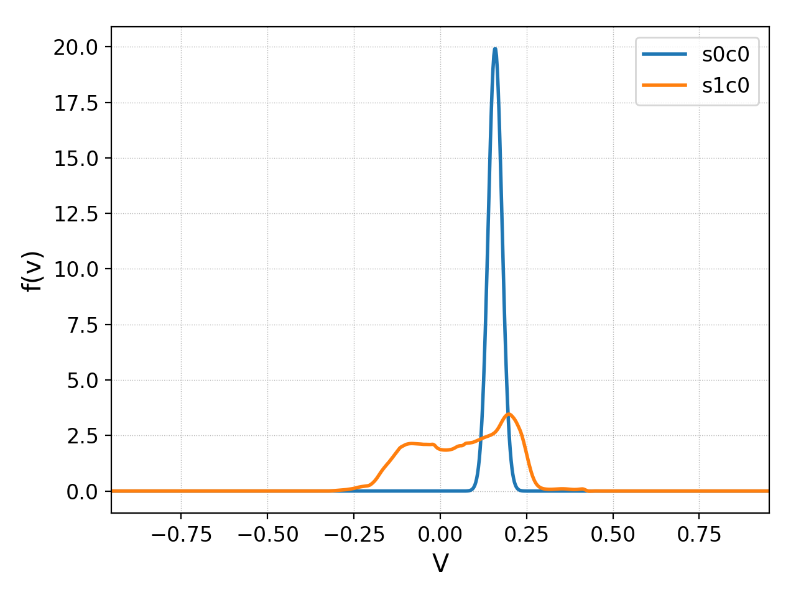

  Spatially integrated distribution function at :math:`t\omega_{pe}=0`
  (blue) and :math:`t\omega_{pe}=2000`. Flattening due to trapping is
  clearly visible. A small fraction of passing particles are also
  seen.

The nonlinear stage with weak collisions
----------------------------------------

The final set of simulations I performed were included weak
electron-electron collisions for the :math:`m_i/,_e = 25` case. For
this the collision frequency was set to :math:`\nu_{ee}/\omega_{pe} =
10^{-2}` and a Lenard-Bernstein Operator (LBO) was used. This operator
conserves density, momentum and energy and has the same structure as
the full Fokker-Planck operator in that it has a drag and diffusion
term. However, it does not require the calculation of Rosenbluth
potentials, which, even though it simplified the implementation,
implies that it can not capture the correct velocity dependent
collision frequency.

The collisions are sufficiently weak that the linear phase of the
instability is unchanged. See field energy plot below.

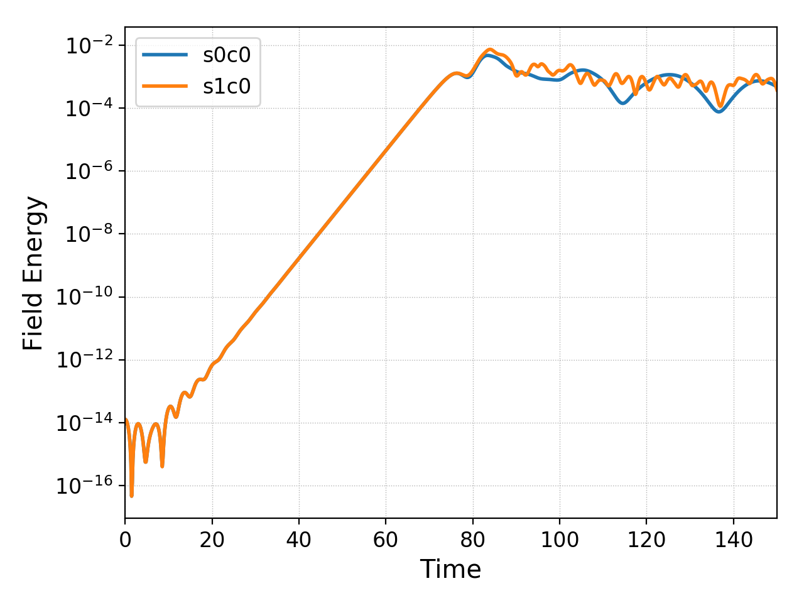

  Field energy for :math:`m_i/m_e = 25` case as a function of
  time. Blue curve shows the case with weak collisions
  (:math:`\nu_{ee}/\omega_{pe}=10^{-2}`) and the orange line is the
  collisionless case. The linear phase of the instability is unchanged
  with collisions, but the small-scale field energy oscillations are
  wiped out. See :doc:`es-buneman/c1 <c1-buneman>` for input file.

However, the non-linear phase is qualitatively different, with most of
the fine-scale phase-space structures wiped out due to
collisions. However, qualitative features like particle trapping and
flattening of distribution function persist. The following plots show
the distribution functions at :math:`t\omega_{pe} = 90` and
:math:`t\omega_{pe} =150`. These should be compared with the
collisionless case above.

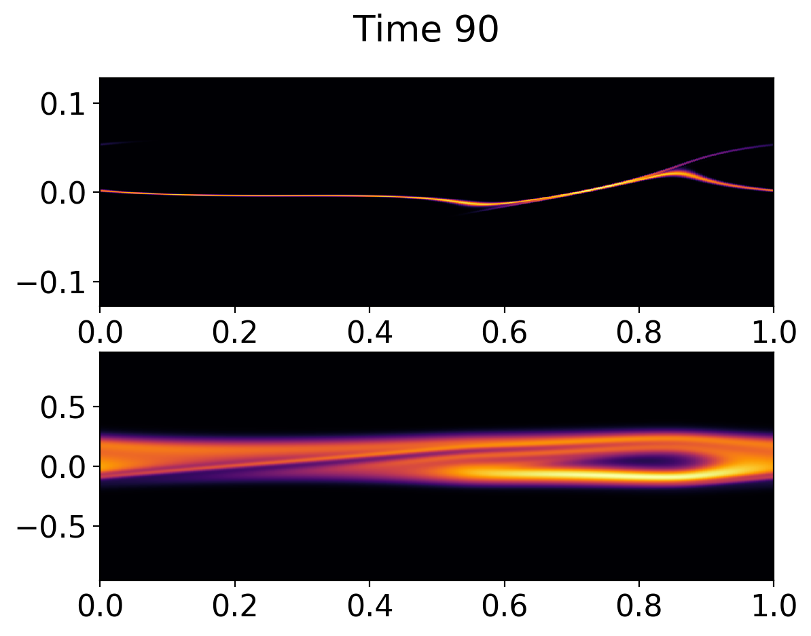

  Ion (top) and electron (bottom) distribution function at
  :math:`t\omega_{pe} = 90` with weak collisions. The fine-scale
  features in the collisionless case are wiped out, even with weak
  collisions.

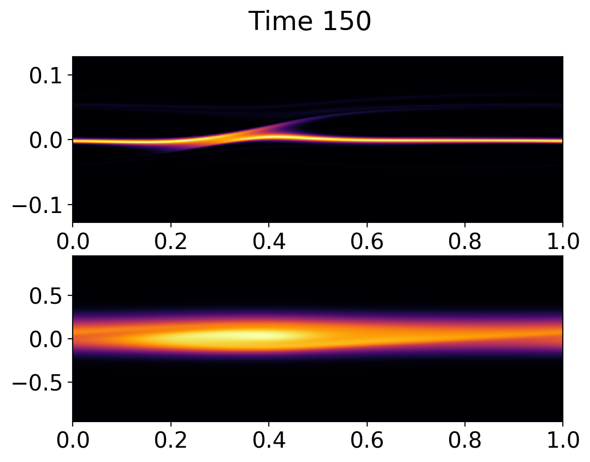

  Same as previous figure, except at :math:`t\omega_{pe} = 150`.

The following plot shows the spatially integrated distribution
function at :math:`t\omega_{pe} = 100` for the collisionless and
collisional cases. Note that the finer phase-space features are wiped
out and the distribution function is becoming Maxwellian due to the
collisions. By :math:`t\omega_{pe}=150` the collisions cause near
thermalization of the electrons.

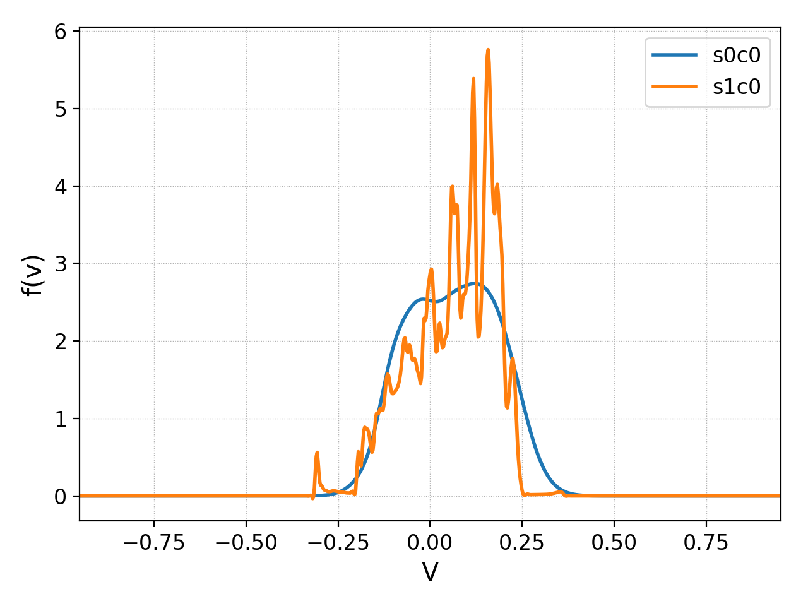

  Spatially Integrated distribution function; blue curve shows the
  case with weak collisions (:math:`\nu_{ee}/\omega_{pe}=10^{-2}`) and
  the orange line is the collisionless case. The collisions wipe out
  the fine-scale distribution function features and drive the
  electrons towards thermalization. However, at this point some
  flattening continues to persist.
  
Conclusion
----------

Simulations of Buneman instability (or any electrostatic problems)
with a Vlasov-Maxwell code are tricky. Non-locality needs to be
introduced via ghost currents and, in general, multidimensional
electrostatic simulations are not possible with just Ampere's law. One
would need to solve Poisson equation as the non-locality is
inescapable.

Many interesting features are seen in the simulations, including
saturation due to particle trapping, complex phase-space structures
and highly persistent electron holes. Even weak collisions can have a
significant quantitative impact in the late nonlinear phase of the
instability. This study sets the path to perform simulations with
magnetized electrons, a case relevant to potentially explain anomalous
electron transport in Hall thrusters and other :math:`E\times B`
machines.

Footnotes
---------
      
.. [1] I am grateful to Greg Hammett for discussion on aspects of
   performing ES simulations with Maxwell equations.
