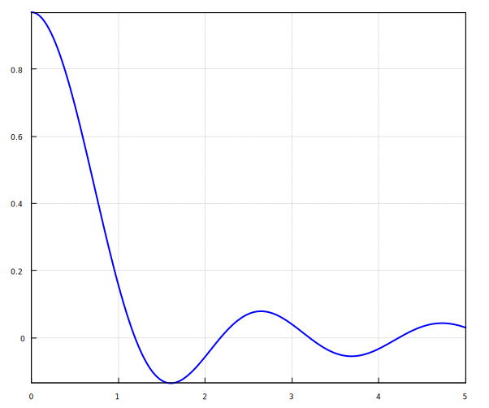
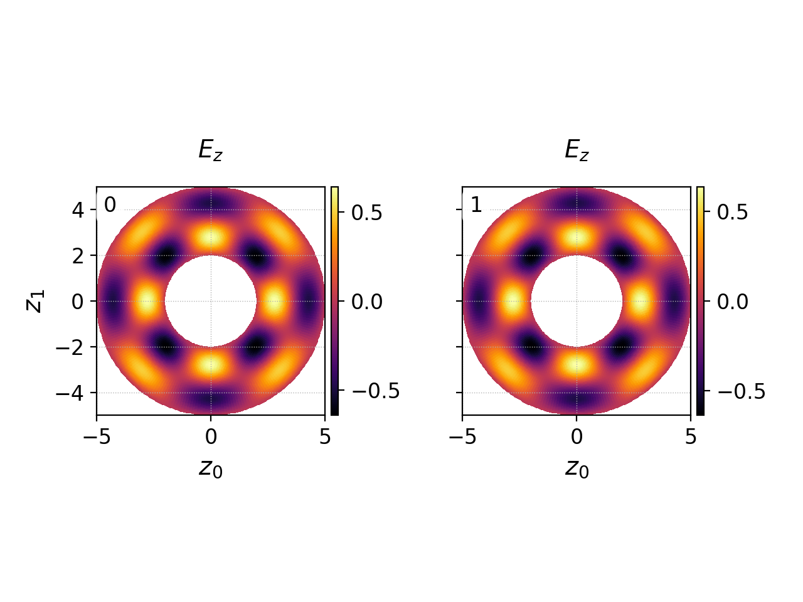
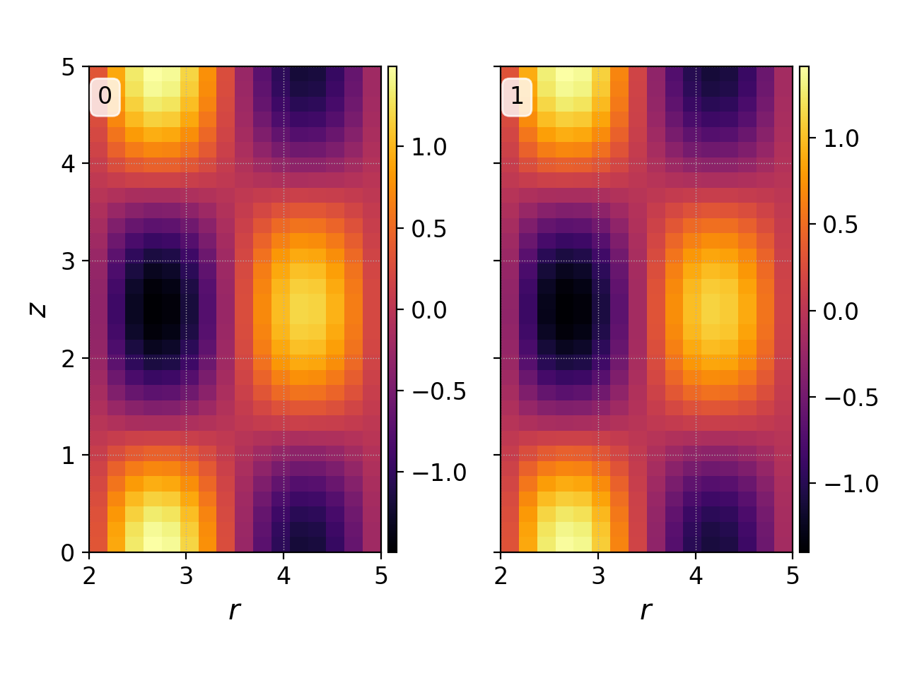
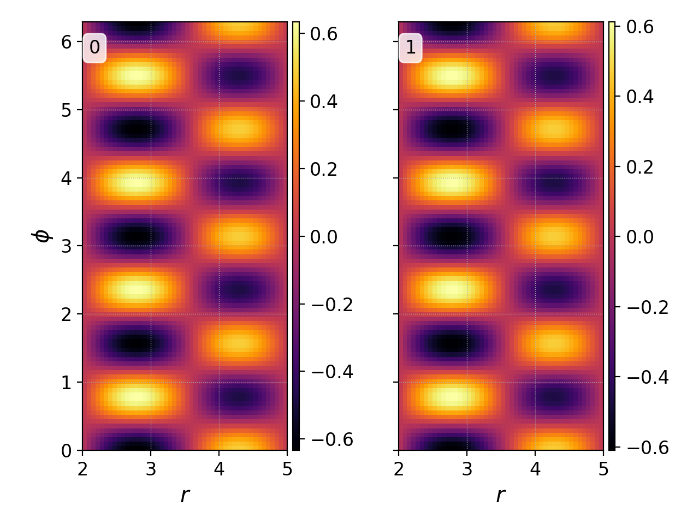

:Author: Ammar Hakim
:Date: March 29th 2022
:Completed: March 30th 2022
:Last Updated:

JE36: Benchmarking general geometry Maxwell solver with annular (cylindrical) waveguides
========================================================================================

.. contents::

Introduction
------------

In this note I present a series of benchmark problems to ensure that
the Maxwell solver in GkeyllZero (G0) works on non-Cartesian
geometries. G0 allows an arbitrary mapping from computational to
physical space. Here I assume that the physical domain is a coaxial
cylinder with inner and outer radii :math:`r_0` and :math:`r_1` and
height :math:`L_z`. In this geometry I study two sets of problems:
transverse magnetic (TM) modes and transverse electric (TE) modes. For
a derivation of these solutions `see this document <../../_static/files/maxwell-cyl.pdf>`_.

.. warning::

   This note is incomplete: I still need to test the TE modes, and
   convergence of the scheme has not been numerically verified. For
   the latter, we need to store cell volumes so the appropriate
   integrals can be computed.

Transverse Magnetic Modes
-------------------------

Transverse Magnetic modes are modes in which the magnetic field is
perpendicular to the direction of propagation. In this case, the
electric field is in the :math:`Z`-direction and is given by

.. math::

   E_z(r,\phi,z,t) = E_z(r)e^{im\phi}e^{ik_nz}e^{-i\omega t}

where :math:`m` is the azimuthal mode number, :math:`k_n = 2\pi/L_z`
describes the axial mode, :math:`\omega` is the frequency. The radial
dependence of the field is given by

.. math::

   E_z(r) = a J_m\big[r\sqrt{\omega^2-k_n^2}\big] + b Y_m\big[r\sqrt{\omega^2-k_n^2}\big]

where :math:`J_m` and :math:`Y_m` are Bessel functions of the first
and second kind, and :math:`a` and :math:`b` are constants. The
boundary conditions :math:`E_z(r_0) = E_z(r_1) = 0` determine the
possible frequencies as roots of the equation

.. math::

  J_m\big[r_0\sqrt{\omega^2-k_n^2}\big]
  Y_m\big[r_1\sqrt{\omega^2-k_n^2}\big]
  -
  J_m\big[r_1\sqrt{\omega^2-k_n^2}\big]
  Y_m\big[r_0\sqrt{\omega^2-k_n^2}\big]
  = 0.   

Once we compute the desired root (for propagating modes we must have
:math:`\omega>k_n`) we can choose set :math:`a` to whatever we like
and then compute :math:`b` from

.. math::

   b = -a \frac{J_m\big[r_0\sqrt{\omega^2-k_n^2}\big]}{Y_m\big[r_0\sqrt{\omega^2-k_n^2}\big]}.

We can compute the frequencies in a few lines of Maxima. In general,
it is not possible to "guess" the interval in which the roots lie and
so it is best to first make a plot to determine the interval. Then
Maxima's root finder can compute the bracketed root to machine
precision. The function we need to solve can be written in Maxima as

.. code-block::

   F(m,kn,r0,r1,w)  := bessel_j(m,r0*sqrt(w^2-kn^2))*bessel_y(m,r1*sqrt(w^2-kn^2))
       - bessel_j(m,r1*sqrt(w^2-kn^2))*bessel_y(m,r0*sqrt(w^2-kn^2))$   

Once this is defined we can plot the specific case (say :math:`m=2`,
:math:`k_n=0`, :math:`r_0 = 2` and :math:`r_1 = 5`) we are interested
as

.. code-block::

   draw2d( grid=true, explicit( F(2,0,2,5,w), w, 0, 5) )$

This will show the following figure:

  Plot of the nonlinear function whose roots (zero crossings) are the
  allowed frequencies. Maxima root-finder requires we find the
  interval in which the root is desired. We also need to ensure that
  the function changes sign only once in the interval.

Using this figure we can choose the interval :math:`[1,2]` and find
the root as

.. code-block::

   w1 : find_root( F(2,0,2,5,w), w, 1, 2 )$

This will yield :math:`1.19318673737701`. We can also find
higher-frequency roots by passing other intervals to the above
command. Once we have the frequency we can determine :math:`a` and
:math:`b` as described above, thus completing the solution.

2D :math:`r,\phi` modes
+++++++++++++++++++++++

First consider the case in which :math:`k_n = 0`. This a 2D standing
mode inside an annular disk (i.e. there is no variation in the
:math:`Z`-direction). We will choose :math:`r_0 = 2` and :math:`r_1 =
5` and :math:`m=4`. For this the first two roots are :math:`\omega =
1.557919724821651` and :math:`\omega = 2.430327042902498`.

The following plot shows the solution at the constant radius
:math:`r=3.5` of :math:`E_z` at :math:`t=0` and :math:`t=2 T_0`, where
:math:`T_0 = 2\pi/\omega` on a :math:`36\times 144` grid.

 .. figure:: 2m-tm-w1-Ez-cmp.png
  :width: 100%
  :align: center

  :math:`E_z` at :math:`t=0` (blue) and :math:`t=2 T_0` (orange) for :math:`m=2`,
  :math:`k_n=0` first harmonic mode for a :math:`36\times 144`
  grid. See :doc:`2d-tm-w1-1 <2d-tm-w1-1>` for simulation input.

The following plot shows the solution at :math:`t=0` and :math:`t=2
T_0` is the mode period, for the second harmonic mode.

  

  :math:`E_z` at :math:`t=0` (left) and :math:`t=2 T_0` (right) for :math:`m=2`,
  :math:`k_n=0` second harmonic mode for a :math:`64\times 256`
  grid. See :doc:`2d-tm-w2-2 <2d-tm-w2-2>` for simulation input.

2D axisymmetric :math:`r,z` modes
+++++++++++++++++++++++++++++++++

The :math:`m=0` modes are axisymmetric. In Gkeyll, axisymmetric
simulations must be done on a 3D :math:`(r,\phi,z)` domain with
"wedge" periodic BCs in the :math:`\phi` direction. These BCs ensure
that the solution remains axisymmetric and also that the geometric
effects of non-rectangular grid are taken into account. Due to the
present limitations of the Gkeyll solver, one needs to use at least 2
cells in the :math:`\phi` direction.

The following figure shows the :math:`E_z` field at :math:`t=0` and
:math:`t=2 T_0` for an axisymmetric mode with :math:`n=1`,
:math:`L_z=5`, and the second harmonic frequency. A coarse resolution
of :math:`16\times 32` in the :math:`RZ` plane is used, with :math:`3`
cells in :math:`\phi` in a narrow wedge of :math:`1/5` radians.

  :math:`E_z` at :math:`t=0` (left) and :math:`t=2 T_0` (right) for :math:`m=0`,
  :math:`k_n=2\pi/5` second harmonic mode for a :math:`16\times 32`
  grid. See :doc:`2d-rz-tm-1 <2d-rz-tm-1>` for simulation input.

3D :math:`r,\phi,z` modes
+++++++++++++++++++++++++

Finally, I look at a 3D TM mode. I consider the case in which
:math:`k_n = 2\pi/5`, :math:`r_0 = 2`, :math:`r_1 = 5` and
:math:`m=4`. The second harmonic frequency is
:math:`2.73598725136604`.

The following figures show the solution in the :math:`r,\phi` and
:math:`r,z` plane for :math:`E_z`.
      

  :math:`E_z` at :math:`t=0` (left) and :math:`t=2 T_0` (right) in the
  :math:`r,\phi` plane at :math:`z=2.5` for
  :math:`m=4`, :math:`k_n=2\pi/5` second harmonic mode on a
  :math:`48\times 96\times 96` grid. See :doc:`3d-tm-1 <3d-tm-1>` for simulation input.

  :math:`E_z` at :math:`t=0` (left) and :math:`t=2 T_0` (right) in the
  :math:`r,z` plane at :math:`\phi=\pi` for
  for
  :math:`m=4`, :math:`k_n=2\pi/5` second harmonic mode on a
  :math:`48\times 96\times 96` grid. See :doc:`3d-tm-1 <3d-tm-1>` for simulation input.	

Conclusions
-----------

The geometry implementation for Maxwell equation seems to be working
fine. At present, there are some limitations in performing RZ
simulations as at least 2 cells need to be used in the :math:`\phi`
direction. Also, the TE modes are not yet tested, though there is no
reason why they should not just work.
