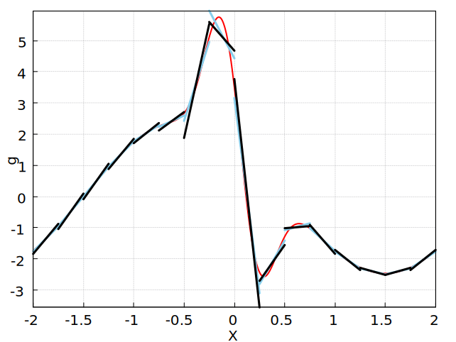
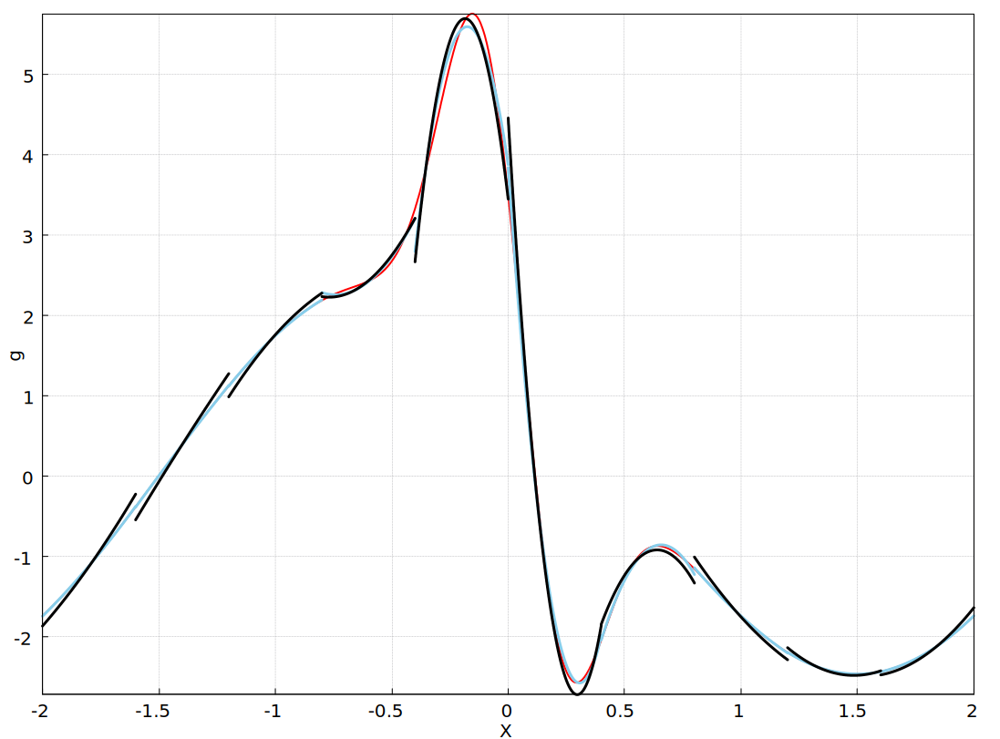
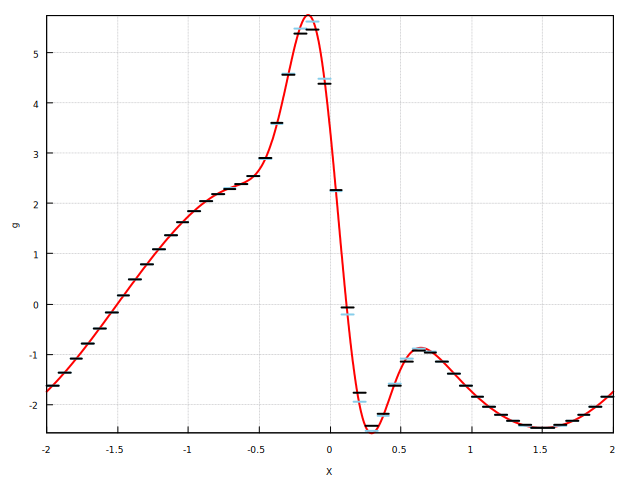
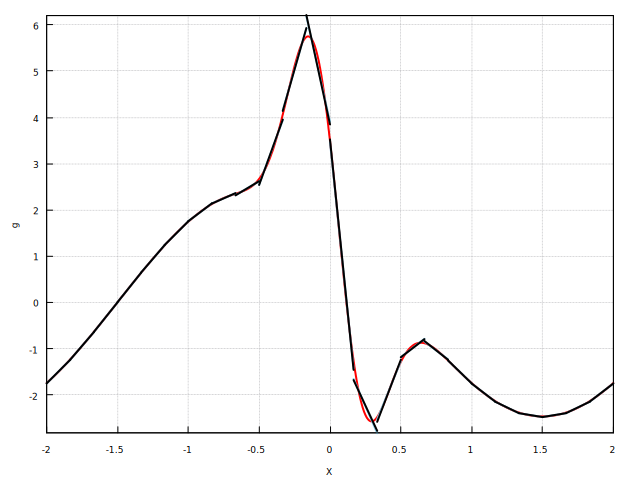
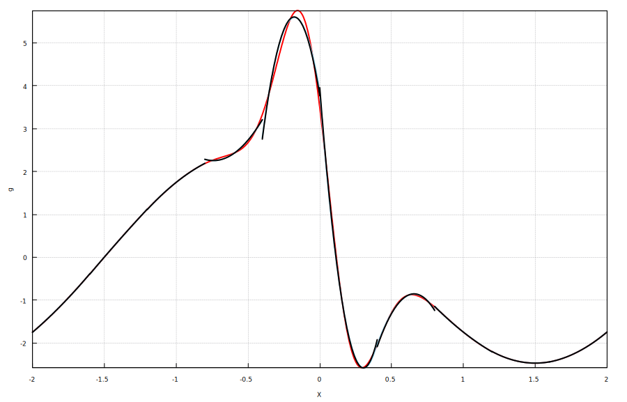

:Author: Ammar Hakim
:Date: September 8th 2025
:Completed: September 14th 2025
:Last Updated:

JE37: Recovery schemes for variable coefficient diffusion
=========================================================

.. note::

   The Maxima code used in this note is `linked here
   <../../_static/files/je37/diff.mac>`_. It requires use of Gkeyll
   CAS repo and Maxima setup as described `in the documentation
   <https://gkeyll.readthedocs.io/en/latest/dev/onmaxima.html>`_.

.. contents::

Computing Second Derivative
---------------------------

Consider computing the weak-form of the term

.. math::
   
   g \equiv \frac{\partial f}{\partial t} 
   = \frac{\partial}{\partial x}\left( \kappa \frac{\partial f}{\partial x} \right)

Here :math:`\kappa = \kappa(x)` is the position dependent diffusion
coefficient. This term appears, for example, in diffusion equation and
Poisson equation with variable coefficient. We will at first assume
:math:`\kappa` is **continuous and smooth**. Of course, this *does not
mean* that it's DG representation is continuous.

Multiply :math:`g` by a weight :math:`w` and integrate by parts *once*
over a single cell :math:`I_j = [x_{j+1/2}, x_{j-1/2}]` to get the
weak-form:

.. math::

   \int_{I_j} w g \thinspace dx
   =
   \left. \left(w \kappa \frac{\partial f}{\partial x} \right) \right\rvert_{j-1/2}^{j+1/2}
   -
   \int_{I_j} \frac{dw}{dx} \kappa  \frac{\partial f}{\partial x} \thinspace dx.

From this weak-form we see that we have to compute interface values of
:math:`f`, :math:`\kappa` and :math:`f_x`. To do this we will recover
:math:`\kappa` across the interfaces :math:`x_{j\pm 1/2}`. We wil also
recover :math:`f` across interfaces :math:`x_{j\pm 1/2}` for use in
the surface terms We then have one of two choices for :math:`f` that
appears in the volume term, leading to two possible schemes:

#. **Scheme 1:** Use the DG representation of :math:`f` in
   the volume term.

#. **Scheme 2:** Recover :math:`f` across three cells :math:`[x_{j-1},
   x_j, x_{j+1}]` (enforcing continuity of *both* :math:`f` and
   :math:`f_x` at :math:`x_{j\pm 1/2}`) and use this in the volume
   term.

Note that in each of the above cases we will use the DG representation
of :math:`\kappa` for the volume term.

Before we use the schemes in solving the diffusion equation, we will
see how each of the schemes behave for computing the second
derivative, that is, the projection of :math:`g` on basis
functions. For the tests presented below we will choose

.. math::

   \kappa(x) &= 1 + \exp(-10 x^2) \\
   f(x) &= 2 + \sin\left(2\pi\frac{x-0.5}{4} \right)

on the domain :math:`-2\le x \le 2`. 

Computing second derivatives: Scheme 1
++++++++++++++++++++++++++++++++++++++

Scheme 1, as described above, uses the DG exapansion of :math:`f` in
the volume term. It turns out that this scheme leads to an
*inconsistent* discretization of the second-order derivative as the
**mean slope is mispredicted**. See below for :math:`p=1` case. This
figure shows that though the cell-centers are converging correctly,
the slopes are incorrect, and, in fact, do not converge as the grid is
refined.

  Recovery solution for :math:`p = 1`, :math:`N_x = 48` (black) for
  :math:`g(x)` (red) compared to the projection of the exact solution
  (sky blue). This figure shows that Scheme 1 is *inconsistent*, that
  is, the mean slope of :math:`g` is mispredicted.

Higher-order DG recovery also shows the same behavior with Scheme 1:
the **higher (that cell-averages) coefficients are all systematically
mispredicted.** 

Note that this misprediction is not a bug: one can compute the exact
errors in the mean slopes and higher-moments by a careful analysis of
the stencil for Scheme 1. Further, this issue also persists even with
a constant diffusion coefficient.

  Recovery solution for :math:`p = 2`, :math:`N_x = 10` (black) for
  :math:`g(x)` (red) compared to the projection of the exact solution
  (sky blue). This figure shows that Scheme 1 is *inconsistent*, that
  is, the mean slope and quadratic moment of :math:`g` are
  mispredicted.

Computing second derivatives: Scheme 2
++++++++++++++++++++++++++++++++++++++

.. list-table:: Convergence for **Scheme 2** for :math:`g(x)`, :math:`p=0`
  :header-rows: 1
  :widths: 10,45,45
	   
  * - :math:`N_x`
    - :math:`l_2`-error
    - Order
  * - 12
    - 1.420
    - 
  * - 24
    - :math:`4.913\times 10^{-1}`
    - 1.53
  * - 48
    - :math:`1.407\times 10^{-1}`
    - 1.80

  Recovery solution for :math:`p = 0`, :math:`N_x = 48` (black) for
  :math:`g(x)` (red) compared to the projection of the exact solution
  (sky blue).

For :math:`p > 0` in the table below we also show the convergence of
the cell-averages.

.. list-table:: Convergence for **Scheme 2** for :math:`g(x)`, :math:`p=1`
  :header-rows: 1
  :widths: 10,22,15,25,25
	   
  * - :math:`N_x`
    - :math:`l_2`-error
    - Order
    - :math:`l_2`-error (:math:`\overline{g}`)
    - Order (:math:`\overline{g}`)
  * - 12
    - :math:`2.367 \times 10^{-1}`
    - 
    - :math:`1.883 \times 10^{-1}`
    - 
  * - 24
    - :math:`3.352 \times 10^{-2}`
    - 2.82
    - :math:`1.639 \times 10^{-2}`
    - 3.52
  * - 48
    - :math:`5.137 \times 10^{-3}`
    - 2.71
    - :math:`1.227\times 10^{-3}`
    - 3.73

  Recovery solution for :math:`p = 1`, :math:`N_x = 24` (black) for
  :math:`g(x)` (red) compared to the projection of the exact solution
  (sky blue). The exact and recovered solutions are visually
  indistinguishable.

.. list-table:: Convergence for **Scheme 2** for :math:`g(x)`, :math:`p=2`
  :header-rows: 1
  :widths: 10,22,15,25,25
	   
  * - :math:`N_x`
    - :math:`l_2`-error
    - Order
    - :math:`l_2`-error (:math:`\overline{g}`)
    - Order (:math:`\overline{g}`)
  * - 8
    - :math:`1.127 \times 10^{-1}`
    - 
    - :math:`3.903 \times 10^{-2}`
    - 
  * - 16
    - :math:`7.552 \times 10^{-3}`
    - 3.90
    - :math:`3.224 \times 10^{-3}`
    - 3.52
  * - 32
    - :math:`1.783 \times 10^{-4}`
    - 5.4
    - :math:`6.189\times 10^{-5}`
    - 5.7

  Recovery solution for :math:`p = 2`, :math:`N_x = 10` (black) for
  :math:`g(x)` (red) compared to the projection of the exact solution
  (sky blue). The exact and recovered solutions are visually
  indistinguishable.

Conclusion
----------

It seems that to get the proper approximation to :math:`g(x)` need to
use Scheme 2. However, it is likely that both Scheme 1 and Scheme 2
will work for solving parabolic equations, as the initial errors in
slopes (and higher-moments) of the DG representation will be damped
rapidly. However, this remains to be seen.
