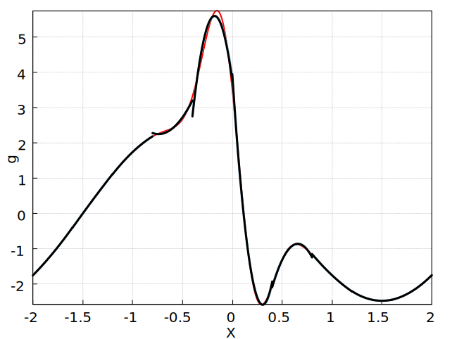

:Author: Ammar Hakim
:Date: September 8th 2025
:Completed: 
:Last Updated:

JE37: Recovery schemes for variable coefficient diffusion
=========================================================

.. contents::

Introduction
------------

Consider computing the weak-form of the term

.. math::
   
   g \equiv \frac{\partial f}{\partial t} 
   = \frac{\partial}{\partial x}\left( \kappa \frac{\partial f}{\partial x} \right)

Here :math:`\kappa = \kappa(x)` is the position dependent diffusion
coefficient. This term appears, for example, in diffusion equation and
Poisson equation with variable coefficient. We will at first assume
:math:`\kappa` is **continuous and smooth**. Of course, this *does not
mean* that it's DG representation is continuous.

Multiply :math:`g` by a weight :math:`w` and integrate by parts *once*
over a single cell :math:`I_j = [x_{j+1/2}, x_{j-1/2}]` to get the
weak-form:

.. math::

   \int_{I_j} w g \thinspace dx
   =
   \left. \left(w \kappa \frac{\partial f}{\partial x} \right) \right\rvert_{j-1/2}^{j+1/2}
   -
   \int_{I_j} \frac{dw}{dx} \kappa  \frac{\partial f}{\partial x} \thinspace dx.

From this weak-form we see that we have to compute interface values of
:math:`f`, :math:`\kappa` and :math:`f_x`. To do this we will recover
:math:`\kappa` across the interfaces :math:`x_{j\pm 1/2}`. We wil also
recover :math:`f` across interfaces :math:`x_{j\pm 1/2}` for use in
the surface terms We then have one of two choices for :math:`f` that
appears in the volume term, leading to two possible schemes:

#. **Scheme 1:** Use the DG representation of :math:`f` in
   the volume term.

#. **Scheme 2:** Recover :math:`f` across three cells :math:`[x_{j-1},
   x_j, x_{j+1}]` (enforcing continuity of *both* :math:`f` and
   :math:`f_x` at :math:`x_{j\pm 1/2}`) and use this in the volume
   term.

Note that in each of the above cases we will use the DG representation
of :math:`\kappa` for the volume term.

Computing second derivatives
----------------------------

Before we use the schemes in solving the diffusion equation, we will
see how each of the schemes behave for computing the diffusion term,
that is, the projection of :math:`g` on basis functions. For the tests
presented below we will choose

.. math::

   \kappa(x) &= 1 + \exp(-10 x^2) \\
   f(x) &= 2 + \sin\left(2\pi\frac{x-0.5}{4} \right)

on the domain :math:`-2\le x \le 2`. 

.. note::

   In the follow tables and figures we show results using
   Scheme 2. The Scheme 1, even in the constant diffusion case,
   **gives incorrect slopes (and higher order terms)** for computing
   :math:`g`. However, Scheme 1 predicts exactly the *same
   cell-averaged* values for :math:`g` as Scheme 2.

.. list-table:: Convergence for **Scheme 2** for :math:`g(x)`, :math:`p=0`
  :header-rows: 1
  :widths: 10,45,45
	   
  * - :math:`N_x`
    - :math:`l_2`-error
    - Order
  * - 12
    - 1.420246267211268
    - 
  * - 24
    - 0.4913373585178838
    - 1.53
  * - 48
    - 0.140716487605041
    - 1.80

.. figure:: gcalc-p0-nx-48.svg
  :width: 100%
  :align: center

  Recovery solution for :math:`p = 0`, :math:`N_x = 48` (black) for
  :math:`g(x)` (red) compared to the projection of the exact solution
  (sky blue).

For :math:`p > 0` in the table below we also show the convergence of
the cell-averages.

.. list-table:: Convergence for **Scheme 2** for :math:`g(x)`, :math:`p=1`
  :header-rows: 1
  :widths: 10,22,15,25,25
	   
  * - :math:`N_x`
    - :math:`l_2`-error
    - Order
    - :math:`l_2`-error (:math:`\overline{g}`)
    - Order (:math:`\overline{g}`)
  * - 12
    - :math:`2.367 \times 10^{-1}`
    - 
    - :math:`1.883 \times 10^{-1}`
    - 
  * - 24
    - :math:`3.352 \times 10^{-2}`
    - 2.82
    - :math:`1.639 \times 10^{-2}`
    - 3.52
  * - 48
    - :math:`5.137 \times 10^{-3}`
    - 2.71
    - :math:`1.227\times 10^{-3}`
    - 3.73

.. figure:: gcalc-p1-nx-24.svg
  :width: 100%
  :align: center

  Recovery solution for :math:`p = 1`, :math:`N_x = 24` (black) for
  :math:`g(x)` (red) compared to the projection of the exact solution
  (sky blue). The exact and recovered solutions are visually
  indistinguishable.

.. list-table:: Convergence for **Scheme 2** for :math:`g(x)`, :math:`p=2`
  :header-rows: 1
  :widths: 10,22,15,25,25
	   
  * - :math:`N_x`
    - :math:`l_2`-error
    - Order
    - :math:`l_2`-error (:math:`\overline{g}`)
    - Order (:math:`\overline{g}`)
  * - 8
    - :math:`1.127 \times 10^{-1}`
    - 
    - :math:`3.903 \times 10^{-2}`
    - 
  * - 16
    - :math:`7.552 \times 10^{-3}`
    - 3.90
    - :math:`3.224 \times 10^{-3}`
    - 3.52
  * - 32
    - :math:`1.783 \times 10^{-4}`
    - 5.4
    - :math:`6.189\times 10^{-5}`
    - 5.7

  Recovery solution for :math:`p = 2`, :math:`N_x = 10` (black) for
  :math:`g(x)` (red) compared to the projection of the exact solution
  (sky blue). The exact and recovered solutions are visually
  indistinguishable.
