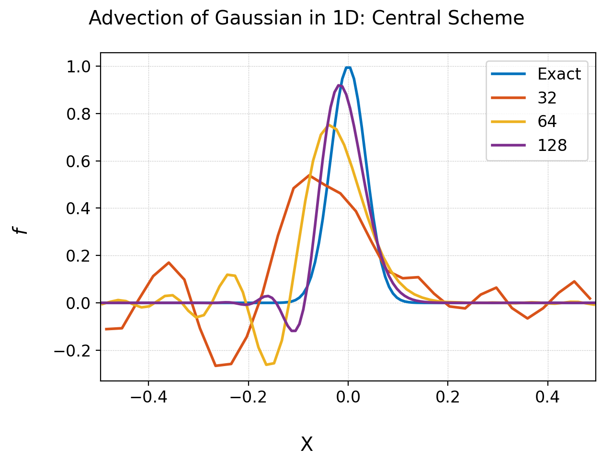
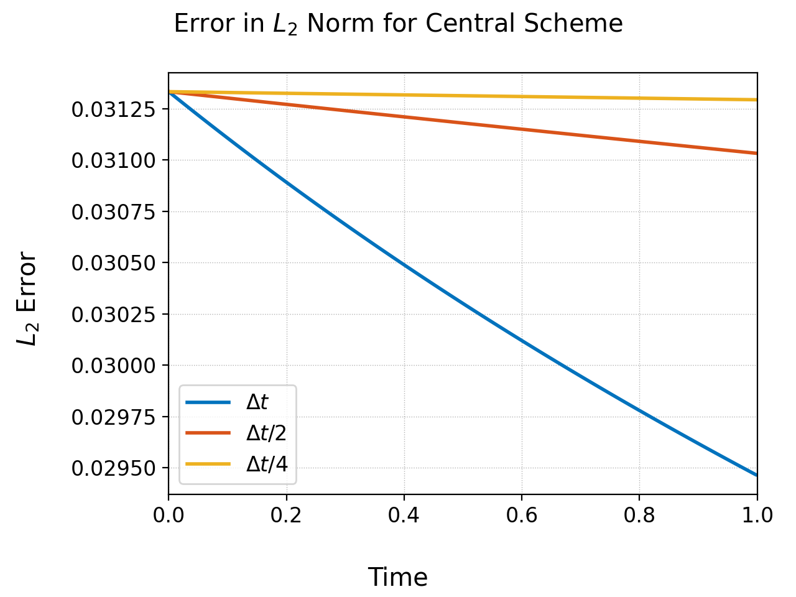
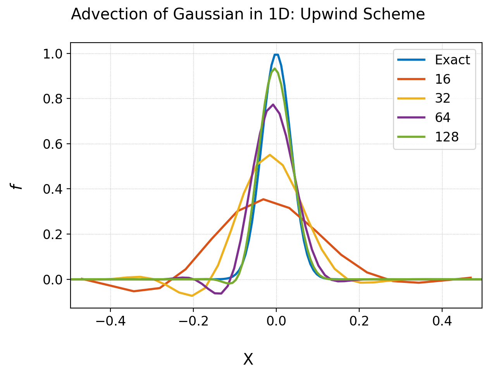
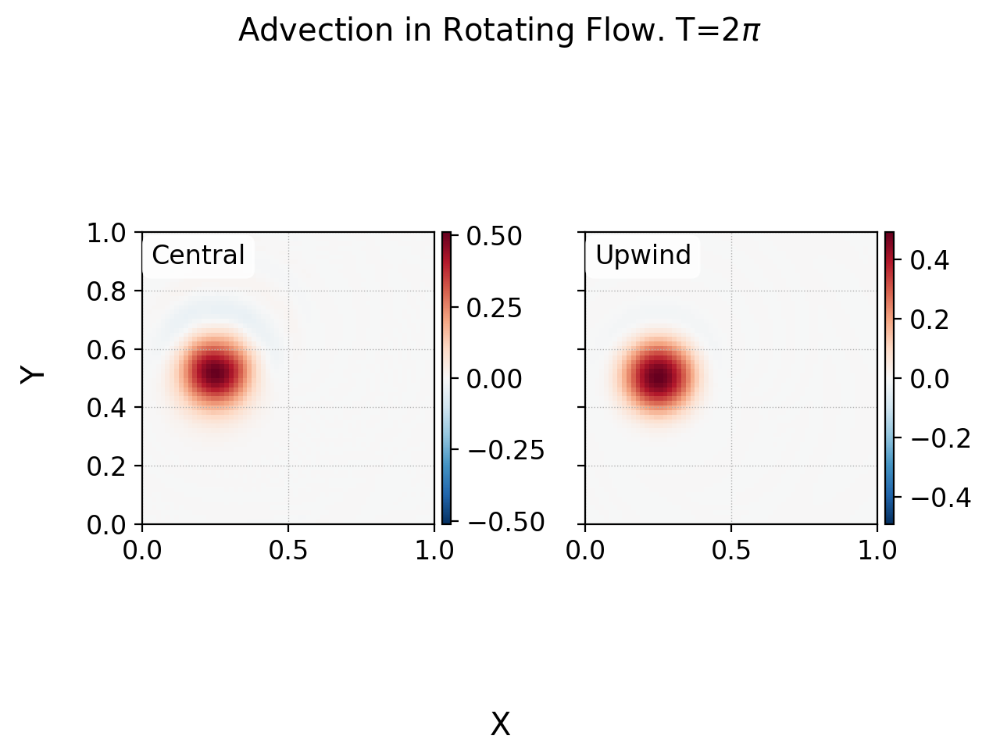
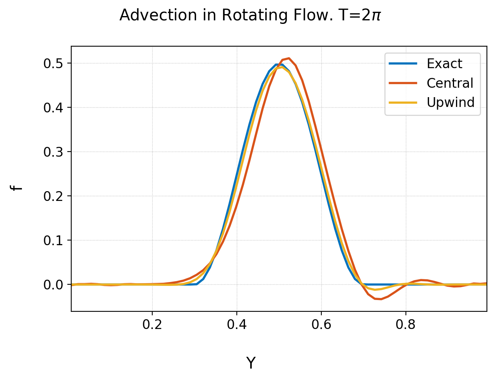
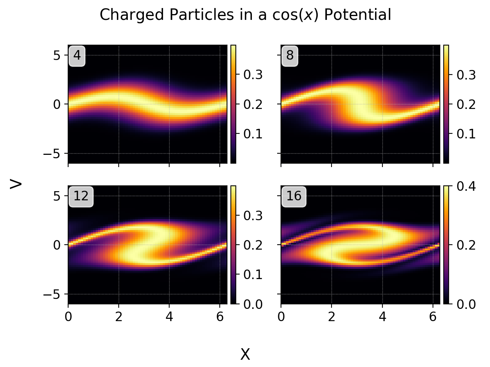

:Author: Ammar Hakim
:Date: June 20th 2026
:Completed: 
:Last Updated:

JE38: Finite-Difference Schemes for Advection-Diffusion
========================================================

.. note::

   A description of the advection-diffusion equation, its properties
   and an overview on how to construct finite-difference methods to
   solve it is given in my class notes for AST560. Please see `this
   link <../../_static/files/advection-diffusion.pdf>`_.

   The complete code for the solver is in two files. Each individual
   simulation driver below is in its own C file. To build the code and
   the simulation driver download `this zip file
   <../../_static/files/je38-code.zip>`_ and type "make" in your terminal. Of
   course, for this to work you must have Gkyell installed. You do not
   need the complete Gkeyll source, just the core library. For
   building Gkeyll please see instructions on the `Github page
   <https://github.com/ammarhakim/gkeyll>`_.

.. contents::

Introduction
------------

The advection-diffusion equation is a fundamental equation that
describes the transport of a scalar field :math:`f(\mathbf{x},t)` in a
given flow-field. We can write this as

.. math::

   \frac{\partial f}{\partial t}
   + \nabla \cdot (\mathbf{u}f)
   =
   \nabla \cdot (\alpha \nabla f )

Here :math:`f(\mathbf{x},t)` is a scalar quantity,
:math:`\mathbf{u}(\mathbf{x},t)` and :math:`\alpha(\mathbf{x},t)` are
the (given) advection velocity and diffusion coefficient
respectively. In many situations of interest the diffusion coefficient
must be replaced by a *diffusion tensor* (a :math:`3\times 3` matrix).
This occurs when the diffusion is *anisotropic*, for example, due to
the introduction of a prefered direction from a magnetic field.

This equation already contains the key features that arise in more
complex systems. In fact, many fundamental kinetic equations are
(nonlinear) advection-diffusion equations in phase-space. The
nonlinearities arise as, in general, the advection velocity and the
diffusion coefficient are functions of :math:`f` itself. Here part we
will see how to implement a finite-difference solver to evolve
:math:`f(\mathbf{x},t)` in a given flow-field. We will use this solver
to understand the properties of the discrete scheme and to look at
some interesting flows, including in phase-space.

On the Structure of the Solver
------------------------------

The solver implemented for this note is based on finite-difference
methods. The advection is treated with either a second-order central
scheme, or a first or third order upwing scheme. Upwinding, as we
shall below, greatly improves quality of the solution. The diffusion
is treated with either a second or fourth order central scheme. As
there is not flow direction for diffusion central schemes are
appropriate. The time-stepping is a `SSP-RK3 stepper
<https://gkeyll.readthedocs.io/en/latest/dev/ssp-rk.html>`_.

The solver works in 1D, 2D and 3D. The solver structure is simple: the
normal component of advection velocity is evaluated at the middle of
each cell face. This allows properly staggering the velocity at the
face wehre the advective numerical flux is to be computed. The
diffusion coefficient is evaluated at the cell centers: this is
required as diffusion is computed using central differences. See
Figure 7 of `the notes
<../../_static/files/advection-diffusion.pdf>`_. To choose the stencil
to use we select the appropriate function pointer that implements the
flux at a face given the cell-center values in two cells to the left
and two to the right of that face. For example, the first-order
updwing flux and the second order central fluxes are implemented by
the functions

.. code:: C

    // First-order upwind
    static inline double
    calc_flux_upwind_1o(double vel, double fll, double fl, double fr, double frr)
    {
      return 0.5*vel*(fr+fl) - 0.5*fabs(vel)*(fr-fl);
    }

    // Second-order central
    static inline double
    calc_flux_central_2o(double vel, double fll, double fl, double fr, double frr)
    {
      return 0.5*vel*(fr+fl);
    }

The function to use is then selected using a switch statement before
the loop to compute the fluxes is performed. For example, for the
advection update:

.. code:: C

  switch (app->a_scheme) {
    case ADV_SCHEME_C2:
      flux_func = calc_flux_central_2o;
      break;

    case ADV_SCHEME_U1:
      flux_func = calc_flux_upwind_1o;
      break;

    case ADV_SCHEME_U3:
      flux_func = calc_flux_upwind_3o;
      break;
  };

The actual loop to update the fluxes is very simple: the outer loop is
over directions and the inner over the faces (for advection) or cells
(for diffusion). Using the dimensionally-independent looping and
stencilling infrastructure in Gkeyll the same loop works for any
dimension. The SSP-RK3 update is composed of three forward Euler
steps. Each forward Euler step accumulates the advective and diffusive
contributions and computes the maximum frequency ("CFL frequency")
that can be used to compute an estimate for the maximum stable
time-step.

Advection of a 1D Gaussian
--------------------------

In the first set of problems a Gaussian distribution

.. math::

  f(x,0) = \exp(-x^2/\sigma^2)

where :math:`\sigma = 0.05` is advected on a domain :math:`x \in
[-1/2, 1/2]` with advection speed :math:`u_x = 1.0` to time :math:`T =
1.0`. The diffusion coefficient is set to zero. Results with two
schemes are shown below: central difference and upwind. The simulation
is implemented in the "cs-1d-guassian-advection.c" file.

In the central difference scheme one sees significant dispersion
errors, though the :math:`L_2` error is conserved. (The :math:`L_2`
error decays from the small amount of damping in the SSP-RK3 scheme as
shown in the figure below). For the upwind scheme there remain
dispersion errors, but much smaller. Of course, the :math:`L_2` errors
now decay due to the numerical diffusion from the upwinding.

  Advection of Gaussian in 1D with a second-order central
  scheme. There are significant dispersion errors that pollute the
  solution as the Gaussian propagates through the domain.

  Advection of Gaussian in 1D with a second-order central
  scheme. The number of cells is held fixed to :math:`64` but the
  time-step is reduced. The spatial scheme conserves :math:`L_2` norm
  of the solution, but the SSP-RK3 scheme adds some diffusion. As the
  time-step is reduced the damping due to the time-stepper reduces
  with the order of the scheme.

  Advection of Gaussian in 1D with a upwind scheme. The dispersion
  errors are much smaller as compared to the central scheme, but still
  present. This indicates some form of limiters are required to reduce
  these errors further.

Rigid-body rotating flow
------------------------

In this test a rigid body rotating flow is initialized by selecting
the flow velocity :math:`(u_x,v_x) = (-y+1/2, x-1/2)` which represents
a counter-clockwise rigid body rotation about
:math:`(x_c,y_c)=(1/2,1/2)` with period :math:`2\pi`. Hence,
structures in :math:`\chi` will perform a circular motion about
:math:`(x_c,y_c)`, returning to their original position at
:math:`t=2\pi`. See :doc:`JE 12 <../je12/je12-poisson-bracket>` for
the same problem but with the DG scheme. The simulation is implemented
in the "cs-2d-rotflow.c" file.

Two simulations were performed: one with central scheme and the other
with upwinding. The diffusion was set to zero. The results are shown
below. The central scheme shows more dispersion and phase errors than
the upwind scheme. However, it is clear that neither schemes are not
competitive with the DG scheme presented in :doc:`JE 12
<../je12/je12-poisson-bracket>`. In general, this reflects the fact
that the sub-cell resolution in DG allows greater control in designing
schemes, allowing both greater accuracy and more efficiency, with much
reduced dispersion.

  Advection of a blob in a rigid-body rotating flow. The blob has
  returned to its original position. Note the faint blue in the
  central difference result that shows dispersion errors. Such errors
  are also present in the upwind scheme, but are much smaller. See
  lineout plots below.

  Advection of a blob in a rigid-body rotating flow. Shown is a
  lineout at :math:`x=0.25`. The blob has returned to its original
  position. The central difference scheme shows latger dispersion and
  phase errorss than the upwind scheme.

Charged Particles in a :math:`\cos(x)` Potential
------------------------------------------------

As we allow arbitrary flow velocity we can simulate the flow of
particles in phase-space by initializing the advection velocity as the
phase-space velocity of Vlasov equation. If we denote the domain by
:math:`(x,v)` we set :math:`u_x = v` and :math:`u_v = -\partial \phi /
\partial x`, where :math:`\phi(x)` is the electrostatic poential. For
this test we set :math:`\phi(x) = \cos(x)` and evolve a thermal
distribution on a domain :math:`[0, 2\pi]\times [-6, 6]` on a
:math:`64\times 64` grid, with the thermal velocity set to
:math:`1.0`. We use an upwind scheme with diffusion set to zero. The
simulation is implemented in "cs-vlasov-cos-pot.c" file.

  Charged particles advecting in a cos potential :math:`\phi(x) =
  \cos(x)`. Shown is the phase-space evolution of the distribution
  function :math:`f(x,v,t)` at various times. Seen are the 
  particles trapped in the potential well, with a passing particle
  population that are too energetic to be trapped.

Conclusions
-----------

We have shown how a simple advection-diffusion solver that allows
setting arbitrary advection velocities can be used for many
interesting problems, including advecting charged particles in a given
electrostatic field. As advection-diffusion equations form the basis
for a large class of kinetic equations that arise in plasma physics
and other fields, extensions of these finite-difference schemes can be
used to solve much more complex systems. 

In general, however, we should mention that the disconinous-Galerkin
schemes are far superior to the finite-difference algorithms presented
in this note. DG schemes have natural sub-cell resolution that allows
greater control on the scheme, and can give higher quality results on
a relatively coarse mesh. Further, DG schemes are ideal for GPUs as
the are FLOP-heavy, requiring only data in three cells, instead of a
wide stencil as in high-order finite-difference methods presented
above.
