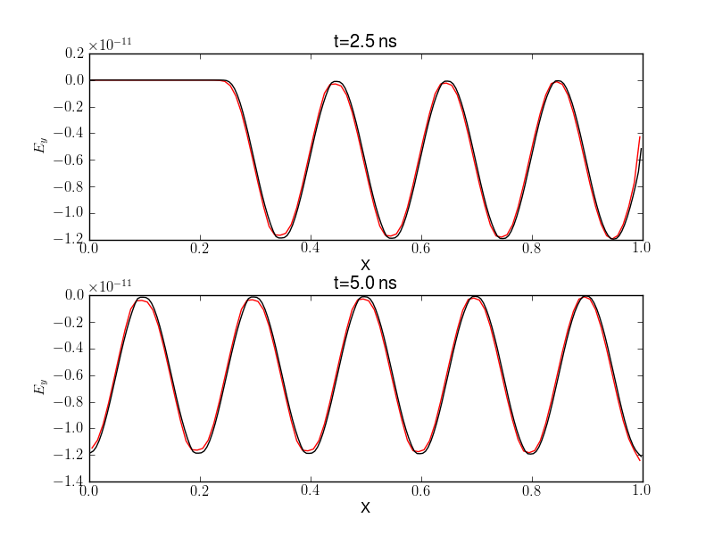
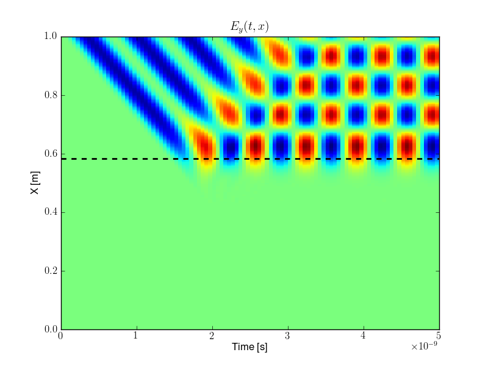
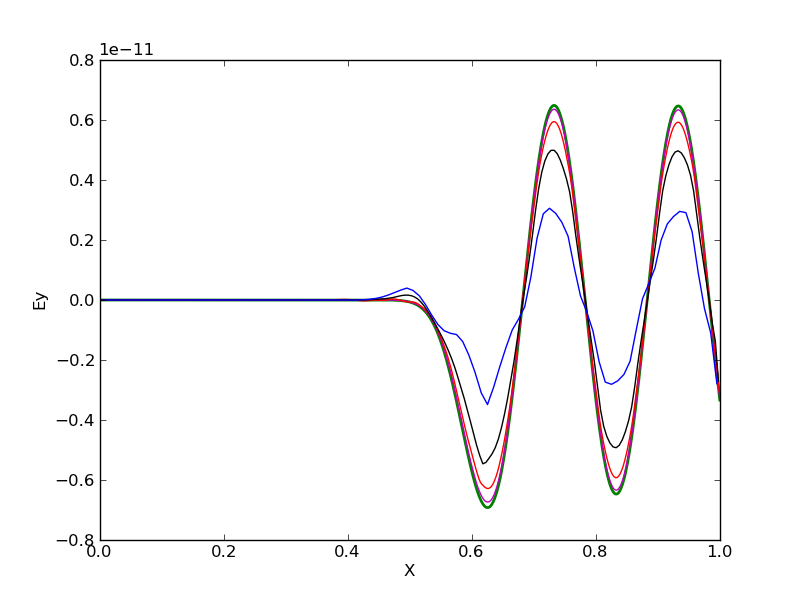

:Author: Ammar Hakim

JE8: Propagation into a plasma wave beach
=========================================

A plasma wave beach is a slab configuration in which the density
increases monotonically. An electromagnetic wave is pumped into the
beach (hence the name wave beach). The wave frequency :math:`\omega`
is arranged such that at some location :math:`x=x_c`, :math:`\omega =
\omega_p(x_c)`. At this location the electromagnetic wave suffers a
cutoff and is reflected back towards the drive plane, creating a
standing wave pattern.

In this entry this problem is simulated with Lucee. The plasma profile
is selected as

.. math::

  \omega_p(x,t) \delta t = \left(\frac{1-x}{L}\right)^5

where :math:`0<x<L` is the domain and :math:`\delta t` is a constant
with units of time. The electromagnetic wave is driven by a current
applied at the center of the last cell, i.e.,

.. math::

  J_y(x,t) = \delta(x-x_e) J_0\sin(\omega t)

where :math:`x_e = L-\Delta x /2`, where :math:`\Delta x` is the cell
size.

We pick :math:`\omega \delta t = \pi /10`. With :math:`L=1` the cutoff
location is :math:`x_c \approx 0.58`. We pick :math:`\delta t =
L/100c`, where :math:`c` is the speed of light. Further, the electron
temperature is set to 1 eV and the ion fluid is not evolved, i.e., on
the time-scale of the problem the ions are assumed to be immobile.

This problem is interesting as with conventional explicit FDTD methods
a numerical instability occurs at cutoff and resonance layers. This
means that implicit algorithms are needed to simulate such
problems. See the paper by David Smithe [Smithe2007]_ for an algorithm
in which the plasma is treated as a cold linear medium that is evolved
implicitly to avoid the instability.

EM wave propagation in vacuum
-----------------------------

In the first test the problem is simulated without the plasma. This is
essentially a test to ensure the EM wave propagation works correctly
with the current source. Simulations are performed by setting
:math:`J_0=1\times 10^{-12}` and run to :math:`t=5` ns. Grids with 100
and 200 cells are used. Results are shown below. Note that although
the solutions are smooth limiters need to be applied as the sudden
appearance of :math:`E_y` due to the current source causes a shock
that propagates into the ghost cell, which in turns spoils the
interior solution. The limiters are what cause the maxima in the
solutions shown below to get slightly flattened.

  Electromagnetic wave propagation in vacuum driven by a current
  source in the last cell. Shown here is the electric field
  :math:`E_y` at :math:`t=2.5` ns (top) and :math:`t=5.0` ns (bottom)
  for 100 cells [:doc:`s65 <../../sims/s65/s65-plasmabeach-maxwell>`]
  (red line) and 200 cells [:doc:`s66
  <../../sims/s66/s66-plasmabeach-maxwell>`] (black line). In the
  upper panel the electromagnetic wave has not yet propagated through
  the domain.

Wave propagation into a plasma beach
------------------------------------

In this set of simulations wave propagation into the plasma beach is
presented. The time-step for this simulation needs to be small enough
to resolve the plasma frequency. Several simulations were performed:
with 100, 200, 400 and 800 grid cells. The transverse electric field,
:math:`E_y` is plotted as a function of space and time below.

  Electromagnetic wave propagation in a plasma beach driven by a
  current source in the last cell. This simulation [:doc:`s69
  <../../sims/s69/s69-plasmabeach>`] was run on a 400 cells. Shown
  here is the electric field :math:`E_y` as a function of time
  (increasing towards the right) and space (top of the figure is the
  right edge). The dashed black line shows the plasma cutoff
  (:math:`\omega_p(x) = \omega`). The EM wave propagates into the
  plasma and reflects off the cutoff layer, interfering with the
  incoming wave. Evanescent waves propagating into the cutoff region
  are also visible.

The convergence of the solution with increasing grid resolution is
shown below. It is seen that the 100 cell resolution is very
diffuse. The reason for this is that the small CFL number (0.1) causes
significant diffusion in the wave-propagation scheme.

  Comparison of :math:`E_y` for different grid sizes. Show are results
  from 100 cells (blue) [:doc:`s67 <../../sims/s67/s67-plasmabeach>`],
  200 cells (black) [:doc:`s68 <../../sims/s68/s68-plasmabeach>`], 400
  cells (red) [:doc:`s69 <../../sims/s69/s69-plasmabeach>`], 800 cells
  (magenta) [:doc:`s70 <../../sims/s70/s70-plasmabeach>`] and 1600
  cells (green) [:doc:`s71 <../../sims/s71/s71-plasmabeach>`]. The
  lower resolution simulations show significant diffusion as the
  wave-propagation scheme can not be run to the allowed CFL number as
  the plasma-frequency needs to be resolved.

Conclusions
-----------

This simulation shows that radio-frequency EM wave propagation into a
plasma cutoff can be simulated with the wave-propagation scheme in a
stable manner. Note that the plasma frequency needs to be
resolved. This constraint can be quiet severe and a way around this
would be advance the source terms (semi-) implicitly. Another option
would be to treat the electrons as a cold linear dielectric medium (in
the spirit of Smithe). Of course, this would exclude non-linear
electron physics.

The fact that the wave-propagation scheme is so diffusive for
time-steps much smaller than allowed by the CFL number is a
significant disadvantage. High-order schemes are not so sensitive to
CFL numbers and should be of value here. Another option would be to
evolve the fields and fluid with different time-steps and using
implicit source advance to couple them.

References
----------

.. [Smithe2007] David N Smithe, "Finite-difference time-domain
   simulation of fusion plasmas at radiofrequency time scales",
   *Physics of Plasmas*, **14**, Pg. 056104 (2007).
